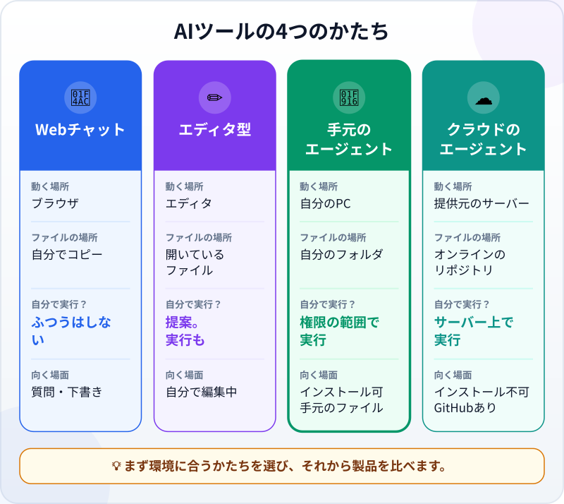
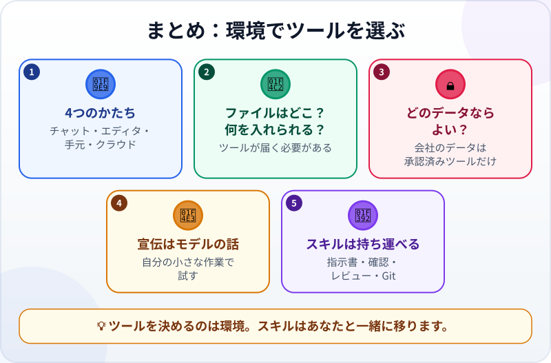

🌐 [Tiếng Việt](../../vi/lessons/tool-landscape.md) · [English](../../en/lessons/tool-landscape.md) · **日本語**

# 話題性ではなく環境でツールを選ぶ

<!-- section: objective -->
## この授業のゴール

この授業を終えると、次のことができるようになります。

- ソフトウェアづくりのためのAIツールの4つの**かたち**（Webチャット、エディタ型の補助、手元のエージェント、クラウドのエージェント）を見分けられる。
- 環境についての4つの問いで、自分に合うかたちを選べる。
- ツールを変えても持ち運べるもの（明確な指示書、確認方法、レビュー、Git）がわかる。

<!-- section: hook -->
## なぜ大事なの？

トゥアンさんが朝SNSを開くと、「*ツールX登場、他を圧倒！*」。先週はツールY、先月はZでした。同僚の一人はほぼ毎月ツールを乗り換え、そのたびに慣れるまで何日かかかっています。

トゥアンさんは考えます。自分はまちがったツールを使っているのだろうか。乗り換えるべきだろうか。

答えは、ランキングよりも、**あなたが働く場所**で決まります。

<!-- section: concept -->
## 本題

### ツールの4つのかたち

製品名から考え始めないでください。まず、かたちから考えます。ツールがどこで動き、ファイルがどこにあり、自分でどこまでできるか、です。

- **💬 Webチャット：** 質問すると答えてくれます。コードはたいてい自分でコピーして、自分のPCで実行します。これは[チャットボットで、まだエージェントではありません](chatbot-to-agent.md)。
- **✏️ エディタ型の補助：** 編集中のファイルの中で、その場で提案してくれます。エージェントモードを持つものも多くあります。
- **🤖 手元のエージェント：** 自分のPCの上で（ターミナルやアプリで）動き、フォルダを読み、ファイルを編集し、コマンドを実行します。この講座のメインルートです。
- **☁️ クラウドのエージェント：** 提供元のサーバーで動き、オンラインのリポジトリで作業します。あなたは結果を見て承認します。

1つの提供元が複数のかたちを出していることもよくあります。たとえば2026年9月時点で、Claude Codeはターミナル、デスクトップアプリ、エディタ、ブラウザ、さらにSlackでも、同じエージェントのループで使えます。Google Antigravityには、デスクトップアプリ版とコマンドライン版があります。だから正しい問いは「*どの製品？*」ではなく、「*どの環境に、どのかたち？*」です。

### 環境についての4つの問い

1. **ファイルはどこにある？** 自分のPC、GitHubのリポジトリ、それとも社内のシステム？ ツールがファイルに届く必要があります。
2. **何をインストールし、実行できる？** 個人のPCは自由がききます。会社のPCはインストールが禁止されていることが多く、その場合、残るのはブラウザか、会社がすでに入れているツールだけです。
3. **どのデータなら入れてよい？** 架空のデータならどこでもかまいません。会社のデータは、会社が承認したツールにだけ入れます。どれほど強力なツールでも、[禁止事項](data-safety-and-permissions.md)は変わりません。
4. **どこまでさせたい？** 提案と説明だけでよければ、チャットで十分です。コマンドを実行し、自分で確かめてほしいなら、エージェントが必要です。そして、はっきりした権限も必要です。

この4つに答えると、たいてい候補は1つか2つのかたちにしぼられます。同じかたちのツール同士を比べるのは、それからです。

### 宣伝が語ること、あなたの環境が語ること

宣伝はたいてい**モデル**の話です。スコア、速さ、ベンチマーク。ところが毎日の仕事を左右するのは**環境**です。ツールが自分のPCに入れられるか、自分のファイルを読めるか、そのデータを見てよいか。ランキング1位でも会社のPCで動かないツールは、トゥアンさんにとっては使えないツールです。

それでも新しいツールを試したいなら、[モデルの選び方](choosing-models.md)と同じやり方で試します。自分の小さな作業、先に書いた基準、架空のデータ、`ai-practice` の中。自分で出した結果は、SNSの投稿より信頼できます。

### 持ち運べるもの

ツールは毎月変わります。この講座で学ぶことは変わりません。

- 完了条件のある[良い指示書を書く](writing-good-specs.md)こと。
- エージェントが自分で実行できる確認方法。
- [差分を読む](reviewing-agent-changes.md)ことと、[Git](git-version-control.md)で履歴を残すこと。

エージェント向けの指示ファイルでさえ、共有しやすくなっています。2026年9月時点で、Claude Codeは自分用の `CLAUDE.md` を読み、ほかのエージェントが使う `AGENTS.md` も読めます。だからツールを変えても、たいていは新しい画面に慣れる数日で済み、一から学び直す必要はありません。

<!-- section: analogy -->
## 身近なたとえ

通勤手段を選ぶことを考えてみましょう。広告は、新しい車が一番速くて快適だと言います。でも都心に住み、会社に駐車場がなく、朝はいつも渋滞しているなら、電車と自転車のほうが正しい選択です。選ぶ基準は**あなたが通る道**であって、速さのランキングではありません。そして何に乗っても、交通ルールを守り、周りを確かめ、距離をとるのはあなた自身です。

このたとえが当てはまらないところ：乗り物は数年に一度しか変えませんが、AIツールは毎月変わります。そして乗り物はあなたの書類を読みませんが、AIツールは入れたデータをすべて見ることができます。だから「どのデータなら入れてよい？」という問いは、どんな性能表よりも大切です。

<!-- section: example -->
## 具体例

トゥアンさんは、自分の**2つの**環境それぞれについて、4つの問いに答えます。

**会社では：**

1. ファイル：図面と表計算ファイル。会社のPCと社内のネットワークドライブにある。
2. インストール：PCはロックされていて、何も入れられない。
3. データ：会社のデータは、会社が承認したツールにだけ入れてよい。会社はブラウザで使うAIチャットツールを1つ承認している。
4. どこまでさせたいか：Excelの数式の説明や、技術的なメールの下書き。提案で十分。

→ 会社では、トゥアンさんは**承認されたチャットツールだけ**を、許可された作業にだけ使います。SNSのツールXは問い2と問い3で外れるので、どれほど強力でも、ここでは選択肢になりません。

**家では：**

1. ファイル：個人のノートPCの `ai-practice` フォルダ。
2. インストール：できる。
3. データ：架空のデータだけ。
4. どこまでさせたいか：単位変換プログラムを実行し、確認も自分で実行してほしい。エージェントが必要。

→ 家では、トゥアンさんは**手元のエージェント**で学びます。ツールXを試したくなったら、先週やった小さな作業を、基準を書いたまま渡して、結果を比べます。かかるのは30分で、1か月ではありません。

トゥアンさんは、もう投稿を追いかけなくてよくなりました。どの問いでツールが候補から外れるかがわかり、どのツールを使っても自分のスキルはそのままだとわかったからです。

<!-- section: misconceptions -->
## よくある誤解

- **「一番新しくて、スコアが一番高いツールが、自分にも一番いい」** ―― スコアは標準テストでのモデルの成績です。自分のPCに入れられない、自分のデータを見る許可がないツールは、使えません。
- **「ツールを変えたら、全部学び直し」** ―― 変わるのは画面です。明確な指示書、確認方法、レビュー、Gitは持ち運べます。
- **「一度選べば終わり」** ―― 環境は変わります。会社が新しいツールを承認する、PCが変わる、仕事が大きくなる。環境が変わるたびに、4つの問いをもう一度考えます。

<!-- section: recap -->
## 1枚でわかるこのレッスン

<!-- section: takeaways -->
## まとめ

- 4つのかたち：Webチャット、エディタ型の補助、手元のエージェント、クラウドのエージェント。1つの提供元が複数持つことも多い。
- 4つの問い：ファイルはどこか、何をインストールできるか、どのデータならよいか、どこまでさせたいか。
- 宣伝はモデルの話。毎日の仕事は環境で決まる。
- 新しいツールは、先に基準を書き、架空のデータを使って、自分の小さな作業で試す。
- 持ち運べるスキル：明確な指示書、確認方法、レビュー、Git。

<!-- section: quiz -->
## 確認クイズ

**問1.** トゥアンさんの会社のPCは何もインストールできず、会社のデータは承認済みのツールにしか入れられません。みんなが絶賛するツールXは、インストールが必要です。会社でトゥアンさんはどうすべき？

- A) より強力なので、ツールXを入れて試す
- B) 会社が承認したツールを使う。Xを使いたいなら、正規の手続きで申請する
- C) Xを使うために、会社のデータを自宅のPCに移す

**問2.** ツールのスコアを比べる**前に**考えるべき問いはどれ？

- A) 自分のファイルはどこにあり、ツールはそこに届くか
- B) フォロワーが一番多いツールはどれか
- C) ロゴがかっこいいツールはどれか

**問3.** 別のエージェントツールに乗り換えたとき、**そのまま使える**のは？

- A) 前のツールのキーボードショートカット
- B) 画面のボタンの名前
- C) 基準のある依頼の書き方、確認方法、差分の読み方

答えを見る

1. **B** ―― 会社では、問い2と問い3でツールXはすでに外れています。ルールをかいくぐることや、データを持ち出すことは禁止事項です。
2. **A** ―― ツールがファイルに届かなければ、スコアが高くても役に立ちません。
3. **C** ―― 画面はツールごとに変わります。エージェントと働くスキルは持ち運べます。

<!-- section: sources -->
## 参考資料

- Anthropic — [How Claude Code works](https://code.claude.com/docs/en/how-claude-code-works)（英語、2026年9月時点）：ターミナル、デスクトップアプリ、エディタ、ブラウザ、Slack、CI/CDで同じエージェントのループが動く。手元、クラウド、リモート操作で実行できる。Claudeは `CLAUDE.md` を読み、ほかのエージェント向けの `AGENTS.md` も読める。
- Google Cloud — [What is agentic coding?](https://cloud.google.com/discover/what-is-agentic-coding)（英語、2026年9月更新）：Google Antigravityにはデスクトップアプリ版とコマンドライン版がある。組織はエージェントがアクセスできる範囲を制限し、エージェントのコードはメインのプロジェクトに入れる前に人がレビューするべき。
