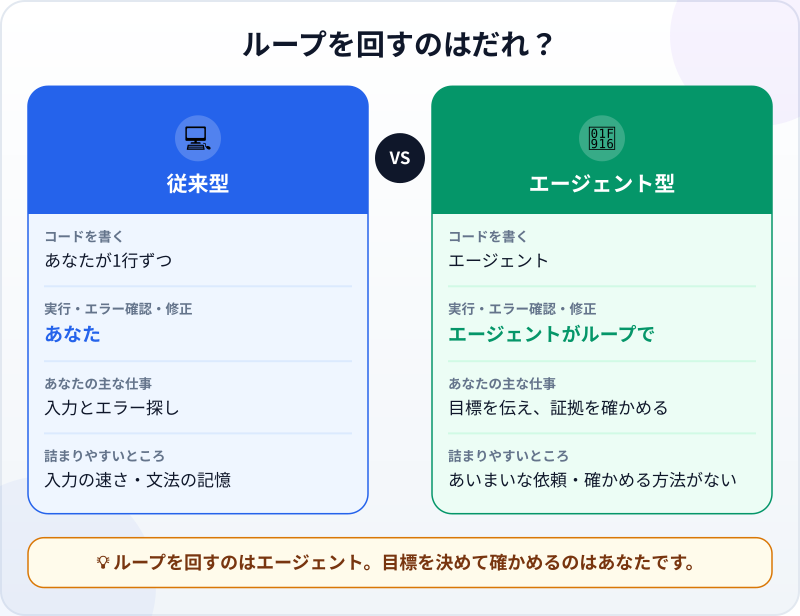

🌐 [Tiếng Việt](../../vi/lessons/traditional-vs-agentic.md) · [English](../../en/lessons/traditional-vs-agentic.md) · **日本語**

# 従来のコーディングとエージェント型コーディング

<!-- section: objective -->
## この授業のゴール

この授業を終えると、次のことができるようになります。

- **書く→実行する→エラーを読む→直す**というループと、従来のコーディングと**エージェント型コーディング**でそれをだれが回すかを説明できる。
- エージェントが自分で実行できる確認方法が、あなたが渡すものの中で一番大切な理由を説明できる。
- 変わらないもの（結果が正しいこと、テスト、Git、変更のレビュー、あなたの責任）を挙げられる。

<!-- section: hook -->
## なぜ大事なの？

マイさんは経理担当です。1か月に1つ、合計12個の架空の売上ファイルがあり、1年分の表にまとめたいと思っています。2年前、こうした作業のためにPythonを独学しようとしたことがあります。週末を2回使い、そのほとんどはエラーメッセージを読んで、意味をネットで調べる時間でした。

今週、マイさんはまったく同じ作業をエージェントに任せました。30分後、表はできあがり、確認も済んでいました。コードは1行も入力していません。でも、何もしていなかったわけではありません。では、何が変わり、何が変わらないのでしょうか。

<!-- section: concept -->
## 本題

### プログラマーのループ

ソフトウェアづくりは、一度書けば終わりというものではありません。プログラマーは同じループを何度もくり返します。コードを少し**書く**→**実行する**→結果やエラーメッセージを**読む**→**直す**→もう一度実行する。小さなプログラムでも、このループを何十回も回ることがあります。

### 従来型：あなたがループ

従来のコーディングでは、ループのすべての手順をあなたが行います。1行ずつ入力し、自分で実行し、自分でエラーを読み、自分で直し方を探します。速さは、入力の速さ、文法をどれだけ覚えているか、エラーをどれだけ読み解けるかで決まります。マイさんが週末を2回使ったのは、そのためです。

### エージェント型：エージェントがループを回す

エージェント型コーディングでは、[エージェント](agent-parts-and-loop.md)がそのループを自分で回します。ファイルを読み、コードを書き、コマンドを実行し、エラーを読んで直し、もう一度実行します。Claude Codeのドキュメント（2026年9月時点）は、この変化をこう説明しています。自分でコードを書いてAIにレビューを頼むのではなく、ほしいものを説明すれば、作り方はエージェントが考える、と。



あなたの仕事は、ループの両端に集まります。

- **入口：** 目標、背景、境界をはっきり伝える。[良い指示書の書き方](writing-good-specs.md)で練習したことです。
- **出口：** 証拠と変更を確かめ、受け入れるかどうかを決める。[エージェントの変更を読んでレビューする](reviewing-agent-changes.md)で学んだことです。

### エージェントに渡す一番大切なもの：確かめる方法

エージェントは、仕事が終わった*ように見えた*ところで止まります。Claude Codeのドキュメントははっきり書いています。エージェントが自分で実行できる確認方法がなければ、「終わったように見える」ことが唯一の手がかりになり、**あなた自身が確認のループになる**。つまり、どのミスもあなたが気づくまで残ります。*合格・不合格*が出る確認方法（[テスト](testing-basics.md)や、一致すべき数字など）があれば、エージェントは作業し、確認を実行し、結果を読み、合格するまで直します。

つまり、詰まりやすいところが移ったのです。「どれだけ速く入力できるか」ではなく、「依頼がどれだけ明確か」と「どうやって確かめられるか」です。

### 変わらないもの

- **結果は正しくなければなりません。** 動くコードが、正しい仕事をしているとは限りません。
- **テスト、[Git](git-version-control.md)、変更のレビュー**は今も土台です。エージェントの作業が速いぶん、むしろ大事になります。
- **責任は今もあなたにあります。** [あなたはタイピストではなくリーダー](lead-not-typist.md)で学んだとおりです。

<!-- section: analogy -->
## 身近なたとえ

手洗いと洗濯機。手洗いでは、つけ置き、もみ洗い、すすぎ、しぼり、きれいになったか見て、またもみ洗い、と全部自分でやります。洗濯機では、コースを選んで洗濯物を入れれば、洗い・すすぎ・脱水のループを機械が自分で回します。あなたの仕事は、正しいコースを選ぶこと、入れてはいけない物を入れないこと、終わったら洗濯物を確かめることに変わります。

このたとえが合わないところ：洗濯機は決まったコースを1つ回すだけです。エージェントは手順を自分で決め、予想外のことをすることもあり、終わっていないのに「終わりました」と言うこともあります。だから、ボタン1つではなく、はっきりした境界と証拠が必要なのです。

<!-- section: example -->
## 具体例

マイさんの作業：12個のファイル `month_01.csv` … `month_12.csv`（架空のデータ、列は `date, product, revenue`）を、月ごとの合計を1行ずつ並べた `year.csv` にまとめること。

**従来のやり方 ―― 2年前の挑戦。** マイさんはPythonでファイルを読む方法を独学し、ループを書いて実行しました。最初のエラーは、ファイル内のアクセント付き文字のエンコーディングに関するメッセージで、その意味を調べるのに午後がまるごとかかりました。直すと動くようになりましたが、1月の合計が大きすぎます。フォルダーに古いコピー `month_01 (1).csv` が残っていて、プログラムが2つのファイルを黙って両方とも足していたのです。書く・実行する・読む・直す、のどのループも、マイさんが回していました。

**エージェント型のやり方 ―― 今週。** マイさんは依頼を書きました。一番大切なのは確認方法の部分です。

```text
12個のファイル month_01.csv ... month_12.csv を year.csv にまとめてください。月ごとに revenue の合計を1行ずつ。
元のファイルは変更しないこと。データは架空です。
完了条件：
1. year.csv に月の行がちょうど12行と、総合計の行が1行ある。
2. 各月の行が、その月のファイルの revenue 列の合計と一致する。
3. 総合計が、12ファイルすべての revenue 列の合計と一致する（別の方法で計算して確かめる）。
それらの確認を実行して、結果を見せてください。
```

エージェントはコードを書いて実行し、かつてマイさんがつまずいたのと同じエンコーディングのエラーに出会い、自分で直してもう一度実行しました。そして確認を実行し、月の行が12行あり、各行がその月のファイルと一致し、年間の合計も一致することをマイさんに見せました。マイさんはそこで終わりにしません。適当に1か月を選んで `month_03.csv` を開き、revenue 列を自分で足し、3月の行と比べました。一致しています。マイさんの30分は、依頼を書くことと確かめることに使われました。エラーメッセージの意味を調べることにではありません。

<!-- section: misconceptions -->
## よくある誤解

- **「エージェント型コーディングなら、ソフトウェアのことを何も知らなくていい」** ―― 目標をはっきり伝え、証拠を読み、結果の誤りに気づくための知識は今も必要です。このコースでファイル、テスト、Gitを学ぶのはそのためです。
- **「エージェントがエラーなしで実行できたなら、コードは正しい」** ―― 動くことと、正しい仕事をすることは別です。マイさんの1月の合計も、エラーは何も出ないまま間違っていました。
- **「従来のコーディングはもう古い」** ―― 学ぶとき、開いているファイルの1語をさっと直すとき、エージェントが何をしているか理解するときに、今も役立ちます。エージェント型コーディングはその上に成り立つもので、置き換えるものではありません。

<!-- section: recap -->
## 1枚でわかるこのレッスン


<!-- section: takeaways -->
## まとめ

- ソフトウェアづくりは、書く→実行する→エラーを読む→直す、のくり返しです。
- 従来のコーディング：そのループをあなたが1行ずつ回します。
- エージェント型コーディング：ループはエージェントが回し、あなたは目標をはっきり伝えて証拠を確かめます。
- エージェントには確かめる方法を渡しましょう。ないと「終わったように見える」が唯一の手がかりになり、ミスは全部あなたが見つけることになります。
- 土台は変わりません：正しい結果、テスト、Git、変更のレビュー、そしてあなたの責任。

<!-- section: quiz -->
## 確認クイズ

**問1.** 従来のコーディングとエージェント型コーディングの一番の違いは何ですか？

- A) エージェント型コーディングは別のプログラミング言語を使う
- B) エージェント型コーディングでは、書く・実行する・直すのループをエージェントが回し、あなたは目標を決めて確かめる
- C) エージェント型コーディングでは、結果を確かめる必要がなくなる

**問2.** マイさんがエージェントに作業を任せましたが、確かめる方法を何も渡しませんでした。最も起こりやすいのはどれですか？

- A) エージェントは終わったように見えたところで止まり、どのミスもマイさんが見つけるまで残る
- B) エージェントが作業を断る
- C) エージェントがコードを実行したので、結果は必ず正しい

**問3.** エージェント型コーディングに移っても、変わらないものはどれですか？

- A) コードを1行ずつ自分で入力しなければならない
- B) 何年もプログラミングを学んだ人しかソフトウェアを作れない
- C) 結果への責任は今もあなたにあり、テスト、Git、変更のレビューも今も必要

<details>
<summary>答えを見る</summary>

1. **B** ―― 言語も、結果が正しくなければならないことも変わりません。変わるのは、だれがループを回すかです。
2. **A** ―― 確認方法がなければ、「終わったように見える」がエージェントの唯一の手がかりになり、ミスを見つけるのはマイさんになります。
3. **C** ―― 入力はエージェントが代わりにしますが、土台と責任はそのままです。

</details>

<!-- section: sources -->
## 参考資料

- Anthropic ―― [Best practices for Claude Code](https://code.claude.com/docs/en/best-practices)（英語、2026年9月時点）：自分でコードを書いてClaudeにレビューを頼むのではなく、ほしいものを説明すればClaudeが作り方を考える。自分で実行できる確認方法がなければ「終わったように見える」が唯一の手がかりになり、あなたが確認のループになる。確認方法があれば、Claudeは作業し、確認を実行し、結果を読み、合格するまでくり返す。
- Anthropic ―― [Claude Code overview](https://code.claude.com/docs/en/overview)（英語、2026年9月時点）：Claude Codeは、コードベースを読み、ファイルを編集し、コマンドを実行するエージェント型コーディングツール。
