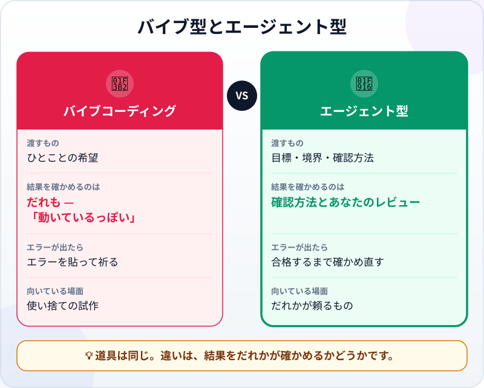
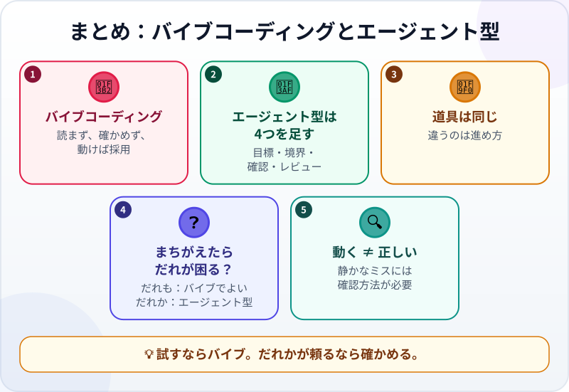

🌐 [Tiếng Việt](../../vi/lessons/vibe-vs-agentic.md) · [English](../../en/lessons/vibe-vs-agentic.md) · **日本語**

# バイブコーディングとエージェント型コーディングの違い

<!-- section: objective -->
## この授業のゴール

この授業を終えると、次のことができるようになります。

- **バイブコーディング**（読まず・確かめずにコードを受け入れる）と**エージェント型コーディング**（目標・境界・確認方法・レビュー）を見分けられる。
- 進め方を選ぶためのシンプルな問い「*まちがっていてもだれも気づかなかったら、だれが困る？*」を使える。
- バイブ型の依頼に4つを足して、エージェント型の依頼に変えられる。

<!-- section: hook -->
## なぜ大事なの？

フイさんは大学2年生です。ある晩、AIツールにこう入力しました。「*みんなで食事したときの割り勘ページを作って。*」10分後にはページができていました。1回だけ試します。3,000円を3人で割って、1人1,000円。正しい。フイさんはサークルのグループにリンクを送りました。

月末、サークルの会計係が集計すると、お金が足りません。飲み会のたびに100円、200円ずつ足りず、1か月で数千円になっていました。フイさんには理由がわかりません。コードを読んだことも、最初の1回以外の金額で試したこともないからです。

フイさんがしていたのは**バイブコーディング**です。いつでもまちがいというわけではありません。でも今回は、その結果に頼る人たちがいました。

<!-- section: concept -->
## 本題

### バイブコーディングとは？

Google Cloudの解説ページによると、*バイブコーディング（vibe coding）*という言葉は、AI研究者のアンドレイ・カルパシー（Andrej Karpathy）氏が2025年のはじめに名づけたものです。もっとも「純粋な」かたちでは、AIが書いたコードを完全に信じ、*コードが存在することさえ忘れて*しまいます。作って終わりの週末プロジェクトに向いたやり方です。

実際のバイブコーディングは、たいていこうなります。

1. ほしいものをひとことで説明する。
2. AIが返したコードを**読まずに**受け取る。
3. 1回だけ動かす。動いているっぽければ採用。
4. エラーが出たら、エラーメッセージをAIに貼りつけて、次はうまくいくよう祈る。

「*結果は正しい？*」と問う手順はどこにもありません。あるのは「*動く？*」だけです。

### エージェント型コーディングは4つを足す

[エージェント型コーディング](traditional-vs-agentic.md)は、**まったく同じ道具**を使うこともできます。違いは、道具との働き方です。次の4つを足します。

- **明確な目標：** 何の作業か、だれのためか、何をもって完了か。[良い指示書の書き方](writing-good-specs.md)で学んだことです。
- **境界：** エージェントが触ってよい範囲と、してはいけないこと。たとえば `ai-practice` フォルダの中だけ、架空のデータだけ。
- **確認方法：** *合格・不合格*が出て、エージェントが自分で実行できるもの。[テスト](testing-basics.md)や、一致すべき数字などです。
- **レビュー：** 受け入れる前に、変更と証拠をあなたが読む。[エージェントの変更（差分）を読んでレビューする](reviewing-agent-changes.md)で学んだことです。



真ん中の行に注目してください。**結果を確かめるのはだれか**。バイブコーディングでは「だれも」です。あるのは*動いているっぽい*という感覚だけ。エージェント型コーディングでは、毎回確認方法が実行され、あなたが証拠を読みます。

### バイブコーディングで十分なのはいつ？

バイブコーディングは悪いものではありません。速くて楽しく、アイデアを試すにはぴったりです。自分にひとつ問いかけてください。**「まちがっていてもだれも気づかなかったら、だれが困る？」**

- **だれも困らない** — 試しに作る小さなゲーム、`ai-practice` での練習ページ、架空のデータ、終わったら捨てるもの。バイブで気楽にどうぞ。✅
- **だれかが困る** — 他人のお金、他人のデータ、ほかの人が使うものや来週また開くもの。エージェント型コーディングが必要です。

フイさんのページは、サークルにリンクを送った瞬間に2つめのグループに入りました。そこからは、もう試作ではありません。

### バイブからエージェント型へは、たいした手間ではない

バイブからエージェント型に変えるのにかかるのは、たいてい依頼を書く数分と、結果を読む数分です。高くつくのは、それを**しない**ことです。みんなが使うものの中に静かなミスが住みつき、どこにあるのかだれもわかりません。

<!-- section: analogy -->
## 身近なたとえ

自分のための料理と、お店の料理。夜に家で作るときは、感覚で味つけします。しょうゆを少し、砂糖を少し、食べられればそれでよし。お店の料理は違います。レシピがあり、計量し、出す前に味見をし、衛生にも気をつけます。お客さんがお金を払い、信頼してくれているからです。

同じ台所、同じ料理人。違うのは、**だれが食べるか**です。

このたとえが当てはまらないところ：まずい料理は、食べればすぐにわかります。まちがったコードは、たいてい動き続け、それらしい数字を出し続けます。ミスが表に出るのは、フイさんのサークルの会計係のように、だれかが合計したときです。だからエージェント型コーディングの確認方法は、「1回味見する」のではなく、書き出しておく必要があります。

<!-- section: example -->
## 具体例

フイさんは `ai-practice` フォルダで、割り勘ページを今度はエージェント型で作り直します。

**1回め（バイブ）：**

```text
みんなで食事したときの割り勘ページを作って。
```

**2回め（エージェント型）：**

```text
目標：1枚の伝票を何人かで割る warikan.html を作る。サークルで使う。
境界：ai-practice フォルダの中だけで作業。1ファイル。データはどこにも送らない。
完了条件：
1. 1人分は100円単位に丸めるが、全員分の合計はいつも伝票の金額とぴったり同じ。
2. 次の場合で正しく動く：3,000円を3人、10,000円を3人、10,000円を7人、2,500円を1人。
3. 人数に0を入れたら、わかりやすいエラーを出す。おかしな数字は出さない。
上のすべての場合を実行する確認を書き、実行して、結果を見せて。
```

エージェントはページを作り、確認を実行します。**10,000円を3人**の場合が不合格でした。1人3,300円、合計9,900円で100円足りません。**10,000円を7人**も足りません。1,400円 × 7 = 9,800円です。これこそ、サークルのお金が足りなくなったバグでした。1人分を100円単位で切り捨て、余りが消えていたのです。

エージェントは直します。100円単位の部分を均等に分け、残った余りを最初の何人かに100円ずつ足します。10,000円を3人なら、3,400円・3,300円・3,300円です。もう一度確認を実行すると、すべて合格しました。

フイさんはそこで終わりにしません。エージェントの報告を読み、リストにない金額——4,700円を6人——を自分で試し、電卓で合計します。800円 × 5 + 700円 = 4,700円。一致しました。新しいリンクをサークルに送ったのは、そのあとです。

同じ道具、同じ晩。2回めにかかった時間は、10分ほど多いだけでした。

<!-- section: misconceptions -->
## よくある誤解

- **「バイブコーディングはいつでもダメ」** — 架空のデータで、だれも頼らない使い捨ての試作なら、アイデアを試す速い方法です。問題になるのは、バイブで作ったものが本番で使われたときです。
- **「エージェントを使えばエージェント型、チャットボットならバイブ」** — 道具では決まりません。強力なエージェントでも、確認方法を渡さず、結果を読まなければ、バイブコーディングです。
- **「エラーなく動いているから正しい」** — フイさんのページは1か月間なめらかに動き、それでもまちがっていました。動くことと、正しい仕事をすることは別です。

<!-- section: recap -->
## 1枚でわかるこのレッスン



<!-- section: takeaways -->
## まとめ

- バイブコーディング：説明し、コードを読まずに受け取り、動いているっぽければ採用する。
- エージェント型コーディングは、明確な目標・境界・確認方法・レビューの4つを足す。
- 違いは進め方にあり、道具にはない。
- 「まちがっていたら、だれが困る？」と問う。だれも困らないならバイブでよい。だれかが困るならエージェント型。
- 動く ≠ 正しい。静かなミスは、確認方法か、だれかの集計でしか見つからない。

<!-- section: quiz -->
## 確認クイズ

**問1.** バイブコーディングをしていることが一番はっきりわかるのは？

- A) AIツールを使ってコードを書いている
- B) 動いているっぽいという理由で、読まず、結果も確かめずにコードを採用している
- C) 依頼を英語ではなく日本語で書いている

**問2.** バイブコーディングで十分なのはどれ？

- A) 経理部全員が使う給与計算の表
- B) 部員全員に送る、部費集めのページ
- C) 試しに `ai-practice` で作り、終わったら捨てる小さなゲーム

**問3.** 「*割り勘ページを作って*」をエージェント型の依頼にするとき、足すべき一番大切なものは？

- A) 「全員分の合計はいつも伝票と同じ」のような、エージェントが自分で実行できる確認方法
- B) 依頼の中の丁寧なことば
- C) もっと速く作業するようにという指示

<details>
<summary>答えを見る</summary>

1. **B** — AIを使うことがバイブなのではなく、読むことと確かめることを飛ばすのがバイブです。
2. **C** — 結果に頼る人がいないので、まちがっていてもだれも困りません。
3. **A** — 確認方法は「正しい」の意味をエージェントに伝え、1回の試しでは見えない不足分を見つけます。

</details>

<!-- section: sources -->
## 参考資料

- Google Cloud — [What is vibe coding?](https://cloud.google.com/discover/what-is-vibe-coding)（英語、2026年3月更新）：この言葉は2025年のはじめにアンドレイ・カルパシー氏が名づけた。「純粋な」バイブコーディングはAIのコードを完全に信じるやり方で、使い捨ての週末プロジェクト向き。責任あるやり方では、利用者がコードをレビューし、テストし、理解して、製品に責任を持つ。
- Anthropic — [Best practices for Claude Code](https://code.claude.com/docs/en/best-practices)（英語、2026年9月時点）：エージェントが自分で実行できる確認方法を渡す。それがないと、「終わったように見える」ことが唯一の手がかりになる。
