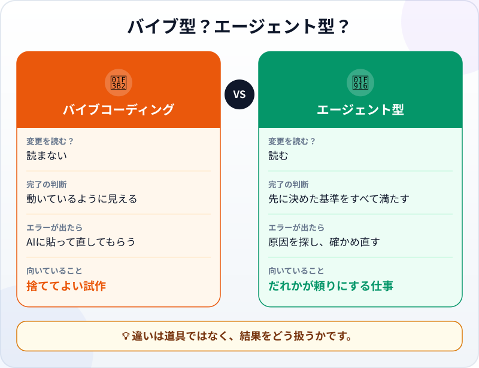

🌐 [Tiếng Việt](../../vi/lessons/vibe-vs-agentic.md) · [English](../../en/lessons/vibe-vs-agentic.md) · **日本語**

# バイブコーディングとエージェント型コーディングの違い

<!-- section: objective -->
## この授業のゴール

この授業を終えると、次のことができるようになります。

- **バイブコーディング**と**エージェント型コーディング**を、道具ではなく「結果をどう扱うか」で見分けられる。
- バイブコーディングで十分な場面を知り、エージェント型に切り替えるべきかを1つの質問で判断できる。
- バイブ型の依頼を、完了条件・確認方法・レビューの3つのステップでエージェント型にできる。

<!-- section: hook -->
## なぜ大事なの？

フイさんは大学2年生です。金曜の夜、サークルのクイズ大会用の得点ボードのページを、AIに希望を打ち込むだけで作りました。「得点を足すボタンを付けて」「色をもっときれいに」「チーム名を入れて」。AIが返すたびにページを開き、動いているのを見て、次の依頼を打ちます。コードは1行も読みません。1時間で完成し、見た目も上々です。

日曜日、サークルはそのページで本番の得点をつけました。試合の途中、パソコンを持っていた人がうっかりページを再読み込みすると、得点がすべて消えました。それまでの得点を覚えている人はいません。フイさんは道具の使い方を間違えたわけではありません。試しに作るのに向いたやり方を、人が頼りにする仕事に使ってしまったのです。

<!-- section: concept -->
## 本題

### バイブコーディングとは？

Google Cloudによると、**バイブコーディング**という言葉は、AI研究者のアンドレイ・カルパシー（Andrej Karpathy）が2025年初めに作ったものです。最も「純粋」な形では、AIが返した結果を完全に信じます。カルパシーの言葉を借りれば、「コードが存在することさえ忘れる」ようなやり方です。よくある流れはこうです。ほしいものを説明し、コードを受け取り、動いていそうなら先に進む。エラーが出たらAIに貼り付けて修正を受け取り、それでも読みません。

### エージェント型コーディングはどこが違う？

[従来のコーディングとエージェント型コーディング](traditional-vs-agentic.md)で見たとおり、エージェント型コーディングもコードを書く作業はAIに任せます。違うのは、その周りであなたがすることです。目標と境界をはっきり伝え、確認方法を渡し、変更と証拠をレビューし、結果に責任を持ちます。Google Cloudはこれを、責任あるAI支援開発と呼んでいます。人がAIを導き、そのうえで生成されたコードをレビューし、テストし、理解するやり方です。



注意：**同じ道具**で、どちらのやり方もできます。エージェントを使えば自動的にエージェント型コーディングになるわけではありません。確認を飛ばせば、バイブコーディングのままです。

### バイブコーディングで十分なのはいつ？

バイブコーディングは悪いものではありません。カルパシーは、速さが一番大事な「週末の使い捨てプロジェクト」に向いていると言っています。このコースでいえば、次のような場合です。

- `ai-practice` フォルダーの中で、架空のデータを使う。
- ほかにだれも結果を頼りにしていない。
- 消してしまっても惜しくない。

たとえば、ゲームのアイデアがどう見えるか試す、下書きの個人ページでデザインを試す、といった場面です。

### 判断のための1つの質問

結果を使う前に、こう聞きましょう。**「これが間違っていたら、だれが困る？」** 答えが「だれも困らない。試しているだけ」なら、バイブコーディングで大丈夫です。ほかの人、本物の数字、お金、サークルのイベントなどが困るなら、エージェント型に切り替えます。

### バイブ型からエージェント型への3ステップ

1. **完了の条件を書き出す。** [良い指示書の書き方](writing-good-specs.md)で学んだとおりです。
2. **確認方法を加える。** エージェントが実行でき、あなたも自分でくり返せるものにします。[「たぶん合っている」をチェックに変える](testing-basics.md)で学んだとおりです。
3. **使う前に、変更と証拠をレビューする。** 画面を見るだけで終わりにしません。

<!-- section: analogy -->
## 身近なたとえ

自分用の試作料理と、結婚式の料理。新しい料理を自分用に試すなら、味付けは気分で、失敗しても明日また作ればいいだけです。50人のお客様に出すなら、レシピどおりに作り、各段階で味見をし、アレルギーのある人を前もって確認します。ほかの人がその食事を頼りにしているからです。

このたとえが合わないところ：まずい料理は食べればすぐ分かります。間違ったコードは見た目には問題なく、実際にだれかが使ったときに初めて表に出ることが多いのです。試合の途中でページを再読み込みしたときのように。だからコードの「味見」とは、問題が出るのを待つのではなく、自分から確かめにいくことです。

<!-- section: example -->
## 具体例

あの日曜日の後、フイさんは同じエージェントを使って、今度はエージェント型のやり方で得点ボードを作り直しました。

**バイブ型の依頼（前回）：**

```text
サークルのクイズ大会用の得点ボードのページを作って。チーム名と得点を足すボタン付きで、色はきれいに。
```

**エージェント型の依頼（今回）：**

```text
目標：サークルの集まりで使う、4チーム用のクイズ得点ボード。
制約：ai-practice の中の scoreboard.html 1ファイルだけ。何かをインストールするときは先に聞くこと。
完了条件：
1. 各チームに +10 と -10 のボタンがあり、得点は0未満にならない。
2. ページを再読み込みしても、得点が残っている。
3. 「新しいゲーム」ボタンで得点が0に戻る。消す前に確認を求める。
終わったら、それぞれの条件をどう確かめたか教えてください。
```

エージェントは作業を終え、どう確かめたかを報告しました。フイさんは報告だけで終わりにしません。変更を読み、3つの条件を自分でも試しました。0点のチームで -10 を押す（0のまま）、何回か得点を足してから再読み込みする（得点が残っている）、「新しいゲーム」を押す（消す前に確認が出て、承認すると4チームとも0点になる）。フイさんが書いた証拠です。

- *見せられるもの…* 自分のパソコンで動く `scoreboard.html`。再読み込みしても得点が残る。
- *確かめたこと…* 変更を読んだうえで、3つの条件すべてを自分の手で。
- *使わないほうがいい場面…* 何人もが別々のパソコンで同時に得点をつけるとき。このページは1つのブラウザーにしか得点を保存しない。

今回は15分ほど長くかかりました。その代わり、次の日曜日にはだれも得点を暗記しておく必要がありませんでした。

<!-- section: misconceptions -->
## よくある誤解

- **「バイブコーディングは間違ったやり方」** ―― 捨ててよい試作なら、速くて楽しいやり方です。だれかが結果を頼りにする場面で使うのが問題なだけです。
- **「エージェントを使えばエージェント型コーディング」** ―― それを決めるのは道具ではありません。基準も確認もレビューもなければ、どれほど強力な道具でもバイブコーディングのままです。
- **「ページが動けば完成」** ―― 動くというのは、1つのやり方で試したときにエラーが出なかったというだけです。正しい仕事をしているかは、先に書いた基準で分かります。

<!-- section: recap -->
## 1枚でわかるこのレッスン


<!-- section: takeaways -->
## まとめ

- バイブコーディング：AIが書き、動いていそうなら受け入れる。読まない、確かめない。
- エージェント型コーディング：目標・境界・確認方法・レビュー。そして責任はあなたに。
- 違いは道具ではなく、結果をどう扱うか。
- `ai-practice` の中で、架空のデータを使った、捨ててよい試作ならバイブコーディングで十分。
- 「間違っていたら、だれが困る？」と聞き、ほかの人が困るならエージェント型へ。

<!-- section: quiz -->
## 確認クイズ

**問1.** バイブコーディングとエージェント型コーディングを分けるのは何ですか？

- A) バイブコーディングはチャットボット、エージェント型はエージェントを使う
- B) バイブコーディングは速いので、必ず品質が低い
- C) 結果をどう扱うか：基準・確認・レビューがあるかどうか

**問2.** バイブコーディングに一番向いている仕事はどれですか？

- A) `ai-practice` の中でゲームのアイデアの見た目を試し、あとで消す
- B) 経理部の給与計算の表
- C) サークルの200人規模のイベントの申込ページ

**問3.** AIが作ったページは、試したときにはうまく動きました。来週、グループ全員が使います。まず何をしますか？

- A) 試して動いたので、そのまま使う
- B) 完了条件を書き、条件を一つずつ確かめ、変更を読んでからグループに渡す
- C) 念のため、AIに全部書き直してもらう

<details>
<summary>答えを見る</summary>

1. **C** ―― 同じ道具でどちらのやり方もできますし、速さが品質を決めるわけでもありません。
2. **A** ―― だれも結果を頼りにしておらず、消しても惜しくありません。ほかの2つは、間違っていればほかの人が困ります。
3. **B** ―― ほかの人が結果を頼りにするので、基準・確認・レビューが必要です。全部書き直すと、確かめていないコードが増えるだけです。

</details>

<!-- section: sources -->
## 参考資料

- Google Cloud ―― [What is vibe coding?](https://cloud.google.com/discover/what-is-vibe-coding)（英語、2026年9月29日閲覧）：この言葉はアンドレイ・カルパシーが2025年初めに作った。「純粋な」バイブコーディングは結果を完全に信じ、「コードが存在することさえ忘れる」もので、「週末の使い捨てプロジェクト」に最も向いている。責任あるAI支援開発では、人がAIを導き、そのうえでコードをレビューし、テストし、理解して、最終的な成果物に責任を持つ。
