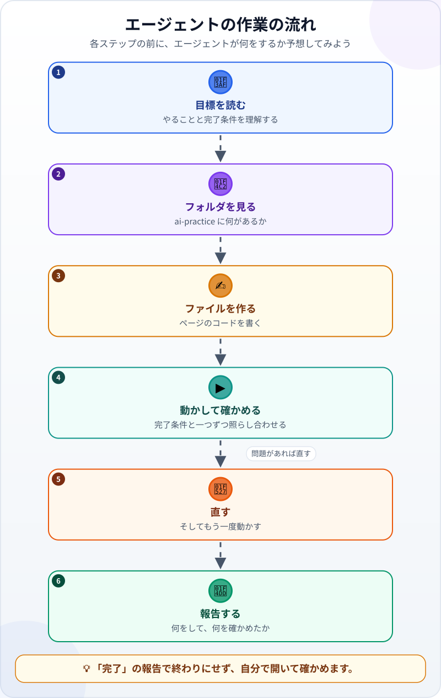
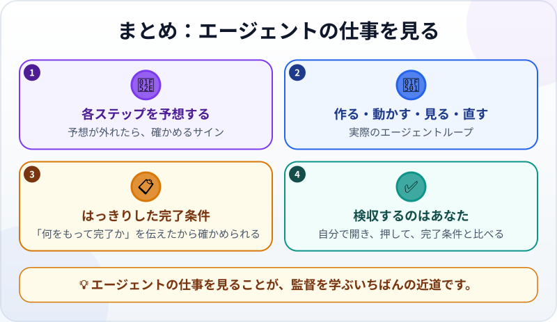

🌐 [Tiếng Việt](../../vi/lessons/watch-an-agent-build.md) · [English](../../en/lessons/watch-an-agent-build.md) · **日本語**

# AIエージェントが小さなWebページを作って確かめる様子を見よう

<!-- section: objective -->
## この授業のゴール

この授業を終えると、次のことができるようになります。

- エージェントの作業の流れを説明できる：目標を読む → フォルダを見る → ファイルを作る → 動かして確かめる → 直す → 報告する。
- **目的を持って見る**：次の一手を予想してから、エージェントが実際にすることと比べる。
- エージェントの「完了」がまだ終わりではない理由がわかり、自分の完了条件で結果を確かめられる。

<!-- section: hook -->
## なぜ大事なの？

エージェントが[「考える→行動する→観察する」のループ](agent-parts-and-loop.md)で動くことは、もう知っています。この授業では、そのループを実際の仕事の中で見てみます。小さなWebページづくりです。

新しい職場の初日を思い出してください。仕事のできる先輩の隣で、まず一回やるところを見せてもらいます。まだ自分ではやりませんが、**「ふつうはこう進む」**がわかります。だから後で、おかしなことが起きたときにすぐ気づけるのです。

<!-- section: concept -->
## 本題

### 作業の流れを一歩ずつ

1. **目標を読む：** エージェントは、やることと「何をもって完了か」を言い直します。誤解していたら、ここで直すのがいちばん安上がりです。
2. **フォルダを見る：** 書く前に、フォルダに何があるかを確かめます。すでにあるファイルを上書きしないためです。
3. **ファイルを作る：** コード（コンピュータへの指示）をファイルに書きます。
4. **動かして確かめる：** 作ったものを動かし、完了条件と一つずつ照らし合わせます。ただし、ページを開いてボタンを押せるツールがある場合です。
5. **直す：** 問題があれば直して、もう一度動かします。4と5は何度かくり返すことがあります。
6. **報告する：** 何をしたか、**何を確かめたか、そして何を確かめていないか**を伝えます。

### 目的を持って見る：予想してから比べる

ただ眺めるのはやめましょう。各ステップの前に、*「自分なら次に何をする？」*と考えます。そして、エージェントが実際にしたことと比べます。

- **予想が当たった：** エージェントの動き方がわかってきた証拠です。
- **予想が外れた：** 新しいやり方を学んだか、エージェントが道をそれているかのどちらかです。確かめるタイミングです。

### 見るべき4つのポイント

- **書く前に見て**いるか？
- 作ったものを**動かして**いるか？
- あなたの**完了条件と比べて**いるか？ それとも「動いていそう」で終わっているか？
- 報告に**確かめていないこと**がはっきり書いてあるか？

<!-- section: example -->
## 具体例

ハナさんは東京で事務の仕事をしていて、AIを使い始めたばかりです。仕事のヒントを表示する小さなWebページがほしくて、練習用フォルダ `ai-practice` でエージェントに頼みました。

> *「`tips.html` というファイルを1つ作って、仕事のヒントを表示してください。『次のヒント』ボタンでヒントが変わるように。完了条件：(1) ブラウザーで開ける、ファイルは1つだけ。(2) ヒントは5つあり、ボタンを押すと別のヒントに変わる。(3) スマホでも読める文字の大きさ。」*

作業はこう進みました（簡略版）。

1. 🎯 エージェントが目標と3つの完了条件を言い直す。
2. 📂 `ai-practice` を見る：あるのは `README.txt` だけ。上書きするものはない。
3. ✍️ ヒント5つとボタンを入れた `tips.html` を作る。
4. ▶️ ページを開いてボタンを押す：**ヒントが変わらない**。エラーメッセージによると、ボタンが呼び出しているコードの名前が存在しない。名前が1文字だけ打ち間違えていた。
5. 🔧 名前を直して開き直す：ボタンでヒントが変わる。ウィンドウをスマホの幅まで狭めても、文字は読める。
6. 📝 報告：*「`tips.html` を作成しました。確かめたこと：開ける、ヒントが5つある、ボタンでヒントが変わる、狭いウィンドウでも読める。確かめていないこと：実際のスマホでの表示。」*

ハナさんは自分の3つの完了条件で確かめます。「次のヒント」を押し続けると、**5回目**でヒントの枠が**空っぽ**になりました。エージェントは数回しか押していなかったので、このバグに出会わなかったのです。ハナさんが伝えると、エージェントは最後のヒントの次に最初へ戻るように直し、自分でも一周押して確かめました。

ハナさんの学び：エージェントが確かめられるのは、自分に**見えたこと**だけ。*「10回続けて押しても、いつもヒントが出る」*のように完了条件がはっきりしているほど、エージェントは自分でしっかり確かめます。そして最後の確認は、やはりあなたの仕事です。

<!-- section: try-it -->
## やってみよう

インストール不要、約3分。トゥアンさんがエージェントに頼みました：*「夏休み（8月10日）まであと何日かを表示する `countdown.html` を作ってください。完了条件：ブラウザーで開ける。日数がカレンダーと合っている。」* ここまでにエージェントがしたこと：

1. 目標と2つの完了条件を言い直した。
2. `ai-practice` フォルダを見た。
3. `countdown.html` を作った。

**予想してみよう：** エージェントは次に何をすべき？ そして「完了」と言われたら、トゥアンさんは自分で何を確かめるべき？

答えの例

- **次のステップ：** ページを開いて、日数をカレンダーと比べる。たとえば別の方法で日数を数えて、2つの結果を比べる。
- **トゥアンさん自身の確認：** ファイルを開き、カレンダーで自分でも日数を数えて、ページの数字と比べる。1日ずれていたり、マイナスの数が出たりしたら、伝えるべきバグです。

<!-- section: misconceptions -->
## よくある誤解

- **「エージェントが完了と言えば完了」** — 報告からわかるのは、エージェントが何を確かめたかです。*確かめていないこと*をよく読み、自分の完了条件で確かめましょう。
- **「エージェントが自分でエラーを直せるなら、見なくていい」** — 直せるのは見えたエラーだけです。打ち間違いには、はっきりしたエラーメッセージがありました。5回押したときだけ出るバグを見つけるには、人か、はっきりした完了条件が必要です。
- **「エージェントの作業を見るのは時間のむだ」** — 最初の数回は、じっくり見ることで「ふつう」がわかります。慣れたら、見るのは要所だけで十分です：目標、確認の結果、報告。

<!-- section: recap -->
## 1枚でわかるこのレッスン

<!-- section: takeaways -->
## まとめ

- エージェントの作業：目標を読む → フォルダを見る → ファイルを作る → 動かして確かめる → 直す → 報告する。
- 目的を持って見る：各ステップを予想する。予想が外れたら、確かめるサイン。
- エージェントが確かめられるのは、あなたが*何をもって完了か*を伝えたから。完了条件がはっきりしているほど、しっかり確かめる。
- エージェントの「完了」で終わりではない：自分で開き、押して、完了条件と比べる。

<!-- section: quiz -->
## 確認クイズ

**問1.** エージェントがファイルを作る前にフォルダを見るべきなのはなぜ？

- A) ゆっくり慎重にやるため
- B) 何があるかを知り、既存のファイルを上書きしないため
- C) コンピュータがそう決めているから

**問2.** 具体例で、エージェントが「ヒントの枠が空になるバグ」に自分で気づかなかったのはなぜ？

- A) エージェントはコードを読めないから
- B) 数回しか押しておらず、バグが出るところまで試していなかったから
- C) ハナさんがボタンを押すのを禁止していたから

**問3.** エージェントの報告：*「ファイルを作成しました。実際のスマホでは確かめていません。」* あなたはどうする？

- A) 完了と言っているので、その一文は気にしない
- B) それが大事なら、足りない部分を自分で確かめるか、エージェントに追加で確かめてもらう
- C) ファイルを消して最初からやり直す

答えを見る

1. **B** — 書く前に見れば、今あるものを上書きせずにすみます。
2. **B** — エージェントが確かめられるのは見えたことだけ。「何回押してもヒントが出る」という完了条件があれば、見つけられたはずです。
3. **B** — 報告の*確かめていないこと*は、あなたの担当です。自分で確かめるか、追加で頼みましょう。

<!-- section: sources -->
## 参考資料

- Anthropic — [Best practices for Claude Code](https://code.claude.com/docs/en/best-practices)（英語）：テストや比べるためのスクリーンショットなど、エージェントが自分の仕事を確かめる手段を用意しようと勧めています。それがないと「完了したように見える」ことだけが手がかりになり、すべてのミスに気づく役目があなたに回ってきます。
- Anthropic — [Building Effective AI Agents](https://www.anthropic.com/engineering/building-effective-agents)（英語、2024年12月）：エージェントは各ステップで、ツールの結果やコードの実行結果など、環境から「実際の結果」を得て進み具合を判断することが重要だと説明しています。
