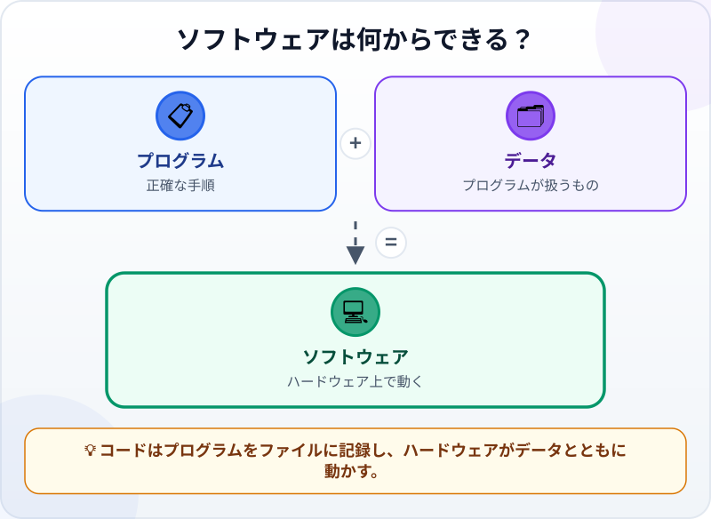
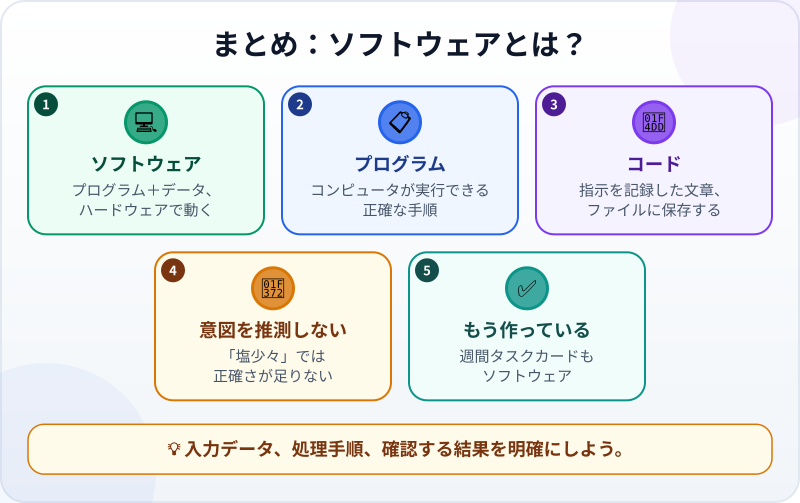

🌐 [Tiếng Việt](../../vi/lessons/what-is-software.md) · [English](../../en/lessons/what-is-software.md) · **日本語**

# ソフトウェアとは？プログラムはレシピのようなもの

<!-- section: objective -->
## この授業のゴール

このレッスンを終えると、次のことができるようになります。

- ソフトウェア、プログラム、コード、データ、ハードウェアの基本的な違いを説明できる。
- コンピュータには、人間向けの曖昧な指示ではなく正確な手順が必要だと説明できる。
- 自分が作った小さな成果物もソフトウェアだと気づける。

<!-- section: hook -->
## なぜ大事なの？

マイは、コンピュータにタスクリストを用意させたいと思っています。「簡単。見やすく並べて、と頼めばいい」と考えました。でも、**見やすく**とは、日付順、重要度順、名前順のどれでしょうか。人なら状況から推測できますが、コンピュータには明確な方法が必要です。

これはマイがエージェントに仕事を頼むときに大切です。エージェントは多くのコードを書けます。しかし製品が何からできているか分からなければ、変更箇所を正確に伝えたり、違う場所が変更されたと気づいたりできません。

<!-- section: concept -->
## 本題

### ハードウェアがソフトウェアを動かす

**ハードウェア**は、スマートフォン、パソコン、メモリ、プロセッサなど物理的な部分です。**ソフトウェア**は、ハードウェアが使うプログラムとデータです。カレンダーアプリ、表計算、Webページもソフトウェアです。ハードウェアがなければ動かす機械がなく、ソフトウェアがなければ機械は何をするか分かりません。

**データ**はプログラムが扱うものです。タスク名、日付、完了状態、文書の文字、画像などがあります。同じプログラムでも、データが違えば二人の画面には違うリストが表示されます。

### プログラムは正確な手順

**プログラム**は、コンピュータが実行できる一連の手順です。タスクカードのプログラムなら、リストを受け取り、未完了の仕事を先に置き、各タスクを画面に表示します。

コンピュータは、書かれた手順を高速に何度でも実行します。しかし生活経験を使って曖昧な部分を補いません。「いい感じに並べる」だけでは正確さが足りません。「未完了を先に置き、各グループでは日付が早い順にする」なら明確です。

### コードはプログラムを表す文章

**コード**は、その手順をプログラミング言語で表した文章です。通常はプロジェクトの**ファイル**に保存され、人やエージェントが読み、修正し、変更を確認できます。コードを動かすと、コンピュータがプログラムを実行し、画面やファイルに結果を出します。

まだ一行ずつ自分で書く必要はありません。変数、条件分岐、ループ、関数は[変数・関数・条件分岐・ループ：よく使う4つの部品](programming-building-blocks.md)で扱います。今は「プログラムは指示、コードはその指示を記録した文章」と覚えましょう。

<!-- section: analogy -->
## 身近なたとえ

プログラムは**料理のレシピ**に似ています。材料はデータ、台所と道具はハードウェア、書かれたレシピはコード、完成した料理は出力に当たります。

料理人は味見と経験で「塩少々」を理解し、調整できます。コンピュータには「少々」が何グラムか分かりません。「塩を2グラム加え、10秒混ぜる」のような指示が必要です。それぞれの入力に、明確な処理と確認できる結果が要ります。

ただし、たとえには限界があります。料理人は感覚を持ち、状況に合わせられますが、コンピュータはプログラムで許された処理だけをします。エージェントは希望をコードにするのを助けますが、完成品は言葉にしなかった意図ではなく、コードとデータに従って動きます。

<!-- section: example -->
## 具体例

[はじめてのエージェント体験：1ファイルのタスクカードを作る](first-agent-session.md)で、マイはエージェントに練習用フォルダ `ai-practice` へ週間タスクカードを作らせました。これは単なる「きれいなページ」ではなく、すでに作ったソフトウェアです。

1. **データ**は「下書きを作る」などの架空の仕事と、完了したかどうかです。
2. **コード**は、内容、見た目、動きを記述するためにエージェントが作ったファイル内の文章です。
3. **プログラム**は、コードとデータをタスクカードに変えるためにブラウザが実行する指示です。
4. **ハードウェア**は、ブラウザを動かして結果を表示するパソコンです。

「未完了を上に置く」と頼むと、エージェントはコードの指示を変更します。「下書きを作る」を「下書きを送る」に変えるだけなら、プログラムの動きはそのままでデータだけが変わるかもしれません。この違いが分かると、仕事を明確に説明できます。

<!-- section: misconceptions -->
## よくある誤解

- **「ソフトウェアはコードだけ」** — 扱うデータと、動かすハードウェアも必要です。
- **「プログラムとコードは完全に別物」** — プログラムは指示、コードは指示を記録する文章です。日常会話ではほぼ同じ意味で使われることもあります。
- **「コンピュータは意図を分かってくれる」** — 「きれい」「いい感じ」「少々」を自動では理解しません。観察して確認できる基準に変えましょう。
- **「大きな製品だけがソフトウェア」** — 一つのファイルのタスクカードでも、コンピュータが指示とデータを実行すればソフトウェアです。

<!-- section: recap -->
## 1枚でわかるこのレッスン

<!-- section: takeaways -->
## まとめ

- ソフトウェアは、ハードウェア上で動くプログラムとデータです。
- プログラムは正確な手順です。コンピュータは「塩少々」では動けません。
- コードはプログラムを表す文章で、通常はファイルに保存されます。
- `ai-practice` の週間タスクカードは、すでに作ったソフトウェアです。

<!-- section: quiz -->
## 確認クイズ

**問1.** ソフトウェアを最も正確に説明しているものはどれですか？

- A) 画面がある機械だけ
- B) ハードウェア上で動くプログラムとデータ
- C) 多くの人に販売する大きなアプリだけ

**問2.** 「塩少々」がコンピュータへのよい指示でないのはなぜですか？

- A) 正確な量と処理手順がないから
- B) コンピュータは数字を扱えないから
- C) すべてのプログラムは料理用だから

**問3.** コードとは何ですか？

- A) パソコン内部の物理的な部品
- B) 利用者が入力するすべてのデータ
- C) プログラムの指示を記録した文章

答えを見る

1. **B** — ソフトウェアはプログラムとデータを含み、動かすにはハードウェアが必要です。
2. **A** — 「少々」は料理人の判断に頼り、コンピュータ向けの正確な手順ではありません。
3. **C** — コードは指示を表す文章で、通常はファイルに保存されます。

