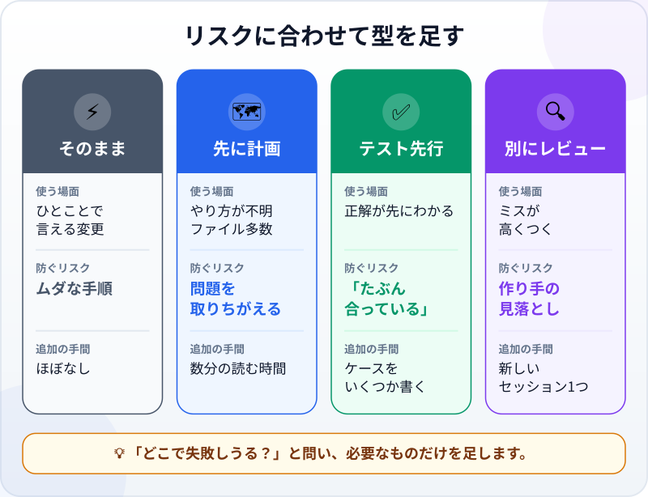
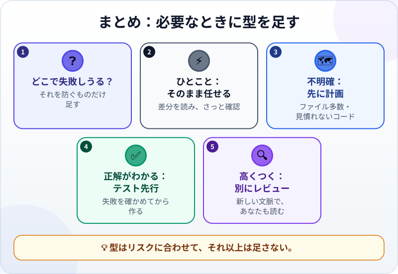

🌐 [Tiếng Việt](../../vi/lessons/workflow-frameworks.md) · [English](../../en/lessons/workflow-frameworks.md) · **日本語**

# 必要なときに型を足す：計画、テスト先行、レビュー

<!-- section: objective -->
## この授業のゴール

この授業を終えると、次のことができるようになります。

- 作業のリスクに合わせて、**そのまま任せる**、**先に計画**、**テスト先行**、**別にレビュー**の4つから選べる。
- それぞれがどのリスクを防ぎ、どんな手間がかかるかを説明できる。
- 「テスト先行」の依頼が書ける：正解が先にわかっているケースを書き、テストが失敗するのを確かめてから作る。

<!-- section: hook -->
## なぜ大事なの？

ハナさんはネットで、AIと働くための「標準プロセス」を読みました。いつも要件定義書を書き、次に計画、次にテスト、次にレビュー、それから作る。試しに、タスクカードの見出しの色を変える作業に当てはめてみました。1行の変更に40分かかりました。

翌週は逆のことをしました。残業時間の計算を、計画もテストもなしにそのまま任せたのです。結果は動きました。夜勤の日が来るまでは。

型は多いほどよいわけでも、少ないほど速いわけでもありません。作業の**リスクに合わせる**べきものです。

<!-- section: concept -->
## 本題

### まず問う：この作業は、どこで失敗しうる？

基本のワークフロー[調べる→計画する→作る→検証する](explore-plan-build-verify.md)は、もう身についています。この授業のテーマは**分量**です。ある作業に、どれだけの型を足すか。足すものはそれぞれ、別々のリスクを防ぎます。



### そのまま任せる

Claude Codeのガイド（2026年9月時点）は簡潔です。**変更をひとことで言えるなら、計画は飛ばしてよい。** 見出しの色を変える、誤字を直す、リストに1行足す。任せて、差分を読み、一度開いて見る。それで終わりです。

### 先に計画 ―― 見当ちがいを防ぐ

どう進めるべきかわからないとき、変更が多くのファイルにわたるとき、その部分のコードをよく知らないとき。一番のリスクは、エージェントが**まちがった**問題を正しく解いてしまうことです。先に読む計画は数分で済み、見当ちがいの方向に進んだ半日をやり直すよりずっと安くつきます。

### テスト先行 ―― 「たぶん合っている」を防ぐ

いくつかのケースの**正解が先にわかっている**とき（再現したいバグ、手で計算した数字など）は、コードができる**前に**[テスト](testing-basics.md)にします。

1. ケースと正解を書く。
2. バグが残っている古いコード、またはわざとまちがえた仮のものでテストを実行する。**失敗**しなければいけません。それも、予想したとおりのケースで、数字がちがうという理由で。ファイルがないというだけの失敗なら、テストについては何もわかっていません。正しい場所での失敗を見ることが、そのテストが確かめたいことを本当に確かめている証拠です。
3. それからエージェントに作らせ、テストが合格するまで進める。

Claude Codeのガイドも、バグを直すときにまさにこのやり方をすすめています。問題を再現する失敗するテストを書き、それから直す。ソフトウェアの世界では*テスト駆動開発*（test-driven development、TDD）と呼ばれます。

### 別にレビュー ―― 作り手の見落としを防ぐ

作り手は、自分のミスに気づきにくいものです。エージェントも同じで、各手順をなぜそうしたかを覚えているからです。まちがいが高くつくとき（お金、データ、たくさんの人が使うもの）や、エージェントが長いあいだ一人で作業したときは、**新しいコンテキストで**レビューさせます。差分と基準だけを見て、そこに至った理屈は知らない別のセッションです。そして、そのレビューが見つけたことを、あなたが読みます。

### 名前はいろいろ、問いはひとつ

ネットには、独自の名前とテンプレートと手順を持つ「フレームワーク」がたくさんあります。その多くは、上の3つの組み合わせ方の違いです。集める必要はありません。作業ごとに「**どこで失敗しうる？**」と問い、そのリスクを防ぐものだけを足します。足しすぎにも代償があります。遅くなり、だれも必要としない文書でコンテキストがいっぱいになります。

<!-- section: analogy -->
## 身近なたとえ

買い物を考えてみましょう。近所のコンビニに塩を買いに行くなら、そのまま行きます。はじめて行く大きな市場なら、先に地図を見ます。これが**計画**です。年末に家族のおせちの買い出しに行くなら、出かける前にリストを書き、帰ってから1品ずつ照らし合わせます。これが**テスト先行**です。会社の経費で買うなら、経理の人が領収書を確認します。これが**別のレビュー**です。

塩を買うのにリストを書く人はいないし、年末の買い出しにリストなしで行く人もいません。

このたとえが当てはまらないところ：買い物は時間がかかるので、手順を1つ足すだけでも重く感じます。エージェントはとても速いので、計画やテストはたいてい数分で済みます。感じるよりずっと安いのです。面倒に思えるからといって、作業に本当に必要な手順を飛ばさないでください。

<!-- section: example -->
## 具体例

ハナさんには今週3つの作業があります。どれも `ai-practice` で、架空のデータを使います。

**作業1 ―― タスクカードの見出しの色を変える。** ひとことで言えます。**そのまま任せ**、1行の差分を読み、ページを開いて見ます。2分です。

**作業2 ―― 勤怠表から残業時間を計算する。** 何日分かの正解がもうわかっているので、ハナさんは**テスト先行**を選びます。架空のルールは、1日8時間を超えた分が残業、昼休み1時間は数えない、です。

```text
コードを書く前に、次のケースで check_overtime.py を作って
（出勤時刻、退勤時刻、休憩1時間、8時間を超えた分が残業）：
- 9:00 → 19:30：残業 1.5時間
- 8:30 → 17:30：残業 0時間
- 9:00 → 22:00：残業 4時間
- 22:00 → 翌7:00（夜勤）：残業 0時間
それから、わざとまちがえた仮の overtime.py を作って。いつも0を返すもの。
その仮のものでテストを実行し、どのケースが合格・FAIL か、その理由を見せて。
本当の計算のコードはまだ書かないで。
```

結果はハナさんの予想どおりでした。残業のある2つのケース（1.5時間と4時間）は、仮のものが0を返すので**失敗**。残業0時間の2つは合格。ファイルがないからではなく、数字がちがうから失敗したので、このテストが本当に残業を確かめているとわかります。ハナさんは続けます。「*では、4つのケースがすべて合格するまで overtime.py を書いて。*」エージェントが書いてテストを実行すると、3つは合格、**夜勤**だけが失敗しました。コードが 7:00 から 22:00 を引いてマイナスの数になり、「退勤が出勤より前です」というエラーで止まっていたのです。エージェントは退勤が翌日になりうるように直し、もう一度実行します。4つすべて合格。先週「そのまま任せた」ときに見逃していたのが、まさにこのバグでした。

**作業3 ―― 残業計算ツールをチームで共有する。** ここからは、まちがえると多くの人に影響します。ハナさんは**新しいセッション**を開き、**別のレビュー**を頼みます。「*overtime.py と check_overtime.py を読んで。ルール（8時間を超えた分が残業、昼休み1時間）と比べて、足りないケースを探して。何も変えないで。*」レビューは、テストのないケースを指摘しました。出勤 9:00 で、退勤 17:30 を 7:30 と打ちまちがえると、コードは22.5時間の夜勤と読み、何の警告もなく残業13.5時間と数えてしまいます。ハナさんは決めました。16時間を超える勤務はエラーにして、入力した人に見直してもらう。そのケースをテストに足し、合格するまでエージェントに直させてから、チームに共有しました。

3つの作業、3つの違う分量。どれも「標準プロセス」を丸ごとは使っていません。

<!-- section: misconceptions -->
## よくある誤解

- **「AIと働くなら、いつも計画が必要」** ―― ひとことで言える変更なら、計画は遅くするだけです。やり方が不明確な作業や、ファイルが多い作業のためにとっておきます。
- **「テストは後で書いても、先に書いても同じ」** ―― 後から書くテストは、今あるコードに合わせて書かれがちです。まちがいも含めて。先に書いて失敗を確かめれば、本当に確かめられるテストだとわかります。
- **「エージェントが自分で確認したから、別のレビューはいらない」** ―― エージェントは、自分が理解したとおりに確認します。差分と基準だけを見る新しいセッションは、作り手の見落としに気づくことがよくあります。

<!-- section: recap -->
## 1枚でわかるこのレッスン



<!-- section: takeaways -->
## まとめ

- まず問う：どこで失敗しうる？ そして、そのリスクを防ぐものだけを足す。
- ひとことで言える：そのまま任せ、差分を読み、さっと確かめる。
- やり方が不明確、ファイルが多い：先に計画。
- 正解が先にわかる：テストを先に書き、失敗を確かめてから作る。
- まちがいが高くつく：新しいコンテキストで別にレビューし、結果をあなたが読む。

<!-- section: quiz -->
## 確認クイズ

**問1.** 計画なしで**そのまま任せる**べき作業はどれ？

- A) ページタイトルの誤字を直す
- B) 一度も読んだことのない4つのファイルにまたがる、エクスポート機能の追加
- C) 部署全員の給与計算を書き直す

**問2.** 本当のコードを書く前にテストを実行して**失敗**を確かめるのはなぜ？

- A) エージェントを失敗に慣れさせるため
- B) そのテストが本当に何かを確かめていると確認するため
- C) ツールがそう決めているから

**問3.** ハナさんは残業計算ツールをチームで共有しようとしています。レビューのために**新しい**セッションを開くのはなぜ？

- A) 前のセッションの電池が切れたから
- B) 新しいセッションのほうがコードを速く直すから
- C) 新しいセッションは差分と基準だけを見て、その裏の理屈を知らないので、見落としに気づきやすいから

<details>
<summary>答えを見る</summary>

1. **A** ―― ひとことで言える変更です。計画は遅くするだけです。
2. **B** ―― 一度も失敗したことのないテストは、何も確かめていないかもしれません。
3. **C** ―― 作り手は、エージェントも含めて、自分のミスを見落としがちです。新しいコンテキストは、結果を別の目で見ます。

</details>

<!-- section: sources -->
## 参考資料

- Anthropic — [Best practices for Claude Code](https://code.claude.com/docs/en/best-practices)（英語、2026年9月時点）：計画が一番役立つのは、やり方に自信がないとき、変更が複数のファイルにわたるとき、コードをよく知らないとき。差分をひとことで言えるなら計画は飛ばす。バグは、再現する失敗テストを書いてから直す。作業を完了とみなす前に、差分と基準だけを見る新しいコンテキストでのレビューを入れる。
