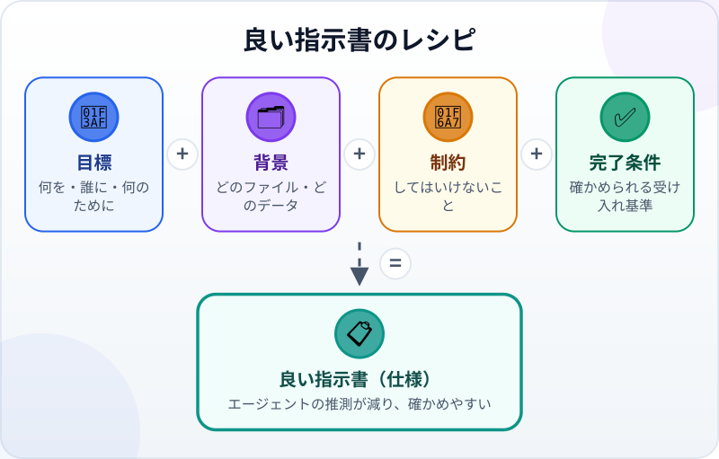
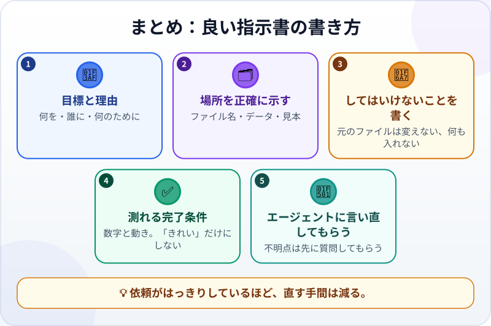

🌐 [Tiếng Việt](../../vi/lessons/writing-good-specs.md) · [English](../../en/lessons/writing-good-specs.md) · **日本語**

# 良い指示書の書き方：タスクと完了条件

<!-- section: objective -->
## この授業のゴール

この授業を終えると、次のことができるようになります。

- 4つの部分で依頼（仕様）を書ける：**目標**、**背景**、**制約**、**受け入れ基準**。
- あいまいな基準（「きれいに」「速く」「正しく」）を、確かめられる基準に変えられる。
- その指示書でエージェントに仕事を任せ、自分で確かめられる。

<!-- section: hook -->
## なぜ大事なの？

エージェントがどこまで自分で確かめられるかは、あなたが渡す基準しだいでした。Anthropic のガイドはこう言います。エージェントは意図を推測できても、あなたの心は読めない。指示が正確なほど、直す回数は減る。

この授業では、その習慣を、小さなWebページから月次レポートまで使えるレシピにします。

<!-- section: concept -->
## 本題

### 4つの部分のレシピ



- **目標：** 何を、誰のために、何のために。理由がわかれば、エージェントはより合ったやり方を選べます。
- **背景：** どのファイル、どのデータ、すでに何があるか。「この前のファイル」ではなく、ファイル名で伝えます。
- **制約：** してはいけないことと、範囲の限定。*元のファイルは変えない*、*何もインストールしない*、*`ai-practice` の中だけで作業する*。
- **受け入れ基準（完了条件）：** 具体的で確かめられる条件。*「完了条件：…」*で始めます。

### あいまいな基準と、確かめられる基準

かんたんなテスト：**ほかの人があなたの基準を読んで、あなたに聞かずに自分で確かめられるか？**

| あいまい | 確かめられる |
|---|---|
| きれいなページ | スマホで拡大せずに読める |
| 速く動く | 1,000行のファイルが自分のPCで2秒以内に開く |
| 計算が正しい | 最初の3行の合計が、自分で足した合計と一致する |
| 使いやすい | はじめて見る同僚が、質問せずに使える |

### 言い直してもらい、先に質問してもらう

指示書の最後には、いつもこの一文を。*「始める前に、目標と完了条件をあなたの言葉で言い直してください。不明な点があれば、先に質問してください。」* ここで見つかる誤解が、いちばん安く直せます。エージェントが間違った方向に一日を使ってしまう前に。

<!-- section: try-it -->
## やってみよう

約12分。`ai-practice` の中で、架空のデータだけを使います。

マイさんがエージェントに送ったメッセージ：*「今月の経費をまとめて。」* これを指示書に書き直しましょう。

**1. 架空のデータを作る（2分）** ――エージェントに頼みます：

```text
2026年9月の架空の経費を20行、expenses.csv として作ってください。
列は date, category, amount です。
category は Travel, Meals, Stationery, Other のどれか。amount の単位はベトナムドンです。
```

列名や項目名は英字のままにしておくと、Excel で開いたときの文字化けを避けられます。

**2. 枠に沿って指示書を書く（5分）：**

```text
目標：
背景：
制約：
完了条件：
1.
2.
3.
始める前に、目標と完了条件を言い直してください。不明な点があれば、先に質問してください。
```

**3. 下の見本と比べる。** 同じである必要はありません。4つの部分がそろい、基準が確かめられればOKです。

**4. 任せて、確かめる（5分）：** 指示書をエージェントに送り、変更を一つずつ承認し、基準を一つずつ自分で確かめます。証拠を書きましょう：

- *見せられるもの…* 表計算ソフトで開いた `summary.csv`。
- *確かめたこと…* 合計が `amount` 列の合計と一致する。Travel の金額が自分で足した金額と一致する。
- *使わないほうがいい場面…* たとえば、データに複数の通貨が混ざっているとき。

<details>
<summary>指示書の見本</summary>

```text
目標：月末の報告のため、2026年9月の経費を項目別にまとめる。
背景：データはこのフォルダの expenses.csv（列は date, category, amount）。架空のデータです。
制約：expenses.csv は変更しない。結果は新しいファイル summary.csv に書く。
何かをインストールする必要があれば、先に確認する。
完了条件：
1. summary.csv に項目ごとの行（4行）と Total の行がある。
2. Total が expenses.csv の amount 列の合計と等しい。
3. Travel の金額が、私が自分で足した金額と一致する。
始める前に、目標と完了条件を言い直してください。不明な点があれば、先に質問してください。
```

</details>

<!-- section: misconceptions -->
## よくある誤解

- **「依頼は長いほどいい」** — 長さではなく、そろっていることが大事です。短い箇条書きのほうが、長い文章より確かめやすいのです。
- **「基準はエージェントに考えてもらえばいい」** — 提案はしてくれますが、何をもって完了とするかを決めるのはあなたです。
- **「いつも完全な指示書が必要」** — アイデアを探っているだけなら（*「このファイル、改善できるところは？」*）、開いた質問も役に立ちます。結果が必要な仕事を任せるときは、4つの部分を書きましょう。
- **「指示書は一度書けば終わり」** — 確認の中で新しい発見があったら（5回目に押したときだけ出るバグなど）、次のために基準に加えます。

<!-- section: recap -->
## 1枚でわかるこのレッスン



<!-- section: takeaways -->
## まとめ

- 指示書 ＝ **目標** ＋ **背景** ＋ **制約** ＋ **受け入れ基準**。
- 良い基準とは、ほかの人が確かめられる基準。数字と動きで書き、「きれい」「速い」だけにしない。
- 最後に、目標と基準の言い直しと、不明点の事前質問を頼む。
- 確認で新しいことがわかったら、基準に加える。

<!-- section: quiz -->
## 確認クイズ

**問1.** 確かめられる基準はどれ？

- A) 「Total が `amount` 列の合計と等しい」
- B) 「レポートがプロっぽく見える」
- C) 「エージェントが丁寧に作業する」

**問2.** 「元のファイルは変えない」は、指示書のどの部分？

- A) 目標
- B) 背景
- C) 制約

**問3.** 始める前にエージェントに目標を言い直してもらうのはなぜ？

- A) エージェントを速くするため
- B) 誤解を早く見つけ、安く直すため
- C) 作業時間を長くするため

<details>
<summary>答えを見る</summary>

1. **A** — 2つの数字は誰でも比べられます。B と C は印象で、確かめられません。
2. **C** — 制約は、してはいけないことと範囲の限定です。
3. **B** — 言い直しを一つ直すほうが、間違った方向の作業を直すよりずっと安く済みます。

</details>

<!-- section: sources -->
## 参考資料

- Anthropic — [Best practices for Claude Code](https://code.claude.com/docs/en/best-practices)（英語）の *Provide specific context in your prompts*：指示が正確なほど直す回数は減る。ファイルを具体的に示し、制約を書き、「直った」状態がどう見えるかを伝える。アイデアを探るときは、あいまいな質問も役に立つ。
