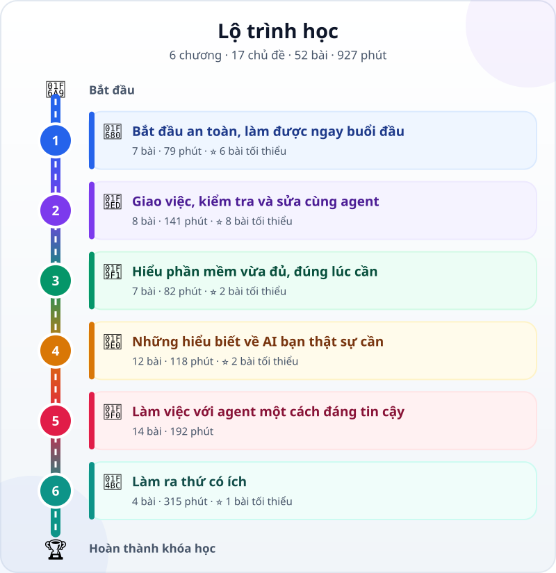

<!-- Generated by `python -m src.main build` from course/data/ and the lesson files. Do not edit by hand: CI fails when this file is out of date. -->

🌐 **Tiếng Việt** · [English](../en/README.md) · [日本語](../ja/README.md)

# Agentic Coding cho người mới bắt đầu

> Từ "phần mềm là gì?" đến giao việc cho AI agent làm phần mềm và tự kiểm tra kết quả — học bằng 3 thứ tiếng.

**Dành cho ai:** Người đi làm, sinh viên và kỹ sư ngoài ngành phần mềm — chưa biết gì về AI hay lập trình — muốn dùng AI agent để tự làm công cụ và tự động hóa công việc. Không cần biết lập trình trước: bạn học vừa đủ để giao việc viết code cho AI, kiểm tra và chịu trách nhiệm về kết quả. Đặc biệt phù hợp với người Việt đang học tập, làm việc ở Nhật hoặc với đối tác Nhật.

**6 chương · 17 chủ đề · 52 bài · 893 phút** · [Thuật ngữ 3 thứ tiếng](glossary.md)

_Bài có liên kết là bài đã đọc được; các bài còn lại đang được viết._

## ⭐ Lộ trình tối thiểu

Bắt đầu từ đây: 19 bài · 347 phút, đủ để giao việc cho AI agent và tự kiểm tra kết quả. Các bài này có dấu ⭐ trong các bảng bên dưới; những bài còn lại học thêm khi cần.

1. [Từ chatbot đến AI agent: AI không chỉ trả lời mà còn làm việc](lessons/chatbot-to-agent.md) — 8 phút
2. [Bộ não, đôi tay và vòng lặp: AI agent được ghép từ gì?](lessons/agent-parts-and-loop.md) — 8 phút
3. [Xem AI agent làm và tự kiểm tra một trang web nhỏ](lessons/watch-an-agent-build.md) — 10 phút
4. [Chọn cách thực hành: trình duyệt, máy cá nhân hay máy công ty](lessons/choose-your-learning-setup.md) — 10 phút
5. [Trước khi để agent làm việc: việc an toàn, việc phải hỏi, việc bị cấm](lessons/data-safety-and-permissions.md) — 10 phút
6. [Buổi đầu với agent: làm một trang "Việc của tôi trong tuần"](lessons/first-agent-session.md) — 25 phút
7. [Tư duy mới: bạn là trưởng nhóm, không phải người gõ code](lessons/lead-not-typist.md) — 8 phút
8. [Viết yêu cầu tốt: mô tả việc và tiêu chí hoàn thành](lessons/writing-good-specs.md) — 12 phút
9. [Quy trình 4 bước: Tìm hiểu → Lập kế hoạch → Thực hiện → Kiểm chứng](lessons/explore-plan-build-verify.md) — 12 phút
10. [File, thư mục và đường dẫn: tấm bản đồ bên trong máy tính](lessons/files-folders-paths.md) — 10 phút
11. [Đọc và review thay đổi của agent (diff)](lessons/reviewing-agent-changes.md) — 15 phút
12. [Từ "trông có vẻ đúng" đến phép kiểm tra](lessons/testing-basics.md) — 12 phút
13. [Đọc thông báo lỗi và gỡ lỗi như một thám tử](lessons/errors-and-debugging.md) — 12 phút
14. [Dự án: trang web cá nhân của bạn](lessons/project-personal-page.md) — 60 phút
15. [Dữ liệu trông như thế nào: JSON, CSV, YAML](lessons/data-formats.md) — 10 phút
16. [Git: nút Undo thần kỳ cho cả dự án](lessons/git-version-control.md) — 15 phút
17. [Ảo giác AI: vì sao AI tự tin nói sai](lessons/hallucination.md) — 10 phút
18. [Cửa sổ ngữ cảnh: trí nhớ ngắn hạn của AI](lessons/context-window.md) — 10 phút
19. [Dự án: tự động hóa việc văn phòng (bảng tính → báo cáo)](lessons/project-office-automation.md) — 90 phút

## 1. 🚀 Bắt đầu an toàn, làm được ngay buổi đầu

🎯 Hiểu AI agent khác chatbot ở đâu, chọn cách thực hành an toàn trên máy của mình, rồi nhờ agent làm sản phẩm đầu tiên và tự kiểm tra.

### 1.1 AI agent làm được gì

| # | Bài học | Loại | Thời lượng |
|---|---|---|---|
| 1.1.1 | ⭐ [Từ chatbot đến AI agent: AI không chỉ trả lời mà còn làm việc](lessons/chatbot-to-agent.md) | 📖 Khái niệm | 8 phút |
| 1.1.2 | ⭐ [Bộ não, đôi tay và vòng lặp: AI agent được ghép từ gì?](lessons/agent-parts-and-loop.md) | 📖 Khái niệm | 8 phút |
| 1.1.3 | ⭐ [Xem AI agent làm và tự kiểm tra một trang web nhỏ](lessons/watch-an-agent-build.md) | 🎬 Minh họa | 10 phút |

### 1.2 Chọn cách học an toàn

| # | Bài học | Loại | Thời lượng |
|---|---|---|---|
| 1.2.1 | ⭐ [Chọn cách thực hành: trình duyệt, máy cá nhân hay máy công ty](lessons/choose-your-learning-setup.md) | 🛠️ Thực hành | 10 phút |
| 1.2.2 | ⭐ [Trước khi để agent làm việc: việc an toàn, việc phải hỏi, việc bị cấm](lessons/data-safety-and-permissions.md) | 📖 Khái niệm | 10 phút |

### 1.3 Sản phẩm đầu tiên

| # | Bài học | Loại | Thời lượng |
|---|---|---|---|
| 1.3.1 | ⭐ [Buổi đầu với agent: làm một trang "Việc của tôi trong tuần"](lessons/first-agent-session.md) | 🛠️ Thực hành | 25 phút |
| 1.3.2 | [Chọn lộ trình và ghi nhật ký học](lessons/how-to-learn-this-course.md) | 🛠️ Thực hành | 8 phút |

## 2. 🧭 Giao việc, kiểm tra và sửa cùng agent

🎯 Giao cho agent một việc rõ ràng, kiểm tra từng thay đổi bằng bằng chứng, và hoàn thành dự án có ý nghĩa đầu tiên.

### 2.1 Giao việc rõ ràng

| # | Bài học | Loại | Thời lượng |
|---|---|---|---|
| 2.1.1 | ⭐ [Tư duy mới: bạn là trưởng nhóm, không phải người gõ code](lessons/lead-not-typist.md) | 📖 Khái niệm | 8 phút |
| 2.1.2 | ⭐ [Viết yêu cầu tốt: mô tả việc và tiêu chí hoàn thành](lessons/writing-good-specs.md) | 🛠️ Thực hành | 12 phút |
| 2.1.3 | ⭐ [Quy trình 4 bước: Tìm hiểu → Lập kế hoạch → Thực hiện → Kiểm chứng](lessons/explore-plan-build-verify.md) | 🛠️ Thực hành | 12 phút |

### 2.2 Kiểm tra kết quả

| # | Bài học | Loại | Thời lượng |
|---|---|---|---|
| 2.2.1 | ⭐ [File, thư mục và đường dẫn: tấm bản đồ bên trong máy tính](lessons/files-folders-paths.md) | 🛠️ Thực hành | 10 phút |
| 2.2.2 | ⭐ [Đọc và review thay đổi của agent (diff)](lessons/reviewing-agent-changes.md) | 🛠️ Thực hành | 15 phút |
| 2.2.3 | ⭐ [Từ "trông có vẻ đúng" đến phép kiểm tra](lessons/testing-basics.md) | 🛠️ Thực hành | 12 phút |
| 2.2.4 | ⭐ [Đọc thông báo lỗi và gỡ lỗi như một thám tử](lessons/errors-and-debugging.md) | 🛠️ Thực hành | 12 phút |

### 2.3 Dự án đầu tiên

| # | Bài học | Loại | Thời lượng |
|---|---|---|---|
| 2.3.1 | ⭐ [Dự án: trang web cá nhân của bạn](lessons/project-personal-page.md) | 🚀 Dự án | 60 phút |

## 3. 🧱 Hiểu phần mềm vừa đủ, đúng lúc cần

🎯 Đọc hiểu những gì agent vừa tạo — file, thư mục, dữ liệu, mã và lịch sử thay đổi — đủ để giám sát và hoàn tác an toàn.

### 3.1 File và dự án

| # | Bài học | Loại | Thời lượng |
|---|---|---|---|
| 3.1.1 | Phần mềm là gì? Chương trình giống một công thức nấu ăn | 📖 Khái niệm | 8 phút |
| 3.1.2 | Giải phẫu một dự án: frontend, backend, database, API | 📖 Khái niệm | 10 phút |
| 3.1.3 | ⭐ [Dữ liệu trông như thế nào: JSON, CSV, YAML](lessons/data-formats.md) | 🛠️ Thực hành | 10 phút |

### 3.2 Mã và lịch sử thay đổi

| # | Bài học | Loại | Thời lượng |
|---|---|---|---|
| 3.2.1 | [Biến, hàm, điều kiện, vòng lặp: 4 viên gạch của mọi chương trình](lessons/programming-building-blocks.md) | 📖 Khái niệm | 12 phút |
| 3.2.2 | ⭐ [Git: nút Undo thần kỳ cho cả dự án](lessons/git-version-control.md) | 🛠️ Thực hành | 15 phút |
| 3.2.3 | [Terminal không đáng sợ: 5 lệnh an toàn đầu tiên](lessons/command-line-basics.md) | 🛠️ Thực hành | 15 phút |

### 3.3 An toàn là trên hết

| # | Bài học | Loại | Thời lượng |
|---|---|---|---|
| 3.3.1 | An toàn cơ bản: API key, mật khẩu và dữ liệu cá nhân | 📖 Khái niệm | 12 phút |

## 4. 🧠 Những hiểu biết về AI bạn thật sự cần

🎯 Biết vì sao câu trả lời trôi chảy của AI vẫn có thể sai, agent nhìn thấy gì và dùng công cụ ra sao; phần lý thuyết sâu hơn là tùy chọn.

### 4.1 Hỏi đúng và đòi bằng chứng

| # | Bài học | Loại | Thời lượng |
|---|---|---|---|
| 4.1.1 | Prompt căn bản: nói sao cho AI hiểu | 🛠️ Thực hành | 12 phút |
| 4.1.2 | ⭐ [Ảo giác AI: vì sao AI tự tin nói sai](lessons/hallucination.md) | 📖 Khái niệm | 10 phút |
| 4.1.3 | ⭐ [Cửa sổ ngữ cảnh: trí nhớ ngắn hạn của AI](lessons/context-window.md) | 📖 Khái niệm | 10 phút |
| 4.1.4 | Đoán chữ tiếp theo: bí mật đơn giản đằng sau LLM | 📖 Khái niệm | 10 phút |
| 4.1.5 | Gọi công cụ: cách LLM "bấm nút" ngoài đời thật | 🎬 Minh họa | 10 phút |

### 4.2 Nền tảng AI · _tùy chọn_

| # | Bài học | Loại | Thời lượng |
|---|---|---|---|
| 4.2.1 | Gia phả của AI trong một hình: từ machine learning đến LLM | 📖 Khái niệm | 8 phút |
| 4.2.2 | Máy "học" như thế nào? Dữ liệu, huấn luyện và mô hình | 📖 Khái niệm | 10 phút |
| 4.2.3 | RAG: cho AI mở tài liệu ra tra cứu | 🎬 Minh họa | 10 phút |
| 4.2.4 | Prompt, RAG hay fine-tuning: chọn cách nào? | 📖 Khái niệm | 10 phút |

### 4.3 Hiểu về mô hình · _tùy chọn_

| # | Bài học | Loại | Thời lượng |
|---|---|---|---|
| 4.3.1 | Token: AI đọc chữ theo từng mảnh | 🎬 Minh họa | 8 phút |
| 4.3.2 | Mô hình biết "suy nghĩ": reasoning là gì? | 📖 Khái niệm | 10 phút |
| 4.3.3 | Chọn mô hình: to hay nhỏ, nhanh hay chậm, rẻ hay đắt | 🛠️ Thực hành | 10 phút |

## 5. 🧰 Làm việc với agent một cách đáng tin cậy

🎯 Biến agent thành một đồng nghiệp đáng tin: đúng quy trình, đủ ngữ cảnh, quyền hạn rõ ràng và được máy tự kiểm tra.

### 5.1 Agentic coding là một hệ thống

| # | Bài học | Loại | Thời lượng |
|---|---|---|---|
| 5.1.1 | Lập trình truyền thống và agentic coding | 📖 Khái niệm | 8 phút |
| 5.1.2 | Vibe coding và agentic coding: khác nhau ở đâu? | 📖 Khái niệm | 8 phút |
| 5.1.3 | Lần theo vòng lặp của agent qua một phiên làm việc thật | 🎬 Minh họa | 10 phút |
| 5.1.4 | Chọn công cụ theo môi trường, không theo lời quảng cáo | 📖 Khái niệm | 10 phút |
| 5.1.5 | Thêm quy trình khi việc cần: lập kế hoạch, viết test trước, duyệt lại | 📖 Khái niệm | 10 phút |

### 5.2 Harness tối thiểu

| # | Bài học | Loại | Thời lượng |
|---|---|---|---|
| 5.2.1 | Model + Harness = Agent: con ngựa và bộ yên cương | 📖 Khái niệm | 10 phút |
| 5.2.2 | Context engineering: đưa đúng thông tin, đúng lúc | 🛠️ Thực hành | 12 phút |
| 5.2.3 | Prompt engineering cho agent: system prompt và chỉ dẫn | 🛠️ Thực hành | 12 phút |
| 5.2.4 | Hooks và phân quyền: hàng rào an toàn tự động | 🛠️ Thực hành | 12 phút |
| 5.2.5 | Test và CI: để máy kiểm tra máy | 🎬 Minh họa | 12 phút |

### 5.3 Thực hành chuyên sâu · _nâng cao_

| # | Bài học | Loại | Thời lượng |
|---|---|---|---|
| 5.3.1 | Bộ nhớ dự án và kỹ năng dùng lại | 🛠️ Thực hành | 15 phút |
| 5.3.2 | Agent và workflow: khi nào cần nhiều agent? | 📖 Khái niệm | 12 phút |
| 5.3.3 | MCP: cổng USB-C cho AI | 🎬 Minh họa | 12 phút |
| 5.3.4 | Evals: chấm điểm chất lượng agent | 🛠️ Thực hành | 15 phút |

## 6. 💼 Làm ra thứ có ích

🎯 Dùng những gì đã học để tự động hóa một việc văn phòng có kiểm chứng, rồi tùy ý làm thêm các dự án nâng cao.

### 6.1 Tự động hóa việc văn phòng

| # | Bài học | Loại | Thời lượng |
|---|---|---|---|
| 6.1.1 | ⭐ [Dự án: tự động hóa việc văn phòng (bảng tính → báo cáo)](lessons/project-office-automation.md) | 🚀 Dự án | 90 phút |
| 6.1.2 | Nhìn lại dự án và gói bằng chứng | 🛠️ Thực hành | 15 phút |

### 6.2 Dự án nâng cao · _nâng cao_

| # | Bài học | Loại | Thời lượng |
|---|---|---|---|
| 6.2.1 | Dự án: làm một công cụ MCP nhỏ cho agent | 🚀 Dự án | 90 phút |
| 6.2.2 | Dự án cuối khóa: ý tưởng của riêng bạn | 🚀 Dự án | 120 phút |
