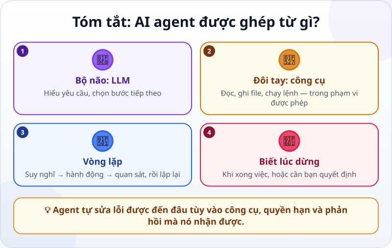

🌐 **Tiếng Việt** · [English](../../en/lessons/agent-parts-and-loop.md) · [日本語](../../ja/lessons/agent-parts-and-loop.md)

# Bộ não, đôi tay và vòng lặp: AI agent được ghép từ gì?

<!-- section: objective -->
## Mục tiêu bài học

Sau bài này, bạn sẽ:

- Nói được một AI agent gồm ba phần: **bộ não (LLM)**, **đôi tay (công cụ)** và **vòng lặp**.
- Mô tả được vòng lặp *suy nghĩ → hành động → quan sát* và biết khi nào nó nên dừng.
- Hiểu vì sao agent tự sửa lỗi được đến đâu còn tùy vào công cụ, quyền hạn và phản hồi nó nhận được.

<!-- section: hook -->
## Mở đầu: vì sao nên quan tâm?

Bạn đã biết [agent tự làm các bước thay bạn](chatbot-to-agent.md). Nhưng tự một mô hình ngôn ngữ chỉ tạo ra đầu ra — một đoạn chữ, hay một *yêu cầu dùng công cụ* — vậy làm sao agent **mở được file** hay **chạy được chương trình**?

Câu trả lời nằm ở cách agent được ghép lại. Hiểu ba bộ phận của nó, bạn sẽ đoán được agent làm được gì, không làm được gì, và khi nào nó cần bạn.

<!-- section: concept -->
## Nội dung chính

### Công thức của một AI agent

- **Bộ não — LLM (mô hình ngôn ngữ lớn):** hiểu yêu cầu, suy luận và quyết định bước tiếp theo. Thứ nó tạo ra là đầu ra — chữ, hoặc một yêu cầu dùng công cụ — chứ chưa phải hành động thật.
- **Đôi tay — công cụ (tool):** những việc agent **được phép** làm thật: đọc/ghi file, chạy lệnh, tìm kiếm web, gọi dịch vụ khác. Mô hình có thể *yêu cầu* một trong những công cụ mà phần mềm của agent cho phép; phần mềm đó quyết định có chấp nhận yêu cầu không, và chính nó mới thực sự bấm nút.
- **Vòng lặp:** agent không làm một lần là xong. Nó lặp lại cho đến khi đạt mục tiêu.

### Vòng lặp suy nghĩ → hành động → quan sát

1. **Suy nghĩ:** bước tiếp theo là gì?
2. **Hành động:** dùng một công cụ, ví dụ chạy thử trang web.
3. **Quan sát:** đọc kết quả — trang chạy được chưa, có thông báo lỗi không?

Rồi quay lại bước 1. Vòng lặp **dừng** khi mục tiêu đã đạt, hoặc khi agent gặp một quyết định chỉ bạn mới có quyền đưa ra (ví dụ xóa dữ liệu), hoặc khi nó hết quyền hay hết cách.

### Tự sửa lỗi không phải phép màu

Agent chỉ sửa được lỗi mà nó **quan sát** được. Nếu không được phép chạy thử chương trình, nó không thấy lỗi; nếu không có thông báo lỗi hay phép kiểm tra rõ ràng, nó không biết mình sai. Vì vậy khả năng tự sửa phụ thuộc vào **công cụ**, **quyền hạn** và **phản hồi** — và bạn vẫn là người kiểm tra cuối cùng.

<!-- section: analogy -->
## Ví dụ đời thường

Hãy nghĩ về một đầu bếp đang nấu món bạn gọi:

- **Bộ não** là kinh nghiệm của đầu bếp: biết bước tiếp theo nên làm gì.
- **Đôi tay** là dao, bếp, nồi: không có chúng, kinh nghiệm chỉ nằm trên giấy.
- **Vòng lặp** là nêm — nếm — chỉnh — nếm lại, cho đến khi vừa miệng; gặp câu hỏi như *"ăn cay được không?"* thì phải hỏi khách.

Chỗ chưa khớp: đầu bếp luôn nếm được món của mình, còn agent chỉ "nếm" được những gì công cụ cho nó thấy.

<!-- section: example -->
## Ví dụ thực tế

Mục tiêu bạn giao: *"Đổi tên 50 ảnh trong thư mục Du lịch theo ngày chụp, dạng 2026-09-01_01.jpg."*

1. **Suy nghĩ:** cần biết ngày chụp của từng ảnh. **Hành động:** liệt kê các file. **Quan sát:** 50 ảnh, 3 ảnh không có ngày chụp.
2. **Suy nghĩ:** 3 ảnh đó nên đặt tên thế nào? Đây là quyết định của bạn → agent **hỏi**: *"Dùng ngày tạo file cho 3 ảnh này được không?"* Bạn đồng ý.
3. **Hành động:** đổi tên. **Quan sát:** liệt kê lại thư mục, thấy đủ 50 file đúng dạng tên.
4. Mục tiêu đạt → vòng lặp dừng, agent báo cáo những gì đã làm.

Bạn kiểm tra nhanh: mở vài ảnh, xem tên có khớp ngày chụp không.

<!-- section: misconceptions -->
## Hiểu lầm thường gặp

- **"LLM tự mở file được."** — Không. LLM chỉ đưa ra *yêu cầu* dùng công cụ; phần mềm của agent quyết định có cho phép không rồi mới thực hiện, và chỉ trong phạm vi được cho phép.
- **"Agent nào cũng tự thấy lỗi và tự sửa."** — Chỉ khi nó có công cụ để quan sát kết quả và được phép sửa. Kể cả khi đó, nó vẫn có thể sửa sai.

<!-- section: recap -->
## Tóm tắt bằng hình

<!-- section: takeaways -->
## Ghi nhớ

- Agent = **LLM** (bộ não) + **công cụ** (đôi tay) + **vòng lặp** suy nghĩ → hành động → quan sát.
- Vòng lặp dừng khi xong việc, hoặc khi cần bạn quyết định.
- Agent tự sửa lỗi được đến đâu tùy vào công cụ, quyền hạn và phản hồi — bước kiểm tra cuối cùng vẫn là của bạn.

<!-- section: quiz -->
## Tự kiểm tra

**Câu 1.** Bộ phận nào giúp agent làm việc thật, như tạo file?

- A) LLM
- B) Công cụ (tool)
- C) Khung chat

**Câu 2.** Agent đang sửa một trang web nhưng không được phép chạy thử trang. Điều gì dễ xảy ra nhất?

- A) Agent vẫn chắc chắn tìm ra mọi lỗi
- B) Agent có thể bỏ sót lỗi vì không quan sát được kết quả
- C) Agent tự cấp thêm quyền cho mình

**Câu 3.** Khi nào agent nên dừng vòng lặp để hỏi bạn?

- A) Sau mỗi dòng code nó viết
- B) Khi cần một quyết định chỉ bạn mới có quyền đưa ra, như xóa dữ liệu
- C) Không bao giờ

Xem đáp án

1. **B** — LLM chỉ đưa ra yêu cầu; công cụ mới là thứ thực sự tạo file.
2. **B** — không quan sát được thì không biết mình sai; tự sửa phụ thuộc vào công cụ và phản hồi.
3. **B** — những quyết định quan trọng hoặc khó đảo ngược là của bạn.

<!-- section: sources -->
## Nguồn tham khảo

- Anthropic — [Building Effective AI Agents](https://www.anthropic.com/engineering/building-effective-agents) (tiếng Anh, 12/2024): agent thường là một LLM dùng công cụ dựa trên phản hồi từ môi trường, trong một vòng lặp, và có thể dừng lại hỏi con người khi gặp trở ngại.
- IBM — [What is Agentic AI?](https://www.ibm.com/think/topics/agentic-ai) (tiếng Anh)
