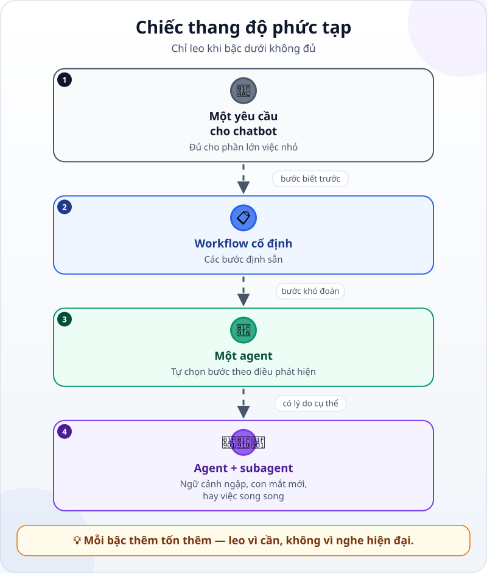
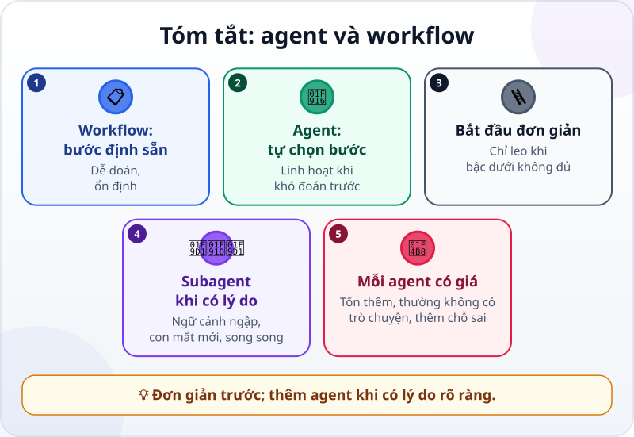

🌐 **Tiếng Việt** · [English](../../en/lessons/agents-and-workflows.md) · [日本語](../../ja/lessons/agents-and-workflows.md)

# Agent và workflow: khi nào cần nhiều agent?

<!-- section: objective -->
## Mục tiêu bài học

Sau bài này, bạn sẽ:

- Phân biệt **workflow** (các bước định sẵn) với **agent** (mô hình tự quyết định các bước).
- Chọn cách đơn giản nhất làm được việc, theo một "chiếc thang" bốn bậc.
- Biết ba trường hợp một **subagent** (agent phụ) thật sự có ích, và cái giá của nó.

<!-- section: hook -->
## Mở đầu: vì sao nên quan tâm?

Huy xem một video: mười agent làm việc như một công ty. Cậu muốn làm y vậy cho **bản tin tháng** của câu lạc bộ: năm agent, mỗi agent một vai.

Nhưng bản tin chỉ dài một trang, lấy từ ba file lịch, mỗi tháng một lần. Năm agent là đúng công cụ — hay là thuê năm đầu bếp nấu một bữa cơm nhà?

<!-- section: concept -->
## Nội dung chính

### Workflow và agent

Anthropic (12/2024) phân biệt hai kiểu hệ thống:

- **Workflow:** các bước được định sẵn, bằng code hay do bạn đặt; mô hình làm từng bước nhưng không tự chọn bước. Ví dụ: kỹ năng báo cáo tháng của Mai trong [Bộ nhớ dự án và kỹ năng dùng lại](memory-and-skills.md).
- **Agent:** mô hình **tự quyết định** bước tiếp theo và công cụ cần dùng, như trong [vòng lặp của agent](the-agent-loop.md).

Workflow dễ đoán cho việc đã rõ; agent linh hoạt khi không đoán trước được các bước.

### Bắt đầu đơn giản

Lời khuyên của Anthropic: tìm **cách đơn giản nhất** làm được việc, chỉ thêm phức tạp khi cần.

Leo từng bậc, chỉ khi bậc dưới không đủ:

1. **Một yêu cầu** cho chatbot — hỏi một lần, trả lời một lần, không công cụ, không vòng lặp.
2. **Một workflow cố định** — việc lặp lại với cùng các bước.
3. **Một agent** — các bước tùy vào điều nó phát hiện dọc đường.
4. **Agent + subagent** — chỉ khi có lý do cụ thể, như ba lý do dưới đây.

### Ba lúc subagent có ích

**Subagent** là một agent phụ do agent chính khởi động, làm một phần việc trong **ngữ cảnh riêng**. Tài liệu Claude Code (tính đến 9/2026) nêu các lý do nên dùng; ba lý do hay gặp nhất:

- **Việc phụ sẽ làm ngập ngữ cảnh chính** — tìm trong hàng trăm file, đọc log dài. Subagent chỉ trả về câu trả lời cuối, nên hãy yêu cầu một bản tóm tắt ngắn.
- **Cần một con mắt mới** — một lượt review chỉ thấy kết quả và tiêu chí, như trong [Thêm quy trình khi việc cần](workflow-frameworks.md).
- **Các phần độc lập có thể chạy song song.**

### Cái giá của mỗi agent thêm vào

- **Tốn thêm:** mỗi subagent tự gửi yêu cầu, tính vào cùng giới hạn sử dụng.
- **Thường bắt đầu mà không có cuộc trò chuyện của bạn:** với Claude Code (tính đến 9/2026), subagent thông thường chỉ nhận lời giao việc cùng những gì phần cài đặt nạp sẵn (thường là file chỉ dẫn của dự án). Có công cụ, và chế độ fork của Claude Code, lại chuyển cả cuộc trò chuyện sang — hãy xem công cụ của bạn.
- **Thêm chỗ để sai:** mỗi lần chuyển tay có thể rơi mất thông tin, và bạn vẫn phải kiểm tra kết quả cuối.

<!-- section: analogy -->
## Ví dụ đời thường

Bếp nhà hàng lớn có bếp trưởng, vài đầu bếp và một người nếm trước khi ra món — hợp lý khi nấu hàng trăm đĩa mỗi tối. Thuê năm đầu bếp cho bữa cơm gia đình thì chỉ thêm việc chỉ huy, va chạm và tốn tiền. Một thứ đáng giữ cả trong bếp nhỏ: **một người không nấu món đó nếm lại**.

Phép so sánh sai ở chỗ: đầu bếp mới vẫn nghe được mọi thứ trong bếp. Subagent thông thường thì không nghe cuộc trò chuyện của bạn với agent chính, nên điều gì nó cần từ đó phải được viết trong lời giao việc.

<!-- section: example -->
## Ví dụ thực tế

Mỗi tháng Huy phải đọc ba file lịch sự kiện (dữ liệu giả trong `ai-practice`), viết bản tin một trang, kiểm tra ngày giờ và địa điểm, lưu ra `ban_tin_thang_X.md`. Thay vì kế hoạch năm agent, cậu leo từng bậc thang:

- **Một yêu cầu?** Gần đủ, nhưng tháng nào cũng lặp lại cùng các bước.
- **Workflow cố định?** Đúng. Cậu viết kỹ năng `ban-tin-thang`: đọc ba file, viết theo mẫu, ghi ra file.
- **Subagent?** Ba file lịch ngắn, không có gì cần chạy song song, nhưng cả câu lạc bộ sẽ dựa vào ngày giờ — nên **con mắt mới** thì có. Bước cuối của kỹ năng: *"Giao cho một subagent mới: so từng ngày giờ và địa điểm trong bản tin với ba file lịch. Chỉ báo chỗ không khớp, không sửa gì."*

Tháng đầu, subagent review báo một chỗ: buổi dã ngoại ghi *thứ Bảy 17/10*, file lịch ghi *Chủ nhật 18/10*. Huy sửa, rồi tự đọc cả bản tin trước khi gửi. Một workflow và một người review thay vì năm agent: rẻ hơn, ít lần chuyển tay hơn, và có con mắt mới đúng chỗ cần.

<!-- section: misconceptions -->
## Hiểu lầm thường gặp

- **"Càng nhiều agent càng thông minh."** — Mỗi agent thêm vào là thêm chi phí và thêm một lần chuyển tay. Thêm agent vì một lý do cụ thể, không phải vì nghe hiện đại.
- **"Subagent biết những gì mình đã nói với agent chính."** — Subagent thông thường của Claude Code không thấy cuộc trò chuyện đó (công cụ khác có thể khác). Viết lời giao việc rõ như một yêu cầu cho người mới.
- **"Có agent review rồi thì mình không cần đọc."** — Nó giúp bắt lỗi; kết quả cuối vẫn là trách nhiệm của bạn.

<!-- section: recap -->
## Tóm tắt bằng hình

<!-- section: takeaways -->
## Ghi nhớ

- Workflow: các bước định sẵn. Agent: mô hình tự chọn bước.
- Bắt đầu đơn giản; chỉ leo lên bậc phức tạp hơn khi bậc dưới không đủ.
- Subagent có ích khi việc phụ làm ngập ngữ cảnh, khi cần con mắt mới, hay khi có phần độc lập làm song song.
- Mỗi agent thêm vào: tốn thêm, thường không có cuộc trò chuyện của bạn, thêm chỗ để sai.
- Nhiều agent không thay bạn kiểm tra kết quả cuối.

<!-- section: quiz -->
## Tự kiểm tra

**Câu 1.** Điểm khác cốt lõi giữa workflow và agent là gì?

- A) Workflow dùng mô hình rẻ, agent dùng mô hình đắt
- B) Ở workflow các bước được định sẵn; ở agent mô hình tự quyết định bước tiếp theo
- C) Workflow không dùng AI

**Câu 2.** Trường hợp nào đáng dùng một subagent nhất?

- A) Việc đổi màu một tiêu đề
- B) Viết một email ngắn
- C) Tìm một thông tin trong hàng trăm file log dài, rồi chỉ cần bản tóm tắt

**Câu 3.** Vì sao lời giao việc cho subagent cần rõ ràng?

- A) Vì một subagent thông thường (như trong Claude Code) bắt đầu với ngữ cảnh mới, không thấy cuộc trò chuyện của bạn với agent chính
- B) Vì subagent luôn chạy trên một mô hình yếu hơn, cần chỉ dẫn đơn giản hơn
- C) Vì subagent không được dùng công cụ nào

Xem đáp án

1. **B** — ai chọn bước tiếp theo là khác biệt chính; cả hai đều dùng mô hình.
2. **C** — việc phụ sẽ làm ngập ngữ cảnh chính; subagent làm riêng và trả về bản tóm tắt bạn yêu cầu.
3. **A** — điều bạn đã nói với agent chính chỉ tới được nó qua lời giao việc (hay file dự án nó đọc).

<!-- section: sources -->
## Nguồn tham khảo

- Anthropic — [Building Effective AI Agents](https://www.anthropic.com/engineering/building-effective-agents) (tiếng Anh, 12/2024): workflow theo các bước định sẵn, agent tự điều khiển quá trình; tìm cách đơn giản nhất, chỉ thêm phức tạp khi cần.
- Anthropic — [Create custom subagents](https://code.claude.com/docs/en/sub-agents) (tiếng Anh, tính đến 9/2026): subagent làm trong ngữ cảnh riêng và chỉ trả về kết quả cuối; không thấy lịch sử trò chuyện; mỗi subagent tính vào cùng giới hạn sử dụng.
