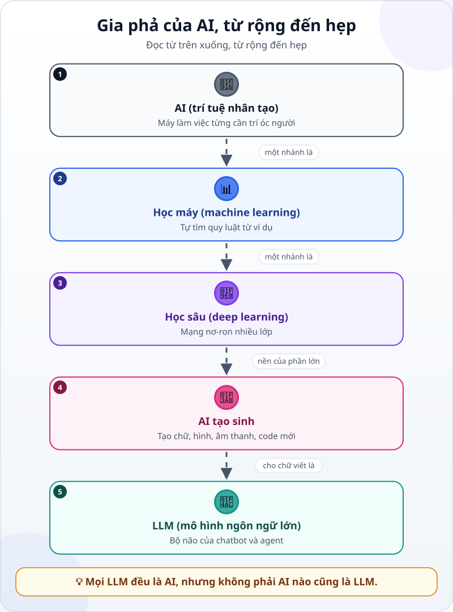
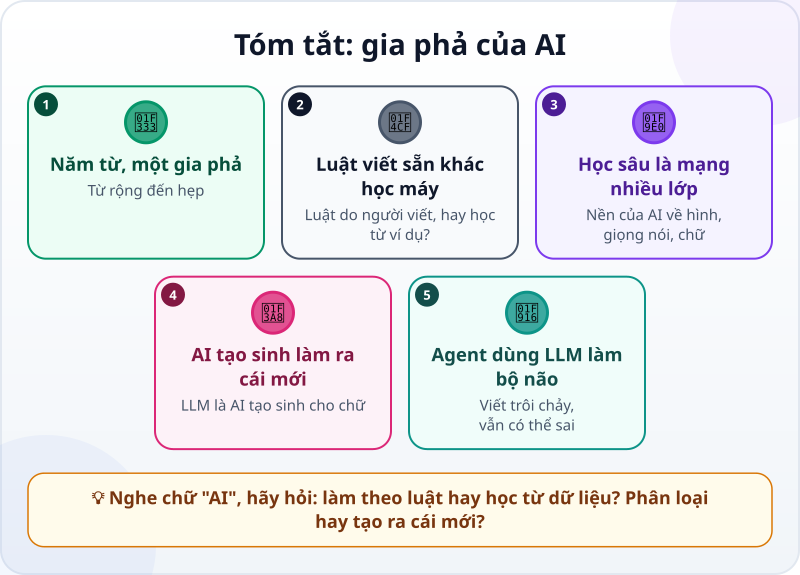

🌐 **Tiếng Việt** · [English](../../en/lessons/ai-ml-dl.md) · [日本語](../../ja/lessons/ai-ml-dl.md)

# Gia phả của AI trong một hình: từ machine learning đến LLM

<!-- section: objective -->
## Mục tiêu bài học

Sau bài này, bạn sẽ:

- Xếp đúng năm từ **AI, học máy, học sâu, AI tạo sinh, LLM** vào một gia phả: nhánh nào nằm trong nhánh nào.
- Phân biệt phần mềm làm theo luật viết sẵn với phần mềm học từ dữ liệu.
- Biết agent trong khóa học thuộc nhánh nào, và điều đó nói gì về điểm mạnh, điểm yếu của nó.

<!-- section: hook -->
## Mở đầu: vì sao nên quan tâm?

Trong buổi họp tuần, Hana nghe ba câu liền nhau. Sếp nói: *"Phần mềm chấm công mới có AI."* Một đồng nghiệp nói: *"Chatbot của mình là AI tạo sinh."* Bản tin công ty viết: *"Bộ lọc thư rác dùng học máy."*

Hana gật đầu, nhưng không chắc ba thứ đó khác nhau thế nào — hay chỉ là một thứ được gọi bằng ba tên. Mười phút tới sẽ gỡ rối cho Hana, và cho bạn.

<!-- section: concept -->
## Nội dung chính

### Một gia phả, không phải năm thứ rời rạc

Đọc hình từ trên xuống. Mỗi tầng là **một nhánh** của tầng ngay trên nó:

1. **AI (trí tuệ nhân tạo)** — tên chung cho các công nghệ giúp máy làm những việc trước đây cần trí óc con người: hiểu ngôn ngữ, phân tích dữ liệu, đưa ra gợi ý. Có những phần mềm "AI" chỉ làm theo luật do người viết sẵn (*nếu… thì…*) và không học gì cả.
2. **Học máy (machine learning)** — một nhánh của AI. Thay vì viết luật, người ta cho máy xem thật nhiều ví dụ để nó tự tìm ra quy luật. Bài [Máy "học" như thế nào?](how-machines-learn.md) kể kỹ phần này.
3. **Học sâu (deep learning)** — một nhánh của học máy, dùng mạng nơ-ron nhiều lớp. Đây là nền của phần lớn AI hiện đại về hình ảnh, giọng nói và ngôn ngữ.
4. **AI tạo sinh (generative AI)** — AI tạo ra nội dung mới: chữ, hình, âm thanh, code, thay vì chỉ phân loại hay chấm điểm. Ngày nay nó hầu hết được xây bằng học sâu.
5. **LLM (mô hình ngôn ngữ lớn)** — AI tạo sinh dành cho chữ viết: được huấn luyện trên lượng văn bản khổng lồ để viết tiếp phần chữ hợp lý nhất.

### Mô hình nền tảng (foundation model)

Bạn sẽ gặp thêm từ này. **Mô hình nền tảng** là mô hình rất lớn, huấn luyện trên dữ liệu rất đa dạng, rồi dùng được cho nhiều việc khác nhau. LLM là một loại mô hình nền tảng cho chữ viết — nhờ vậy cùng một mô hình vừa tóm tắt, vừa dịch, vừa viết code.

### Agent của bạn thuộc nhánh nào?

"Bộ não" của agent trong khóa học là một LLM — tầng dưới cùng của gia phả. Vì thế nó mang cả điểm mạnh lẫn điểm yếu của nhánh này: viết trôi chảy, làm được nhiều việc, nhưng có thể sai một cách tự tin ([ảo giác](hallucination.md)). Còn phần "tay chân" — đọc file, chạy lệnh — là do chương trình bao quanh cung cấp, như bạn đã thấy trong bài [Bộ não, đôi tay và vòng lặp](agent-parts-and-loop.md).

<!-- section: analogy -->
## Ví dụ đời thường

Hãy nghĩ tới **xe cộ**: phương tiện giao thông → ô tô → ô tô điện → một mẫu ô tô điện cụ thể. Mọi ô tô điện đều là ô tô, nhưng không phải ô tô nào cũng chạy điện. Cũng vậy: mọi LLM đều là AI, nhưng không phải AI nào cũng là LLM — bộ lọc thư rác hay hệ thống gợi ý sản phẩm cũng là AI.

Chỗ chưa khớp: ranh giới giữa các loại xe thì rõ; ranh giới giữa các nhánh AI thì mờ hơn nhiều. Và trong quảng cáo, chữ "AI" thường được dùng rất rộng — có khi chỉ là vài câu *nếu… thì…* viết sẵn.

<!-- section: example -->
## Ví dụ thực tế

Sau buổi họp, Hana lấy bốn thứ ở công ty và xếp vào gia phả:

| Thứ Hana gặp | Nó làm gì | Thuộc nhánh |
|---|---|---|
| Phần mềm chấm công "có AI" | Đánh dấu ai đến muộn quá 10 phút, theo luật cài sẵn | AI theo luật — không học từ dữ liệu |
| Bộ lọc thư rác | Học từ rất nhiều email đã được đánh dấu "rác" hay "không rác" | Học máy |
| Ứng dụng đọc chữ trên hóa đơn chụp ảnh | Mạng nơ-ron nhiều lớp nhận ra chữ trong hình | Học sâu |
| Chatbot viết nháp email | Tạo đoạn văn mới từ vài dòng yêu cầu | AI tạo sinh, cụ thể là một LLM |

Từ nay, mỗi lần nghe *"cái này có AI"*, Hana hỏi thêm hai câu: **"Nó làm theo luật hay học từ dữ liệu?"** và **"Nó phân loại, hay tạo ra cái mới?"** Hai câu đó đủ để biết nên tin nó tới đâu, và cần kiểm tra gì.

<!-- section: misconceptions -->
## Hiểu lầm thường gặp

- **"AI chính là ChatGPT."** — Chatbot chỉ là một nhánh nhỏ ở cuối gia phả. Máy lọc thư rác, gợi ý phim hay nhận diện khuôn mặt cũng là AI.
- **"Cứ gắn nhãn AI là tự học được."** — Có phần mềm "AI" chỉ làm theo luật viết sẵn; nó không tốt lên dù dùng bao lâu.
- **"Học máy nghĩa là máy suy nghĩ như người."** — Nó tìm quy luật từ ví dụ. Nó có thể rất giỏi một việc mà không hiểu việc đó theo cách con người hiểu.

<!-- section: recap -->
## Tóm tắt bằng hình

<!-- section: takeaways -->
## Ghi nhớ

- AI → học máy → học sâu → AI tạo sinh → LLM: mỗi tầng là một nhánh của tầng trên.
- Làm theo luật viết sẵn khác với học từ dữ liệu, dù cả hai đều có thể được gọi là "AI".
- Học sâu dùng mạng nơ-ron nhiều lớp; AI tạo sinh làm ra nội dung mới; LLM làm việc đó với chữ viết.
- Agent trong khóa học dùng một LLM làm bộ não: viết trôi chảy, nhưng vẫn cần bạn kiểm tra.
- Nghe chữ "AI", hãy hỏi: theo luật hay học từ dữ liệu? Phân loại hay tạo ra cái mới?

<!-- section: quiz -->
## Tự kiểm tra

**Câu 1.** Câu nào đúng?

- A) Mọi phần mềm AI đều là LLM
- B) Học sâu là một nhánh của học máy
- C) Học máy là một nhánh của AI tạo sinh

**Câu 2.** Phần mềm chấm công đánh dấu ai đến muộn quá 10 phút theo luật cài sẵn. Nó thuộc loại nào?

- A) AI làm theo luật viết sẵn, không học từ dữ liệu
- B) AI tạo sinh
- C) Học sâu

**Câu 3.** Vì sao câu trả lời của agent vẫn cần được kiểm tra?

- A) Vì agent làm theo luật viết sẵn nên không linh hoạt
- B) Vì agent không đọc được file nào
- C) Vì bộ não của agent là một LLM: viết trôi chảy nhưng có thể sai một cách tự tin

Xem đáp án

1. **B** — học sâu nằm trong học máy, học máy nằm trong AI; không phải AI nào cũng là LLM.
2. **A** — nó không học từ ví dụ nào; nó chỉ chạy một luật do người viết.
3. **C** — LLM viết phần chữ hợp lý nhất, và điều hợp lý chưa chắc là điều đúng.

<!-- section: sources -->
## Nguồn tham khảo

- Google Cloud — [What is Artificial Intelligence (AI)?](https://cloud.google.com/learn/what-is-artificial-intelligence) (tiếng Anh): AI là tập hợp công nghệ giúp máy làm những việc trước đây cần trí thông minh của con người.
- Google Cloud — [What is Machine Learning?](https://cloud.google.com/learn/what-is-machine-learning) (tiếng Anh): học máy là một nhánh của AI, học từ dữ liệu thay vì được lập trình từng bước; học sâu là một nhánh của học máy.
- Google Cloud — [What are foundation models?](https://cloud.google.com/discover/what-are-foundation-models) (tiếng Anh): mô hình nền tảng được huấn luyện trên lượng dữ liệu rất lớn và dùng được cho nhiều loại việc.
- Anthropic — [Glossary](https://platform.claude.com/docs/en/about-claude/glossary) (tiếng Anh), mục *LLM*: LLM được huấn luyện trên lượng văn bản khổng lồ và có thể viết, trả lời câu hỏi, tóm tắt.
