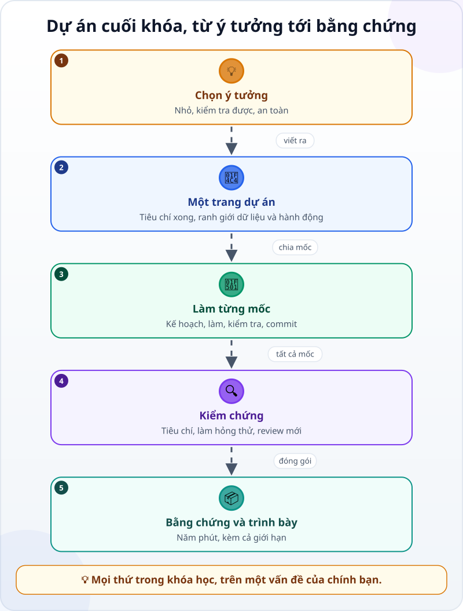
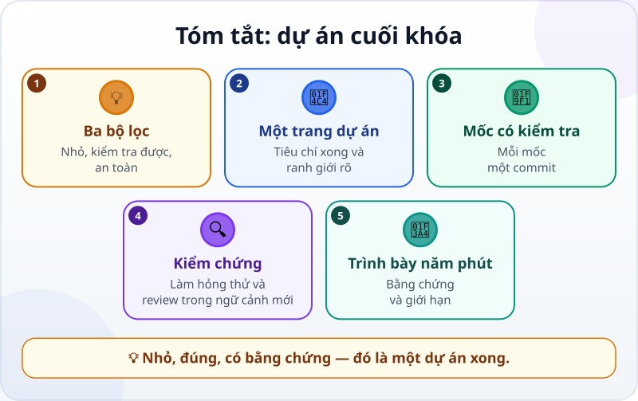

🌐 **Tiếng Việt** · [English](../../en/lessons/capstone-your-idea.md) · [日本語](../../ja/lessons/capstone-your-idea.md)

# Dự án cuối khóa: ý tưởng của riêng bạn

<!-- section: objective -->
## Mục tiêu bài học

Sau dự án này, bạn sẽ:

- Chọn được một vấn đề **vừa sức**: xong trong khoảng hai tiếng, kiểm tra được, và an toàn.
- Tự dẫn một dự án từ đầu tới cuối với agent: một trang dự án, các mốc có phép kiểm tra, kiểm chứng, gói bằng chứng.
- Trình bày kết quả trong năm phút cho một người khác — kèm cả giới hạn của nó.

<!-- section: hook -->
## Mở đầu: vì sao nên quan tâm?

Đến đây, bạn đã xem agent làm việc, viết yêu cầu, đọc diff, viết phép kiểm tra, dùng Git, đặt hàng rào, và làm hai dự án có sẵn đề bài. Lần này không có đề bài.

Tuấn có một vấn đề nhỏ của riêng anh: anh đang học tiếng Nhật chuyên ngành, và các từ mới nằm rải rác trong sổ tay, ảnh chụp, tin nhắn. Anh muốn một trang ôn từ vựng đơn giản trên máy cá nhân. Nghe thì nhỏ — nhưng để nó **đúng**, **an toàn** và **dùng được lâu**, anh sẽ cần gần như mọi thứ của khóa học.

<!-- section: concept -->
## Nội dung chính

### Chọn ý tưởng: ba bộ lọc

Liệt kê ba ý tưởng, rồi cho từng cái qua ba bộ lọc:

- **Nhỏ:** làm xong phiên bản đầu trong khoảng hai tiếng. Quá lớn? Cắt còn phần lõi.
- **Kiểm tra được:** bạn nói được trước *thế nào là đúng*, bằng những con số hay hành vi cụ thể.
- **An toàn:** chỉ dữ liệu giả — một bản mẫu bạn tự bịa với cùng cột và định dạng, không dùng file, ghi chú hay ảnh thật của bạn; không dữ liệu công ty, không dữ liệu của người khác, không mật khẩu hay API key.

Ý tưởng hay cho dự án cuối khóa thường là một việc lặp lại của chính bạn: một bảng tính cá nhân, một trang nhỏ, một công cụ đổi định dạng file. Ý tưởng qua được cả ba bộ lọc mới đáng làm.

### Một trang dự án

Trước khi mở agent, viết **một trang** — gộp những gì bạn đã học về [yêu cầu tốt](writing-good-specs.md) và [ba loại việc](data-safety-and-permissions.md):

- **Vấn đề và người dùng:** ai dùng, dùng khi nào, hiện giờ làm thế nào.
- **Tiêu chí xong:** 3–5 điều kiểm tra được.
- **Ranh giới dữ liệu:** dùng dữ liệu gì; cái gì ⛔ không bao giờ đưa vào.
- **Ranh giới hành động:** agent được tự làm gì (✅), phải hỏi gì (✋), không bao giờ làm gì (⛔).
- **Không làm:** những thứ cố ý để lại cho lần sau.

### Từ trang dự án tới bằng chứng



Chia dự án thành **2–4 mốc**, mỗi mốc có một phép kiểm tra riêng. Với mỗi mốc, đi vòng quen thuộc [tìm hiểu → lập kế hoạch → làm → kiểm chứng](explore-plan-build-verify.md), thêm cấu trúc khi việc cần (như trong [Thêm quy trình khi việc cần](workflow-frameworks.md)), và commit khi mốc đạt. Cuối cùng, [gói bằng chứng](project-retrospective.md) và trình bày.

<!-- section: example -->
## Ví dụ thực tế

Trang dự án của Tuấn, rút gọn:

```text
Vấn đề: từ vựng tiếng Nhật chuyên ngành rải rác khắp nơi; tôi muốn ôn 10 phút mỗi tối.
Người dùng: chỉ tôi, trên laptop cá nhân (không phải máy công ty).
Tiêu chí xong:
1. Trang on_tu.html đọc danh sách từ từ tu_vung.csv (cột: tu, cach_doc, nghia).
2. Mỗi lần hiện một từ; bấm "Xem nghĩa" mới hiện cách đọc và nghĩa.
3. Bấm "Nhớ" hay "Chưa nhớ"; từ "Chưa nhớ" quay lại sau 2 từ khác (còn ít hơn 2 từ thì quay lại cuối buổi).
4. Có phép kiểm tra với 5 từ mẫu:
   a) bấm "Nhớ" cho cả 5 từ: mỗi từ hiện đúng một lần, rồi hiện "Xong buổi ôn";
   b) bấm "Chưa nhớ" ở từ 1: các từ hiện tiếp theo là từ 2, từ 3, rồi từ 1.
Dữ liệu: chỉ một danh sách mẫu khoảng 20 từ giả do tôi tự gõ (không dùng sổ tay, ảnh hay tin nhắn thật của tôi); không bản vẽ, không tài liệu, không tên dự án của công ty. ⛔
Hành động: agent tự sửa file trong ai-practice/on-tu (✅); cài thư viện, xóa file (✋); gửi dữ liệu đi đâu (⛔).
Không làm lần này: đồng bộ điện thoại, âm thanh phát âm.
```

Anh chia thành ba mốc: (1) đọc CSV và hiện từ, (2) nút "Xem nghĩa" và "Nhớ / Chưa nhớ", (3) phép kiểm tra 5 từ. Ở mốc 3, phép kiểm tra (b) không đạt: từ "Chưa nhớ" quay lại **ngay lập tức**, nên cứ lặp mãi một từ — lỗi mà lúc bấm thử bằng tay ở mốc 2 anh không để ý. Agent sửa, phép kiểm tra đạt, anh commit. Trước khi coi là xong, anh mở một phiên mới để review riêng, chỉ đưa trang dự án và toàn bộ diff từ commit đầu tiên của anh. Phiên review hỏi: file CSV có dấu phẩy trong phần nghĩa thì sao? Anh thêm một từ như vậy vào dữ liệu mẫu, sửa, và ghi vào phần giới hạn những gì chưa thử.

Năm phút trình bày cho một người bạn: vấn đề (30 giây), demo (2 phút), bằng chứng kiểm tra (1 phút), giới hạn và việc tiếp theo (1 phút), câu hỏi.

<!-- section: try-it -->
## Thử ngay

Khoảng 120 phút, trong một thư mục mới trong `ai-practice`, ở chế độ agent hỏi trước. Bắt đầu bằng một mốc nền: trong thư mục mới, viết một file `README.md` một dòng (tên dự án) rồi commit — nếu `ai-practice` chưa là một kho Git, làm `git init` trước. Đó là commit khởi đầu của bạn. (Đi đường chỉ xem? Làm bước 1–3 trên giấy: đó đã là nửa khó nhất của dự án.)

**1. Chọn ý tưởng (15 phút).** Viết ra ba ý tưởng. Cho từng cái qua ba bộ lọc: nhỏ, kiểm tra được, an toàn. Giữ lại một. Không cái nào qua? Cắt nhỏ ý tưởng tốt nhất cho tới khi qua.

**2. Viết một trang dự án (15 phút)** theo năm phần ở trên. Tiêu chí xong phải kiểm tra được bằng con số hay hành vi cụ thể. Nhờ agent đọc trang đó và hỏi lại chỗ mơ hồ — **chưa làm gì**.

**3. Chia mốc (10 phút).** 2–4 mốc, mỗi mốc một câu *"xong khi…"* và một cách kiểm tra.

**4. Làm từng mốc (45 phút).** Với mỗi mốc: kế hoạch (đọc với ba câu hỏi), làm, đọc diff, chạy phép kiểm tra, commit. Agent bị kẹt hay đi lạc? Ngắt sớm, nói rõ hướng mới.

**5. Kiểm chứng (15 phút).** Tự kiểm tra từng tiêu chí xong. Làm hỏng thử một chỗ để thấy phép kiểm tra báo không đạt, rồi trả lại như cũ (`git restore TEN_FILE_BI_HONG` — ✋, agent sẽ hỏi). Mở một phiên mới để review riêng: đưa trang dự án và toàn bộ thay đổi từ commit khởi đầu của bạn (nhờ agent cho xem `git diff` từ commit đó tới commit mới nhất — `git diff` trơn sẽ trống khi mọi thứ đã commit), nhờ tìm chỗ thiếu.

**6. Gói bằng chứng và trình bày (20 phút).** Viết `BANG_CHUNG.md` (yêu cầu, trước và sau, các phép kiểm tra, giới hạn, một cải tiến) và làm phép thử người lạ. Trình bày năm phút cho một người — bạn bè, người thân, đồng nghiệp — hoặc ghi âm cho chính mình.

**Bằng chứng:**

- *Tôi cho xem được…* dự án chạy được, trang dự án, lịch sử Git theo từng mốc, và `BANG_CHUNG.md`.
- *Tôi đã kiểm tra…* từng tiêu chí xong; phép kiểm tra báo không đạt khi tôi làm hỏng thử; một lượt review trong ngữ cảnh mới.
- *Tôi sẽ không dùng cách này khi…* dự án cần dữ liệu thật (dữ liệu công ty, của người khác, hay file cá nhân của chính bạn) thay vì dữ liệu giả, hoặc có người dựa vào nó mà chưa ai ngoài tôi kiểm tra.

<!-- section: misconceptions -->
## Hiểu lầm thường gặp

- **"Dự án cuối khóa phải thật hoành tráng."** — Một việc nhỏ làm đúng, có bằng chứng, dạy bạn nhiều hơn một việc lớn bỏ dở. Lớn thì để lần sau, với dự án này làm nền.
- **"Dùng dữ liệu công ty cho thật mới có ý nghĩa."** — Trong khóa học này, dữ liệu công ty vẫn là ⛔, dù chỉ để học. Dữ liệu giả có cùng cấu trúc là đủ để chứng minh cách làm.
- **"Chạy được là xong."** — Xong là khi các tiêu chí đã được kiểm tra, có bằng chứng, và một người khác hiểu được giới hạn của nó.

<!-- section: recap -->
## Tóm tắt bằng hình



<!-- section: takeaways -->
## Ghi nhớ

- Chọn ý tưởng qua ba bộ lọc: nhỏ, kiểm tra được, an toàn.
- Viết một trang dự án trước: vấn đề, tiêu chí xong, ranh giới dữ liệu và hành động, những gì không làm.
- Chia mốc; mỗi mốc có phép kiểm tra và một commit.
- Kiểm chứng bằng tiêu chí, lần làm hỏng thử và một lượt review trong ngữ cảnh mới.
- Gói bằng chứng và trình bày năm phút — kèm cả giới hạn.
