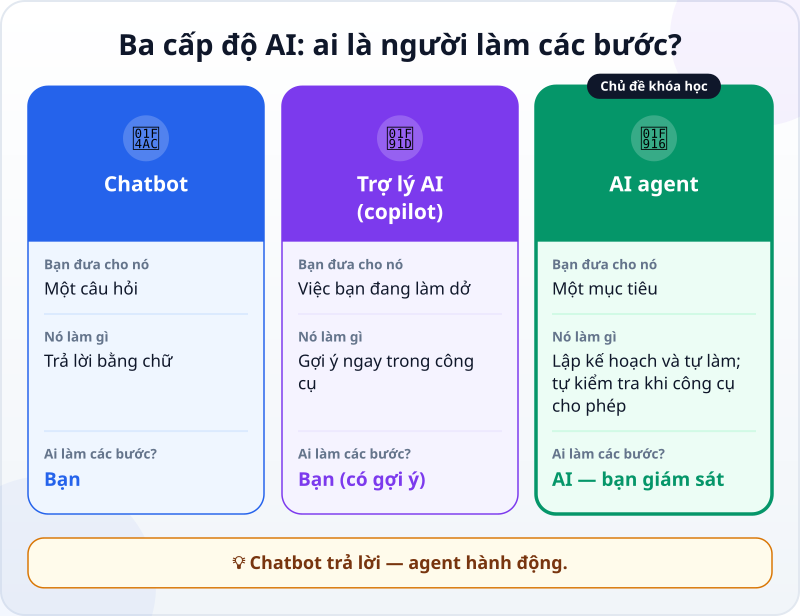
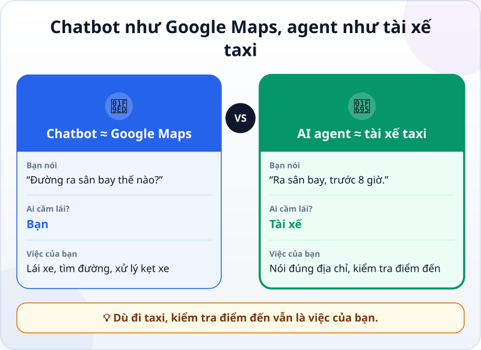
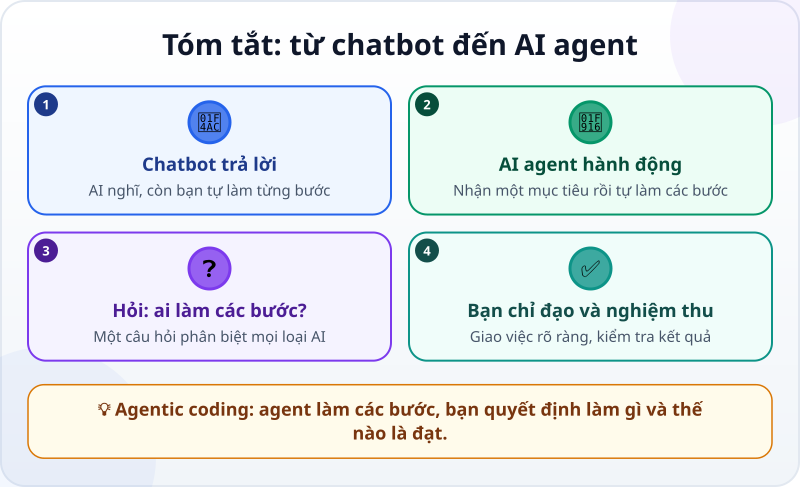

🌐 **Tiếng Việt** · [English](../../en/lessons/chatbot-to-agent.md) · [日本語](../../ja/lessons/chatbot-to-agent.md)

# Từ chatbot đến AI agent: AI không chỉ trả lời mà còn làm việc

<!-- section: objective -->
## Mục tiêu bài học

Sau bài này, bạn sẽ:

- Phân biệt được **chatbot**, **trợ lý AI** và **AI agent** bằng một câu hỏi đơn giản: *ai là người thực hiện các bước?*
- Hiểu vì sao **agentic coding** — làm phần mềm cùng AI agent — biến bạn từ người làm thành người chỉ đạo và nghiệm thu.

<!-- section: hook -->
## Mở đầu: vì sao nên quan tâm?

Thử nhớ lại lần gần nhất bạn nhờ ChatGPT, Gemini hay Claude một việc cụ thể, ví dụ: *"Làm sao để tổng hợp chi tiêu tháng này từ ba file Excel?"*

AI trả lời rất hay: năm bước, kèm cả công thức. Nhưng rồi **chính bạn** vẫn phải mở từng file, chép công thức, sửa khi báo lỗi, rồi quay lại hỏi tiếp…

Bây giờ hãy tưởng tượng một loại AI khác: bạn chỉ nói mục tiêu, và nó **tự mở file, tự viết công thức, tự chạy thử**, cuối cùng báo lại: *"Xong rồi, tổng chi tiêu tháng 9 là 12,4 triệu đồng — đây là những gì tôi đã làm."*

Loại AI đó có tên: **AI agent**. Và nó đang thay đổi cách con người làm phần mềm.

<!-- section: concept -->
## Nội dung chính

### Ba cấp độ AI bạn sẽ gặp

Câu hỏi quan trọng nhất để phân biệt: **ai là người thực hiện các bước?**

- **Chatbot:** AI nghĩ — bạn làm. Nó trả lời, còn mọi bước là của bạn.
- **Trợ lý AI (copilot):** AI gợi ý ngay trong công cụ bạn đang dùng, còn bạn vẫn là người làm từng bước.
- **AI agent:** AI vừa nghĩ vừa làm. Bạn giao một mục tiêu; agent tự chọn và thực hiện các bước, rồi báo lại.

### Agentic coding là gì?

Khi agent được dùng để làm phần mềm — viết code, chạy thử, sửa lỗi — ta gọi đó là **agentic coding**. Bạn không cần gõ từng dòng code; vai trò của bạn là **giao việc, đặt tiêu chí và kiểm tra kết quả**. Khóa học này dạy bạn đúng kỹ năng đó, cùng vừa đủ kiến thức phần mềm để làm tốt nó.

<!-- section: analogy -->
## Ví dụ đời thường

Bạn cần đi từ nhà ra sân bay.

- **Chatbot giống Google Maps:** chỉ đường rất chi tiết — nhưng **bạn** phải tự lái, tự xoay xở khi kẹt xe, tự tìm chỗ đậu.
- **AI agent giống tài xế taxi:** bạn chỉ cần nói *"ra sân bay, trước 8 giờ"*. Tài xế tự chọn đường, tự đổi hướng khi kẹt xe và đưa bạn tới nơi.

Nhưng để ý: dù đi taxi, **bạn vẫn phải nói đúng địa chỉ và kiểm tra mình có tới đúng nhà ga không**. Phép so sánh này cũng có chỗ chưa khớp: tài xế taxi hiếm khi "đi nhầm thành phố", còn agent đôi khi hiểu sai yêu cầu một cách rất tự tin — vì vậy với agent, bước kiểm tra còn quan trọng hơn.

<!-- section: example -->
## Ví dụ thực tế

Nhiệm vụ: *làm một trang web thiệp mời sinh nhật cho bé An, 5 tuổi, chủ đề khủng long, có nút "Xác nhận tham dự".*

**Với chatbot:**

1. Bạn hỏi, chatbot đưa một đoạn code HTML.
2. Bạn tự tạo file, dán code vào, mở bằng trình duyệt.
3. Nút bấm không hoạt động → bạn chép thông báo lỗi, dán lại cho chatbot.
4. Lặp lại bước 2–3 cho đến khi chạy được. Mọi bước đều do bạn làm.

**Với một AI agent làm phần mềm** (ví dụ Claude Code hay Codex — tên công cụ tính đến tháng 9/2026):

1. Bạn gõ đúng yêu cầu ở trên.
2. Agent tự tạo thư mục và các file, viết HTML/CSS, rồi mở trang lên chạy thử.
3. Nếu công cụ cho phép chạy thử, agent có thể thấy nút bấm bị lỗi, đọc lỗi, sửa rồi chạy lại. Không phải agent nào cũng làm được việc này, và không phải lần nào cũng sửa đúng.
4. Agent báo cáo: *"Đã xong. Tôi đã tạo 3 file, đây là cách mở trang."* Bạn xem thử và yêu cầu chỉnh: *"Đổi sang màu xanh lá, thêm ngày giờ tiệc."*

Cùng một mục tiêu, nhưng với agent, **bạn chuyển từ người làm sang người chỉ đạo và nghiệm thu**.

<!-- section: try-it -->
## Thử ngay

Không cần cài đặt gì, mất khoảng 5 phút:

1. Hai việc dưới đây, việc nào chỉ cần chatbot **trả lời**, việc nào cần agent **làm thay các bước**?
   - *"Giải thích công thức VLOOKUP trong Excel."*
   - *"Gộp 12 file báo cáo tháng thành một bảng, bỏ các dòng trùng, rồi lưu thành file mới."*
2. Chọn một việc **của bạn** mà bạn muốn giao cho agent. Viết mục tiêu trong **một câu**.
3. Viết thêm **một tiêu chí** để bạn tự kiểm tra là agent đã làm đúng, ví dụ: *"File mới có đủ 12 tháng và tổng doanh thu khớp với tổng của 12 file."*

Đáp án câu 1

Giải thích VLOOKUP chỉ cần một câu trả lời → chatbot là đủ. Gộp 12 file cần nhiều bước làm thật (mở file, gộp, lọc, lưu) → hợp với agent.

Giữ lại mục tiêu và tiêu chí này — bạn sẽ dùng lại chúng khi học cách viết yêu cầu cho agent.

<!-- section: misconceptions -->
## Hiểu lầm thường gặp

- **"Agent là robot hình người."** — Không. Agent là phần mềm; "đôi tay" của nó là các công cụ trong máy tính.
- **"Phải biết lập trình mới dùng được agent."** — Không cần biết trước. Khóa học dạy bạn vừa đủ về phần mềm để giao việc rõ ràng và phát hiện lỗi sớm.
- **"Agent sẽ thay thế hoàn toàn con người."** — Agent làm thay nhiều *bước*, còn con người vẫn quyết định *làm gì*, *làm cho ai* và *thế nào là đạt*.

<!-- section: recap -->
## Tóm tắt bằng hình

<!-- section: takeaways -->
## Ghi nhớ

- Chatbot **trả lời**; AI agent **hành động** để đạt mục tiêu.
- Câu hỏi phân biệt: **ai thực hiện các bước?**
- Agentic coding = làm phần mềm cùng AI agent: agent làm các bước, **bạn giao việc và kiểm tra kết quả**.

<!-- section: quiz -->
## Tự kiểm tra

**Câu 1.** Điểm khác biệt lớn nhất giữa chatbot và AI agent là gì?

- A) Agent dùng mô hình AI lớn hơn
- B) Agent tự thực hiện các bước để đạt mục tiêu, còn chatbot chỉ trả lời
- C) Agent không bao giờ mắc lỗi

**Câu 2.** Việc nào dưới đây cần một AI agent thay vì chatbot?

- A) Giải thích "biến" trong lập trình là gì
- B) Tạo các file cho một trang web, chạy thử và sửa lỗi cho đến khi chạy được
- C) Dịch một câu sang tiếng Nhật

**Câu 3.** Agent báo "đã xong". Bạn nên làm gì tiếp theo?

- A) Tin tưởng hoàn toàn và dùng ngay
- B) Kiểm tra kết quả theo tiêu chí bạn đã đặt ra
- C) Bắt agent làm lại từ đầu cho chắc

Xem đáp án

1. **B** — agent làm thay các bước; mô hình lớn hay nhỏ không phải là điểm khác biệt, và agent vẫn có thể sai.
2. **B** — việc này cần nhiều bước hành động thật (tạo file, chạy, sửa), không chỉ một câu trả lời.
3. **B** — giao việc và nghiệm thu luôn là trách nhiệm của bạn.

<!-- section: sources -->
## Nguồn tham khảo

- Anthropic — [Building Effective AI Agents](https://www.anthropic.com/engineering/building-effective-agents) (tiếng Anh, 12/2024)
- Anthropic — [Claude Code overview](https://code.claude.com/docs/en/overview) (tiếng Anh)
- Google Cloud — [What is agentic coding?](https://cloud.google.com/discover/what-is-agentic-coding) (tiếng Anh)
- IBM — [What is Agentic AI?](https://www.ibm.com/think/topics/agentic-ai) (tiếng Anh)
