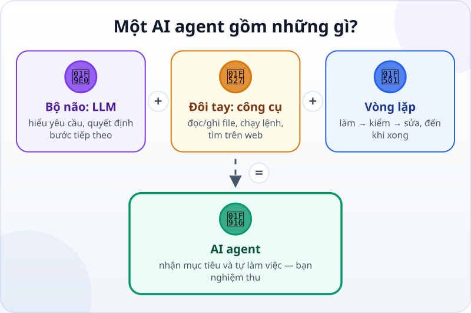
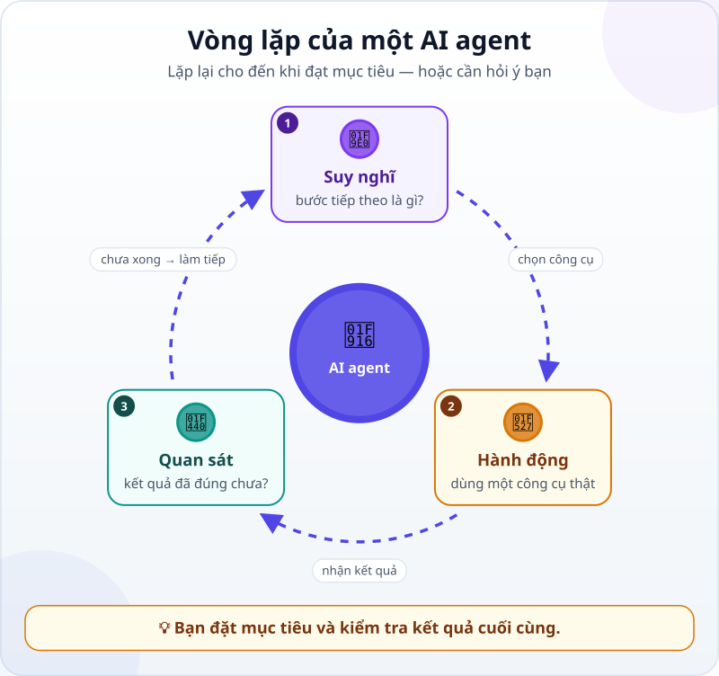

🌐 **Tiếng Việt** · [English](../../en/lessons/chatbot-to-agent.md) · [日本語](../../ja/lessons/chatbot-to-agent.md)

# Từ chatbot đến AI agent: AI không chỉ trả lời mà còn làm việc

<!-- section: objective -->
## Mục tiêu bài học

Sau bài này, bạn sẽ:

- Phân biệt được **chatbot**, **trợ lý AI** và **AI agent** bằng một câu hỏi đơn giản: *ai là người thực hiện các bước?*
- Nói được một AI agent gồm những gì: bộ não (LLM), đôi tay (công cụ) và vòng lặp làm – kiểm – sửa.
- Hiểu vì sao **agentic coding** — làm phần mềm cùng AI agent — là chủ đề chính của khóa học này.

<!-- section: hook -->
## Mở đầu: vì sao nên quan tâm?

Thử nhớ lại lần gần nhất bạn nhờ ChatGPT, Gemini hay Claude một việc cụ thể, ví dụ: *"Làm sao để tổng hợp chi tiêu tháng này từ ba file Excel?"*

AI trả lời rất hay: năm bước, kèm cả công thức. Nhưng rồi **chính bạn** vẫn phải mở từng file, chép công thức, sửa khi báo lỗi, rồi quay lại hỏi tiếp…

Bây giờ hãy tưởng tượng một loại AI khác: bạn chỉ nói mục tiêu, và nó **tự mở file, tự viết công thức, tự chạy thử, thấy lỗi thì tự sửa**, cuối cùng báo lại: *"Xong rồi, tổng chi tiêu tháng 9 là 12,4 triệu đồng — đây là những gì tôi đã làm."*

Loại AI đó có tên: **AI agent**. Và nó đang thay đổi cách con người làm phần mềm.

<!-- section: read-first -->
## Xem và đọc trước

Không bắt buộc — bài này đã đủ để hiểu. Nếu muốn đọc thêm (tiếng Anh):

- [Building Effective AI Agents — Anthropic](https://www.anthropic.com/engineering/building-effective-agents): phân biệt *workflow* và *agent* rất rõ ràng.
- [What is agentic coding? — Google Cloud](https://cloud.google.com/discover/what-is-agentic-coding): giới thiệu ngắn gọn về agentic coding.

<!-- section: concept -->
## Nội dung chính

### Ba cấp độ AI bạn sẽ gặp

Câu hỏi quan trọng nhất để phân biệt: **ai là người thực hiện các bước?** Với chatbot, AI nghĩ — bạn làm. Với agent, AI vừa nghĩ vừa làm — bạn giao việc và kiểm tra.

### Một AI agent gồm những gì?

Hãy nhớ công thức:

- **Bộ não — LLM (mô hình ngôn ngữ lớn):** hiểu yêu cầu, suy luận và quyết định bước tiếp theo.
- **Đôi tay — công cụ (tool):** những việc agent được phép làm thật: đọc/ghi file, chạy lệnh, tìm kiếm web, gọi dịch vụ khác.
- **Vòng lặp:** agent không làm một lần là xong. Nó **suy nghĩ → hành động → quan sát kết quả**, rồi lặp lại cho đến khi đạt mục tiêu hoặc cần hỏi ý bạn.

### Agentic coding là gì?

Khi agent được dùng để làm phần mềm — viết code, chạy thử, sửa lỗi, viết test — ta gọi đó là **agentic coding**. Bạn không cần gõ từng dòng code nữa; vai trò của bạn chuyển thành **người giao việc, đặt tiêu chí và kiểm tra kết quả**. Đó chính là kỹ năng khóa học này sẽ dạy bạn.

<!-- section: analogy -->
## Ví dụ đời thường

Bạn cần đi từ nhà ra sân bay.

- **Chatbot giống Google Maps:** chỉ đường rất chi tiết — nhưng **bạn** phải tự lái, tự xoay xở khi kẹt xe, tự tìm chỗ đậu.
- **AI agent giống tài xế taxi:** bạn chỉ cần nói *"ra sân bay, trước 8 giờ"*. Tài xế tự chọn đường, tự đổi hướng khi kẹt xe và đưa bạn tới nơi.

Nhưng để ý: dù đi taxi, **bạn vẫn phải nói đúng địa chỉ và kiểm tra mình có tới đúng nhà ga không**. Làm việc với AI agent cũng vậy — giao việc rõ ràng và kiểm tra kết quả là trách nhiệm của bạn.

Phép so sánh này cũng có chỗ chưa khớp: tài xế taxi hiếm khi "đi nhầm thành phố", còn agent đôi khi hiểu sai yêu cầu một cách rất tự tin. Vì vậy với agent, bước kiểm tra còn quan trọng hơn.

<!-- section: example -->
## Ví dụ thực tế

Nhiệm vụ: *làm một trang web thiệp mời sinh nhật cho bé An, 5 tuổi, chủ đề khủng long, có nút "Xác nhận tham dự".*

**Với chatbot:**

1. Bạn hỏi, chatbot đưa một đoạn code HTML.
2. Bạn tự tạo file, dán code vào, mở bằng trình duyệt.
3. Nút bấm không hoạt động → bạn chép thông báo lỗi, dán lại cho chatbot.
4. Lặp lại bước 2–3 cho đến khi chạy được. Mọi bước đều do bạn làm.

**Với AI agent (ví dụ Claude Code):**

1. Bạn gõ đúng yêu cầu ở trên.
2. Agent tự tạo thư mục và các file, viết HTML/CSS, mở trang lên chạy thử.
3. Agent thấy nút bấm bị lỗi → tự đọc lỗi, tự sửa, chạy lại.
4. Agent báo cáo: *"Đã xong. Tôi đã tạo 3 file, đây là cách mở trang."* Bạn xem thử và yêu cầu chỉnh: *"Đổi sang màu xanh lá, thêm ngày giờ tiệc."*

Cùng một mục tiêu, nhưng với agent, **bạn chuyển từ người làm sang người chỉ đạo và nghiệm thu**.

<!-- section: try-it -->
## Thử ngay

Không cần cài đặt gì, mất khoảng 5 phút:

1. Liệt kê **3 việc** bạn làm lặp đi lặp lại mỗi tuần (ví dụ: tổng hợp báo cáo, trả lời email theo mẫu, đổi tên hàng loạt file).
2. Với mỗi việc, tự hỏi: *chatbot chỉ cần **trả lời** là đủ, hay cần một agent **làm thay** các bước?*
3. Với việc hợp với agent nhất, viết mục tiêu trong **một câu**, kèm cách bạn sẽ kiểm tra là nó đã làm đúng.

Giữ lại danh sách này — ở phần dự án cuối khóa, bạn sẽ biến một việc trong đó thành dự án thật.

<!-- section: misconceptions -->
## Hiểu lầm thường gặp

- **"Agent là robot hình người."** — Không. Agent là phần mềm; "đôi tay" của nó là các công cụ trong máy tính.
- **"Agent thông minh nên không bao giờ sai."** — Sai. Agent có thể hiểu nhầm yêu cầu hoặc làm sai; vì vậy luôn phải kiểm tra kết quả.
- **"Phải biết lập trình mới dùng được agent."** — Không bắt buộc. Nhưng hiểu nền tảng phần mềm giúp bạn giao việc rõ hơn và phát hiện lỗi sớm hơn — đó là lý do khóa học có phần nền tảng phần mềm.
- **"Agent sẽ thay thế hoàn toàn con người."** — Agent làm thay nhiều *bước*, còn con người vẫn quyết định *làm gì*, *làm cho ai* và *thế nào là đạt*.

<!-- section: takeaways -->
## Ghi nhớ

- Chatbot **trả lời**; AI agent **hành động** để đạt mục tiêu.
- Câu hỏi phân biệt: **ai thực hiện các bước?**
- Agent = LLM (bộ não) + công cụ (đôi tay) + vòng lặp làm – kiểm – sửa.
- Bạn vẫn là người giao việc và **kiểm tra kết quả** — agent càng mạnh, bước kiểm tra càng quan trọng.
- Agentic coding = làm phần mềm cùng AI agent — chủ đề của cả khóa học.

<!-- section: quiz -->
## Tự kiểm tra

**Câu 1.** Điểm khác biệt lớn nhất giữa chatbot và AI agent là gì?

- A) Agent dùng mô hình AI lớn hơn
- B) Agent có thể dùng công cụ để tự hành động và kiểm tra kết quả theo vòng lặp
- C) Agent không bao giờ mắc lỗi

**Câu 2.** Việc nào dưới đây cần một AI agent thay vì chatbot?

- A) Giải thích "biến" trong lập trình là gì
- B) Tạo các file cho một trang web, chạy thử và sửa lỗi cho đến khi chạy được
- C) Dịch một câu sang tiếng Nhật

**Câu 3.** Agent báo "đã xong". Bạn nên làm gì tiếp theo?

- A) Tin tưởng hoàn toàn và dùng ngay
- B) Kiểm tra kết quả theo tiêu chí bạn đã đặt ra
- C) Bắt agent làm lại từ đầu cho chắc

Xem đáp án

1. **B** — công cụ và vòng lặp là thứ biến AI "biết nói" thành AI "biết làm".
2. **B** — việc này cần nhiều bước hành động thật (tạo file, chạy, sửa), không chỉ một câu trả lời.
3. **B** — giao việc và nghiệm thu luôn là trách nhiệm của bạn.

<!-- section: sources -->
## Nguồn tham khảo

- Anthropic — [Building Effective AI Agents](https://www.anthropic.com/engineering/building-effective-agents) (tiếng Anh, 12/2024)
- Anthropic — [Claude Code overview](https://code.claude.com/docs/en/overview) (tiếng Anh)
- Google Cloud — [What is agentic coding?](https://cloud.google.com/discover/what-is-agentic-coding) (tiếng Anh)
- IBM — [What is Agentic AI?](https://www.ibm.com/think/topics/agentic-ai) (tiếng Anh)
