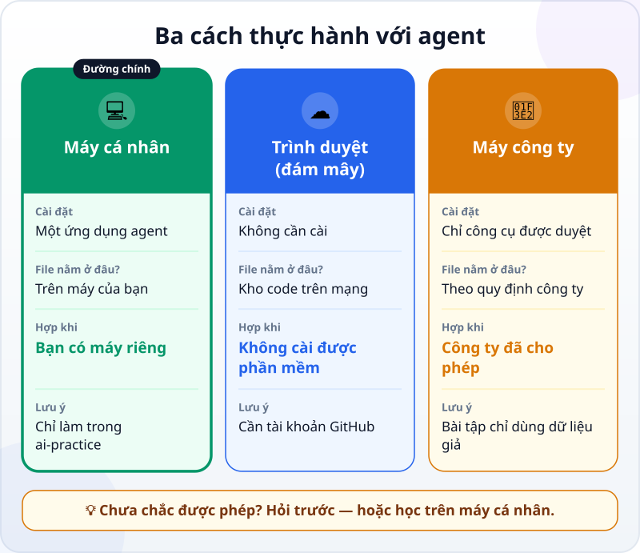
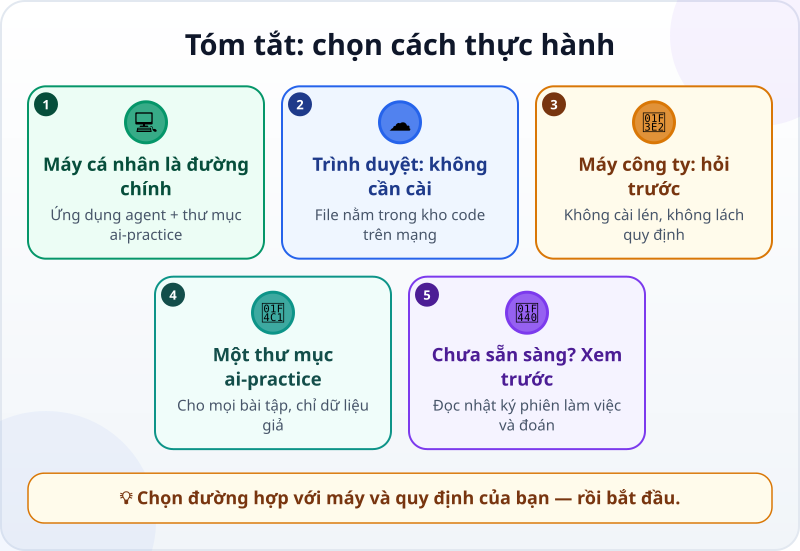

🌐 **Tiếng Việt** · [English](../../en/lessons/choose-your-learning-setup.md) · [日本語](../../ja/lessons/choose-your-learning-setup.md)

# Chọn cách thực hành: trình duyệt, máy cá nhân hay máy công ty

<!-- section: objective -->
## Mục tiêu bài học

Sau bài này, bạn sẽ:

- So sánh được ba cách thực hành với agent: **máy cá nhân**, **trình duyệt (đám mây)** và **máy công ty**.
- Chọn được cách hợp với máy, tài khoản và quy định nơi bạn làm việc.
- Chuẩn bị xong thư mục thực hành `ai-practice`, hoặc biết mình cần hỏi ai trước.

<!-- section: hook -->
## Mở đầu: vì sao nên quan tâm?

Tuấn là kỹ sư cơ khí ở Nhật. Xem xong một phiên làm việc của agent, anh muốn thử ngay — nhưng máy tính công ty chặn cài phần mềm, và anh không chắc công ty có cho dùng AI hay không.

Chọn sai chỗ thực hành có thể làm bạn mất cả buổi để cài đặt, hoặc tệ hơn: vi phạm quy định công ty. Mười phút chọn đúng từ đầu giúp mọi bài sau suôn sẻ.

<!-- section: concept -->
## Nội dung chính

### Ba cách, khác nhau ở đâu?

- **💻 Máy cá nhân — đường chính của khóa học.** Bạn cài một ứng dụng agent, chọn thư mục `ai-practice`, rồi giao việc. File nằm ngay trên máy bạn, nên bạn tự mở ra kiểm tra dễ dàng. Ví dụ (tính đến tháng 9/2026): ứng dụng Claude cho máy tính có thẻ *Code*, chạy trên macOS và Windows, chọn chạy trên máy (*Local*) và chọn thư mục làm việc — không cần gõ lệnh.
- **☁️ Trình duyệt (đám mây).** Agent chạy trên máy chủ của nhà cung cấp; bạn chỉ cần trình duyệt. Đổi lại, file nằm trong một kho code trên mạng (thường là GitHub), nên bạn cần tài khoản GitHub và phải tải file về mới mở trên máy được. Hợp khi bạn không cài được phần mềm — trên một máy bạn được phép dùng.
- **🏢 Máy công ty.** Chỉ dùng công cụ công ty đã duyệt, theo cách công ty cho phép. Không cài lén, không tìm cách vượt qua quy định, không đưa dữ liệu công ty vào tài khoản cá nhân. Chưa chắc? Hỏi bộ phận IT hoặc quản lý trước.

### Trước khi chọn: ba điều cần biết

- **Tài khoản:** nhiều công cụ agent cần tài khoản trả phí. Ví dụ, tính đến tháng 9/2026, Claude Code cần gói Pro, Max, Team, Enterprise hoặc tài khoản Console; gói miễn phí không có Claude Code. Hãy xem trang của công cụ bạn chọn.
- **Máy:** mô hình AI không chạy trên máy bạn mà trên máy chủ của nhà cung cấp. Máy bạn chỉ cần đủ mới và có Internet — với Claude Code là macOS 13 hoặc Windows 10 trở lên (một số bản Linux cũng được), RAM từ 4 GB.
- **Chưa sẵn sàng?** Vẫn học được theo **đường chỉ xem**: đọc nhật ký phiên làm việc trong bài, đoán bước tiếp theo, làm các câu hỏi — rồi cài đặt sau.

### Một thư mục cho mọi bài tập

Dù chọn đường nào, mọi bài tập của khóa học diễn ra trong **một thư mục riêng tên `ai-practice`**, chỉ chứa dữ liệu giả. Thư mục riêng giúp **bạn** dễ theo dõi agent làm gì, ở đâu. Nhưng nó chưa phải hàng rào chặn agent: agent được làm gì còn tùy quyền hạn bạn cho nó — điều bạn sẽ học khi chia [việc an toàn, việc phải hỏi và việc bị cấm](data-safety-and-permissions.md).

<!-- section: try-it -->
## Thử ngay

Khoảng 10 phút.

1. **Trả lời ba câu hỏi:**
   - Bạn có máy tính riêng (macOS 13 hoặc Windows 10 trở lên) và được cài phần mềm trên đó không?
   - Bạn đã có, hoặc sẵn sàng đăng ký, tài khoản của một công cụ agent chưa?
   - Nếu định dùng máy công ty: công ty đã cho phép công cụ đó chưa?
2. **Chọn đường** theo câu trả lời:
   - Có máy riêng và tài khoản → 💻 **máy cá nhân**.
   - Không cài được phần mềm, có hoặc sẵn sàng tạo tài khoản GitHub → ☁️ **trình duyệt**.
   - Công ty đã duyệt công cụ → 🏢 **máy công ty**, đúng theo quy định.
   - Chưa có gì → 👀 **chỉ xem**, cài đặt sau.
3. **Chuẩn bị chỗ làm:**
   - 💻 Tạo thư mục `ai-practice` trong thư mục Tài liệu (Documents). Bên trong, tạo file `README.txt` ghi: *"Thư mục thực hành với AI agent. Chỉ dữ liệu giả."*
   - ☁️ Làm theo hướng dẫn bắt đầu của công cụ để kết nối GitHub, rồi tạo một kho trống tên `ai-practice`.
   - 🏢 Nếu chưa rõ quy định, gửi tin nhắn này cho IT hoặc quản lý: *"Tôi muốn học dùng AI agent [tên công cụ] với dữ liệu giả, trong một thư mục riêng. Công ty có cho phép dùng trên máy công ty không?"*
   - 👀 Ghi vào sổ: bạn sẽ dùng máy nào, và khi nào cài đặt.
4. **Ghi bằng chứng** (ba dòng):
   - *Tôi cho xem được…* — ví dụ: thư mục `ai-practice` có file `README.txt`.
   - *Tôi đã kiểm tra…* — ví dụ: máy đủ yêu cầu, tài khoản đã có, công ty cho phép.
   - *Tôi sẽ không dùng cách này khi…* — ví dụ: cần làm với dữ liệu thật của công ty.

<!-- section: misconceptions -->
## Hiểu lầm thường gặp

- **"Máy công ty cũng như máy nhà, cứ cài là dùng."** — Không. Máy công ty có quy định về phần mềm và dữ liệu; tự cài hay lách quy định có thể khiến bạn gặp rắc rối thật. Hỏi trước.
- **"Phải có máy mạnh mới chạy được agent."** — Mô hình AI chạy trên máy chủ của nhà cung cấp. Máy bạn chỉ cần đủ mới và có Internet.
- **"Có thư mục riêng rồi thì agent không đụng được gì khác."** — Thư mục riêng là ranh giới cho bạn, chưa phải hàng rào cho agent. Agent được làm gì là do quyền hạn quyết định.

<!-- section: recap -->
## Tóm tắt bằng hình

<!-- section: takeaways -->
## Ghi nhớ

- Ba đường thực hành: **máy cá nhân** (đường chính), **trình duyệt** (không cần cài, file nằm trên mạng), **máy công ty** (chỉ khi được phép).
- Máy công ty: chỉ công cụ được duyệt; không cài lén, không lách quy định, không đưa dữ liệu công ty vào tài khoản cá nhân.
- Mọi bài tập diễn ra trong thư mục `ai-practice`, chỉ với dữ liệu giả.
- Chưa sẵn sàng cài đặt? Học theo đường chỉ xem trước.

<!-- section: quiz -->
## Tự kiểm tra

**Câu 1.** Máy công ty của bạn chặn cài phần mềm. Việc nào **không nên** làm?

- A) Hỏi IT xem công ty có công cụ AI nào được duyệt không
- B) Học trên máy cá nhân với dữ liệu giả
- C) Tìm cách vượt qua lệnh chặn để cài công cụ

**Câu 2.** Khi dùng agent qua trình duyệt (đám mây), file bạn làm ra nằm ở đâu?

- A) Luôn nằm trên ổ cứng máy bạn
- B) Trong một kho code trên mạng; bạn tải về khi cần
- C) Không nằm ở đâu cả

**Câu 3.** Vì sao mọi bài tập đều diễn ra trong thư mục `ai-practice`?

- A) Để agent chạy nhanh hơn
- B) Để dễ theo dõi agent làm gì, ở đâu, và chỉ dùng dữ liệu giả
- C) Vì agent không mở được thư mục nào khác

Xem đáp án

1. **C** — lách quy định công ty là việc không bao giờ làm, dù để học.
2. **B** — agent trên đám mây làm việc trong kho code trên mạng, không phải trên ổ cứng của bạn.
3. **B** — thư mục riêng giúp bạn theo dõi; còn agent được làm gì thì do quyền hạn quyết định, nên C sai.

<!-- section: sources -->
## Nguồn tham khảo

- Anthropic — [Advanced setup](https://code.claude.com/docs/en/setup) (tiếng Anh): yêu cầu hệ thống của Claude Code và loại tài khoản cần có (tính đến 9/2026).
- Anthropic — [Desktop application](https://code.claude.com/docs/en/desktop) (tiếng Anh): thẻ *Code* của ứng dụng Claude; chọn chạy trên máy (*Local*) hay trên đám mây (*Cloud*), và chọn thư mục làm việc.
- Anthropic — [Use Claude Code in the cloud](https://code.claude.com/docs/en/claude-code-on-the-web) (tiếng Anh): phiên làm việc trên đám mây chạy trên hạ tầng của nhà cung cấp và cần quyền truy cập kho GitHub.
