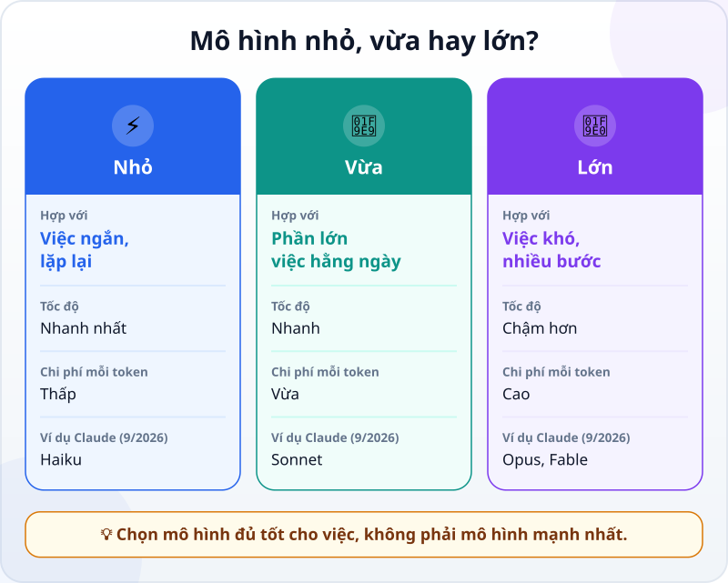
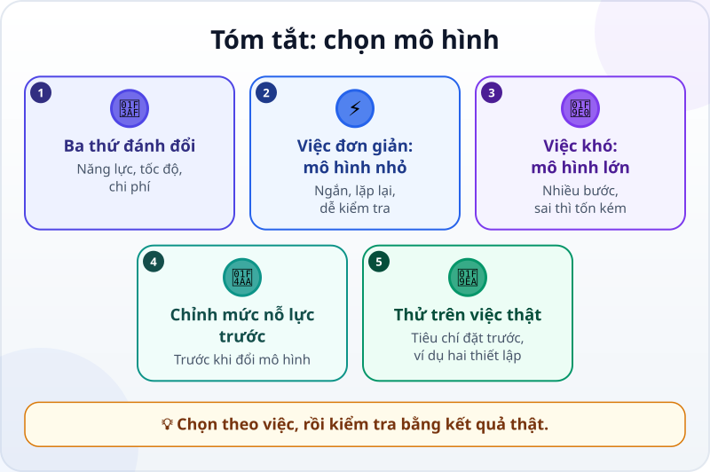

🌐 **Tiếng Việt** · [English](../../en/lessons/choosing-models.md) · [日本語](../../ja/lessons/choosing-models.md)

# Chọn mô hình: to hay nhỏ, nhanh hay chậm, rẻ hay đắt

<!-- section: objective -->
## Mục tiêu bài học

Sau bài này, bạn sẽ:

- Kể được ba thứ phải đánh đổi khi chọn **mô hình (model)**: năng lực, tốc độ và chi phí.
- Chọn được điểm bắt đầu hợp lý cho một việc: mô hình nhỏ cho việc đơn giản, lặp lại; mô hình lớn cho việc khó, nhiều bước.
- Tự so sánh hai thiết lập (hai mô hình, hoặc hai mức nỗ lực) trên cùng một việc thật và quyết định dựa trên kết quả đã kiểm tra.

<!-- section: hook -->
## Mở đầu: vì sao nên quan tâm?

Hana làm văn phòng ở Tokyo. Từ khi biết công cụ AI của công ty cho chọn mô hình, cô luôn chọn mô hình mạnh nhất — cho mọi việc, kể cả sửa một lỗi chính tả trong email. Câu trả lời lúc nào cũng tốt, nhưng thường phải chờ, và có tuần cô dùng hết hạn mức sử dụng từ giữa tuần.

Anh đồng nghiệp ngồi cạnh cười: *"Em thuê xe tải để đi mua ổ bánh mì à?"* Hana thắc mắc: vậy việc nào nên dùng mô hình nào, và làm sao biết mô hình nhỏ có "đủ tốt" không?

<!-- section: concept -->
## Nội dung chính

### Một hãng, nhiều cỡ mô hình

Các hãng AI thường có cả một họ mô hình với nhiều cỡ. Ví dụ, tính đến 9/2026, Anthropic có Claude Haiku (nhanh và tiết kiệm), Claude Sonnet (cho phần lớn việc hằng ngày, kể cả code), Claude Opus (cho việc phức tạp và agent chạy dài) và Claude Fable (mạnh nhất, cho việc khó và dài nhất). Các hãng khác cũng có những cỡ tương tự. Tên và phiên bản đổi rất nhanh, nên hãy nhớ **cách chọn**, đừng học thuộc tên.



### Ba thứ phải đánh đổi

Tài liệu của Anthropic gọi việc chọn mô hình là cân bằng giữa ba thứ:

- **Năng lực:** mô hình lớn làm tốt hơn ở việc khó — nhiều bước, cần hiểu sâu, code phức tạp.
- **Tốc độ:** mô hình nhỏ trả lời nhanh hơn.
- **Chi phí:** mô hình lớn tốn hơn cho mỗi [token](tokens.md). Dù bạn trả theo gói hay theo lượng dùng, việc nặng hơn thường làm hạn mức hết nhanh hơn.

Không có mô hình nào thắng cả ba. Mô hình "tốt nhất" là mô hình **đủ tốt cho việc này**, với tốc độ và chi phí bạn chấp nhận được.

### Hai cách bắt đầu

- **Nhỏ trước:** bắt đầu với mô hình nhỏ, thử kỹ, chỉ nâng cấp khi thấy nó thiếu ở chỗ cụ thể. Hợp với việc đơn giản, làm nhiều lần, cần nhanh.
- **Mạnh trước:** bắt đầu với mô hình mạnh, làm cho kết quả đạt, rồi thử hạ dần. Hợp với việc khó, nhiều bước, hay việc mà sai thì tốn kém hơn chờ lâu.

### Thử chỉnh mức nỗ lực trước khi đổi mô hình

Trong bài [Mô hình biết "suy nghĩ"](reasoning-models.md), bạn đã gặp **mức nỗ lực (effort)**. Tài liệu của Anthropic (9/2026) ghi rằng chỉnh mức này thường là cách tốt hơn đổi mô hình: cùng một mô hình, mức thấp nhanh và tiết kiệm hơn, mức cao nghĩ kỹ hơn.

### Kiểm chứng trên việc thật

Bảng so sánh và lời quảng cáo không biết việc *của bạn*. Và khi mô hình nhỏ làm không nổi, nó hiếm khi nói ra — câu trả lời sai vẫn nghe rất tự tin. Cũng theo tài liệu đó, bước quan trọng nhất là có vài bài thử từ chính việc của mình, kiểm tra theo tiêu chí đặt trước — giống cách bạn nghiệm thu việc của agent. Cách dễ nhất để thấy sự khác biệt là chạy cùng một yêu cầu trên **hai thiết lập**: hai mô hình, hoặc một mô hình ở hai mức nỗ lực.

<!-- section: example -->
## Ví dụ thực tế

Hana chọn ba việc trong tuần, dùng dữ liệu giả, và chạy mỗi việc trên mô hình nhỏ và mô hình mạnh: viết lại một email xin lỗi khách, phân loại 30 câu góp ý vào 4 nhóm (so với 10 câu cô tự phân loại trước), và lập kế hoạch sắp xếp thư mục chung với ràng buộc "không xóa file nào". Hai việc đầu, cả hai mô hình đều đạt, mô hình nhỏ nhanh hơn thấy rõ. Việc thứ ba, kế hoạch của mô hình nhỏ có một bước xóa file trùng tên — vi phạm ràng buộc. Hana ghi lại quy tắc cho mình:

```text
Việc ngắn, lặp lại, dễ kiểm tra  → mô hình nhỏ
Việc nhiều bước, sai thì tốn kém → mô hình mạnh (hoặc mức nỗ lực cao)
Chưa chắc                        → thử cả hai, kiểm tra theo tiêu chí
```

Đó là quy tắc cho việc của Hana; với việc của bạn, kết quả có thể khác.

<!-- section: try-it -->
## Thử ngay

Khoảng 8 phút, trong `ai-practice`, chỉ với dữ liệu giả. Bạn cần một công cụ cho chọn mô hình hoặc chọn mức nỗ lực — có một trong hai là đủ. Ví dụ, tính đến 9/2026, trong Claude Code gõ `/model haiku`, `/model sonnet` hay `/model opus` để đổi mô hình; ứng dụng chat thường có ô chọn mô hình gần khung nhập. Nếu công cụ chỉ có mức nỗ lực, hãy so hai mức thấp và cao. Bên dưới, **hai thiết lập** nghĩa là mô hình nhỏ và mô hình lớn, hoặc mức nỗ lực thấp và cao.

**1. Chạy ba việc trên hai thiết lập (6 phút).** Dán đúng cùng một yêu cầu cho thiết lập nhỏ (mô hình nhỏ hoặc mức thấp) và cho thiết lập lớn (mô hình lớn hoặc mức cao). Mỗi lần chạy — mỗi việc, mỗi thiết lập — dùng một cuộc trò chuyện mới (trong Claude Code: gõ `/clear`), để thiết lập sau không nhìn thấy câu trả lời của thiết lập trước.

*Việc A — viết lại (không có một đáp án duy nhất):*

```text
Viết lại tin nhắn sau cho lịch sự, tối đa 3 câu:
"Anh gửi file trễ 2 ngày rồi đó. Gửi liền đi, mai em họp."
```

*Việc B — cộng tiền theo nhóm:*

```text
Tổng chi phí theo từng nhóm (Ăn uống, Đi lại, Văn phòng phẩm) và tổng cộng:
Ăn trưa 85.000 đ; Taxi 120.000 đ; Giấy in 45.000 đ; Ăn trưa 70.000 đ;
Taxi 95.000 đ; Bút 30.000 đ; Cà phê tiếp khách 110.000 đ; Xe buýt 7.000 đ.
```

*Việc C — xếp lịch nhiều ràng buộc:*

```text
Xếp 4 việc vào 4 khung giờ thứ Hai: 9:00, 10:00, 11:00, 14:00 (mỗi việc 1 giờ).
Việc: Viết báo cáo, Gửi báo cáo, Họp nhóm, Gọi khách hàng.
- Viết báo cáo và Họp nhóm đều phải xong trước Gửi báo cáo.
- Gửi báo cáo phải trước giờ nghỉ trưa.
- Khách hàng chỉ nghe máy từ 11:00 trở đi.
- Trưởng nhóm đến lúc 10:00, nên không họp lúc 9:00.
Cho biết lịch và kiểm tra lại từng điều kiện.
```

**2. Ghi kết quả (1 phút)** vào file `ai-practice/so_sanh_mo_hinh.md`, dưới dạng một bảng nhỏ: với mỗi việc và mỗi thiết lập, *nhanh hay chậm* và *đạt hay không đạt*. Việc B và C có đáp án đúng bên dưới — hãy so sau khi chạy xong.

**3. Viết quy tắc của bạn (1 phút)** theo mẫu của Hana, vào cùng file đó, rồi ghi bằng chứng:

- *Tôi cho xem được…* file `so_sanh_mo_hinh.md`: bảng so sánh ba việc trên hai thiết lập và quy tắc của tôi.
- *Tôi đã kiểm tra…* tổng tiền việc B và lịch việc C khớp với đáp án; lời nhắn việc A đủ ý và không quá 3 câu.
- *Tôi sẽ không dùng cách này khi…* ví dụ: chỉ thử mỗi việc một lần rồi kết luận cho cả loại việc lớn và quan trọng.

<details>
<summary>Đáp án việc B và C</summary>

**Việc B:** Ăn uống 265.000 đ (85.000 + 70.000 + 110.000) · Đi lại 222.000 đ (120.000 + 95.000 + 7.000) · Văn phòng phẩm 75.000 đ (45.000 + 30.000) · **Tổng cộng 562.000 đ**.

**Việc C** chỉ có một lịch đúng: 9:00 Viết báo cáo · 10:00 Họp nhóm · 11:00 Gửi báo cáo · 14:00 Gọi khách hàng. Vì Gửi báo cáo phải sau hai việc khác và trước trưa, nó chỉ có thể là 11:00; Họp nhóm không được lúc 9:00 nên là 10:00; Gọi khách còn lại 14:00.

</details>

<!-- section: misconceptions -->
## Hiểu lầm thường gặp

- **"Mô hình mạnh nhất lúc nào cũng là lựa chọn đúng."** — Với việc đơn giản, nó chủ yếu làm bạn chờ lâu hơn và tốn hạn mức hơn, mà kết quả không khác.
- **"Mô hình nhỏ là mô hình kém."** — Nó được làm ra cho việc nhanh, nhiều, đơn giản, và làm tốt những việc đó. Chỉ là đừng giao cho nó việc quá sức mà không kiểm tra.
- **"Thử một lần là biết."** — Câu trả lời của AI có thể khác nhau giữa các lần chạy. Với việc quan trọng, thử vài lần và vài ví dụ trước khi chọn.

<!-- section: recap -->
## Tóm tắt bằng hình



<!-- section: takeaways -->
## Ghi nhớ

- Chọn mô hình là đánh đổi giữa năng lực, tốc độ và chi phí; không mô hình nào thắng cả ba.
- Việc ngắn, lặp lại, dễ kiểm tra: bắt đầu với mô hình nhỏ.
- Việc khó, nhiều bước, sai thì tốn kém: bắt đầu với mô hình mạnh.
- Thử chỉnh mức nỗ lực trước khi đổi mô hình.
- Kiểm chứng trên việc thật, theo tiêu chí đặt trước — ví dụ so hai thiết lập trên cùng một việc.

<!-- section: quiz -->
## Tự kiểm tra

**Câu 1.** Mỗi ngày bạn cần phân loại vài trăm câu góp ý ngắn vào 4 nhóm. Nên bắt đầu thế nào?

- A) Dùng mô hình mạnh nhất cho chắc, khỏi cần thử
- B) Thử mô hình nhỏ trên một mẫu đã tự phân loại trước, kiểm tra rồi mới dùng
- C) Chọn mô hình có tên mới nhất

**Câu 2.** Với những câu hỏi đơn giản, mô hình lớn bạn đang dùng trả lời chậm hơn hẳn mức cần thiết. Nên làm gì trước tiên?

- A) Chuyển sang một mô hình còn lớn hơn
- B) Viết prompt dài hơn để mô hình hiểu kỹ hơn
- C) Hạ mức nỗ lực, hoặc dùng mô hình nhỏ hơn cho loại việc này

**Câu 3.** Làm sao biết mô hình nhỏ "đủ tốt" cho việc của bạn?

- A) Chạy thử trên vài việc thật và kiểm tra theo tiêu chí đặt trước
- B) Hỏi mô hình nhỏ xem nó có làm được không
- C) Xem mô hình nào đứng đầu bảng xếp hạng trên mạng

<details>
<summary>Xem đáp án</summary>

1. **B** — việc ngắn, lặp lại, dễ kiểm tra hợp với "nhỏ trước"; một mẫu đã phân loại sẵn cho bạn biết nó có đủ tốt không.
2. **C** — mức nỗ lực thường là nút chỉnh tốt hơn đổi mô hình; mô hình lớn hơn hay prompt dài hơn chỉ làm chậm thêm.
3. **A** — bảng xếp hạng và lời tự đánh giá của mô hình không biết việc của bạn; kết quả đã kiểm tra thì biết.

</details>

<!-- section: sources -->
## Nguồn tham khảo

- Anthropic — [Choosing the right model](https://platform.claude.com/docs/en/about-claude/models/choosing-a-model) (tiếng Anh, tính đến 9/2026): chọn mô hình là cân bằng năng lực, tốc độ và chi phí; hai cách bắt đầu (tiết kiệm trước với Claude Haiku, năng lực trước với Claude Opus); chỉnh mức effort thường là cách tốt hơn đổi mô hình; có bộ bài thử cho việc của mình là bước quan trọng nhất.
- Anthropic — [Model configuration](https://code.claude.com/docs/en/model-config) (tiếng Anh, tính đến 9/2026): trong Claude Code, lệnh `/model` đổi mô hình; `haiku` cho việc đơn giản, `sonnet` cho việc code hằng ngày, `opus` cho việc cần suy luận phức tạp, `fable` cho việc khó và dài nhất.
