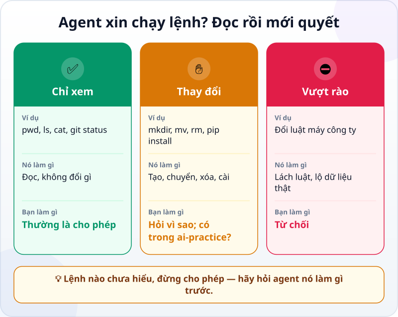
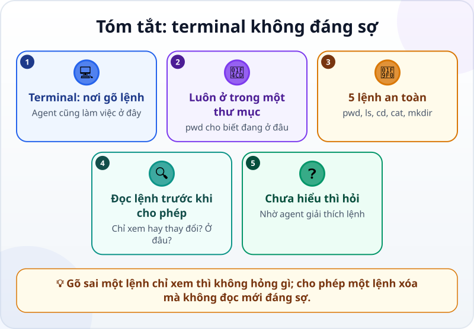

🌐 **Tiếng Việt** · [English](../../en/lessons/command-line-basics.md) · [日本語](../../ja/lessons/command-line-basics.md)

# Terminal không đáng sợ: 5 lệnh an toàn đầu tiên

<!-- section: objective -->
## Mục tiêu bài học

Sau bài này, bạn sẽ:

- Mở terminal ngay trong thư mục `ai-practice` và dùng 5 lệnh an toàn: `pwd`, `ls`, `cd`, `cat`, `mkdir`.
- Đọc một lệnh agent xin chạy: nó chỉ xem, hay sẽ thay đổi gì, và ở đâu.
- Quyết định cho phép, hỏi lại hay từ chối theo ba loại việc ✅ ✋ ⛔.

<!-- section: hook -->
## Mở đầu: vì sao nên quan tâm?

Tuấn giao việc cho agent trên máy cá nhân, ở chế độ agent hỏi trước mỗi thay đổi. Giữa chừng, agent hỏi: *"Cho phép chạy lệnh `rm -rf build`?"* (Trên PowerShell, cùng việc đó là `Remove-Item build -Recurse -Force`.) Tuấn không biết lệnh đó làm gì. Bấm Không thì sợ agent kẹt; bấm Có thì sợ mất file. Anh bấm Có cho nhanh.

Lần này may: `build` chỉ là thư mục agent vừa tạo ra. Nhưng "may" không phải là cách giao việc. Mười lăm phút với terminal sẽ giúp bạn đọc được những câu hỏi như thế.

<!-- section: concept -->
## Nội dung chính

### Terminal là gì?

**Terminal (dòng lệnh)** là cửa sổ để gõ lệnh bằng chữ thay vì bấm chuột. Trên Windows, terminal có sẵn là **PowerShell**; trên Mac là ứng dụng **Terminal**. Agent làm việc với máy tính phần lớn qua chính những lệnh như thế: liệt kê file, chạy chương trình, chạy phép kiểm tra, cài thư viện.

Mỗi lệnh gồm **tên lệnh**, thường kèm **đối tượng**: trong `cd ai-practice`, `cd` là lệnh ("đi vào thư mục"), `ai-practice` là đối tượng. Terminal cũng luôn "đứng" trong một thư mục — thư mục hiện tại — như khi bạn đang mở một thư mục trong File Explorer. Trên Windows, dòng nhắc `PS C:\Users\Tuan>` cho biết bạn đang ở PowerShell, trong thư mục `C:\Users\Tuan`.

### Năm lệnh an toàn

| Lệnh | Làm gì | Có thay đổi gì không? |
|---|---|---|
| `pwd` | Cho biết bạn đang ở thư mục nào | Không |
| `ls` | Liệt kê những gì có trong thư mục | Không |
| `cd <thư mục>` | Đi vào một thư mục; `cd ..` lên một cấp | Không, chỉ đổi chỗ đứng |
| `cat <file>` | In nội dung một file ra để xem | Không |
| `mkdir <tên>` | Tạo một thư mục mới | Có — thêm vào, không xóa gì |

Cả năm lệnh chạy được trên PowerShell lẫn Terminal của Mac; kết quả chỉ trình bày hơi khác nhau. Bốn lệnh đầu chỉ xem. `mkdir` là thay đổi đầu tiên, và vẫn an toàn khi thư mục mới nằm trong `ai-practice`.

### Đọc lệnh agent xin chạy



Ví dụ, tính đến tháng 9/2026, Claude Code ở chế độ mặc định tự chạy một số lệnh chỉ đọc như `ls`, `cat`, `git status` mà không hỏi, còn lệnh có thể thay đổi máy thì hỏi bạn trước. Nghĩa là: **lệnh nào hiện ra để hỏi bạn thì thường là lệnh có thể thay đổi gì đó** — càng đáng đọc kỹ.

Trước khi bấm cho phép, hỏi ba câu:

1. **Lệnh gì?** Chỉ xem, hay tạo, chuyển, xóa, cài, gửi đi?
2. **Ở đâu?** Đường dẫn trong lệnh có nằm trong `ai-practice` không? Có `..`, `~`, `C:\` hay `/` dẫn ra ngoài không?
3. **Lấy lại được không?** `rm -rf <folder>` (Terminal Mac hoặc Git Bash) và `Remove-Item <folder> -Recurse -Force` (PowerShell) xóa hẳn cả thư mục và mọi thứ bên trong, **không qua Thùng rác**. Chỉ đọc hai lệnh này, đừng chạy.

Chưa trả lời được thì chưa cho phép: hỏi agent *"Lệnh này làm gì, thay đổi những file nào?"*. Lệnh có thể trông khác một chút tùy máy — trên Windows, Claude Code dùng PowerShell, hoặc lệnh kiểu Mac nếu máy có cài Git for Windows — nhưng ba câu hỏi thì như nhau.

<!-- section: try-it -->
## Thử ngay

Khoảng 12 phút, trên máy cá nhân, trong `ai-practice`. Máy công ty: chỉ làm khi công ty cho phép dùng PowerShell; không được thì đọc bài và bỏ qua phần gõ lệnh — không tìm cách lách.

**1. Mở terminal ngay trong `ai-practice` (2 phút)**

- **Windows:** mở thư mục `ai-practice` trong File Explorer, bấm vào thanh địa chỉ, gõ `powershell` rồi Enter — PowerShell mở ra ngay trong thư mục đó. Hãy ưu tiên cách mở từ File Explorer này. Nếu bạn mở PowerShell ở nơi khác, tên hiển thị có thể đã được dịch và thư mục Documents có thể nằm trong OneDrive; hãy dùng đường dẫn thật của thư mục thay vì mặc định gõ `cd Documents`.
- **Mac:** `Cmd + Space`, gõ `Terminal`, Enter. Gõ `cd ` (có một dấu cách), kéo thư mục `ai-practice` từ Finder thả vào cửa sổ Terminal, rồi Enter.

**2. Năm lệnh (5 phút)** — gõ từng dòng, mỗi dòng nhấn Enter, và đoán trước kết quả:

```text
pwd
ls
cat README.txt
mkdir thu-nghiem
ls
cd thu-nghiem
pwd
cd ..
```

Trên Windows, nếu chữ có dấu hiện thành ký tự lạ, gõ `cat README.txt -Encoding utf8`: file vẫn đúng, chỉ là cách PowerShell đọc nó.

**3. Đọc lệnh của agent (5 phút)** — trong ứng dụng agent, ở chế độ agent hỏi trước, gửi:

```text
Tạo thư mục bao-cao trong thư mục này, rồi liệt kê các file.
Sau đó giải thích cả hai lệnh xóa mà không chạy: rm -rf thu-nghiem (Terminal Mac hoặc Git Bash), và Remove-Item thu-nghiem -Recurse -Force (PowerShell).
```

Khi agent xin chạy lệnh, trả lời ba câu hỏi trước khi cho phép. Rồi đọc lời giải thích về `rm -rf <folder>` (Terminal Mac hoặc Git Bash) và `Remove-Item <folder> -Recurse -Force` (PowerShell), rồi so với bảng ở trên. Chỉ đọc, đừng chạy.

Muốn bỏ `thu-nghiem`? Xóa bằng File Explorer hoặc Finder như bình thường — nó vào Thùng rác, lấy lại được.

Ghi bằng chứng:

- *Tôi cho xem được…* cửa sổ terminal với kết quả `pwd` kết thúc bằng `ai-practice`, và thư mục `thu-nghiem` vừa tạo.
- *Tôi đã kiểm tra…* thư mục `thu-nghiem` và `bao-cao` cũng hiện ra trong File Explorer hoặc Finder.
- *Tôi sẽ không dùng cách này khi…* ví dụ: máy công ty không cho mở PowerShell — khi đó tôi hỏi bộ phận IT.

<!-- section: misconceptions -->
## Hiểu lầm thường gặp

- **"Terminal chỉ dành cho dân IT."** — Nó chỉ là một cách khác để ra lệnh cho máy. Bạn không cần thuộc lòng; cần đọc hiểu được những lệnh agent xin chạy.
- **"Gõ sai là hỏng máy."** — Năm lệnh này chỉ xem hoặc tạo thêm; gõ sai tên thì terminal báo lỗi, vậy thôi. Điều cần cẩn thận là lệnh xóa, lệnh cài đặt, và lệnh chép từ mạng mà bạn không hiểu.
- **"Agent xin chạy lệnh thì cứ cho phép, nó biết mà."** — Agent có thể nhầm thư mục, và lệnh xóa không qua Thùng rác. Đọc trước; chưa hiểu thì hỏi.

<!-- section: recap -->
## Tóm tắt bằng hình



<!-- section: takeaways -->
## Ghi nhớ

- Terminal là cửa sổ gõ lệnh bằng chữ — và là nơi agent làm việc.
- Terminal luôn đứng trong một thư mục; `pwd` cho biết thư mục nào.
- Năm lệnh an toàn: `pwd`, `ls`, `cd`, `cat` chỉ xem; `mkdir` tạo thêm.
- Trước khi cho phép một lệnh: nó chỉ xem hay thay đổi? Ở đâu? Lấy lại được không?
- Lệnh nào chưa hiểu thì chưa cho phép — hỏi agent giải thích trước.

<!-- section: quiz -->
## Tự kiểm tra

**Câu 1.** Lệnh nào cho biết terminal đang ở thư mục nào?

- A) `ls`
- B) `mkdir`
- C) `pwd`

**Câu 2.** Agent hiện `rm -rf build` (Terminal Mac hoặc Git Bash) và `Remove-Item build -Recurse -Force` (PowerShell). Bạn chỉ đọc, không chạy. Mỗi lệnh sẽ làm gì?

- A) Liệt kê các file trong thư mục `build`
- B) Xóa hẳn thư mục `build` và mọi thứ bên trong, không qua Thùng rác
- C) Tạo một thư mục mới tên `build`

**Câu 3.** Agent xin chạy một lệnh bạn chưa hiểu. Bạn nên làm gì?

- A) Hỏi agent lệnh đó làm gì, thay đổi file nào, rồi mới quyết
- B) Cho phép, vì agent biết rõ hơn
- C) Tắt ứng dụng cho an toàn

<details>
<summary>Xem đáp án</summary>

1. **C** — `pwd` in ra thư mục hiện tại; `ls` liệt kê những gì bên trong nó.
2. **B** — cả hai dạng dành cho từng shell đều xóa thư mục và mọi thứ bên trong mà không hỏi lại: đây là việc ✋ phải hỏi trước.
3. **A** — không cho phép điều mình chưa hiểu; hỏi là cách nhanh nhất để hiểu.

</details>

<!-- section: sources -->
## Nguồn tham khảo

- Anthropic — [Terminal guide for new users](https://code.claude.com/docs/en/terminal-guide) (tiếng Anh): mở terminal trên Mac (`Cmd + Space`, gõ Terminal) và trên Windows (`Win + X`, chọn Windows PowerShell hoặc Terminal); dòng nhắc `PS C:\Users\...>` cho biết bạn đang ở PowerShell.
- Anthropic — [Security](https://code.claude.com/docs/en/security) (tiếng Anh): ở chế độ mặc định, Claude Code tự chạy một số lệnh chỉ đọc như `ls`, `cat`, `git status` và hỏi trước các lệnh có thể thay đổi máy (tính đến 9/2026).
- Anthropic — [Advanced setup](https://code.claude.com/docs/en/setup) (tiếng Anh): trên Windows, Claude Code chạy lệnh bằng PowerShell, hoặc bằng Git Bash khi máy có cài Git for Windows.
