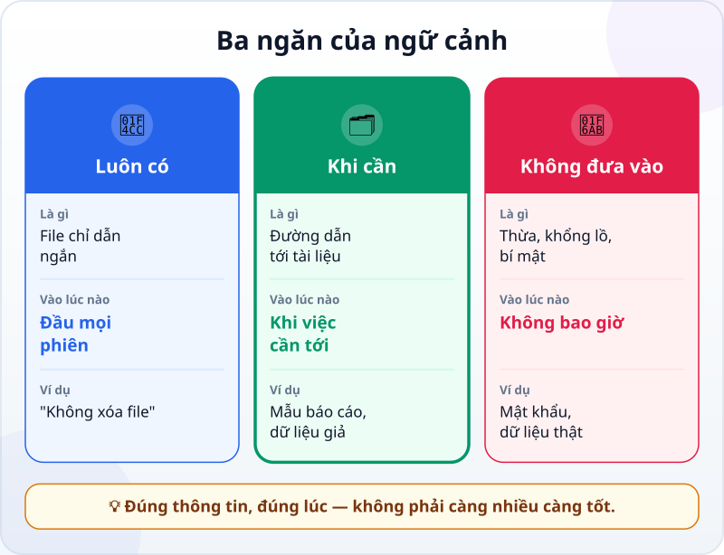
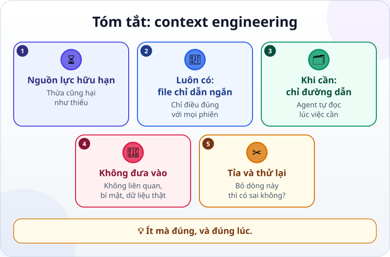

🌐 **Tiếng Việt** · [English](../../en/lessons/context-engineering.md) · [日本語](../../ja/lessons/context-engineering.md)

# Context engineering: đưa đúng thông tin, đúng lúc

<!-- section: objective -->
## Mục tiêu bài học

Sau bài này, bạn sẽ:

- Chia thông tin cho agent vào ba ngăn: **luôn có**, **khi cần**, **không đưa vào**.
- Viết được một file chỉ dẫn ngắn cho dự án, và biết dòng nào nên bỏ.
- Kiểm tra được agent có thật sự làm theo file chỉ dẫn mà không cần bạn nhắc.

<!-- section: hook -->
## Mở đầu: vì sao nên quan tâm?

Hana muốn agent làm báo cáo tuần theo đúng mẫu của phòng. "Cho chắc", cô dán vào đầu mỗi phiên: sổ tay nhân viên 50 trang, ba báo cáo cũ, danh sách thuật ngữ, và cuối cùng một dòng: *"Không ghi tên khách hàng vào báo cáo."*

Kết quả: báo cáo có tên khách hàng.

Agent không cố tình làm trái. Dòng quan trọng nhất bị chìm giữa mấy chục nghìn chữ không liên quan. Nhiều thông tin hơn không làm agent làm tốt hơn — **đúng** thông tin mới làm được.

<!-- section: concept -->
## Nội dung chính

### Context engineering là gì?

Bạn đã biết [cửa sổ ngữ cảnh](context-window.md) là trí nhớ làm việc có giới hạn của agent. **Context engineering** là việc quyết định cái gì được vào đó, và vào lúc nào, để agent có đúng những gì việc cần — không thiếu, không thừa.

Anthropic (9/2025) giải thích vì sao thừa cũng hại: khi ngữ cảnh càng dài, khả năng mô hình nhớ chính xác thông tin trong đó càng giảm. Họ gọi ngữ cảnh là một nguồn lực hữu hạn, và mục tiêu là tìm *tập thông tin nhỏ nhất* mà vẫn giúp việc thành công.

### Ba ngăn



**1. Luôn có — file chỉ dẫn ngắn.** Điều đúng với **mọi** phiên của dự án: thư mục này là gì, không được sửa gì, kiểm tra bằng cách nào, quy ước riêng agent không tự đoán được. Nhiều công cụ đọc một file như vậy ở đầu mỗi phiên — tính đến tháng 9/2026, với Claude Code đó là `CLAUDE.md`. Hướng dẫn của Claude Code khuyên giữ nó ngắn, và với mỗi dòng, hỏi: *"Bỏ dòng này thì agent có làm sai không?"* Không thì cắt. File quá dài khiến agent bỏ qua chính những chỉ dẫn bạn cần.

**2. Khi cần — chỉ đường, đừng dán cả kho.** Tài liệu dài, dữ liệu, báo cáo cũ: đừng dán hết vào đầu phiên. Ghi **đường dẫn** — *"mẫu báo cáo ở `mau/bao_cao_tuan.md`"* — để agent tự mở khi việc cần tới. Anthropic gọi cách này là đưa ngữ cảnh vào *đúng lúc* (just in time): agent giữ những "địa chỉ" nhẹ, và dùng công cụ để đọc nội dung khi cần.

**3. Không đưa vào.** Thứ không liên quan tới việc này. File khổng lồ khi chỉ cần vài dòng. Và những thứ [⛔ không bao giờ](data-safety-and-permissions.md): mật khẩu, API key, dữ liệu thật của công ty hay khách hàng.

### Ngữ cảnh cũng cần dọn

- **Mỗi việc một phiên.** Việc mới không liên quan thì mở phiên mới, để ngữ cảnh không đầy những thứ của việc cũ.
- **Điều phải nhớ lâu thì ghi vào file**, đừng chỉ nói trong cuộc trò chuyện — phiên sau không còn nhớ.
- **File chỉ dẫn cũng cần tỉa.** Agent cứ làm sai một điều dù đã có dòng dặn? Có thể file đã quá dài và dòng đó bị lạc.

<!-- section: try-it -->
## Thử ngay

Khoảng 15 phút, trong `ai-practice`, dữ liệu giả. Dùng thẻ công việc `my-week.html` từ [buổi đầu với agent](first-agent-session.md), hoặc bất kỳ file nào bạn đã làm trong thư mục này. (Đi đường chỉ xem? Làm bước 1 và 3 trên giấy.)

**1. Viết file chỉ dẫn (5 phút).** Tạo file chỉ dẫn mà công cụ của bạn đọc ở đầu phiên (với Claude Code là `CLAUDE.md` trong thư mục `ai-practice`, tính đến 9/2026; công cụ khác có tên riêng — xem tài liệu của nó). Tối đa 5 dòng, chỉ điều đúng với mọi phiên. Ví dụ:

```text
# ai-practice
- Thư mục thực hành, chỉ có dữ liệu giả.
- Không xóa file nào; cần xóa thì hỏi mình trước.
- Ngày viết theo kiểu 30/09/2026.
- Thẻ công việc là my-week.html, chỉ một file, không dùng thư viện ngoài.
- Xong việc thì mở trang và liệt kê đã kiểm tra gì, chưa kiểm tra gì.
```

**2. Thử mà không nhắc (5 phút).** Mở một **phiên mới**. Giao một việc nhỏ mà **không** nhắc lại quy ước nào:

```text
Thêm vào my-week.html một dòng hiện ngày hôm nay.
```

Đọc kết quả: ngày có viết kiểu 30/09/2026 không? Cuối phiên agent có liệt kê đã kiểm tra gì, chưa kiểm tra gì không? Có dòng nào agent làm khác đi không?

**3. Tỉa (5 phút).** Đọc lại từng dòng với câu hỏi *"Bỏ dòng này thì agent có làm sai không?"*. Nếu có một dòng chỉ đúng với một việc — ví dụ "tuần này làm thêm phần ghi chú" — chuyển nó ra khỏi file; lần sau nói trong yêu cầu của việc đó. Nếu agent làm sai một quy ước, sửa câu cho rõ hơn, rồi thử lại ở một phiên mới.

**Bằng chứng:**

- *Tôi cho xem được…* file chỉ dẫn 5 dòng, và kết quả một phiên mới làm đúng quy ước mà tôi không nhắc.
- *Tôi đã kiểm tra…* từng quy ước trong file với kết quả thật (ngày, báo cáo đã kiểm tra gì, không file nào bị xóa).
- *Tôi sẽ không dùng cách này khi…* thông tin chỉ cần cho một việc (thì nói trong yêu cầu), hoặc là bí mật hay dữ liệu thật (thì không đưa vào đâu cả).

<!-- section: misconceptions -->
## Hiểu lầm thường gặp

- **"Càng nhiều ngữ cảnh càng tốt."** — Ngữ cảnh dài làm mô hình nhớ kém chính xác hơn. Thứ không liên quan chiếm chỗ và che mất thứ quan trọng.
- **"Ghi hết mọi thứ vào file chỉ dẫn cho chắc."** — File đó được đọc ở **mọi** phiên. Điều chỉ cần cho một việc thì để trong yêu cầu của việc đó, hoặc trong một file riêng mà agent mở khi cần.
- **"Đã dặn một lần trong trò chuyện là agent nhớ mãi."** — Phiên mới bắt đầu với ngữ cảnh mới. Điều phải nhớ lâu thì ghi vào file.

<!-- section: recap -->
## Tóm tắt bằng hình



<!-- section: takeaways -->
## Ghi nhớ

- Context engineering: quyết định thông tin nào vào ngữ cảnh, và lúc nào.
- Ngữ cảnh là nguồn lực hữu hạn; thừa cũng hại như thiếu.
- Luôn có: file chỉ dẫn ngắn, chỉ điều đúng với mọi phiên.
- Khi cần: chỉ đường dẫn để agent tự đọc lúc cần.
- Không đưa vào: thứ không liên quan, file khổng lồ, bí mật, dữ liệu thật.

<!-- section: quiz -->
## Tự kiểm tra

**Câu 1.** Hana dán 50 trang tài liệu vào đầu phiên, và agent bỏ qua dòng dặn quan trọng nhất. Lý do hợp lý nhất?

- A) Agent cố tình làm trái
- B) Dòng quan trọng bị chìm giữa quá nhiều thông tin không liên quan
- C) Tài liệu viết bằng tiếng Việt

**Câu 2.** Dòng nào **nên** nằm trong file chỉ dẫn đọc ở mọi phiên?

- A) "Tuần này làm thêm phần ghi chú cho báo cáo"
- B) Toàn bộ nội dung sổ tay nhân viên
- C) "Không sửa file trong thư mục du_lieu/"

**Câu 3.** Mẫu báo cáo dài 20 trang, chỉ cần khi làm báo cáo tuần. Cách tốt nhất?

- A) Ghi đường dẫn tới file mẫu, để agent mở khi làm báo cáo
- B) Dán cả 20 trang vào file chỉ dẫn
- C) Không cho agent biết có mẫu

<details>
<summary>Xem đáp án</summary>

1. **B** — ngữ cảnh càng dài, mô hình càng dễ bỏ sót; đúng thông tin quan trọng hơn nhiều thông tin.
2. **C** — nó đúng với mọi phiên; A chỉ đúng với một việc, B quá dài và phần lớn không liên quan.
3. **A** — đưa vào đúng lúc: agent biết chỗ, và chỉ đọc khi việc cần.

</details>

<!-- section: sources -->
## Nguồn tham khảo

- Anthropic — [Effective context engineering for AI agents](https://www.anthropic.com/engineering/effective-context-engineering-for-ai-agents) (tiếng Anh, 9/2025): ngữ cảnh càng dài, khả năng nhớ chính xác càng giảm; coi ngữ cảnh là nguồn lực hữu hạn và tìm tập thông tin nhỏ nhất mà hiệu quả; cách đưa ngữ cảnh vào đúng lúc bằng đường dẫn và công cụ.
- Anthropic — [Best practices for Claude Code](https://code.claude.com/docs/en/best-practices) (tiếng Anh, tính đến 9/2026): `CLAUDE.md` được đọc ở đầu mỗi phiên, nên chỉ ghi điều áp dụng rộng và giữ ngắn; với mỗi dòng, hỏi bỏ nó đi thì Claude có làm sai không; file quá dài khiến Claude bỏ qua chỉ dẫn.
