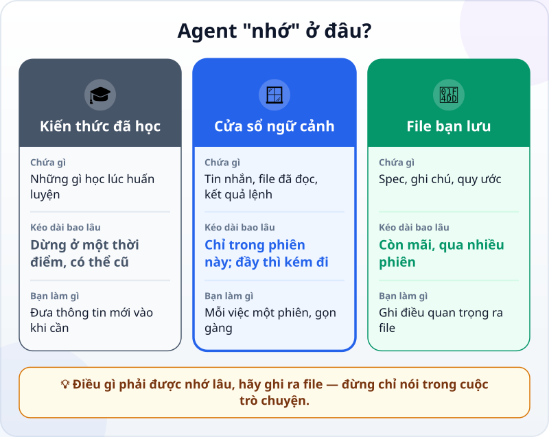
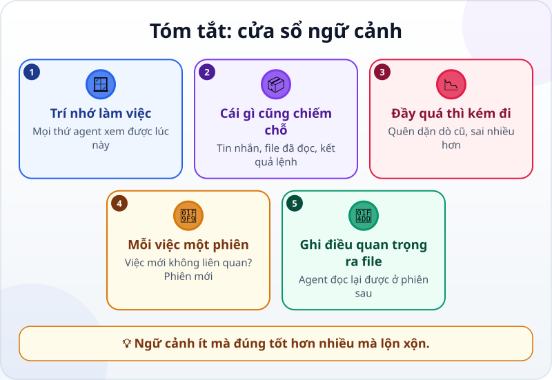

🌐 **Tiếng Việt** · [English](../../en/lessons/context-window.md) · [日本語](../../ja/lessons/context-window.md)

# Cửa sổ ngữ cảnh: trí nhớ ngắn hạn của AI

<!-- section: objective -->
## Mục tiêu bài học

Sau bài này, bạn sẽ:

- Giải thích được **cửa sổ ngữ cảnh**: trí nhớ làm việc của AI, khác với kiến thức nó đã học.
- Biết cái gì chiếm chỗ trong đó, và vì sao đầy quá thì kết quả kém đi.
- Giữ ngữ cảnh gọn: mỗi việc một phiên, điều quan trọng ghi ra file.

<!-- section: hook -->
## Mở đầu: vì sao nên quan tâm?

Tuấn làm việc với agent cả buổi chiều: sửa thẻ tuần, hỏi thêm về một lỗi ở chỗ khác, rồi quay lại thẻ tuần. Đầu buổi anh dặn: *"Không sửa phần lưu dữ liệu."* Cuối buổi, agent sửa đúng phần đó.

Agent không cãi lời — nó "quên". Hướng dẫn của Claude Code nói rõ: phần lớn các thói quen tốt khi làm với agent đều xuất phát từ một giới hạn: cửa sổ ngữ cảnh đầy lên rất nhanh, và càng đầy thì agent càng làm kém đi.

<!-- section: concept -->
## Nội dung chính

### Cửa sổ ngữ cảnh là gì?

Cửa sổ ngữ cảnh là **mọi đoạn chữ mà mô hình xem được khi trả lời** — giống trí nhớ làm việc. Nó khác với lượng dữ liệu khổng lồ mô hình đã học lúc huấn luyện. Trong một phiên làm việc với agent, **mọi thứ đều chiếm chỗ**: tin nhắn của bạn, câu trả lời của agent, mọi file nó đọc, mọi kết quả lệnh nó chạy. Một buổi gỡ lỗi có thể dùng hết hàng chục nghìn token.

### Agent "nhớ" ở đâu?

- **Kiến thức đã học:** rộng nhưng dừng ở một thời điểm, và không biết gì về việc của bạn.
- **Cửa sổ ngữ cảnh:** biết việc của bạn — nhưng chỉ trong phiên này, và có giới hạn.
- **File bạn lưu:** spec, ghi chú, quy ước — còn mãi; agent đọc lại được ở phiên sau.

### Nhiều hơn không có nghĩa là tốt hơn

Tài liệu của Anthropic nói: ngữ cảnh nhiều hơn không tự động tốt hơn — càng nhiều token, độ chính xác và khả năng nhớ lại càng giảm. Khi cửa sổ gần đầy, agent có thể "quên" dặn dò ban đầu hoặc sai nhiều hơn.

### Giữ ngữ cảnh gọn

- **Mỗi việc một phiên.** Xong việc này, định làm việc khác không liên quan? Bắt đầu phiên mới, hoặc xóa ngữ cảnh (ví dụ lệnh `/clear` trong Claude Code).
- **Điều quan trọng ghi ra file.** Ràng buộc như "không sửa phần lưu dữ liệu" nên nằm trong file spec, và nhờ agent đọc file đó đầu mỗi phiên.
- **Chỉ đưa thứ cần thiết.** Đưa đúng file liên quan, không phải cả thư mục.

<!-- section: analogy -->
## Ví dụ đời thường

Cửa sổ ngữ cảnh giống **mặt bàn làm việc**. Kiến thức đã học là những gì bạn học ở trường. Tủ hồ sơ là các file bạn lưu.

Mặt bàn có hạn: càng chất nhiều giấy tờ của đủ việc khác nhau, càng khó tìm đúng tờ cần tìm. Người làm việc giỏi dọn bàn giữa hai việc, và cất giấy tờ quan trọng vào tủ để lấy ra khi cần.

Chỗ chưa khớp: bạn nhìn bàn là biết nó bừa; còn agent không tự báo "bàn tôi bừa rồi" — bạn phải để ý dấu hiệu: nó bắt đầu quên dặn dò, lặp lại lỗi cũ.

<!-- section: example -->
## Ví dụ thực tế

Sau buổi chiều đó, Tuấn đổi cách làm:

1. Anh tạo file `spec-the-tuan.txt`, ghi mục tiêu và các ràng buộc — trong đó có *"Không sửa phần lưu dữ liệu"*.
2. Mỗi việc mới, anh bắt đầu một phiên mới và mở đầu bằng: *"Đọc spec-the-tuan.txt trước khi làm."*
3. Câu hỏi về lỗi ở chỗ khác, anh hỏi trong một phiên riêng.

Kết quả: agent không còn "quên" ràng buộc, và mỗi phiên ngắn, dễ theo dõi hơn.

<!-- section: misconceptions -->
## Hiểu lầm thường gặp

- **"Agent nhớ mọi thứ mình từng nói."** — Nó chỉ nhớ những gì còn trong cửa sổ ngữ cảnh của phiên này. Phiên mới là bắt đầu lại — trừ những gì bạn ghi ra file.
- **"Cửa sổ càng lớn càng tốt, cứ đưa hết vào."** — Ngữ cảnh nhiều không tự động tốt hơn; đưa đúng thứ cần thiết mới tốt.
- **"AI biết cả những chuyện mới xảy ra."** — Kiến thức đã học dừng ở một thời điểm. Việc của bạn và tin mới nhất, nó chỉ biết nếu bạn đưa vào ngữ cảnh hoặc nó có công cụ để tra cứu.

<!-- section: recap -->
## Tóm tắt bằng hình

<!-- section: takeaways -->
## Ghi nhớ

- Cửa sổ ngữ cảnh = trí nhớ làm việc: mọi thứ agent xem được lúc này.
- Tin nhắn, file đã đọc, kết quả lệnh — cái gì cũng chiếm chỗ; đầy quá thì agent quên và sai nhiều hơn.
- Mỗi việc một phiên; việc mới không liên quan thì bắt đầu lại.
- Điều quan trọng thì ghi ra file để agent đọc lại ở phiên sau.

<!-- section: quiz -->
## Tự kiểm tra

**Câu 1.** Cái gì chiếm chỗ trong cửa sổ ngữ cảnh của một phiên làm việc với agent?

- A) Chỉ những tin nhắn bạn gõ
- B) Toàn bộ Internet
- C) Mọi thứ trong phiên: tin nhắn, file agent đã đọc, kết quả lệnh

**Câu 2.** Bạn vừa xong việc A và định làm việc B không liên quan. Nên làm gì?

- A) Bắt đầu một phiên mới
- B) Tiếp tục cùng phiên cho tiện
- C) Dán lại toàn bộ việc A cho chắc

**Câu 3.** Một ràng buộc quan trọng, như "không sửa phần lưu dữ liệu", nên để ở đâu?

- A) Chỉ nói một lần ở đầu một phiên thật dài
- B) Ghi vào file spec, và nhờ agent đọc file đó đầu mỗi phiên
- C) Không cần nói, agent sẽ tự hiểu

Xem đáp án

1. **C** — mọi thứ trong phiên đều chiếm chỗ, không chỉ tin nhắn của bạn.
2. **A** — ngữ cảnh của việc A chỉ làm rối việc B.
3. **B** — file còn qua nhiều phiên; một câu nói giữa cuộc trò chuyện dài có thể bị "quên".

<!-- section: sources -->
## Nguồn tham khảo

- Anthropic — [Context windows](https://platform.claude.com/docs/en/build-with-claude/context-windows) (tiếng Anh): cửa sổ ngữ cảnh là mọi đoạn chữ mô hình xem được khi trả lời — "trí nhớ làm việc", khác với dữ liệu đã học; ngữ cảnh nhiều không tự động tốt hơn, vì càng nhiều token thì độ chính xác và khả năng nhớ lại càng giảm.
- Anthropic — [Best practices for Claude Code](https://code.claude.com/docs/en/best-practices) (tiếng Anh): cửa sổ ngữ cảnh đầy lên nhanh và agent làm kém đi khi nó đầy; xóa ngữ cảnh giữa các việc không liên quan.
- Anthropic — [Effective context engineering for AI agents](https://www.anthropic.com/engineering/effective-context-engineering-for-ai-agents) (tiếng Anh, 9/2025): ngữ cảnh là tài nguyên quan trọng nhưng có hạn; hãy tìm tập thông tin nhỏ nhất mà giá trị nhất.
