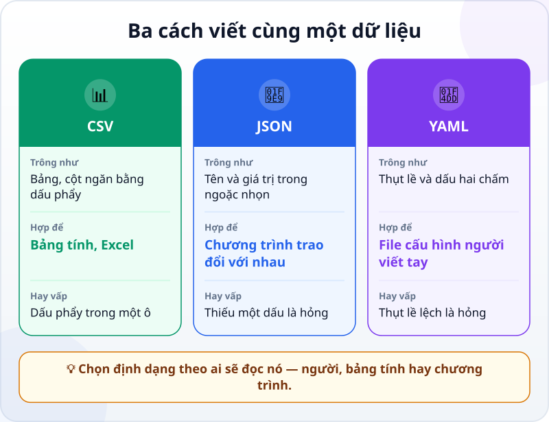
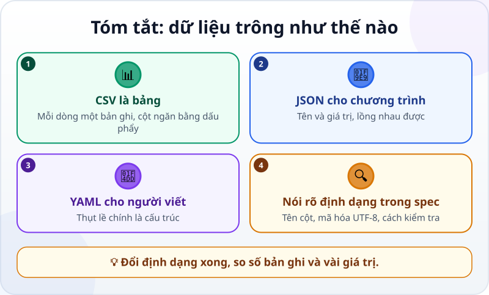

🌐 **Tiếng Việt** · [English](../../en/lessons/data-formats.md) · [日本語](../../ja/lessons/data-formats.md)

# Dữ liệu trông như thế nào: JSON, CSV, YAML

<!-- section: objective -->
## Mục tiêu bài học

Sau bài này, bạn sẽ:

- Nhận ra ba định dạng dữ liệu phổ biến: **CSV**, **JSON**, **YAML**.
- Biết mỗi định dạng hợp với việc gì, và chỗ nào hay vấp.
- Nói rõ định dạng trong spec, và kiểm tra dữ liệu sau khi agent chuyển đổi.

<!-- section: hook -->
## Mở đầu: vì sao nên quan tâm?

Rất nhiều việc bạn giao cho agent là việc với dữ liệu: đọc một bảng, tổng hợp, xuất báo cáo. Agent sẽ hỏi — hoặc tự chọn — định dạng: *"Xuất ra CSV hay JSON?"*

Bạn không cần thuộc cú pháp. Chỉ cần nhìn là nhận ra, biết cái nào hợp với việc của mình, và biết kiểm tra gì sau khi chuyển đổi. (Nhân tiện: dữ liệu của chính khóa học này — mục lục, bảng thuật ngữ, các infographic — được lưu bằng YAML.)

<!-- section: concept -->
## Nội dung chính

### Cùng một dữ liệu, ba cách viết

Hai dòng chi phí của Mai, viết bằng **CSV** — một cái bảng, mỗi dòng một bản ghi, các cột ngăn bằng dấu phẩy:

```text
ngay,hang_muc,so_tien
2026-09-01,Di lai,50000
2026-09-02,An uong,120000
```

Bằng **JSON** — tên và giá trị trong ngoặc nhọn, rất hợp để các chương trình gửi cho nhau:

```json
[
  {"ngay": "2026-09-01", "hang_muc": "Di lai", "so_tien": 50000},
  {"ngay": "2026-09-02", "hang_muc": "An uong", "so_tien": 120000}
]
```

Bằng **YAML** — thụt lề và dấu hai chấm, dễ đọc và dễ viết tay:

```yaml
- ngay: 2026-09-01
  hang_muc: Di lai
  so_tien: 50000
- ngay: 2026-09-02
  hang_muc: An uong
  so_tien: 120000
```

### Mỗi định dạng hợp với việc gì?



- **CSV:** gửi cho người dùng bảng tính. Vấp khi một ô có dấu phẩy (ô đó phải nằm trong dấu ngoặc kép), khi Excel tự đổi `0901…` thành số và làm mất số 0 ở đầu, hoặc khi chữ có dấu bị lỗi hiển thị.
- **JSON:** chương trình đọc và ghi. Chặt chẽ: thiếu một dấu phẩy hay ngoặc là cả file không đọc được.
- **YAML:** file cấu hình mà người viết tay. Thụt lề chính là cấu trúc — lệch một khoảng trắng là sai nghĩa.

### Nói rõ định dạng trong spec

Khi giao việc với dữ liệu, ghi vào spec: định dạng, tên cột, mã hóa (thường là **UTF-8** cho chữ tiếng Việt, tiếng Nhật), và cách kiểm tra. Sau mỗi lần chuyển đổi, **so số bản ghi và vài giá trị** giữa file cũ và file mới.

<!-- section: try-it -->
## Thử ngay

Khoảng 10 phút, với `chi_phi.csv` (20 dòng dữ liệu giả từ bài [viết yêu cầu tốt](writing-good-specs.md)).

**1. Chuyển đổi (3 phút):**

```text
Từ chi_phi.csv, tạo chi_phi.json và chi_phi.yaml chứa cùng dữ liệu. Không sửa chi_phi.csv.
Sau đó viết một phép kiểm tra: số bản ghi trong ba file bằng nhau, và tổng so_tien trong ba file bằng nhau.
Chạy và cho mình xem kết quả.
```

**2. Nhìn tận mắt (3 phút):** mở cả ba file bằng Notepad (Windows) hoặc TextEdit (Mac). Tìm cùng một khoản chi trong cả ba — nó trông thế nào ở mỗi định dạng?

**3. Thử một chỗ hay vấp (4 phút):**

```text
Thêm vào chi_phi.csv một dòng mới: ngày 2026-09-30, hạng mục "An uong, tiep khach", số tiền 300000.
Rồi tạo lại chi_phi.json và chạy lại phép kiểm tra.
```

Mở `chi_phi.csv`: agent có đặt ô có dấu phẩy trong dấu ngoặc kép không? Trong `chi_phi.json`, hạng mục có còn nguyên "An uong, tiep khach" không?

Ghi bằng chứng:

- *Tôi cho xem được…* ba file cùng dữ liệu, và phép kiểm tra báo số bản ghi và tổng tiền khớp nhau.
- *Tôi đã kiểm tra…* một khoản chi trong cả ba file, và ô có dấu phẩy sau khi chuyển đổi.
- *Tôi sẽ không dùng cách này khi…* ví dụ: dữ liệu có mã số bắt đầu bằng 0 mà tôi định mở bằng Excel — khi đó tôi dặn agent giữ chúng ở dạng chữ.

<!-- section: misconceptions -->
## Hiểu lầm thường gặp

- **"CSV là file Excel."** — CSV chỉ là chữ thuần; Excel chỉ là một chương trình mở được nó. Định dạng màu, công thức, nhiều trang tính không được lưu trong CSV.
- **"JSON và YAML chỉ dành cho lập trình viên."** — Chúng là chữ đọc được. Bạn sẽ đọc chúng để kiểm tra agent làm ra gì.
- **"Đổi định dạng thì dữ liệu giữ nguyên."** — Chuyển đổi có thể làm mất số 0 ở đầu, đổi ngày tháng, cắt đôi ô có dấu phẩy, hỏng chữ có dấu. Hãy so số bản ghi và vài giá trị.

<!-- section: recap -->
## Tóm tắt bằng hình



<!-- section: takeaways -->
## Ghi nhớ

- CSV là bảng; JSON cho chương trình; YAML cho file người viết tay.
- Chỗ hay vấp: dấu phẩy trong ô CSV, một dấu thiếu trong JSON, thụt lề lệch trong YAML.
- Ghi rõ định dạng, tên cột và mã hóa (UTF-8) trong spec.
- Sau khi chuyển đổi, so số bản ghi và vài giá trị.

<!-- section: quiz -->
## Tự kiểm tra

**Câu 1.** Bạn cần gửi một bảng cho đồng nghiệp mở bằng Excel. Định dạng nào hợp nhất?

- A) CSV
- B) JSON
- C) YAML

**Câu 2.** Agent vừa đổi `chi_phi.csv` sang JSON. Cách kiểm tra nhanh và đáng tin nhất là gì?

- A) Mở file JSON xem có gọn gàng không
- B) So số bản ghi và vài giá trị giữa hai file
- C) Hỏi agent "đúng chưa?"

**Câu 3.** Vì sao ô "An uong, tiep khach" có thể làm hỏng một file CSV?

- A) Vì CSV không chứa được chữ
- B) Vì chữ quá dài
- C) Vì dấu phẩy là ký tự ngăn cột, nên ô đó phải nằm trong dấu ngoặc kép

<details>
<summary>Xem đáp án</summary>

1. **A** — CSV là bảng, Excel mở được ngay.
2. **B** — số bản ghi và vài giá trị là thứ kiểm tra được, không phải cảm nhận.
3. **C** — không có dấu ngoặc kép, ô đó bị cắt làm hai cột.

</details>
