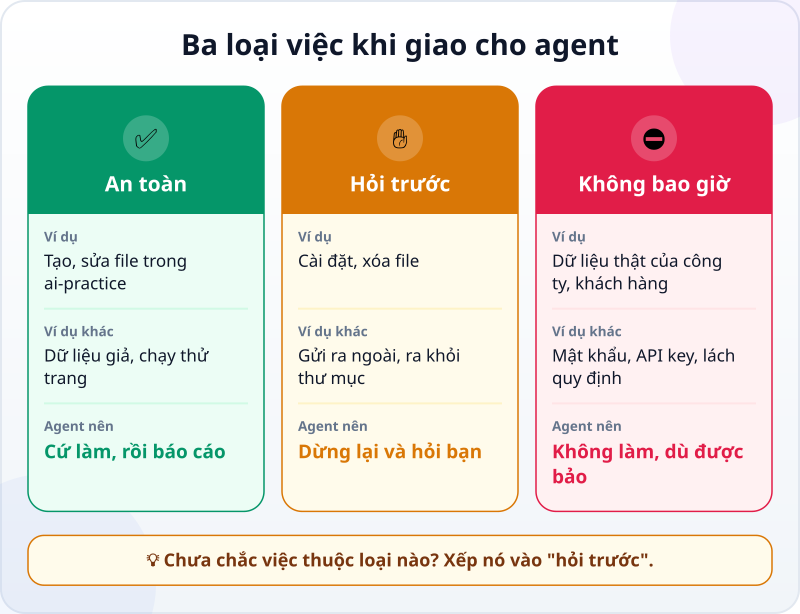
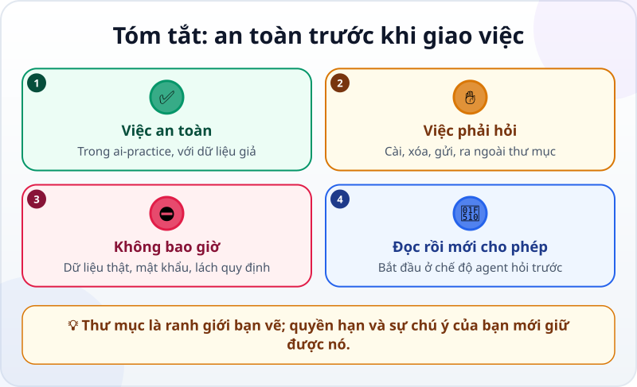

🌐 **Tiếng Việt** · [English](../../en/lessons/data-safety-and-permissions.md) · [日本語](../../ja/lessons/data-safety-and-permissions.md)

# Trước khi để agent làm việc: việc an toàn, việc phải hỏi, việc bị cấm

<!-- section: objective -->
## Mục tiêu bài học

Sau bài này, bạn sẽ:

- Xếp được một việc vào đúng một trong ba loại: ✅ **an toàn**, ✋ **phải hỏi trước**, ⛔ **không bao giờ**.
- Hiểu vì sao thư mục riêng là **ranh giới** bạn vẽ, còn **quyền hạn** của agent mới giữ được ranh giới đó.
- Biết đọc một yêu cầu cho phép của agent trước khi bấm "đồng ý".

<!-- section: hook -->
## Mở đầu: vì sao nên quan tâm?

Agent khác chatbot ở chỗ nó **làm thật**: tạo file, xóa file, chạy lệnh. Việc thật thì hậu quả cũng thật — một file bị xóa nhầm, một bảng lương gửi nhầm người, một mật khẩu lọt ra ngoài.

Tin tốt: bạn không cần là chuyên gia bảo mật. Chỉ cần một thói quen: **trước khi để agent làm, hỏi xem việc đó thuộc loại nào.**

<!-- section: concept -->
## Nội dung chính

### Ba loại việc

- ✅ **An toàn — cứ làm, rồi báo cáo:** tạo và sửa file trong `ai-practice`, dùng dữ liệu giả, chạy thử trang web hay bảng tính bạn vừa làm.
- ✋ **Hỏi trước — agent dừng lại, bạn quyết định:** cài phần mềm hay thư viện, xóa file, gửi thứ gì ra ngoài (email, đăng lên mạng), làm gì bên ngoài thư mục, chạy lệnh bạn không hiểu.
- ⛔ **Không bao giờ — kể cả khi được bảo:** dữ liệu thật của công ty hay khách hàng, mật khẩu và API key (chìa khóa để phần mềm dùng một dịch vụ), tìm cách lách quy định của máy công ty.

Chưa chắc một việc thuộc loại nào? Xếp nó vào ✋ **hỏi trước**.

### Thư mục là ranh giới, quyền hạn là người giữ

Thư mục `ai-practice` là ranh giới bạn vẽ ra. Thứ giữ ranh giới đó là **quyền hạn (permission)**: những gì phần mềm agent cho phép nó tự làm mà không cần hỏi bạn.

Ví dụ, tính đến tháng 9/2026, Claude Code ở chế độ mặc định chỉ tự **đọc**; muốn sửa file hay chạy lệnh, nó phải hỏi bạn trước. Ở chế độ này, nó chỉ ghi được trong thư mục bạn mở, và hỏi trước khi đọc bên ngoài. Các chế độ tự động hơn thì hỏi ít hơn — và ranh giới cũng lỏng hơn.

Vì vậy, khi mới học: **chọn chế độ mà agent hỏi trước**, và đọc kỹ từng yêu cầu.

### Đọc một yêu cầu cho phép

Khi agent hỏi, trả lời ba câu trước khi bấm:

1. **Nó sẽ làm gì?** Cài, xóa, gửi hay chạy lệnh?
2. **Ở đâu?** Trong `ai-practice` hay bên ngoài?
3. **Có làm lại được không?** File đã xóa, email đã gửi thì khó lấy lại.

Không hiểu yêu cầu? Hỏi lại agent: *"Lệnh này làm gì? Có cách nào an toàn hơn không?"*

<!-- section: analogy -->
## Ví dụ đời thường

Hãy nghĩ về một bạn thực tập sinh mới vào văn phòng:

- ✅ **Tự làm được:** photo tài liệu, soạn bản nháp, sắp xếp bàn làm việc của mình.
- ✋ **Phải hỏi:** gửi thư cho khách hàng, hủy tài liệu cũ, dùng máy móc của phòng khác.
- ⛔ **Không bao giờ:** mang hồ sơ khách hàng về nhà, cho người ngoài biết mật khẩu văn phòng.

Chỗ chưa khớp: một bạn thực tập hiểu ngữ cảnh và biết ngần ngại; agent thì không tự biết cái gì là nhạy cảm — trừ khi bạn nói rõ, hoặc quyền hạn chặn nó lại.

<!-- section: example -->
## Ví dụ thực tế

Mai là kế toán ở TP.HCM, ngày nào cũng làm việc với Excel. Cô muốn agent giúp làm báo cáo doanh thu tháng.

1. ⛔ Mai định kéo file thật `DoanhThu_KhachHang_T8.xlsx` vào `ai-practice` — rồi dừng lại: đây là dữ liệu khách hàng thật. Thay vào đó, cô nhờ agent **tạo một file giả** có cùng các cột (ngày, khách hàng, số tiền) với 30 dòng số liệu bịa.
2. ✋ Agent hỏi: *"Tôi cần cài thư viện openpyxl để đọc file Excel. Cho phép không?"* Mai hỏi lại đó là gì, nghe giải thích (một thư viện phổ biến để đọc và ghi file Excel), rồi cho phép **một lần**.
3. ✋ Agent đề nghị xóa file `bao_cao_cu.xlsx` trong thư mục cho gọn. Mai từ chối — xóa rồi khó lấy lại — và bảo agent chuyển nó vào thư mục con `cu`.
4. ✅ Agent làm báo cáo từ dữ liệu giả, mở ra đối chiếu tổng tiền, rồi báo cáo.
5. ✋ Cuối cùng agent gợi ý: *"Tôi có thể gửi báo cáo qua email cho quản lý của bạn."* Mai từ chối: gửi ra ngoài là việc cô tự làm, sau khi đã kiểm tra.

<!-- section: misconceptions -->
## Hiểu lầm thường gặp

- **"Agent hỏi nhiều quá, bật chế độ tự động cho nhanh."** — Chế độ tự động dành cho khi bạn đã hiểu mình đang làm gì. Khi mới học, chính những câu hỏi đó là bài học.
- **"Dữ liệu giả thì không học được gì thật."** — Kỹ năng giống hệt. Dữ liệu giả cùng cột, cùng định dạng là đủ để luyện — và không ai gặp rủi ro.
- **"Dặn agent 'đừng đụng vào file khác' là đủ."** — Lời dặn có ích nhưng không phải lời bảo đảm; quyền hạn và việc bạn đọc kỹ mới là lớp bảo vệ thật. Một file hay trang web cũng có thể chứa những dòng chữ giả làm mệnh lệnh cho agent: nếu agent đề nghị một việc bạn không hề yêu cầu, hãy dừng lại.

<!-- section: recap -->
## Tóm tắt bằng hình

<!-- section: takeaways -->
## Ghi nhớ

- ✅ An toàn: trong `ai-practice`, với dữ liệu giả — agent cứ làm, rồi báo cáo.
- ✋ Hỏi trước: cài, xóa, gửi, ra ngoài thư mục, lệnh bạn không hiểu. Chưa chắc thì xếp vào đây.
- ⛔ Không bao giờ: dữ liệu thật của công ty và khách hàng, mật khẩu và API key, lách quy định.
- Thư mục là ranh giới; quyền hạn và việc bạn đọc kỹ trước khi cho phép mới giữ được nó.

<!-- section: quiz -->
## Tự kiểm tra

**Câu 1.** Agent xin cài một thư viện để đọc file Excel. Việc này thuộc loại nào?

- A) ✅ An toàn
- B) ✋ Hỏi trước
- C) ⛔ Không bao giờ

**Câu 2.** Bạn muốn luyện làm báo cáo với agent. Nên dùng dữ liệu nào?

- A) File doanh thu thật của công ty, cho sát thực tế
- B) File giả có cùng các cột, với số liệu bịa
- C) Ảnh chụp màn hình báo cáo thật

**Câu 3.** Vì sao chỉ có thư mục riêng thì chưa đủ an toàn?

- A) Vì thư mục riêng làm agent chạy chậm
- B) Vì agent được làm gì là do quyền hạn quyết định; tùy chế độ, nó vẫn có thể đọc hay làm việc bên ngoài
- C) Vì agent không dùng được thư mục riêng

Xem đáp án

1. **B** — cài đặt thay đổi máy của bạn, nên agent phải hỏi và bạn quyết định.
2. **B** — dữ liệu giả cùng cấu trúc đủ để luyện; dữ liệu thật, kể cả ảnh chụp, không bao giờ đưa vào bài tập.
3. **B** — thư mục là ranh giới bạn vẽ; quyền hạn mới là thứ giữ nó.

<!-- section: sources -->
## Nguồn tham khảo

- Anthropic — [Security](https://code.claude.com/docs/en/security) (tiếng Anh): ở chế độ mặc định, Claude Code bắt đầu với quyền chỉ đọc và hỏi trước khi sửa file hay chạy lệnh; nó chỉ ghi trong thư mục được mở. Công cụ chỉ có những quyền bạn cấp, và bạn chịu trách nhiệm xem xét trước khi đồng ý.
- Anthropic — [Choose a permission mode](https://code.claude.com/docs/en/permission-modes) (tiếng Anh): bảng các chế độ quyền, và mỗi chế độ cho agent tự làm những gì mà không cần hỏi.
