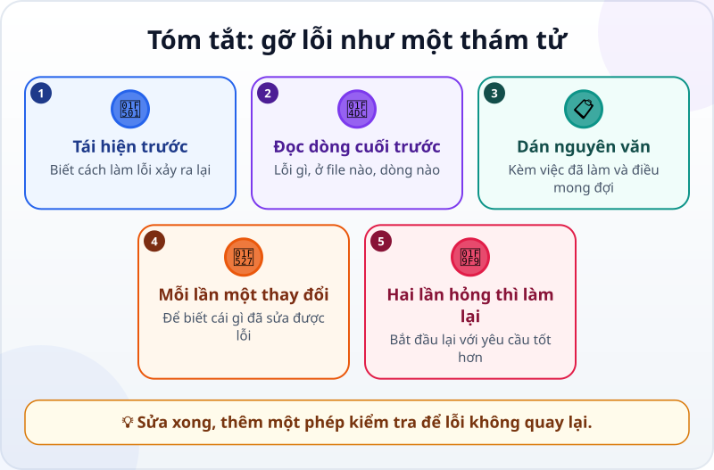

🌐 **Tiếng Việt** · [English](../../en/lessons/errors-and-debugging.md) · [日本語](../../ja/lessons/errors-and-debugging.md)

# Đọc thông báo lỗi và gỡ lỗi như một thám tử

<!-- section: objective -->
## Mục tiêu bài học

Sau bài này, bạn sẽ:

- Đọc một thông báo lỗi: **lỗi gì** và **ở đâu**.
- Gỡ lỗi (debug) cùng agent theo vòng: tái hiện → đọc → đoán nguyên nhân → sửa một chỗ → kiểm chứng.
- Biết khi nào nên dừng sửa tiếp và bắt đầu lại với một yêu cầu tốt hơn.

<!-- section: hook -->
## Mở đầu: vì sao nên quan tâm?

Trong bài [biến "trông có vẻ đúng" thành phép kiểm tra](testing-basics.md), chương trình tổng hợp chi phí của Mai dừng lại với một đoạn chữ lạ khi gặp ô số tiền để trống. Nhiều người thấy thông báo lỗi là tắt đi, hoặc chỉ nói với agent "nó lỗi rồi".

Thật ra thông báo lỗi là **manh mối** — thường chỉ thẳng tới chỗ hỏng. Bạn không cần hiểu hết; chỉ cần đọc đúng hai chỗ, rồi đưa manh mối đó cho agent.

<!-- section: concept -->
## Nội dung chính

### Giải phẫu một thông báo lỗi

```text
Traceback (most recent call last):
  File "tong_hop.py", line 12, in <module>
    tong += int(dong["so_tien"])
ValueError: invalid literal for int() with base 10: ''
```

- **Dòng cuối — lỗi gì:** `ValueError` (sai giá trị): chương trình không đổi được `''` (một ô trống) thành số.
- **Phía trên — ở đâu:** file `tong_hop.py`, dòng 12, đúng câu lệnh cộng tiền.

Với thông báo kiểu Python như trên, hãy đọc **từ dưới lên**. Trang web cũng có chỗ hiện lỗi: trong Chrome hay Edge, nhấn **F12** (Mac: **Cmd+Option+J**) rồi xem thẻ **Console** — lỗi hiện bằng chữ đỏ, kèm tên file và số dòng.

### Vòng gỡ lỗi của thám tử


1. **Tái hiện:** biết chính xác làm gì thì lỗi xảy ra. Không tái hiện được thì chưa sửa được.
2. **Đọc thông báo:** lỗi gì, ở đâu.
3. **Đoán nguyên nhân:** một giả thuyết thôi. Nhờ agent giải thích nguyên nhân **trước khi** sửa.
4. **Sửa một chỗ:** mỗi lần một thay đổi, để biết thay đổi nào có tác dụng.
5. **Kiểm chứng:** làm lại đúng các bước tái hiện. Hết lỗi thì thêm một phép kiểm tra để lỗi không quay lại; còn lỗi thì đi thêm một vòng.

### Báo lỗi cho agent

Dán **nguyên văn** thông báo lỗi — đừng kể lại bằng lời — kèm hai điều: mình đã làm gì, và mong đợi điều gì. Tốt hơn nữa, như hướng dẫn của Claude Code gợi ý: nhờ agent viết một phép kiểm tra tái hiện được lỗi, rồi mới sửa.

### Khi agent sửa mãi không được

Nếu bạn đã sửa lại cho agent hai lần mà vẫn hỏng, cuộc trò chuyện đã đầy những hướng thử thất bại. Hướng dẫn của Claude Code khuyên: dừng lại, bắt đầu một phiên mới, và viết một yêu cầu tốt hơn, gộp những gì bạn đã học được.

<!-- section: example -->
## Ví dụ thực tế

Mai chạy chương trình tổng hợp và nhận thông báo lỗi ở trên. Cô gửi cho agent:

> *"Mình chạy tong_hop.py với chi_phi.csv (dòng 7 có ô so_tien để trống) và nhận lỗi sau: [dán nguyên văn thông báo lỗi]. Mong đợi: ô trống được tính là 0 và được liệt kê trong báo cáo. Trước khi sửa, hãy giải thích nguyên nhân, rồi viết một phép kiểm tra tái hiện lỗi này."*

Agent giải thích: dòng 12 đổi số tiền sang số nguyên, và `''` không phải là số. Nó viết phép kiểm tra — phép kiểm tra thất bại, đúng như lỗi. Nó sửa **một chỗ** — ô trống được tính là 0 và được ghi lại — rồi chạy lại: phép kiểm tra đạt, và bảng tổng hợp có thêm dòng "1 ô số tiền trống (dòng 7)".

<!-- section: try-it -->
## Thử ngay

Khoảng 12 phút: trò chơi thám tử với `my-week.html`.

**1. Để agent giấu một lỗi (2 phút):**

```text
Tạo bản sao my-week-loi.html từ my-week.html, rồi cố tình thêm đúng MỘT lỗi nhỏ
khiến việc đánh dấu không chạy. Đừng nói cho mình biết lỗi ở đâu. Không sửa my-week.html.
```

**2. Tái hiện và đọc (4 phút):** mở `my-week-loi.html` bằng trình duyệt, bấm thử một ô. Nhấn F12 (Mac: Cmd+Option+J), xem thẻ Console, đọc dòng chữ đỏ: lỗi gì, ở file nào, dòng nào?

**3. Báo lỗi như thám tử (4 phút)** — trong một phiên mới, gửi:

```text
Mình mở my-week-loi.html và bấm vào ô của việc đầu tiên. Không có gì xảy ra.
Console báo: [dán nguyên văn dòng lỗi]. Mong đợi: chữ bị gạch ngang.
Trước khi sửa, giải thích nguyên nhân. Sau đó sửa một chỗ duy nhất.
```

**4. Kiểm chứng (2 phút):** làm lại bước 2 — lỗi còn không? Console còn chữ đỏ không?

Ghi bằng chứng:

- *Tôi cho xem được…* thông báo lỗi trước khi sửa, và trang chạy đúng sau khi sửa.
- *Tôi đã kiểm tra…* bằng đúng các bước đã làm lỗi xảy ra, và Console không còn lỗi.
- *Tôi sẽ không dùng cách này khi…* ví dụ: lỗi chỉ thỉnh thoảng mới xảy ra — khi đó tôi cần tìm cách tái hiện chắc chắn trước.

<!-- section: misconceptions -->
## Hiểu lầm thường gặp

- **"Thông báo lỗi là tiếng ngoài hành tinh, bỏ qua đi."** — Chỉ cần đọc hai thứ: lỗi gì (thường ở dòng cuối) và ở đâu (tên file, số dòng).
- **"Cứ bảo agent 'sửa đi' đến khi được."** — Sau hai lần không được, dừng lại và bắt đầu lại với một yêu cầu tốt hơn.
- **"Sửa nhiều chỗ một lúc cho nhanh."** — Sửa nhiều chỗ một lúc thì không biết chỗ nào có tác dụng, chỗ nào gây lỗi mới.

<!-- section: recap -->
## Tóm tắt bằng hình



<!-- section: takeaways -->
## Ghi nhớ

- Thông báo lỗi = manh mối: lỗi gì (dòng cuối), ở đâu (file, số dòng).
- Vòng thám tử: tái hiện → đọc → đoán nguyên nhân → sửa một chỗ → kiểm chứng.
- Báo lỗi cho agent: dán nguyên văn, kèm việc đã làm và điều mong đợi; nhờ giải thích trước khi sửa.
- Hai lần sửa hỏng? Bắt đầu lại với yêu cầu tốt hơn. Sửa xong, thêm phép kiểm tra.

<!-- section: quiz -->
## Tự kiểm tra

**Câu 1.** Với thông báo lỗi kiểu Python ở trên, nên đọc dòng nào trước?

- A) Dòng đầu: `Traceback (most recent call last)`
- B) Một dòng bất kỳ ở giữa
- C) Dòng cuối cùng: loại lỗi và thông điệp

**Câu 2.** Cách báo lỗi nào giúp agent nhất?

- A) Dán nguyên văn thông báo lỗi, kèm việc đã làm và điều mong đợi
- B) "Nó lỗi rồi, sửa đi."
- C) Kể lại lỗi bằng lời của mình, cho ngắn

**Câu 3.** Agent đã sửa hai lần mà lỗi vẫn còn. Nên làm gì?

- A) Tiếp tục bảo "sửa lại" lần thứ ba, thứ tư
- B) Dừng lại, bắt đầu phiên mới với một yêu cầu tốt hơn, gộp những gì đã biết
- C) Bỏ cuộc

<details>
<summary>Xem đáp án</summary>

1. **C** — dòng cuối cho biết lỗi gì; các dòng phía trên cho biết ở đâu.
2. **A** — nguyên văn giữ nguyên manh mối; kể lại bằng lời dễ làm rơi mất chi tiết.
3. **B** — sau hai lần hỏng, cuộc trò chuyện đầy hướng thử thất bại; bắt đầu lại sạch sẽ hiệu quả hơn.

</details>

<!-- section: sources -->
## Nguồn tham khảo

- Anthropic — [Best practices for Claude Code](https://code.claude.com/docs/en/best-practices) (tiếng Anh): khi báo lỗi, mô tả triệu chứng, chỗ có thể hỏng và "đã sửa" trông như thế nào — ví dụ nhờ agent viết một phép kiểm tra tái hiện lỗi rồi mới sửa; nếu đã sửa lại cho agent hai lần mà vẫn sai, hãy bắt đầu lại và viết một yêu cầu tốt hơn, gộp những gì đã học được.
