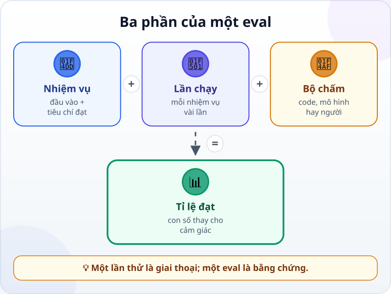
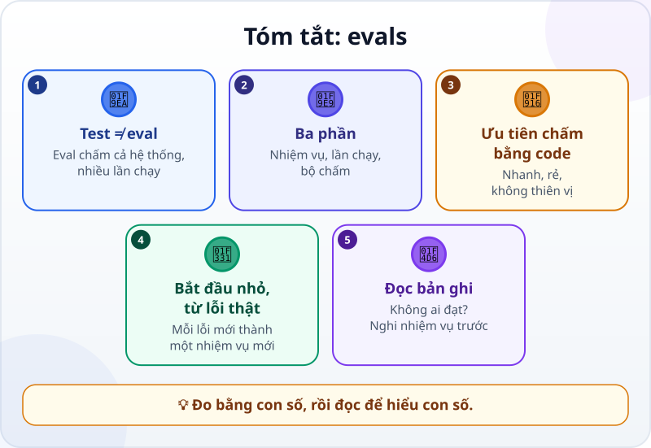

🌐 **Tiếng Việt** · [English](../../en/lessons/evals.md) · [日本語](../../ja/lessons/evals.md)

# Evals: chấm điểm chất lượng agent

<!-- section: objective -->
## Mục tiêu bài học

Sau bài này, bạn sẽ:

- Phân biệt **test** (kiểm tra code) với **eval** (chấm một hệ thống AI qua nhiều nhiệm vụ, nhiều lần chạy).
- Kể được ba phần của một eval: **nhiệm vụ**, **lần chạy**, **bộ chấm** — và ba loại bộ chấm.
- Làm một eval nhỏ để so hai cách viết yêu cầu bằng con số.

<!-- section: hook -->
## Mở đầu: vì sao nên quan tâm?

Mai đang tập với một agent đọc hóa đơn, trên hóa đơn giả. Cô thêm một câu về định dạng ngày vào yêu cầu, thử một hóa đơn — ra đúng — và kết luận *"bản mới tốt hơn"*. Tuần sau, bản mới đọc sai một hóa đơn ghi tiền kiểu *"3,5 triệu"*, thứ bản cũ vẫn đọc đúng.

Một lần thử đúng không nói được bản nào tốt hơn: AI có thể trả lời khác nhau cho cùng một câu hỏi, và một hóa đơn không phải mọi hóa đơn. Mai cần một cách đo **lặp lại được**: nhiều nhiệm vụ, nhiều lần chạy, chấm cùng một cách.

<!-- section: concept -->
## Nội dung chính

### Test và eval

Một [test](tests-and-ci-for-agents.md) kiểm tra **code**: cùng đầu vào, cùng kết quả, đạt hoặc không. Một **eval** (bài đánh giá) kiểm tra **cả hệ thống AI** — mô hình, chỉ dẫn, công cụ — trên nhiều nhiệm vụ. Vì câu trả lời của AI có thể khác nhau, eval chạy mỗi nhiệm vụ **nhiều lần** và đếm tỉ lệ đạt. Anthropic (1/2026) nói gọn: đưa cho AI một đầu vào, rồi áp một cách chấm lên đầu ra để đo thành công.

### Ba phần của một eval



- **Nhiệm vụ (task):** một bài thử với đầu vào và tiêu chí thành công rõ ràng — ví dụ đọc một hóa đơn, trả về ngày và số tiền.
- **Lần chạy (trial):** một lần thử nhiệm vụ; mỗi nhiệm vụ nên chạy vài lần.
- **Bộ chấm (grader):** cách quyết định một lần chạy đạt hay không.
  - **Bằng code** — so khớp chính xác, chạy test, kiểm tra kết quả cuối. Nhanh, rẻ, lần nào cũng chấm như nhau; ưu tiên khi được.
  - **Bằng mô hình** — một AI chấm theo tiêu chí viết sẵn, cho việc khó so khớp chính xác (giọng văn, tóm tắt).
  - **Bằng người** — người hiểu việc chấm, hoặc kiểm tra ngẫu nhiên vài bài. Chậm nhất, nhưng là thước đo cuối cùng.

### Bắt đầu nhỏ, từ lỗi thật

Anthropic khuyên bắt đầu với khoảng 20–50 nhiệm vụ đơn giản **lấy từ lỗi thật**, không chờ đủ hàng trăm. Với người học, năm nhiệm vụ trong `ai-practice` đã là một khởi đầu: mỗi lần AI làm sai, biến lần sai đó thành một nhiệm vụ mới.

### Ba thói quen giữ eval trung thực

- **Đọc bản ghi của lần sai** — toàn bộ những gì xảy ra trong một lần chạy. Không đọc, bạn không biết lỗi ở AI, ở nhiệm vụ hay ở bộ chấm.
- **Chấm kết quả, không chấm từng bước.** Bộ chấm bắt đi đúng một con đường sẽ đánh trượt những cách khác cũng đúng.
- **Không ai đạt thì nghi nhiệm vụ trước.** Anthropic lưu ý: nhiệm vụ thử trăm lần không lần nào đạt thường là nhiệm vụ viết hỏng, không phải agent kém.

<!-- section: try-it -->
## Thử ngay

Khoảng 11 phút, trong `ai-practice`, dữ liệu giả, với agent (hay chatbot được phép dùng — khi đó tự chấm bằng mắt). (Đi đường chỉ xem? Làm bước 1 và đoán kết quả bước 3.)

**1. Nhiệm vụ và đáp án (2 phút).** Tạo `hoa_don.txt`, mỗi dòng một hóa đơn giả:

```text
Hóa đơn số 101, ngày 03/09/2026, tổng cộng 1.250.000 đ
HĐ 102 — 2.400.000 VND — thanh toán ngày 5/9/2026
Ngày 12 tháng 9 năm 2026, hóa đơn 103, số tiền: 980.000 đồng
Hóa đơn 104 ngày 20/09/2026: 3,5 triệu đồng
HĐ 105, 30/9/2026, tạm ứng 500.000 đ, còn lại 1.500.000 đ; tổng 2.000.000 đ
```

Và `dap_an.jsonl` — đáp án đúng, viết trước khi chạy:

```text
{"so": 101, "ngay": "2026-09-03", "tien": 1250000}
{"so": 102, "ngay": "2026-09-05", "tien": 2400000}
{"so": 103, "ngay": "2026-09-12", "tien": 980000}
{"so": 104, "ngay": "2026-09-20", "tien": 3500000}
{"so": 105, "ngay": "2026-09-30", "tien": 2000000}
```

**2. Bộ chấm bằng code (2 phút).** Nhờ agent: *"Viết cham_diem.py, chạy bằng `python cham_diem.py FILE_KET_QUA dap_an.jsonl`: so từng hóa đơn trong dap_an.jsonl với file kết quả theo số hóa đơn, in số hóa đơn đúng và hóa đơn nào sai. Dòng nào không đọc được, hay thiếu hóa đơn nào, thì tính là sai."* Thử trước khi cho AI chạy: chép `dap_an.jsonl` thành `ket_qua_thu.jsonl` rồi chấm — mọi hóa đơn phải đúng. Sửa một con số trong `ket_qua_thu.jsonl` rồi chấm lại — nó phải báo sai đúng hóa đơn đó.

**3. So hai cách viết yêu cầu (5 phút).** Mỗi lần chạy trong một **phiên mới**, ghi kết quả ra file riêng:

- **Cách A:** *"Đọc hoa_don.txt, lấy số hóa đơn, ngày và số tiền, ghi ra ket_qua_A1.jsonl."*
- **Cách B:** *"Đọc hoa_don.txt. Với mỗi dòng, ghi một dòng JSON vào ket_qua_B1.jsonl: so (số nguyên), ngay (dạng YYYY-MM-DD), tien (số nguyên, đơn vị đồng, là TỔNG của hóa đơn). Ví dụ (một hóa đơn không có trong file): {"so": 999, "ngay": "2026-01-15", "tien": 500000}."*

Chạy mỗi cách **hai lần** (A1, A2, B1, B2), rồi chấm cả bốn bằng `cham_diem.py`. Ghi vào bảng: A được bao nhiêu trên 10, B được bao nhiêu trên 10.

**4. Đọc lần sai (2 phút).** Mở lại phiên của một hóa đơn bị sai và đọc: AI hiểu sai ở đâu ("3,5 triệu"? số tạm ứng thay cho tổng?) — lỗi ở yêu cầu, hay ở đáp án của bạn? Nếu mọi lần chạy đều đúng, hãy đọc một lần chạy trên hóa đơn khó nhất (104 hay 105): AI đã quyết định thế nào? Rồi, cho lần sau, thêm một hóa đơn khó hơn vào `hoa_don.txt` và ghi đáp án của nó vào `dap_an.jsonl` trước khi chạy.

**Bằng chứng:**

- *Tôi cho xem được…* năm nhiệm vụ, đáp án, bộ chấm, và bảng điểm của hai cách viết yêu cầu.
- *Tôi đã kiểm tra…* bộ chấm báo sai khi tôi cố ý làm hỏng một đáp án; tôi đã đọc bản ghi của ít nhất một lần sai (hoặc, nếu tất cả đều đúng, một lần chạy trên hóa đơn khó nhất).
- *Tôi sẽ không dùng cách này khi…* chỉ có một hai lần chạy để so (quá ít để kết luận), hay khi nhiệm vụ cần dữ liệu thật của công ty.

<!-- section: misconceptions -->
## Hiểu lầm thường gặp

- **"Thử một lần thấy đúng là đủ."** — AI có thể trả lời khác nhau mỗi lần. Một lần đúng không cho biết tỉ lệ đúng; eval chạy nhiều nhiệm vụ, nhiều lần.
- **"Phải có hàng trăm nhiệm vụ mới gọi là eval."** — Bắt đầu nhỏ, từ những lỗi thật, và thêm dần. Năm nhiệm vụ chấm đúng cách hơn hẳn không có gì.
- **"Điểm thấp nghĩa là AI kém."** — Có thể nhiệm vụ mơ hồ, đáp án sai, hay bộ chấm quá cứng. Đọc bản ghi trước khi kết luận.

<!-- section: recap -->
## Tóm tắt bằng hình



<!-- section: takeaways -->
## Ghi nhớ

- Test kiểm tra code; eval kiểm tra cả hệ thống AI, qua nhiều nhiệm vụ và nhiều lần chạy.
- Eval gồm nhiệm vụ, lần chạy và bộ chấm; ưu tiên bộ chấm bằng code.
- Bắt đầu nhỏ, từ những lỗi thật; mỗi lỗi mới thành một nhiệm vụ mới.
- Đọc bản ghi của lần sai, chấm kết quả chứ không chấm từng bước.
- Không ai đạt thì nghi nhiệm vụ và đáp án trước.

<!-- section: quiz -->
## Tự kiểm tra

**Câu 1.** Vì sao eval chạy mỗi nhiệm vụ nhiều lần?

- A) Vì AI có thể trả lời khác nhau cho cùng một đầu vào
- B) Để mô hình học từ các lần chạy trước và giỏi lên
- C) Vì lần chạy đầu tiên luôn sai

**Câu 2.** Nhiệm vụ "trả về ngày dạng YYYY-MM-DD". Bộ chấm nào phù hợp nhất?

- A) Nhờ một người đọc cảm nhận
- B) Bộ chấm bằng code so khớp chính xác với đáp án
- C) Không cần chấm, nhìn qua là biết

**Câu 3.** Một nhiệm vụ chạy 20 lần, không lần nào đạt. Nên làm gì trước tiên?

- A) Kết luận mô hình không làm được việc này
- B) Chạy thêm 100 lần cho tới khi nó qua được một lần
- C) Đọc bản ghi và kiểm tra lại nhiệm vụ, đáp án và bộ chấm

<details>
<summary>Xem đáp án</summary>

1. **A** — một lần chạy không cho biết tỉ lệ đúng; nhiều lần mới cho.
2. **B** — có đáp án chính xác thì code chấm nhanh, rẻ và lần nào cũng như nhau (miễn là đáp án đúng).
3. **C** — không ai đạt thường là dấu hiệu nhiệm vụ hay bộ chấm có vấn đề.

</details>

<!-- section: sources -->
## Nguồn tham khảo

- Anthropic — [Demystifying evals for AI agents](https://www.anthropic.com/engineering/demystifying-evals-for-ai-agents) (tiếng Anh, 1/2026): eval là đưa cho AI một đầu vào rồi áp cách chấm lên đầu ra; nhiệm vụ, lần chạy, bộ chấm (bằng code, bằng mô hình, bằng người), bản ghi và kết quả; bắt đầu với 20–50 nhiệm vụ đơn giản lấy từ lỗi thật; phải đọc bản ghi; chấm kết quả thay vì từng bước; một nhiệm vụ không bao giờ đạt thường là nhiệm vụ viết hỏng.
