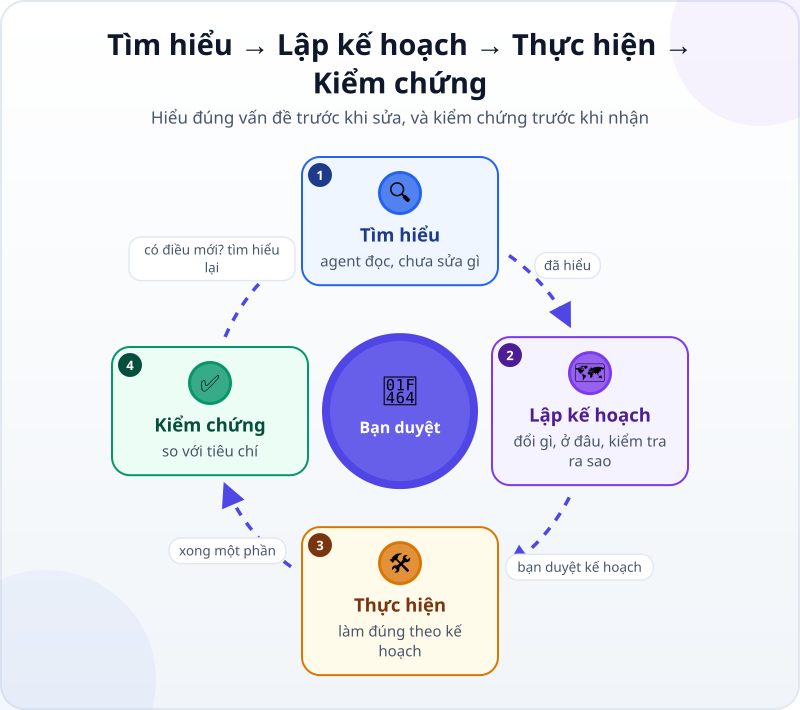
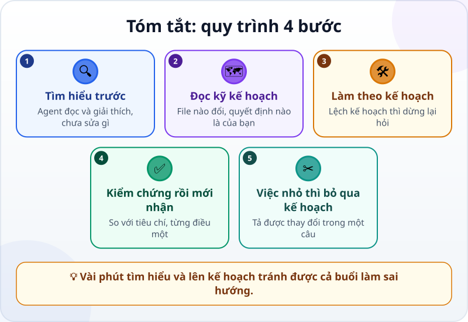

🌐 **Tiếng Việt** · [English](../../en/lessons/explore-plan-build-verify.md) · [日本語](../../ja/lessons/explore-plan-build-verify.md)

# Quy trình 4 bước: Tìm hiểu → Lập kế hoạch → Thực hiện → Kiểm chứng

<!-- section: objective -->
## Mục tiêu bài học

Sau bài này, bạn sẽ:

- Kể được bốn bước **tìm hiểu, lập kế hoạch, thực hiện, kiểm chứng** — và bạn duyệt ở đâu.
- Dùng chế độ lập kế hoạch (plan mode) để agent đề xuất trước khi sửa.
- Đọc một kế hoạch bằng ba câu hỏi, và biết khi nào nên bỏ qua kế hoạch.

<!-- section: hook -->
## Mở đầu: vì sao nên quan tâm?

Agent làm việc rất nhanh — nhanh cả khi làm sai việc. Hướng dẫn của Claude Code cảnh báo: để agent lao ngay vào viết code có thể cho ra code giải một vấn đề sai.

Người làm dự án đã quen điều này: trước khi làm, phải hiểu yêu cầu và thống nhất kế hoạch. Với agent cũng vậy, chỉ là nhanh hơn nhiều.

<!-- section: concept -->
## Nội dung chính

### Bốn bước, và chỗ bạn duyệt



1. **Tìm hiểu:** agent đọc file, đặt câu hỏi, giải thích — **chưa sửa gì**.
2. **Lập kế hoạch:** agent đề xuất sẽ đổi gì, ở file nào, kiểm tra bằng cách nào. **Bạn đọc và duyệt.**
3. **Thực hiện:** agent làm theo kế hoạch đã duyệt. Phải đi khác kế hoạch thì nó nên dừng lại hỏi.
4. **Kiểm chứng:** so với tiêu chí. Có điều mới? Quay lại tìm hiểu.

### Chế độ lập kế hoạch

Nhiều công cụ có chế độ riêng cho hai bước đầu. Ví dụ, tính đến tháng 9/2026, Claude Code có *plan mode*: agent đọc file và viết kế hoạch nhưng không sửa file nào cho đến khi bạn duyệt kế hoạch. Trong ứng dụng Claude, bạn chọn chế độ này ở ô chọn chế độ quyền.

### Đọc một kế hoạch: ba câu hỏi

- **File nào sẽ đổi?** Có file nào bạn không ngờ tới không?
- **Có gì mới được thêm vào?** Thư viện, công cụ, dữ liệu — những việc ✋ phải hỏi trước.
- **Quyết định nào là của bạn?** Kế hoạch thường giấu một lựa chọn, ví dụ dữ liệu được lưu ở đâu. Hãy đọc ra và tự quyết định.

### Khi nào bỏ qua kế hoạch?

Theo hướng dẫn của Claude Code, lập kế hoạch có ích nhất khi bạn chưa chắc nên làm theo cách nào, khi thay đổi đụng nhiều file, hoặc khi bạn chưa quen phần code đó. **Nếu tả được thay đổi trong một câu** — sửa lỗi chính tả, đổi màu tiêu đề — cứ giao thẳng.

<!-- section: try-it -->
## Thử ngay

Khoảng 12 phút, với thẻ `my-week.html` từ [buổi đầu với agent](first-agent-session.md). Việc cần làm: thẻ nhớ các việc đã đánh dấu sau khi tải lại trang. (Đi đường chỉ xem? Đọc từng bước và tự trả lời ba câu hỏi ở bước 2.)

**1. Tìm hiểu (3 phút)** — chuyển sang chế độ lập kế hoạch, rồi gửi:

```text
Mình muốn thẻ my-week.html nhớ các việc đã đánh dấu sau khi tải lại trang.
Trước hết, chỉ đọc my-week.html và giải thích ngắn gọn nó đang hoạt động thế nào. Chưa sửa gì.
```

**2. Lập kế hoạch (3 phút):**

```text
Giờ đề xuất kế hoạch: sẽ đổi gì, ở file nào, dữ liệu lưu ở đâu,
và mình kiểm tra bằng cách nào. Chưa sửa gì.
```

Đọc kế hoạch với ba câu hỏi. Có thể bạn sẽ thấy: các việc đã đánh dấu được lưu **trong trình duyệt của máy này**, nên mở trên máy khác hay trình duyệt khác sẽ không thấy. Chấp nhận được không? Đó là quyết định của bạn.

**3. Thực hiện (3 phút):** duyệt kế hoạch, rồi đọc từng thay đổi trước khi chấp nhận.

**4. Kiểm chứng (3 phút):** đánh dấu 2 việc → tải lại trang → vẫn còn? Bỏ đánh dấu 1 việc → tải lại → đúng chưa? Rồi ghi bằng chứng:

- *Tôi cho xem được…* thẻ vẫn giữ các việc đã đánh dấu sau khi tải lại trang.
- *Tôi đã kiểm tra…* cả đánh dấu lẫn bỏ đánh dấu, lần nào cũng tải lại trang.
- *Tôi sẽ không dùng cách này khi…* cần xem cùng một danh sách trên nhiều máy.

<!-- section: misconceptions -->
## Hiểu lầm thường gặp

- **"Lập kế hoạch tốn thời gian."** — Vài phút đọc kế hoạch rẻ hơn nhiều so với sửa cả buổi làm sai hướng. Nhưng việc tả được trong một câu thì cứ giao thẳng.
- **"Kế hoạch do agent viết thì cứ duyệt."** — Kế hoạch là lúc rẻ nhất để phát hiện một file lạ bị đụng, một thư viện lạ được thêm, hay một quyết định lẽ ra là của bạn.
- **"Kiểm chứng chỉ làm một lần ở cuối."** — Với việc nhiều phần, kiểm chứng sau từng phần; thấy điều mới thì quay lại tìm hiểu.

<!-- section: recap -->
## Tóm tắt bằng hình



<!-- section: takeaways -->
## Ghi nhớ

- Bốn bước: tìm hiểu (chỉ đọc) → lập kế hoạch (bạn duyệt) → thực hiện → kiểm chứng.
- Đọc kế hoạch với ba câu hỏi: file nào đổi, có gì mới thêm vào, quyết định nào là của bạn.
- Tả được thay đổi trong một câu? Bỏ qua kế hoạch, giao thẳng.
- Có điều mới khi kiểm chứng? Quay lại tìm hiểu.

<!-- section: quiz -->
## Tự kiểm tra

**Câu 1.** Việc nào nên giao thẳng, không cần lập kế hoạch?

- A) Sửa một lỗi chính tả trong tiêu đề
- B) Thêm tính năng lưu dữ liệu, đụng nhiều file
- C) Một việc bạn chưa biết nên làm theo cách nào

**Câu 2.** Ở bước tìm hiểu, agent nên làm gì?

- A) Sửa luôn cho nhanh
- B) Cài sẵn các thư viện có thể cần
- C) Đọc file và giải thích, chưa sửa gì

**Câu 3.** Kế hoạch ghi: *"Dữ liệu lưu trong trình duyệt của máy này."* Bạn nên làm gì?

- A) Bỏ qua, vì đó là chi tiết kỹ thuật
- B) Xem điều đó có chấp nhận được với mình không, rồi mới duyệt
- C) Để agent tự quyết

<details>
<summary>Xem đáp án</summary>

1. **A** — tả được trong một câu thì không cần kế hoạch; B và C chính là lúc kế hoạch có ích nhất.
2. **C** — tìm hiểu là chỉ đọc; sửa và cài đặt đến sau, khi bạn đã duyệt kế hoạch.
3. **B** — kế hoạch hay giấu một quyết định; đọc ra và tự quyết là việc của bạn.

</details>

<!-- section: sources -->
## Nguồn tham khảo

- Anthropic — [Best practices for Claude Code](https://code.claude.com/docs/en/best-practices) (tiếng Anh), mục *Explore first, then plan, then code*: tách tìm hiểu và lập kế hoạch khỏi việc viết code để khỏi giải sai vấn đề; lập kế hoạch có ích nhất khi chưa chắc cách làm, khi thay đổi đụng nhiều file, hoặc khi chưa quen phần code đó; tả được thay đổi trong một câu thì bỏ qua kế hoạch.
- Anthropic — [Choose a permission mode](https://code.claude.com/docs/en/permission-modes) (tiếng Anh), mục về plan mode: agent đọc file và viết kế hoạch nhưng không sửa gì cho đến khi bạn duyệt kế hoạch.
