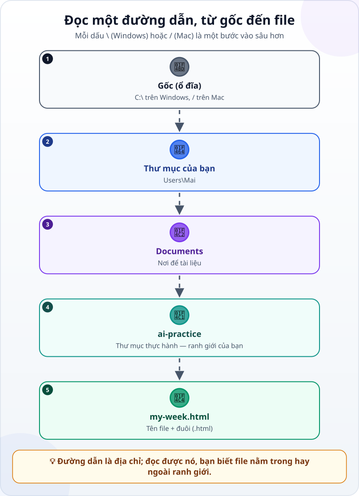
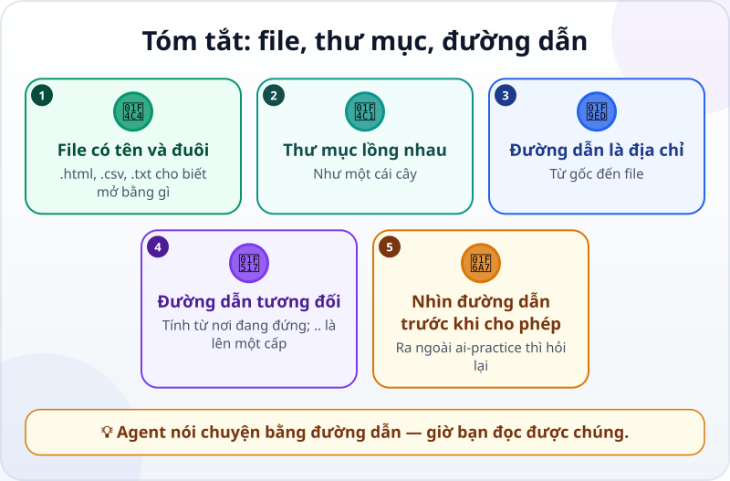

🌐 **Tiếng Việt** · [English](../../en/lessons/files-folders-paths.md) · [日本語](../../ja/lessons/files-folders-paths.md)

# File, thư mục và đường dẫn: tấm bản đồ bên trong máy tính

<!-- section: objective -->
## Mục tiêu bài học

Sau bài này, bạn sẽ:

- Phân biệt **file**, **thư mục** và **đường dẫn**; đọc được một đường dẫn trên Windows và Mac.
- Hiểu **đường dẫn tương đối** và ký hiệu `..` (lên một cấp).
- Dùng đường dẫn để tìm file agent vừa tạo, và để biết một yêu cầu cho phép có nằm trong `ai-practice` hay không.

<!-- section: hook -->
## Mở đầu: vì sao nên quan tâm?

Hana giao việc xong, agent báo: *"Đã tạo `tips/tips.html`."* Cô mở `ai-practice`… không thấy `tips.html` đâu. Hóa ra agent đã tạo thêm một thư mục con tên `tips`, và file nằm trong đó.

Agent nói chuyện bằng đường dẫn: trong báo cáo, trong kế hoạch, trong mỗi yêu cầu cho phép. Đọc được đường dẫn, bạn tìm được file — và thấy ngay khi agent muốn đụng vào thứ nằm ngoài ranh giới.

<!-- section: concept -->
## Nội dung chính

### File và thư mục

- **File** chứa nội dung: một trang web, một bảng tính, một bức ảnh. Tên file có **đuôi** (phần mở rộng) như `.html`, `.csv`, `.txt`, cho máy biết mở file bằng chương trình nào.
- **Thư mục** chứa file và các thư mục khác, lồng vào nhau như một cái cây.

### Đường dẫn: địa chỉ từ gốc đến file



- Windows: `C:\Users\Mai\Documents\ai-practice\my-week.html`
- Mac: `/Users/mai/Documents/ai-practice/my-week.html`

Windows dùng dấu `\`, Mac dùng dấu `/`; ý nghĩa như nhau: mỗi dấu là một bước vào sâu hơn.

### Đường dẫn tương đối

Đường dẫn đầy đủ đi từ gốc. **Đường dẫn tương đối** tính từ thư mục đang đứng. Khi agent làm việc trong `ai-practice`:

- `my-week.html` — file nằm ngay trong `ai-practice`.
- `tips/tips.html` — file trong thư mục con `tips`.
- `../../Desktop/luong.xlsx` — mỗi `..` là **lên một cấp**: ra khỏi `ai-practice` về `Documents`, rồi về `Mai`, rồi vào `Desktop`. Đường dẫn này đã **ra ngoài ranh giới**.

### Đường dẫn và ranh giới an toàn

Mỗi khi agent xin sửa, xóa hay đọc một file, hãy nhìn đường dẫn:

- Nằm trong `ai-practice` → thường là ✅.
- Có `..` đi ra ngoài, hoặc là một đường dẫn đầy đủ không nằm trong `ai-practice` → ✋ hỏi lại vì sao.

Công cụ cũng giúp một tay: ví dụ, ở chế độ mặc định, Claude Code chỉ ghi được trong thư mục bạn mở và các thư mục con của nó.

<!-- section: try-it -->
## Thử ngay

Khoảng 10 phút, trong `ai-practice`.

**1. Bật hiện đuôi file (2 phút).** Nhiều máy ẩn đuôi file theo mặc định.

- Windows 11: mở File Explorer → **View** → **Show** → bật **File name extensions**.
- Mac: Finder → **Settings** → **Advanced** → bật **Show all filename extensions**.

(Tên mục có thể khác một chút tùy phiên bản và ngôn ngữ của máy.)

**2. Lấy đường dẫn đầy đủ của `my-week.html` (2 phút).**

- Windows 11: nhấp chuột phải vào file → **Copy as path**.
- Mac: nhấp chuột phải, giữ phím **Option** → **Copy "my-week.html" as Pathname**.

Dán vào sổ ghi chép và đếm xem có mấy bước từ gốc đến file.

**3. Nhờ agent vẽ cây thư mục (3 phút):**

```text
Liệt kê các file và thư mục trong thư mục này dưới dạng cây,
kèm đường dẫn tương đối của từng file. Chưa sửa gì.
```

So với những gì bạn thấy trong File Explorer hay Finder.

**4. Xếp loại ba đường dẫn (3 phút).** Agent đang làm việc trong `ai-practice` xin ghi vào ba chỗ. Mỗi chỗ thuộc loại nào — ✅, ✋ hay ⛔?

1. `notes/week-2.html`
2. `../../Desktop/luong-thang-9.xlsx`
3. `C:\Windows\System32\drivers\etc\hosts`

<details>
<summary>Gợi ý đáp án</summary>

1. ✅ — nằm trong thư mục con `notes` của `ai-practice`.
2. ✋ — ra ngoài `ai-practice`; hỏi lại vì sao. Nếu đó là bảng lương thật thì là ⛔.
3. ⛔ — một file hệ thống của Windows; bài tập không bao giờ đụng tới.

</details>

Ghi bằng chứng:

- *Tôi cho xem được…* đường dẫn đầy đủ của `my-week.html`, và cây thư mục agent vẽ khớp với máy của tôi.
- *Tôi đã kiểm tra…* từng đường dẫn trong bài tập 4 nằm trong hay ngoài `ai-practice`.
- *Tôi sẽ không dùng cách này khi…* ví dụ: một đường dẫn có tên thư mục lạ mà tôi không nhận ra — khi đó tôi hỏi trước.

<!-- section: misconceptions -->
## Hiểu lầm thường gặp

- **"Desktop là màn hình, không phải thư mục."** — Desktop cũng là một thư mục có đường dẫn, ví dụ `C:\Users\Mai\Desktop`.
- **"Hai file cùng tên là một file."** — `report.csv` ở hai thư mục khác nhau là hai file khác nhau; đường dẫn mới phân biệt được chúng.
- **"Đuôi file chỉ để trang trí."** — Đuôi cho máy biết mở file bằng gì. File tên `report.csv.txt` là file văn bản, không phải CSV — lỗi hay gặp khi máy ẩn đuôi file.

<!-- section: recap -->
## Tóm tắt bằng hình



<!-- section: takeaways -->
## Ghi nhớ

- File có tên và đuôi; thư mục chứa file và thư mục khác, như một cái cây.
- Đường dẫn là địa chỉ từ gốc đến file: `\` trên Windows, `/` trên Mac.
- Đường dẫn tương đối tính từ nơi đang đứng; `..` là lên một cấp.
- Trước khi cho phép, nhìn đường dẫn: ra ngoài `ai-practice` thì hỏi lại vì sao.

<!-- section: quiz -->
## Tự kiểm tra

**Câu 1.** Trong `C:\Users\Mai\Documents\ai-practice\my-week.html`, thư mục chứa trực tiếp file là thư mục nào?

- A) `Users`
- B) `Documents`
- C) `ai-practice`

**Câu 2.** Agent đang làm việc trong `ai-practice`. `..` chỉ tới đâu?

- A) Thư mục cha — ở đây là `Documents`
- B) Thư mục con đầu tiên
- C) Ổ đĩa `C:`

**Câu 3.** Agent xin ghi vào `../../Desktop/luong.xlsx`. Bạn làm gì?

- A) Chấp nhận, vì chỉ là một file
- B) Hỏi lại vì sao: đường dẫn này ra ngoài `ai-practice`
- C) Không cần đọc đường dẫn

<details>
<summary>Xem đáp án</summary>

1. **C** — phần ngay trước tên file là thư mục chứa nó.
2. **A** — `..` là lên một cấp.
3. **B** — hai dấu `..` đưa ra ngoài `ai-practice`, nên đây là việc ✋ phải hỏi.

</details>

<!-- section: sources -->
## Nguồn tham khảo

- Anthropic — [Security](https://code.claude.com/docs/en/security) (tiếng Anh), mục *Working directory boundary*: ở chế độ mặc định, Claude Code chỉ ghi được trong thư mục nơi nó được mở và các thư mục con, không sửa được file ở thư mục cha nếu bạn chưa cho phép.
