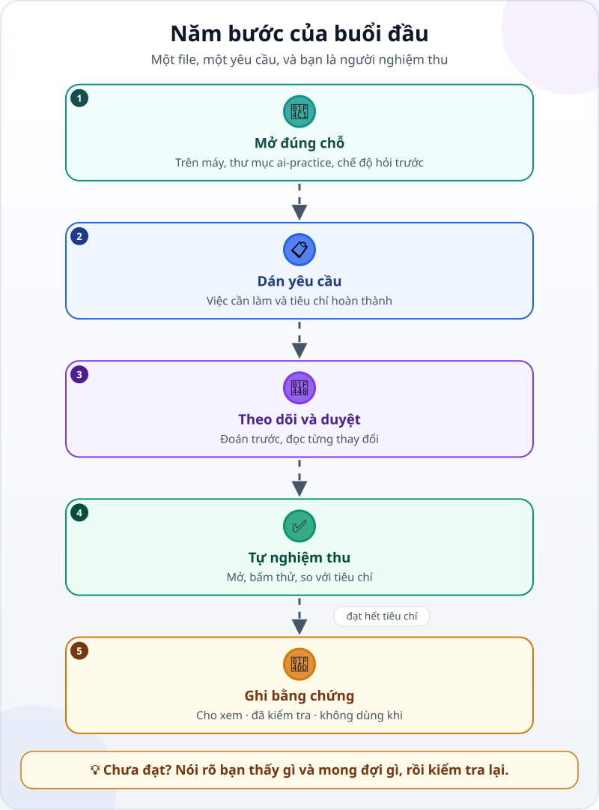
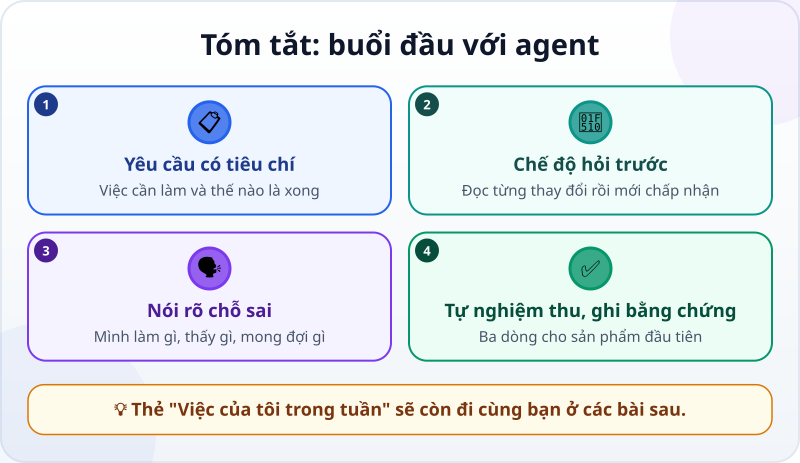

🌐 **Tiếng Việt** · [English](../../en/lessons/first-agent-session.md) · [日本語](../../ja/lessons/first-agent-session.md)

# Buổi đầu với agent: làm một trang "Việc của tôi trong tuần"

<!-- section: objective -->
## Mục tiêu bài học

Sau bài này, bạn sẽ:

- Chạy trọn một phiên làm việc với agent: mở đúng chỗ, giao việc có tiêu chí, duyệt thay đổi, tự nghiệm thu.
- Nói cho agent biết chỗ sai một cách rõ ràng: mình đã làm gì, thấy gì, mong đợi gì.
- Ghi ba dòng bằng chứng cho sản phẩm đầu tiên của mình.

<!-- section: hook -->
## Mở đầu: vì sao nên quan tâm?

Bạn đã [xem agent làm việc](watch-an-agent-build.md), [chọn chỗ thực hành](choose-your-learning-setup.md) và biết [việc nào an toàn, việc nào phải hỏi](data-safety-and-permissions.md). Giờ đến lượt bạn cầm lái.

Sản phẩm hôm nay nhỏ thôi — một file HTML duy nhất, thẻ "Việc của tôi trong tuần" có ô đánh dấu — nhưng bạn sẽ đi qua đủ mọi bước của một buổi làm việc thật với agent. Thẻ này còn đi cùng bạn ở các bài sau.

<!-- section: concept -->
## Nội dung chính

### Năm bước của buổi đầu



1. **Mở đúng chỗ:** chạy agent trên máy của bạn, chọn thư mục `ai-practice`, và chọn chế độ mà agent **hỏi trước** mỗi thay đổi.
2. **Dán yêu cầu:** việc cần làm và tiêu chí hoàn thành — có mẫu sẵn ở phần *Thử ngay*.
3. **Theo dõi và duyệt:** đoán trước bước tiếp theo; đọc từng thay đổi agent đề xuất rồi mới chấp nhận.
4. **Tự nghiệm thu:** mở file bằng trình duyệt, bấm thử, so với từng tiêu chí.
5. **Ghi bằng chứng:** ba dòng — cho xem được gì, đã kiểm tra gì, khi nào không nên dùng.

### Khi kết quả chưa đúng: nói rõ thấy gì, mong đợi gì

"Nó không chạy" là câu agent khó dùng nhất. Hãy nói **mình đã làm gì, thấy gì, mong đợi gì**. Ví dụ:

> *"Mình bấm ô của việc thứ 2 nhưng chữ không bị gạch ngang. Mong đợi: bấm thì chữ bị gạch, bấm lần nữa thì bỏ gạch."*

Câu như vậy cho agent một phép kiểm tra rõ ràng để tự thử lại trước khi báo xong.

<!-- section: try-it -->
## Thử ngay

Khoảng 25 phút. Chỉ dùng dữ liệu giả.

**1. Chuẩn bị (3 phút)** — theo đường bạn đã chọn:

- 💻 **Máy cá nhân:** mở ứng dụng agent trong thư mục `ai-practice`. Ví dụ với ứng dụng Claude (tính đến tháng 9/2026): thẻ **Code** → chọn **Local** → **Select folder** → chọn `ai-practice` → ở ô chọn chế độ quyền, chọn **Manual**: agent đề xuất từng thay đổi và chờ bạn chấp nhận.
- ☁️ **Trình duyệt:** mở một phiên làm việc trên đám mây với kho `ai-practice`.
- 👀 **Chỉ xem:** đọc *nhật ký mẫu* ở cuối phần này, rồi làm bước 3–5 trên giấy.

**2. Dán yêu cầu (2 phút):**

```text
Trong thư mục này, tạo một file duy nhất tên my-week.html: thẻ "Việc của tôi trong tuần".

Yêu cầu:
- Có tiêu đề "Việc của tôi trong tuần" và 5 việc mẫu (bịa ra), mỗi việc có một ô đánh dấu.
- Bấm vào ô thì chữ của việc đó bị gạch ngang; bấm lần nữa thì bỏ gạch.
- Mở được bằng trình duyệt, không cần Internet, không dùng thư viện bên ngoài.

Xong khi:
1. Mở my-week.html bằng trình duyệt thấy tiêu đề và đủ 5 việc.
2. Đánh dấu rồi bỏ đánh dấu từng việc đều đúng.
3. Thu hẹp cửa sổ cỡ màn hình điện thoại, chữ vẫn đọc được.

Trước khi làm, nhắc lại mục tiêu và tiêu chí bằng lời của bạn.
Làm xong, báo cáo đã kiểm tra gì và chưa kiểm tra gì.
```

**3. Theo dõi và duyệt (10 phút):**

- Agent nhắc lại mục tiêu có đúng ý bạn không? Sai thì sửa ngay — đây là lúc rẻ nhất.
- Trước mỗi bước, đoán xem agent sẽ làm gì.
- Với mỗi thay đổi được đề xuất: xem tên file — có phải `my-week.html` trong `ai-practice`? — rồi mới chấp nhận. Agent xin làm một việc ✋ (cài đặt, xóa, ra ngoài thư mục)? Hỏi lại vì sao: bài này không cần những việc đó.

**4. Tự nghiệm thu (5 phút):** mở thư mục `ai-practice`, nhấp đúp `my-week.html`. So với từng tiêu chí: thấy tiêu đề và 5 việc? Đánh dấu rồi bỏ đánh dấu **từng** việc? Thu hẹp cửa sổ vẫn đọc được? Chưa đạt thì nói rõ thấy gì, mong đợi gì, rồi kiểm tra lại.

**5. Ghi bằng chứng (3 phút):**

- *Tôi cho xem được…* file `my-week.html` mở trong trình duyệt, 5 việc đánh dấu được.
- *Tôi đã kiểm tra…* cả 3 tiêu chí, từng việc một, cả khi cửa sổ hẹp.
- *Tôi sẽ không dùng cách này khi…* ví dụ: cần giữ việc đã đánh dấu sau khi tải lại trang — thẻ này chưa làm được.

Muốn thử thêm? Gửi một yêu cầu nữa để thẻ nhớ việc đã đánh dấu sau khi tải lại trang — kèm tiêu chí của riêng bạn.

<details>
<summary>Nhật ký mẫu (cho đường chỉ xem)</summary>

1. Agent nhắc lại: tạo một file `my-week.html`, 5 việc mẫu có ô đánh dấu, 3 tiêu chí.
2. Agent xem thư mục: chỉ có `README.txt`.
3. Agent đề xuất tạo `my-week.html`; bạn đọc tên file và chấp nhận.
4. Agent mở trang thử: bấm từng ô thì chữ bị gạch, bấm lại thì bỏ gạch; thu hẹp cửa sổ, chữ vẫn đọc được.
5. Báo cáo: *"Đã tạo `my-week.html`. Đã kiểm tra: 3 tiêu chí. Chưa kiểm tra: trên điện thoại thật; việc đã đánh dấu sẽ mất khi tải lại trang."*

**Câu hỏi cho bạn:** trước khi tin báo cáo này, bạn sẽ tự kiểm tra những gì?

</details>

<!-- section: misconceptions -->
## Hiểu lầm thường gặp

- **"Yêu cầu càng ngắn càng tốt, agent tự hiểu."** — Ngắn mà thiếu tiêu chí thì agent phải đoán; đoán sai thì bạn mất thời gian sửa.
- **"Phải đọc hiểu hết code mới nghiệm thu được."** — Chưa cần. Hôm nay bạn nghiệm thu bằng hành vi: mở, bấm, so với tiêu chí. Đọc từng thay đổi trong code là kỹ năng bạn sẽ học sau.
- **"Agent làm sai lần đầu nghĩa là mình giao việc dở."** — Làm thêm một hai vòng là bình thường. Quan trọng là mỗi vòng bạn nói rõ thấy gì, mong đợi gì.

<!-- section: recap -->
## Tóm tắt bằng hình



<!-- section: takeaways -->
## Ghi nhớ

- Một buổi làm việc: mở đúng chỗ → dán yêu cầu có tiêu chí → theo dõi và duyệt → tự nghiệm thu → ghi bằng chứng.
- Khi mới học, chọn chế độ agent hỏi trước và đọc từng thay đổi rồi mới chấp nhận.
- Chưa đạt? Nói rõ mình đã làm gì, thấy gì, mong đợi gì.
- Buổi đầu thành công khi **bạn** kiểm tra được kết quả, không phải khi agent báo xong.

<!-- section: quiz -->
## Tự kiểm tra

**Câu 1.** Chế độ quyền nào hợp nhất cho buổi đầu?

- A) Chế độ tự động hoàn toàn, cho nhanh
- B) Chế độ agent đề xuất từng thay đổi và chờ bạn chấp nhận
- C) Chế độ nào cũng được, không quan trọng

**Câu 2.** Câu nào giúp agent sửa lỗi nhanh nhất?

- A) "Nó không chạy."
- B) "Làm lại từ đầu đi."
- C) "Mình bấm ô việc thứ 2 nhưng chữ không bị gạch; mong đợi là chữ bị gạch ngang."

**Câu 3.** Agent báo đã xong. Bạn làm gì tiếp theo?

- A) Mở file, thử từng tiêu chí, rồi ghi bằng chứng
- B) Tin báo cáo và chuyển sang việc khác
- C) Xóa file đi cho gọn thư mục

<details>
<summary>Xem đáp án</summary>

1. **B** — khi mới học, đọc từng thay đổi trước khi chấp nhận chính là cách học.
2. **C** — nói rõ đã làm gì, thấy gì, mong đợi gì cho agent một phép kiểm tra cụ thể.
3. **A** — báo cáo của agent là điểm bắt đầu; bước nghiệm thu là của bạn.

</details>

<!-- section: sources -->
## Nguồn tham khảo

- Anthropic — [Get started with the desktop app](https://code.claude.com/docs/en/desktop-quickstart) (tiếng Anh): cài ứng dụng, mở thẻ *Code*, chọn *Local* và thư mục; ở chế độ *Manual*, agent đề xuất từng thay đổi và chờ bạn chấp nhận hoặc từ chối.
- Anthropic — [Best practices for Claude Code](https://code.claude.com/docs/en/best-practices) (tiếng Anh): nêu cụ thể bối cảnh trong yêu cầu, và cho agent một cách để tự kiểm tra việc mình làm.
