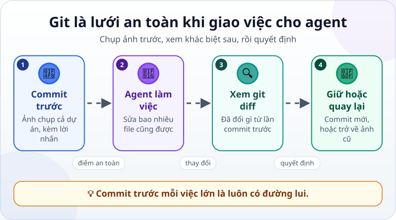
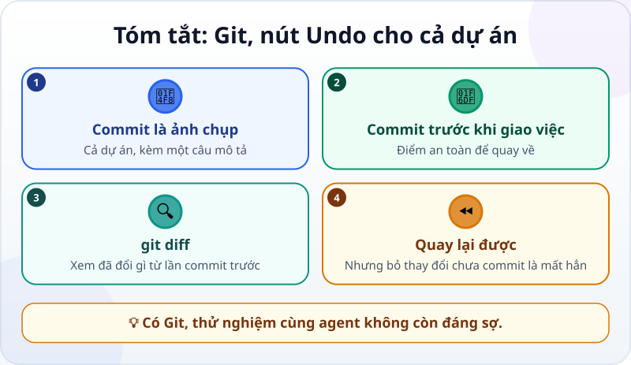

🌐 **Tiếng Việt** · [English](../../en/lessons/git-version-control.md) · [日本語](../../ja/lessons/git-version-control.md)

# Git: nút Undo thần kỳ cho cả dự án

<!-- section: objective -->
## Mục tiêu bài học

Sau bài này, bạn sẽ:

- Hiểu **Git** và **commit**: ảnh chụp cả dự án, kèm lời nhắn.
- Commit trước khi giao việc cho agent, xem **git diff**, rồi giữ lại hoặc quay về.
- Biết việc nào trong Git là ✋ phải cân nhắc: bỏ thay đổi chưa commit là mất hẳn.

<!-- section: hook -->
## Mở đầu: vì sao nên quan tâm?

Agent sửa nhanh và sửa nhiều: một yêu cầu có thể đụng tới vài file cùng lúc. Nút Undo trong trình soạn thảo chỉ nhớ từng file, và mất khi bạn đóng ứng dụng.

Git thì khác: nó chụp lại **cả dự án** tại một thời điểm, và bạn quay về được bất cứ lúc nào. Trong [trang web cá nhân](project-personal-page.md), bạn đã làm ra một thứ đáng giữ. Từ bài này, mọi thứ trong `ai-practice` đều có đường lui.

<!-- section: concept -->
## Nội dung chính

### Commit: ảnh chụp cả dự án

Một **commit** lưu trạng thái của mọi file trong thư mục tại một thời điểm, kèm một câu mô tả — ví dụ *"Thêm việc 'Dọn bàn làm việc' vào thẻ tuần"*. Chuỗi commit là lịch sử của dự án: bạn xem lại được, so sánh được, quay về được. Git chạy ngay trên máy bạn; không cần Internet.

### Lưới an toàn khi giao việc



1. **Commit trước:** trước mỗi việc lớn, chụp một ảnh — đó là điểm an toàn.
2. **Agent làm việc:** sửa bao nhiêu file cũng được.
3. **Xem `git diff`:** so với lần commit trước, đã đổi gì — giống diff bạn đã học đọc.
4. **Giữ hoặc quay lại:** vừa ý thì commit mới; không vừa ý thì trở về ảnh cũ.

### Bạn không cần thuộc lệnh

Agent gõ lệnh Git thay bạn: `git init` (biến thư mục thành kho Git), `git commit` (chụp ảnh), `git log` (xem lịch sử), `git diff` (xem khác biệt), `git restore` (trả một file về bản đã commit). Việc của bạn là biết **khi nào** cần mỗi việc — và đọc kỹ trước khi cho phép.

### Việc cần cân nhắc

- **Bỏ thay đổi chưa commit là mất hẳn.** `git restore` đưa file về bản đã commit; những gì sửa sau đó và chưa commit sẽ không lấy lại được. Muốn giữ gì, commit trước. Đây là việc ✋ phải hỏi.
- **Cài Git là việc ✋ hỏi trước.** Trên Windows, hướng dẫn của Claude Code (tính đến tháng 9/2026) khuyên cài Git for Windows; không có nó, Claude Code dùng PowerShell thay thế.

<!-- section: example -->
## Ví dụ thực tế

Tuấn đã commit thẻ tuần với lời nhắn *"Thẻ tuần nhớ việc đã đánh dấu"*. Rồi anh nhờ agent *"làm cho thẻ đẹp hơn"* — một yêu cầu mơ hồ. Agent đổi màu, đổi bố cục, và… tính năng nhớ việc đã đánh dấu không chạy nữa.

Tuấn xem `git diff`: hơn 80 dòng thay đổi, cả phần lưu dữ liệu cũng bị viết lại. Anh quyết định quay về: agent hỏi lại vì thay đổi chưa commit sẽ mất, Tuấn đồng ý, và thẻ trở về đúng bản đã commit trong vài giây. Lần này anh viết spec rõ ràng: *"Chỉ đổi màu nền và phông chữ; không sửa phần lưu dữ liệu."*

<!-- section: try-it -->
## Thử ngay

Khoảng 15 phút, trong `ai-practice`, ở chế độ agent hỏi trước.

**1. Kiểm tra Git (2 phút):**

```text
Kiểm tra máy đã có Git chưa (git --version). Nếu chưa có, hướng dẫn mình cách cài; đừng tự cài.
```

**2. Commit đầu tiên (3 phút):**

```text
Biến thư mục này thành một kho Git, rồi tạo commit đầu tiên với tất cả file hiện có,
lời nhắn: "Bản đầu tiên: thẻ tuần và trang cá nhân". Cho mình xem git log.
```

**3. Để agent đổi một thứ (3 phút):** *"Đổi màu nền của my-week.html sang xanh nhạt."* Chưa commit.

**4. Xem khác biệt (2 phút):** *"Cho mình xem git diff."* Đọc: đổi đúng một chỗ chứ?

**5. Quay lại (3 phút):** giả sử bạn không thích màu mới: *"Bỏ thay đổi vừa rồi ở my-week.html, trả về bản đã commit."* Agent nên nói rõ thay đổi sẽ mất và hỏi bạn. Mở file kiểm tra: đã về như cũ?

**6. Giữ một thay đổi (2 phút):** nhờ agent thêm một việc bạn muốn giữ vào thẻ, rồi commit với lời nhắn rõ ràng. `git log` giờ có hai commit.

Ghi bằng chứng:

- *Tôi cho xem được…* `git log` với hai commit, và file đã quay về đúng bản cũ ở bước 5.
- *Tôi đã kiểm tra…* `git diff` trước khi quyết định giữ hay bỏ.
- *Tôi sẽ không dùng cách này khi…* ví dụ: tôi chưa commit những gì muốn giữ — khi đó tôi commit trước rồi mới quay lại.

**Thử thách thêm (tùy chọn):** muốn đưa trang cá nhân lên mạng, bạn có thể đẩy kho Git lên một dịch vụ như GitHub và bật tính năng xuất bản trang web của nó. Nhờ agent lập kế hoạch từng bước và đọc thật kỹ: đây là việc ✋ gửi ra ngoài, và trang sẽ công khai.

<!-- section: misconceptions -->
## Hiểu lầm thường gặp

- **"Git là GitHub."** — Git chạy trên máy bạn. GitHub là một trang web lưu kho Git trên mạng. Bạn dùng Git được mà không cần GitHub.
- **"Có nút Undo trong trình soạn thảo là đủ."** — Undo chỉ nhớ từng file và mất khi đóng ứng dụng; commit chụp cả dự án và còn mãi.
- **"Commit càng ít càng gọn."** — Commit nhỏ và thường xuyên, với lời nhắn rõ ràng, giúp bạn quay về đúng chỗ mình cần.

<!-- section: recap -->
## Tóm tắt bằng hình



<!-- section: takeaways -->
## Ghi nhớ

- Commit = ảnh chụp cả dự án, kèm một câu mô tả.
- Commit trước mỗi việc lớn; xem `git diff`; vừa ý thì commit mới, không thì quay lại.
- Bỏ thay đổi chưa commit là mất hẳn — việc ✋ phải cân nhắc.
- Agent gõ lệnh Git; bạn quyết định khi nào và đọc kỹ trước khi cho phép.

<!-- section: quiz -->
## Tự kiểm tra

**Câu 1.** Commit là gì?

- A) Một bản sao lưu tự động lên mạng
- B) Ảnh chụp cả dự án tại một thời điểm, kèm lời nhắn
- C) Một lệnh xóa file cũ

**Câu 2.** Khi nào nên commit?

- A) Chỉ khi dự án xong hẳn
- B) Mỗi tháng một lần
- C) Trước khi giao cho agent một việc lớn, và sau mỗi thay đổi bạn muốn giữ

**Câu 3.** `git restore my-week.html` làm gì với những thay đổi chưa commit của file đó?

- A) Bỏ chúng, trả file về bản đã commit — những thay đổi đó mất hẳn
- B) Lưu chúng thành một commit mới
- C) Đẩy chúng lên GitHub

<details>
<summary>Xem đáp án</summary>

1. **B** — commit chụp cả dự án; nó nằm trên máy bạn, không tự lên mạng.
2. **C** — commit trước để có điểm an toàn, và sau để giữ những gì vừa ý.
3. **A** — vì vậy đây là việc ✋ phải hỏi: muốn giữ gì, commit trước.

</details>

<!-- section: sources -->
## Nguồn tham khảo

- Anthropic — [Best practices for Claude Code](https://code.claude.com/docs/en/best-practices) (tiếng Anh): quy trình khuyên dùng kết thúc bằng việc nhờ agent commit kèm lời nhắn mô tả rõ ràng.
- Anthropic — [Advanced setup](https://code.claude.com/docs/en/setup) (tiếng Anh): trên Windows, nên cài Git for Windows để Claude Code dùng được công cụ Bash; nếu không có, Claude Code dùng PowerShell.
