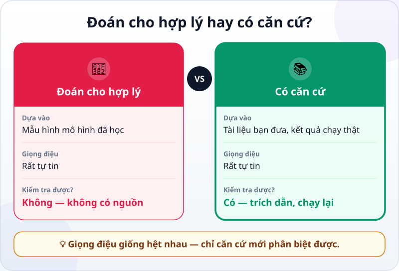
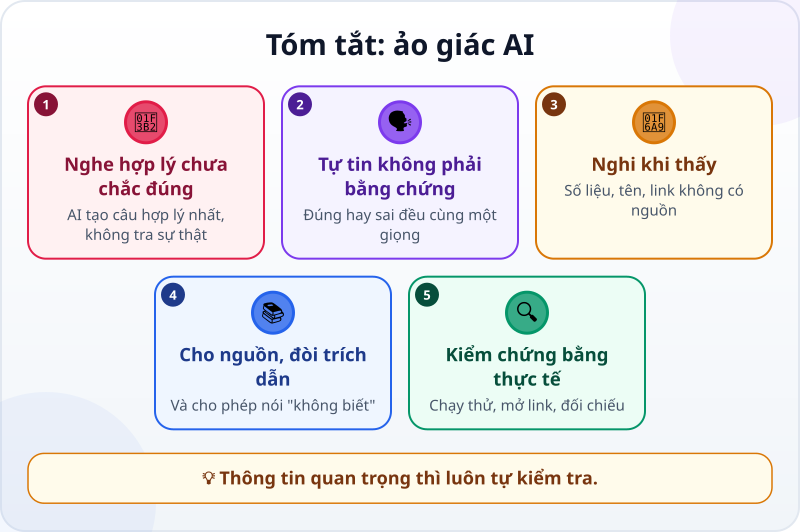

🌐 **Tiếng Việt** · [English](../../en/lessons/hallucination.md) · [日本語](../../ja/lessons/hallucination.md)

# Ảo giác AI: vì sao AI tự tin nói sai

<!-- section: objective -->
## Mục tiêu bài học

Sau bài này, bạn sẽ:

- Giải thích được **ảo giác AI** là gì và vì sao nó xảy ra.
- Nhận ra các dấu hiệu nên nghi: số liệu, tên, đường link không có nguồn.
- Dùng được vài cách giảm và bắt ảo giác: đưa nguồn, đòi trích dẫn, cho phép nói "không biết", kiểm chứng bằng thực tế.

<!-- section: hook -->
## Mở đầu: vì sao nên quan tâm?

Trong [dự án trang web cá nhân](project-personal-page.md), bạn đã đặt một luật: nội dung về bạn thì bạn viết, vì agent có thể bịa rất tự tin những điều nghe hợp lý. Bài này giải thích vì sao.

Ngay cả những mô hình ngôn ngữ tiên tiến nhất đôi khi vẫn tạo ra thông tin sai, hay không khớp với tài liệu bạn đưa — Anthropic, công ty làm ra Claude, nói vậy trong chính tài liệu hướng dẫn của mình. Biết khi nào nên nghi là kỹ năng giám sát quan trọng nhất.

<!-- section: concept -->
## Nội dung chính

### Vì sao AI tự tin nói sai?

Mô hình ngôn ngữ tạo ra câu trả lời **nghe hợp lý nhất** dựa trên những mẫu hình nó đã học — nó không tra cứu sự thật, trừ khi có công cụ hay tài liệu để dựa vào. Nghe hợp lý không có nghĩa là đúng. Và giọng văn thì trôi chảy, tự tin như nhau, dù câu trả lời đúng hay sai.

### Dấu hiệu nên nghi

- Một **con số rất cụ thể** mà không có nguồn ("74% nhân viên…").
- **Tên riêng, tên hàm, tên thư viện** lạ mà bạn chưa từng thấy.
- **Đường link hay trích dẫn** nghe rất thật — mở ra mới biết có tồn tại không.
- Thông tin về **bạn hay công ty bạn** mà bạn chưa hề đưa cho nó.

### Cách giảm và bắt ảo giác

Hướng dẫn của Anthropic gợi ý:

- **Cho phép nói "không biết":** ghi rõ trong yêu cầu *"Nếu không chắc, hãy nói không biết."*
- **Đưa tài liệu, chỉ dùng tài liệu đó:** *"Chỉ dựa vào file này, không dùng kiến thức chung."*
- **Đòi trích dẫn nguyên văn:** mỗi ý phải kèm câu trích từ tài liệu; không tìm được trích dẫn thì bỏ ý đó.
- **Hỏi lại và so sánh:** hỏi cùng một câu vài lần; các câu trả lời mâu thuẫn nhau là dấu hiệu đáng nghi.

Với agent, còn một cách mạnh hơn: **kiểm chứng bằng thực tế.** Một hàm bịa ra sẽ lộ ngay khi chạy thử; một đường link bịa sẽ không mở được. Đó là lý do bạn đã học chạy thử, đọc lỗi và viết phép kiểm tra. Nhưng các cách trên chỉ giảm, không xóa hết ảo giác: thông tin quan trọng thì luôn tự kiểm tra.

<!-- section: analogy -->
## Ví dụ đời thường

Hãy tưởng tượng một đồng nghiệp mới rất lanh lợi, không bao giờ nói "tôi không biết". Hỏi gì cũng trả lời ngay, trôi chảy — thường là đúng, nhưng thỉnh thoảng là tự nghĩ ra. Dần dần, bạn học cách hỏi lại: *"Anh lấy thông tin này ở đâu?"*

Chỗ chưa khớp: người đồng nghiệp đó biết mình đang đoán; mô hình ngôn ngữ thì không phân biệt được lúc mình đoán với lúc mình biết.

<!-- section: example -->
## Ví dụ thực tế

Hana nhờ agent thêm vào trang mẹo một câu: *"Người làm văn phòng ở Nhật kiểm tra email bao nhiêu lần mỗi ngày?"* Agent viết: *"Trung bình 74 lần mỗi ngày (theo một khảo sát năm 2023)."*

Nghe rất thật — và không có nguồn. Hana hỏi lại: *"Khảo sát nào? Cho mình đường link."* Agent không đưa ra được nguồn nào kiểm chứng được. Hana bỏ con số đó, thay bằng một mẹo không cần số liệu: *"Chọn hai khung giờ cố định để trả lời email."* Luật của cô từ nay: **số liệu không có nguồn kiểm chứng được thì không đưa lên trang.**

<!-- section: misconceptions -->
## Hiểu lầm thường gặp

- **"AI nói chắc chắn thì đúng."** — Giọng tự tin như nhau khi đúng và khi sai. Tự tin không phải bằng chứng.
- **"Có đường link là có nguồn."** — Đường link cũng có thể bịa. Mở ra và đọc xem nó có nói đúng điều đó không.
- **"Mô hình mới hơn sẽ hết ảo giác."** — Theo chính Anthropic, các cách trên giảm đáng kể nhưng không xóa hết ảo giác; thông tin quan trọng vẫn phải kiểm tra.

<!-- section: recap -->
## Tóm tắt bằng hình

<!-- section: takeaways -->
## Ghi nhớ

- Ảo giác: AI nói điều sai hoặc bịa đặt như thể là sự thật, vì nó tạo câu nghe hợp lý nhất.
- Giọng tự tin không phải bằng chứng; chỉ căn cứ mới phân biệt được đúng sai.
- Nghi số liệu, tên, link không có nguồn; đưa tài liệu, đòi trích dẫn, cho phép nói "không biết".
- Kiểm chứng bằng thực tế — chạy thử, mở link, đối chiếu — nhất là với thông tin quan trọng.

<!-- section: quiz -->
## Tự kiểm tra

**Câu 1.** Vì sao AI có thể nói sai mà vẫn rất tự tin?

- A) Vì nó cố ý đánh lừa bạn
- B) Vì mạng Internet bị chậm
- C) Vì nó tạo ra câu nghe hợp lý nhất; nghe hợp lý chưa chắc là đúng

**Câu 2.** Dấu hiệu nào đáng nghi nhất?

- A) Một con số rất cụ thể mà không có nguồn
- B) Một câu trả lời ngắn
- C) Một câu trả lời có gạch đầu dòng

**Câu 3.** Bạn hỏi AI về nội dung một tài liệu (giả) của công ty. Cách nào giúp giảm ảo giác nhất?

- A) Hỏi dồn dập thật nhiều câu
- B) Đưa tài liệu, yêu cầu chỉ dùng tài liệu đó và trích dẫn nguyên văn
- C) Dặn AI "đừng nói sai nhé"

Xem đáp án

1. **C** — AI không cố ý nói dối; nó tạo câu hợp lý nhất, và giọng thì luôn tự tin.
2. **A** — số liệu cụ thể không có nguồn là nơi ảo giác hay xuất hiện nhất.
3. **B** — có tài liệu và trích dẫn nguyên văn thì mới kiểm tra lại được từng ý.

<!-- section: sources -->
## Nguồn tham khảo

- Anthropic — [Reduce hallucinations](https://platform.claude.com/docs/en/test-and-evaluate/strengthen-guardrails/reduce-hallucinations) (tiếng Anh): ngay cả mô hình tiên tiến nhất đôi khi cũng tạo ra thông tin sai; cho phép nói "không biết", dùng trích dẫn nguyên văn, kiểm chứng bằng trích dẫn, chỉ dùng tài liệu được đưa; các cách này giảm nhưng không xóa hết ảo giác.
- Anthropic — [Building Effective AI Agents](https://www.anthropic.com/engineering/building-effective-agents) (tiếng Anh, 12/2024): agent cần lấy "sự thật" từ môi trường — kết quả dùng công cụ, kết quả chạy code — ở mỗi bước.
