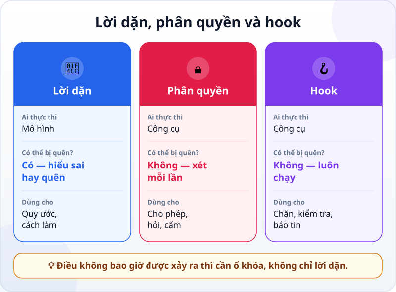
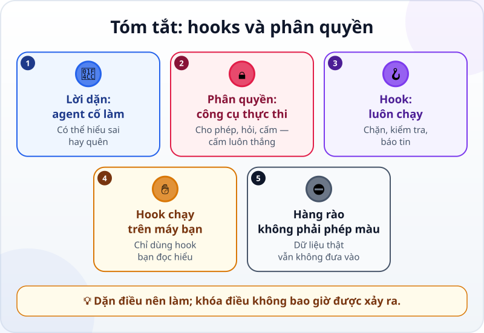

🌐 **Tiếng Việt** · [English](../../en/lessons/hooks-and-permissions.md) · [日本語](../../ja/lessons/hooks-and-permissions.md)

# Hooks và phân quyền: hàng rào an toàn tự động

<!-- section: objective -->
## Mục tiêu bài học

Sau bài này, bạn sẽ:

- Phân biệt **lời dặn** (file chỉ dẫn) với **ổ khóa** (quyền hạn và **hook**): cái nào agent có thể quên, cái nào công cụ luôn thực thi.
- Đọc và viết được một quy tắc phân quyền đơn giản: cho phép, phải hỏi, bị cấm.
- Đặt một quy tắc cấm sửa thư mục dữ liệu trong `ai-practice` và kiểm tra nó thật sự chặn.

<!-- section: hook -->
## Mở đầu: vì sao nên quan tâm?

Trong file chỉ dẫn của dự án báo cáo, Mai đã ghi: *"Không sửa file trong thư mục du_lieu/."* Nhiều tuần liền, agent làm đúng.

Rồi một buổi chiều, sau một phiên rất dài, agent "tiện tay" sửa một dòng trong `du_lieu/ban_hang_thang_11.csv` cho khớp báo cáo. Mai đang ở chế độ cho phép agent tự sửa file, nên không có hộp hỏi nào hiện ra. May mà cô dùng [Git](git-version-control.md) và thấy ngay trong diff.

Chuyện gì đã xảy ra? Như bạn đã thấy trong [vòng lặp của agent](the-agent-loop.md), khi ngữ cảnh gần đầy, chỉ dẫn từ đầu phiên có thể bị mất. Lời dặn là thứ agent **cố** làm theo. Mai cần thêm một thứ mà agent **không thể** vượt qua.

<!-- section: concept -->
## Nội dung chính

### Lời dặn và ổ khóa

Tài liệu Claude Code (9/2026) nói rất rõ: quy tắc phân quyền do **công cụ** thực thi, không phải do mô hình. Chỉ dẫn trong prompt hay trong `CLAUDE.md` định hướng điều agent cố làm, nhưng không thay đổi điều công cụ cho phép.



- **Lời dặn** (file chỉ dẫn): rẻ, linh hoạt, dùng cho quy ước và cách làm. Nhưng mô hình có thể hiểu sai, hoặc quên.
- **Phân quyền:** công cụ kiểm tra **mỗi lần** agent định dùng một công cụ, rồi cho phép, hỏi bạn, hoặc chặn.
- **Hook:** một lệnh công cụ **tự chạy** ở một thời điểm định sẵn — trước khi agent sửa file, sau khi sửa xong, khi agent cần bạn. Nó luôn chạy, không phụ thuộc vào việc mô hình có nhớ hay không.

### Quy tắc phân quyền: cho phép, phải hỏi, bị cấm

Ba nhóm việc bạn đã học trong [Trước khi để agent làm việc](data-safety-and-permissions.md) có thể viết thành quy tắc cho công cụ. Ví dụ với Claude Code (tính đến 9/2026), trong file `.claude/settings.json` của dự án:

```json
{
  "permissions": {
    "deny": ["Edit(/du_lieu/**)"],
    "ask": ["Bash(rm *)"],
    "allow": ["Bash(python kiem_tra.py)"]
  }
}
```

Đọc là: **cấm** sửa mọi file trong `du_lieu/`; **phải hỏi** trước mọi lệnh xóa bằng `rm`; **cho phép** chạy phép kiểm tra mà không cần hỏi.

Hai điều cần nhớ:

- **Cấm luôn thắng.** Công cụ xét theo thứ tự cấm → hỏi → cho phép; một quy tắc cho phép không mở được lỗ trên một quy tắc cấm.
- **Quy tắc không hoàn hảo.** Tài liệu cũng cảnh báo: một quy tắc cấm lệnh có thể không bắt được cùng lệnh đó viết theo cách khác. Ví dụ, quy tắc `Edit(...)` chặn công cụ sửa file của agent, nhưng một lệnh terminal vẫn có thể ghi vào file đó — vì vậy lệnh terminal vẫn nên ở chế độ hỏi trước, và bạn đọc kỹ từng lệnh. Hàng rào giảm rủi ro, không xóa rủi ro — dữ liệu thật vẫn không vào `ai-practice`.

Ngoài quy tắc, công cụ còn có **chế độ quyền hạn** (hỏi trước mọi thứ, tự sửa file, chỉ lập kế hoạch…). Khi mới học, giữ chế độ hỏi trước.

### Hook: việc luôn xảy ra

Tài liệu Claude Code mô tả hook là lệnh do bạn định nghĩa, công cụ chạy ở những thời điểm cố định, để *một số việc luôn xảy ra* thay vì trông vào việc mô hình chọn làm. Vài ví dụ hay gặp:

- **Trước khi sửa file:** kiểm tra đường dẫn; nếu là file được bảo vệ thì chặn, kèm lý do để agent đổi hướng.
- **Sau khi sửa file:** tự chạy phép kiểm tra hay định dạng lại code.
- **Khi agent cần bạn:** hiện một thông báo trên máy, để bạn không phải ngồi canh.

Hook là một đoạn lệnh chạy trên máy bạn với quyền của bạn. Vì vậy nó là việc ✋ **hỏi trước**: chỉ dùng hook bạn đọc hiểu, hoặc do người bạn tin viết.

<!-- section: try-it -->
## Thử ngay

Khoảng 8 phút, trong `ai-practice`, dữ liệu giả. Các bước dưới đây dùng Claude Code (tính đến 9/2026); công cụ khác có cài đặt tương tự — xem tài liệu của nó. (Đi đường chỉ xem? Đọc các bước và tự trả lời câu hỏi ở bước 3.)

**1. Chuẩn bị (1 phút).** Trong `ai-practice`, tạo thư mục `du_lieu` với một file giả `du_lieu/khach.csv`:

```text
ten,thanh_pho
Cong ty A,Ha Noi
Cong ty B,Ho Chi Mnh
```

(Chữ "Ho Chi Mnh" sai chính tả là cố ý.)

**2. Đặt quy tắc (2 phút).** Tạo file `ai-practice/.claude/settings.json` với nội dung:

```json
{
  "permissions": {
    "deny": ["Edit(/du_lieu/**)"]
  }
}
```

Tự tạo file này, hoặc nhờ agent tạo rồi đọc từng dòng trước khi đồng ý. Đóng phiên cũ, mở **phiên mới** để cài đặt có hiệu lực.

**3. Thử chặn (4 phút).** Giao cho agent:

```text
Sửa lỗi chính tả "Ho Chi Mnh" trong du_lieu/khach.csv.
```

Điều bạn mong đợi: agent **bị chặn** khi định sửa file. Đọc xem agent làm gì tiếp — nó có báo lại bị chặn và đề xuất cách khác không? Nếu nó đề nghị chạy một lệnh terminal để sửa `du_lieu/khach.csv` thay thế, đó chính là kẽ hở ở trên — **từ chối**. Rồi giao tiếp:

```text
Đừng sửa file gốc. Ghi bản đã sửa ra ket_qua/khach_da_sua.csv.
```

Lần này agent làm được, vì `ket_qua/` không bị cấm. Mở cả hai file: file gốc vẫn còn chữ sai, file mới đã sửa.

**4. (Tùy chọn, ✋) Một hook thông báo (1 phút).** Nếu muốn, nhờ agent: *"Đề xuất một hook hiện thông báo trên máy khi bạn cần mình trả lời. Chưa cài; cho mình xem nội dung trước."* Đọc lệnh nó đề xuất. Hiểu từng phần thì mới cài.

**Bằng chứng:**

- *Tôi cho xem được…* file `settings.json` có quy tắc cấm, và lần agent bị chặn khi định sửa `du_lieu/khach.csv`.
- *Tôi đã kiểm tra…* file gốc không đổi, file trong `ket_qua/` đã sửa đúng.
- *Tôi sẽ không dùng cách này khi…* định dùng hàng rào để "yên tâm" đưa dữ liệu thật vào — hàng rào giảm rủi ro, không thay được quy định về dữ liệu.

<!-- section: misconceptions -->
## Hiểu lầm thường gặp

- **"Đã ghi 'không được sửa' trong file chỉ dẫn là đủ."** — Đó là lời dặn: agent cố làm theo, nhưng có thể hiểu sai hoặc quên. Điều không bao giờ được xảy ra thì cần quy tắc cấm hay hook.
- **"Bật chế độ cho phép tất cả cho nhanh."** — Nhanh hơn, và mọi hàng rào bạn dựa vào hộp hỏi cũng biến mất. Chỉ tự động hóa những việc bạn đã chắc là an toàn, như chạy phép kiểm tra.
- **"Có hàng rào rồi thì dùng dữ liệu thật cũng được."** — Quy tắc có kẽ hở, và dữ liệu vẫn đi qua mô hình. ⛔ dữ liệu thật không đổi thành ✅ chỉ vì có hàng rào.

<!-- section: recap -->
## Tóm tắt bằng hình



<!-- section: takeaways -->
## Ghi nhớ

- Lời dặn định hướng điều agent cố làm; phân quyền và hook do công cụ thực thi.
- Quy tắc phân quyền: cho phép, phải hỏi, bị cấm — cấm luôn thắng.
- Hook là lệnh tự chạy ở thời điểm định sẵn, để một việc luôn xảy ra.
- Hook chạy trên máy bạn: chỉ dùng hook bạn đọc hiểu (✋).
- Hàng rào giảm rủi ro, không xóa rủi ro: dữ liệu thật vẫn ⛔.

<!-- section: quiz -->
## Tự kiểm tra

**Câu 1.** File chỉ dẫn ghi "không sửa du_lieu/", nhưng agent vẫn sửa sau một phiên dài. Cách chắc chắn nhất để việc này không lặp lại?

- A) Viết dòng đó bằng chữ in hoa
- B) Thêm quy tắc cấm sửa `du_lieu/` trong cài đặt quyền hạn của công cụ
- C) Nhắc lại dòng đó ở mỗi tin nhắn

**Câu 2.** Có quy tắc cấm `Bash(rm *)` và quy tắc cho phép `Bash(rm tam.txt)`. Agent định chạy `rm tam.txt`. Chuyện gì xảy ra?

- A) Bị chặn, vì quy tắc cấm luôn được xét trước
- B) Được chạy, vì quy tắc cho phép cụ thể hơn
- C) Công cụ chọn ngẫu nhiên

**Câu 3.** Việc nào là việc của một **hook**?

- A) Giải thích cho agent vì sao báo cáo phải ngắn
- B) Chọn mô hình cho phiên làm việc
- C) Tự chạy phép kiểm tra mỗi lần agent sửa xong một file

<details>
<summary>Xem đáp án</summary>

1. **B** — quy tắc do công cụ thực thi, không phụ thuộc vào việc mô hình nhớ hay quên.
2. **A** — thứ tự là cấm → hỏi → cho phép; cho phép không mở lỗ được trên cấm.
3. **C** — hook là lệnh tự chạy ở một thời điểm định sẵn; A là việc của lời dặn.

</details>

<!-- section: sources -->
## Nguồn tham khảo

- Anthropic — [Configure permissions](https://code.claude.com/docs/en/permissions) (tiếng Anh, tính đến 9/2026): quy tắc phân quyền do Claude Code thực thi, không phải mô hình; chỉ dẫn trong prompt hay `CLAUDE.md` không thay đổi điều công cụ cho phép; quy tắc được xét theo thứ tự cấm → hỏi → cho phép; cú pháp `Edit(...)`, `Bash(...)`; một quy tắc cấm lệnh không bắt được mọi cách viết khác của lệnh đó.
- Anthropic — [Automate actions with hooks](https://code.claude.com/docs/en/hooks-guide) (tiếng Anh, tính đến 9/2026): hook là lệnh do người dùng định nghĩa, chạy ở những thời điểm cố định để một số việc luôn xảy ra; ví dụ chặn sửa file được bảo vệ kèm lý do cho Claude, và thông báo khi Claude cần bạn.
