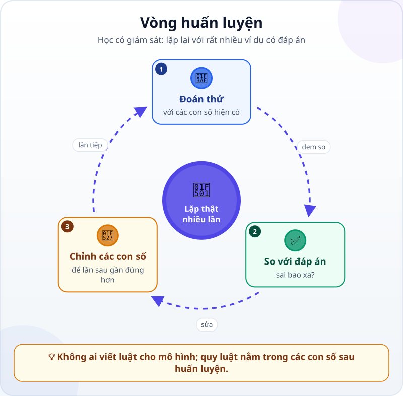
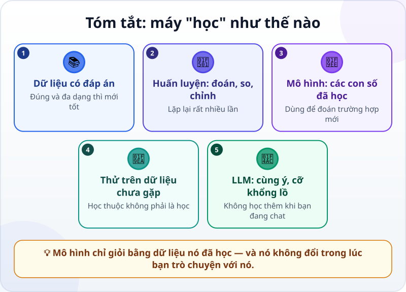

🌐 **Tiếng Việt** · [English](../../en/lessons/how-machines-learn.md) · [日本語](../../ja/lessons/how-machines-learn.md)

# Máy "học" như thế nào? Dữ liệu, huấn luyện và mô hình

<!-- section: objective -->
## Mục tiêu bài học

Sau bài này, bạn sẽ:

- Giải thích ba từ **dữ liệu, huấn luyện, mô hình** bằng một ví dụ của chính bạn.
- Mô tả vòng huấn luyện của học có giám sát — đoán thử, so với đáp án, chỉnh, lặp lại — và kể tên các kiểu học khác.
- Biết vì sao dữ liệu kém cho mô hình kém, và vì sao mô hình không tự học thêm khi bạn trò chuyện với nó.

<!-- section: hook -->
## Mở đầu: vì sao nên quan tâm?

Mỗi tháng, Mai phân loại hàng trăm khoản chi vào bốn hạng mục: Đi lại, Ăn uống, Văn phòng phẩm, Khác. Cô thử viết luật cho máy làm thay: *có chữ "taxi" thì là Đi lại*. Viết được vài chục luật thì rối: "Grab" là đi xe hay đặt đồ ăn? "Cà phê tiếp khách" là Ăn uống hay Khác?

Một đồng nghiệp gợi ý: *"Sao không để máy tự học từ những khoản chị đã phân loại năm ngoái?"* Máy tự học — nghe như phép màu. Thực ra nó là một vòng lặp rất đơn giản.

<!-- section: concept -->
## Nội dung chính

### Ba thứ: dữ liệu, huấn luyện, mô hình

- **Dữ liệu huấn luyện:** các ví dụ để máy học. Bài này đi theo kiểu dễ hình dung nhất, **học có giám sát** (supervised learning): mỗi ví dụ kèm sẵn đáp án. Với Mai, mỗi ví dụ là một dòng mô tả khoản chi cùng hạng mục cô đã chọn. Muốn máy nhận ra quả táo, người ta cho nó xem thật nhiều ảnh có ghi "táo".
- **Mô hình (model):** một bộ rất nhiều con số, biến đầu vào (mô tả khoản chi) thành đầu ra (hạng mục). Lúc đầu các con số gần như ngẫu nhiên, nên mô hình đoán bừa.
- **Huấn luyện (training):** quá trình chỉnh các con số đó cho đến khi mô hình đoán đúng phần lớn ví dụ.

### Vòng huấn luyện

1. **Đoán thử:** mô hình đoán hạng mục cho một ví dụ, bằng các con số hiện có.
2. **So với đáp án:** đúng hay sai, và sai bao xa.
3. **Chỉnh các con số:** chỉnh một chút, để lần sau đoán gần đúng hơn.

Lặp lại với rất nhiều ví dụ, qua nhiều lượt. Không ai viết luật *"Grab là Đi lại"*: quy luật nằm trong các con số sau khi huấn luyện xong.

### Kiểm tra trên dữ liệu chưa gặp

Mô hình có thể "học thuộc" ví dụ cũ mà vẫn đoán sai khoản mới. Vì vậy người ta giữ riêng một phần dữ liệu, không dùng để huấn luyện, chỉ để kiểm tra — giống đề thi không bị lộ trước.

### Không phải kiểu học nào cũng có đáp án sẵn

Vòng lặp ở trên là của học có giám sát. Các kiểu khác khác nhau ở chỗ máy lấy tín hiệu "đúng hay sai" từ đâu:

- **Học không giám sát (unsupervised learning):** không có đáp án nào; máy tự gom những thứ giống nhau thành nhóm, chẳng hạn những khách hàng có thói quen mua giống nhau.
- **Đáp án lấy từ chính dữ liệu:** che phần tiếp theo của một câu và để máy đoán; chữ thật trong văn bản là đáp án, không ai phải ghi nhãn. LLM bắt đầu học theo cách này (phần kế tiếp).
- **Học tăng cường (reinforcement learning):** không có đáp án cho từng ví dụ, chỉ có thưởng hay phạt cho điều máy vừa làm — học bằng thử và sai.

### LLM học thế nào?

Vẫn là đoán – so – chỉnh, ở quy mô khổng lồ, nhưng đáp án lấy từ chính văn bản. Theo Anthropic, ở giai đoạn đầu (*pretraining*), mô hình ngôn ngữ được huấn luyện trên một kho văn bản rất lớn không gắn nhãn: nó đoán [token tiếp theo](next-token-prediction.md) — một mẩu chữ, có thể là một từ hay một phần của từ — dựa trên phần chữ phía trước, và token thật trong văn bản chính là đáp án. Sau đó nó được huấn luyện tiếp — *fine-tuning*, và *RLHF*: con người xếp hạng các câu trả lời, mô hình được chỉnh để nghiêng về những câu xếp cao — để biết làm theo chỉ dẫn và trò chuyện như một trợ lý. Bài [Gia phả của AI](ai-ml-dl.md) cho thấy LLM nằm ở đâu trong gia đình AI.

### Khi bạn trò chuyện, mô hình không học thêm

Huấn luyện xong, các con số được giữ cố định. Trong lúc bạn trò chuyện, mô hình không tự chỉnh con số nào. Điều nó "nhớ" trong một phiên nằm ở [cửa sổ ngữ cảnh](context-window.md) và mất đi khi bạn bắt đầu phiên mới. Nếu một sản phẩm có tính năng "ghi nhớ", đó là ghi chú được lưu lại và đưa vào ngữ cảnh — không phải mô hình vừa học thêm.

<!-- section: analogy -->
## Ví dụ đời thường

Một nhân viên mới học phân loại chứng từ: xem các chứng từ cũ đã có người phân loại, tự đoán, rồi được chị kế toán trưởng sửa. Sau vài tuần, họ đoán đúng gần hết.

Chỗ chưa khớp: người nhân viên hiểu **vì sao** ("Grab Food là đặt đồ ăn") và biết hỏi lại khi gặp trường hợp lạ. Mô hình chỉ chỉnh các con số; nó không giải thích được lý do, và có thể đoán sai rất tự tin với những gì chưa từng gặp.

<!-- section: example -->
## Ví dụ thực tế

Giả sử công ty Mai thử cách này với dữ liệu giả lập:

1. Lấy 300 khoản chi năm ngoái đã được phân loại. Dùng 250 khoản để huấn luyện, giữ riêng 50 khoản để kiểm tra.
2. Sau huấn luyện, mô hình đoán đúng hầu hết các khoản Đi lại và Ăn uống trong 50 khoản kiểm tra.
3. Nhưng nó hay sai với "Khác". Mai xem lại dữ liệu và thấy lý do: năm ngoái "Khác" có rất ít ví dụ, và mỗi người phân loại một kiểu.

Mai rút ra hai điều. Muốn mô hình tốt hơn, phải **sửa dữ liệu** — thêm ví dụ "Khác" rõ ràng, thống nhất cách phân loại — chứ không phải "dặn" mô hình. Và nếu năm ngoái cô phân loại sai, mô hình sẽ học luôn cái sai đó: rác vào, rác ra.

<!-- section: misconceptions -->
## Hiểu lầm thường gặp

- **"Mô hình lưu nguyên dữ liệu để tra lại."** — Nó lưu quy luật dưới dạng các con số, không phải một kho để tra từng ví dụ.
- **"Càng nhiều dữ liệu càng tốt, dữ liệu thế nào cũng được."** — Nhiều dữ liệu chỉ giúp khi dữ liệu đúng và đa dạng; dữ liệu sai thì dạy mô hình cái sai.
- **"Mình sửa lỗi trong cuộc trò chuyện, lần sau AI sẽ nhớ."** — Các con số không đổi khi trò chuyện. Điều cần nhớ lâu, hãy ghi ra file và đưa lại vào ngữ cảnh.

<!-- section: recap -->
## Tóm tắt bằng hình

<!-- section: takeaways -->
## Ghi nhớ

- Trong học có giám sát, dữ liệu huấn luyện là ví dụ có đáp án; mô hình là một bộ con số; huấn luyện là chỉnh các con số ấy.
- Vòng huấn luyện: đoán thử, so với đáp án, chỉnh một chút — lặp lại rất nhiều lần.
- Kiểm tra mô hình bằng dữ liệu nó chưa gặp; học thuộc không phải là học.
- LLM học bằng cách đoán token tiếp theo, với đáp án lấy từ chính văn bản, rồi được huấn luyện thêm để làm trợ lý.
- Mô hình không học thêm trong lúc bạn trò chuyện; điều cần nhớ lâu thì ghi ra file.

<!-- section: quiz -->
## Tự kiểm tra

**Câu 1.** "Mô hình" thực chất là gì?

- A) Một bộ rất nhiều con số đã được chỉnh qua huấn luyện
- B) Một danh sách luật do lập trình viên viết
- C) Một kho lưu lại mọi ví dụ đã thấy để tra

**Câu 2.** Vì sao phải giữ riêng một phần dữ liệu không dùng để huấn luyện?

- A) Để tiết kiệm bộ nhớ
- B) Để mô hình có nhiều ví dụ hơn
- C) Để kiểm tra mô hình trên những trường hợp nó chưa gặp

**Câu 3.** Hôm qua bạn sửa một lỗi của chatbot. Hôm nay, trong một cuộc trò chuyện mới, nó có tự nhớ lời sửa đó không?

- A) Có, vì nó đã học từ lời sửa
- B) Không nên trông chờ: các con số của mô hình không đổi khi trò chuyện, điều cần nhớ nên ghi ra file và đưa lại vào ngữ cảnh
- C) Có, nếu bạn sửa đủ nhiều lần

Xem đáp án

1. **A** — quy luật nằm trong các con số; không ai viết luật, và nó không phải kho để tra từng ví dụ.
2. **C** — đúng trên ví dụ cũ chưa chứng tỏ gì; phải thử với những gì mô hình chưa từng thấy.
3. **B** — huấn luyện đã xong; cuộc trò chuyện chỉ thay đổi ngữ cảnh, không thay đổi mô hình.

<!-- section: sources -->
## Nguồn tham khảo

- Google Cloud — [What is Machine Learning?](https://cloud.google.com/learn/what-is-machine-learning) (tiếng Anh): học có giám sát dùng dữ liệu đã gắn nhãn (ví dụ ảnh có ghi "táo"); huấn luyện là tối ưu mô hình để đoán đúng dựa trên các mẫu dữ liệu; nhiều dữ liệu chỉ giúp khi dữ liệu có chất lượng; học không giám sát dùng dữ liệu không gắn nhãn và tự chia nhóm; học tăng cường học bằng thử và sai, với thưởng và phạt.
- Anthropic — [Glossary](https://platform.claude.com/docs/en/about-claude/glossary) (tiếng Anh), các mục *Pretraining*, *Fine-tuning* và *RLHF*: mô hình ngôn ngữ được huấn luyện trước trên văn bản không gắn nhãn để đoán phần chữ tiếp theo, rồi được tinh chỉnh và học từ việc con người xếp hạng câu trả lời để làm theo chỉ dẫn.
