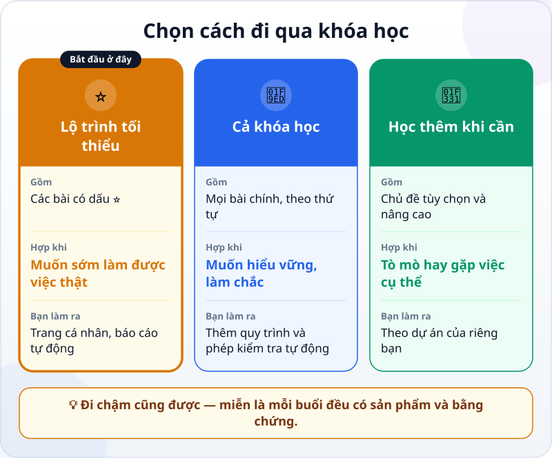
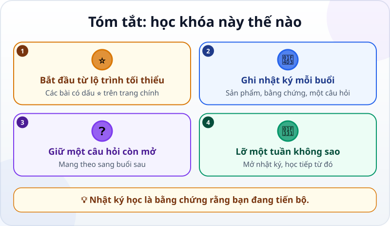

🌐 **Tiếng Việt** · [English](../../en/lessons/how-to-learn-this-course.md) · [日本語](../../ja/lessons/how-to-learn-this-course.md)

# Chọn lộ trình và ghi nhật ký học

<!-- section: objective -->
## Mục tiêu bài học

Sau bài này, bạn sẽ:

- Chọn được cách đi qua khóa học hợp với mình: **lộ trình tối thiểu**, **cả khóa**, hay **học thêm khi cần**.
- Bắt đầu một **nhật ký học**: sau mỗi buổi, ghi sản phẩm, bằng chứng và một câu hỏi còn mở.
- Có cách quay lại học khi lỡ một thời gian.

<!-- section: hook -->
## Mở đầu: vì sao nên quan tâm?

Bạn vừa có sản phẩm đầu tiên — thẻ "Việc của tôi trong tuần". Từ đây, khóa học còn nhiều bài, và cuộc sống thì bận: sẽ có tuần bạn không học được.

Người học đi đường dài không nhờ ý chí sắt đá, mà nhờ một thói quen nhỏ: mỗi buổi để lại một dấu vết — làm được gì, kiểm tra ra sao, còn thắc mắc gì. Lần sau mở ra là biết mình đang ở đâu.

<!-- section: concept -->
## Nội dung chính

### Ba cách đi qua khóa học



- **⭐ Lộ trình tối thiểu:** các bài có dấu ⭐ trên [trang chính của khóa học](../README.md), theo thứ tự. Đủ để giao việc thật cho agent và tự kiểm tra kết quả, với hai dự án.
- **🧭 Cả khóa học:** mọi bài chính theo thứ tự — hiểu vững hơn, thêm quy trình và phép kiểm tra tự động.
- **🌱 Học thêm khi cần:** các chủ đề đánh dấu *tùy chọn* (AI hoạt động ra sao) và *nâng cao* (làm việc với agent ở quy mô lớn hơn) — học khi bạn tò mò hoặc khi dự án cần.

Không chắc? Bắt đầu từ lộ trình tối thiểu. Bạn luôn có thể học thêm sau.

### Nhật ký học: ba thứ sau mỗi buổi

1. **Sản phẩm:** bạn đã làm ra gì? (tên file, ảnh chụp màn hình)
2. **Bằng chứng:** ba dòng quen thuộc — *Tôi cho xem được… / Tôi đã kiểm tra… / Tôi sẽ không dùng cách này khi…*
3. **Một câu hỏi còn mở:** điều bạn chưa hiểu, hay muốn thử tiếp.

Câu hỏi còn mở là điểm bắt đầu tốt nhất cho buổi sau.

### Lỡ một tuần? Không sao

Khóa học không đếm chuỗi ngày học liên tục. Lỡ một tuần — hay một tháng — hãy mở nhật ký, đọc câu hỏi còn mở gần nhất, và học tiếp từ đó.

<!-- section: try-it -->
## Thử ngay

Khoảng 8 phút.

**1. Chọn cách học (2 phút).** Mở [trang chính của khóa học](../README.md), xem các bài có dấu ⭐, và quyết định: tối thiểu, cả khóa, hay tối thiểu trước rồi tính tiếp.

**2. Tạo nhật ký (3 phút).** Nhờ agent tạo file trong `ai-practice`:

```text
Tạo file nhat-ky-hoc.md với tiêu đề "Nhật ký học agentic coding"
và một mẫu cho mỗi buổi gồm: ngày, tên bài, Sản phẩm, Bằng chứng (3 dòng), Câu hỏi còn mở.
```

**3. Ghi buổi đầu tiên (3 phút).** Tự điền mục đầu tiên cho [buổi đầu với agent](first-agent-session.md) — bằng lời của bạn:

```text
## 2026-09-27 — Buổi đầu với agent
- Sản phẩm: my-week.html
- Bằng chứng:
  - Tôi cho xem được…
  - Tôi đã kiểm tra…
  - Tôi sẽ không dùng cách này khi…
- Câu hỏi còn mở: …
```

Nếu đã học nhiều bài, ghi thêm một dòng cho mỗi sản phẩm bạn đã làm.

<!-- section: misconceptions -->
## Hiểu lầm thường gặp

- **"Phải học mỗi ngày mới giỏi được."** — Đều đặn giúp ích, nhưng lỡ vài hôm không làm mất những gì bạn đã học. Nhật ký giúp bạn quay lại nhanh.
- **"Nhật ký học là việc thừa."** — Ba dòng bằng chứng là kỹ năng bạn dùng mỗi ngày khi giao việc cho agent. Nhật ký là chỗ luyện nó.
- **"Phải học hết cả khóa mới dùng được."** — Xong lộ trình tối thiểu là bạn đã giao việc thật và kiểm tra được kết quả.

<!-- section: recap -->
## Tóm tắt bằng hình



<!-- section: takeaways -->
## Ghi nhớ

- Không chắc nên học gì? Bắt đầu từ lộ trình tối thiểu — các bài có dấu ⭐.
- Sau mỗi buổi: sản phẩm, ba dòng bằng chứng, một câu hỏi còn mở.
- Câu hỏi còn mở là điểm bắt đầu của buổi sau.
- Lỡ một tuần không sao: mở nhật ký và học tiếp.

<!-- section: quiz -->
## Tự kiểm tra

**Câu 1.** Bạn chưa chắc nên học những bài nào. Nên bắt đầu từ đâu?

- A) Các bài nâng cao, cho nhanh giỏi
- B) Lộ trình tối thiểu — các bài có dấu ⭐
- C) Chọn ngẫu nhiên

**Câu 2.** Nhật ký học ghi gì sau mỗi buổi?

- A) Sản phẩm, ba dòng bằng chứng, một câu hỏi còn mở
- B) Số giờ đã học
- C) Toàn bộ cuộc trò chuyện với agent

**Câu 3.** Bạn lỡ ba tuần không học. Làm gì bây giờ?

- A) Học lại khóa từ đầu
- B) Bỏ, vì đã mất chuỗi ngày học
- C) Mở nhật ký, đọc câu hỏi còn mở gần nhất, học tiếp từ đó

<details>
<summary>Xem đáp án</summary>

1. **B** — lộ trình tối thiểu đủ để làm việc thật; học thêm sau.
2. **A** — ba thứ đó cho bạn biết đã làm được gì và nên bắt đầu buổi sau ở đâu.
3. **C** — nhật ký sinh ra chính là cho lúc này.

</details>
