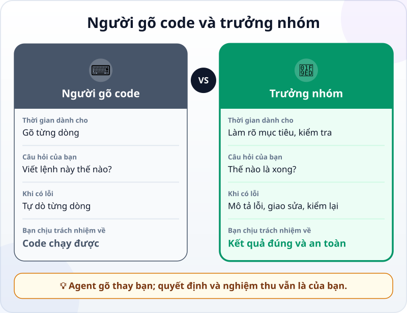
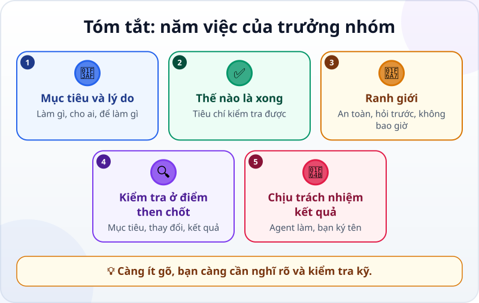

🌐 **Tiếng Việt** · [English](../../en/lessons/lead-not-typist.md) · [日本語](../../ja/lessons/lead-not-typist.md)

# Tư duy mới: bạn là trưởng nhóm, không phải người gõ code

<!-- section: objective -->
## Mục tiêu bài học

Sau bài này, bạn sẽ:

- Mô tả được vai trò mới khi làm việc với agent: từ **người gõ code** sang **trưởng nhóm**.
- Kể được năm việc của trưởng nhóm: mục tiêu và lý do, thế nào là xong, ranh giới, kiểm tra ở điểm then chốt, chịu trách nhiệm kết quả.
- Viết lại một yêu cầu kiểu "người gõ" thành yêu cầu kiểu "trưởng nhóm".

<!-- section: hook -->
## Mở đầu: vì sao nên quan tâm?

Trong [buổi đầu với agent](first-agent-session.md), bạn không gõ dòng code nào — nhưng bạn đã làm rất nhiều việc: nói rõ muốn gì, đặt tiêu chí, đọc từng thay đổi, tự nghiệm thu. Đó chính là việc của một trưởng nhóm.

Nhiều người nghĩ "AI viết code thay mình" nghĩa là mình nhàn đi. Thật ra việc chỉ chuyển chỗ: ít gõ hơn, nhưng phải nghĩ rõ hơn và kiểm tra kỹ hơn.

<!-- section: concept -->
## Nội dung chính

### Điều gì thay đổi?

Người gõ code dành thời gian cho *cách làm*: viết từng dòng, tự dò từng lỗi. Trưởng nhóm dành thời gian cho *việc cần làm* và *cách biết là đã xong*. Agent lo phần gõ; bạn lo phần quyết định.

### Năm việc của trưởng nhóm

1. **Mục tiêu và lý do:** làm gì, cho ai, để làm gì. Biết lý do, agent chọn được cách làm hợp hơn.
2. **Thế nào là xong:** tiêu chí kiểm tra được, như trong buổi đầu.
3. **Ranh giới:** việc an toàn, việc phải hỏi, việc không bao giờ.
4. **Kiểm tra ở điểm then chốt:** agent đã hiểu đúng mục tiêu chưa, thay đổi có đúng chỗ không, kết quả có đạt tiêu chí không.
5. **Chịu trách nhiệm kết quả:** agent làm, nhưng người ký tên nghiệm thu là bạn.

<!-- section: analogy -->
## Ví dụ đời thường

Bạn thuê thợ sửa nhà. Bạn không cầm bay xây tường, nhưng bạn nói rõ muốn gì (*"thêm một kệ sách cao 2 mét, chịu được 50 kg sách"*), duyệt bản vẽ, ghé xem ở vài mốc, và kiểm tra từng hạng mục trước khi trả tiền.

Chỗ chưa khớp: người thợ có kinh nghiệm thường hỏi lại khi yêu cầu mơ hồ; agent đôi khi tự điền chỗ trống bằng một phỏng đoán rất tự tin. Vì vậy yêu cầu của bạn càng cần rõ.

<!-- section: example -->
## Ví dụ thực tế

Huy là sinh viên năm hai, biết chút Python. Cậu có file `diem.csv` — điểm giả của 20 bạn, 4 môn, mỗi môn tối đa 10 điểm — và cần một bảng tổng kết.

**Kiểu người gõ:** *"Viết code Python đọc file CSV."* Agent đưa ra một đoạn code đọc file. Huy vẫn phải tự nghĩ bước tiếp theo, tự ghép, tự thử.

**Kiểu trưởng nhóm:**

> *"Từ `diem.csv`, tạo file `tong_ket.csv` có thêm cột Tổng và cột Xếp loại (từ 32 điểm: Giỏi; từ 24 điểm: Khá; còn lại: Trung bình). Không sửa file gốc. Xong khi: `tong_ket.csv` có đủ 20 dòng; tổng của 3 bạn đầu khớp với tổng mình tự cộng; xếp loại đúng ngưỡng."*

Yêu cầu thứ hai nói rõ **kết quả** (không chỉ đoạn code), **ranh giới** (không sửa file gốc) và **cách kiểm tra**. Để nghiệm thu, Huy tự cộng điểm 3 bạn đầu và so với file.

<!-- section: misconceptions -->
## Hiểu lầm thường gặp

- **"Không gõ code thì không cần hiểu gì về phần mềm."** — Vẫn cần đủ để đánh giá: đọc thông báo lỗi, biết file nằm đâu, kiểm tra kết quả. Khóa học dạy bạn vừa đủ những điều đó.
- **"Trưởng nhóm là ra lệnh rồi ngồi chờ."** — Trưởng nhóm kiểm tra ở vài điểm then chốt, không chỉ ở cuối.
- **"Agent giỏi thì lỗi là của agent."** — Agent không chịu hậu quả. Người dùng kết quả — và người đã nghiệm thu — là bạn.

<!-- section: recap -->
## Tóm tắt bằng hình

<!-- section: takeaways -->
## Ghi nhớ

- Khi làm cùng agent, bạn chuyển từ người gõ code sang trưởng nhóm.
- Năm việc: mục tiêu và lý do, thế nào là xong, ranh giới, kiểm tra ở điểm then chốt, chịu trách nhiệm kết quả.
- Yêu cầu tốt nói về kết quả và cách kiểm tra, không chỉ về đoạn code.
- Càng ít gõ, càng cần nghĩ rõ và kiểm tra kỹ.

<!-- section: quiz -->
## Tự kiểm tra

**Câu 1.** Yêu cầu nào mang tư duy trưởng nhóm?

- A) "Viết một hàm Python."
- B) "Sửa code cho chạy đi."
- C) "Tạo file tổng kết từ `diem.csv`, không sửa file gốc; xong khi tổng của 3 bạn đầu khớp với tính tay."

**Câu 2.** Việc nào **không** thuộc năm việc của trưởng nhóm?

- A) Gõ từng dòng code
- B) Định nghĩa thế nào là xong
- C) Kiểm tra ở điểm then chốt

**Câu 3.** Agent làm sai, và bạn đã nghiệm thu mà không kiểm tra. Ai chịu trách nhiệm về kết quả?

- A) Agent
- B) Bạn
- C) Không ai cả

Xem đáp án

1. **C** — nó nói rõ kết quả, ranh giới và cách kiểm tra.
2. **A** — gõ code là phần agent làm; bốn việc còn lại, cộng với chịu trách nhiệm kết quả, là của bạn.
3. **B** — agent không chịu hậu quả; người nghiệm thu là bạn.

<!-- section: sources -->
## Nguồn tham khảo

- Google Cloud — [What is agentic coding?](https://cloud.google.com/discover/what-is-agentic-coding) (tiếng Anh): chuyển từ "trò chuyện với AI" sang "giao việc cho AI" giúp người làm phần mềm tập trung vào kiến trúc và logic; agent giống một nhà thầu lành nghề hơn là một người tư vấn thụ động; code agent làm nên được người xem lại trước khi đưa vào dự án chính.
- Anthropic — [Best practices for Claude Code](https://code.claude.com/docs/en/best-practices) (tiếng Anh): viết yêu cầu có bối cảnh cụ thể, và cho agent một cách để tự kiểm tra.
