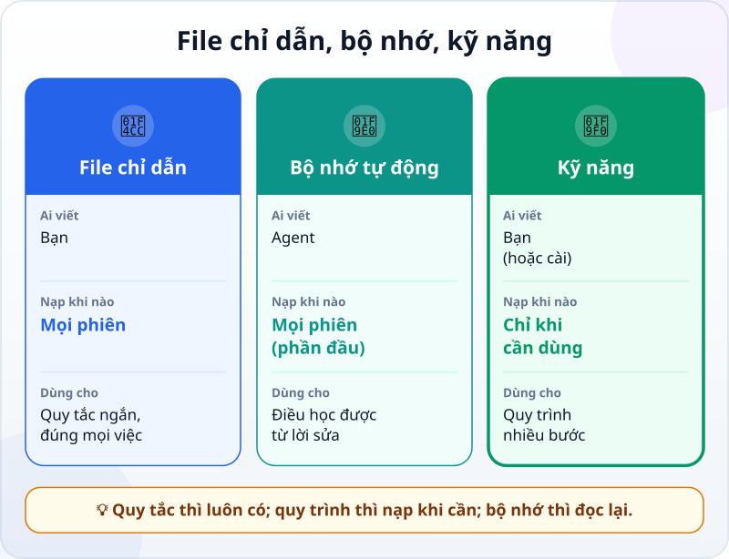
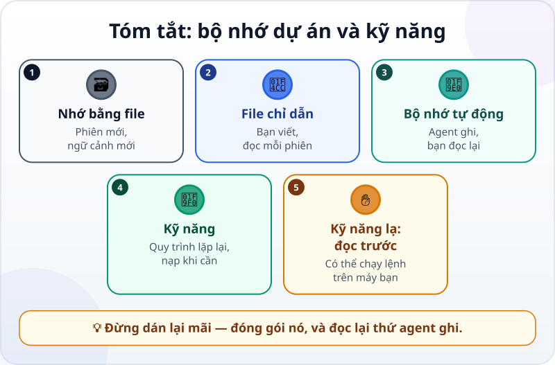

🌐 **Tiếng Việt** · [English](../../en/lessons/memory-and-skills.md) · [日本語](../../ja/lessons/memory-and-skills.md)

# Bộ nhớ dự án và kỹ năng dùng lại

<!-- section: objective -->
## Mục tiêu bài học

Sau bài này, bạn sẽ:

- Phân biệt ba thứ mang được sang phiên sau: **file chỉ dẫn**, **bộ nhớ tự động**, **kỹ năng (skill)**.
- Biến một quy trình bạn hay lặp lại thành một kỹ năng, và gọi nó ở phiên mới.
- Đọc lại và dọn bộ nhớ agent tự ghi, để nó không giữ điều sai hay điều không nên giữ.

<!-- section: hook -->
## Mở đầu: vì sao nên quan tâm?

Cuối mỗi tháng, Mai mở phiên mới và dán cho agent cùng một danh sách:

```text
1. Kiểm tra có đủ file ban_hang_thang_X.csv.
2. Chạy lam_bao_cao.py với file tháng đó.
3. Chạy kiem_tra.py; không đạt thì dừng và báo mình.
4. Tự cộng tay doanh thu một chi nhánh, so với báo cáo.
5. Ghi một dòng vào nhat_ky.md: tháng, tổng doanh thu, kết quả kiểm tra.
6. Commit với lời nhắn "Báo cáo tháng X".
```

Tháng 12, đang vội, cô chỉ gõ *"làm báo cáo tháng 12"*. Agent làm báo cáo — nhưng không chạy bước 3. Một con số sai đi thẳng tới quản lý.

Agent không có lỗi "quên": mỗi phiên bắt đầu với ngữ cảnh mới. Điều Mai cần là một nơi để quy trình đó **luôn có sẵn khi cần**, mà không phải dán lại.

<!-- section: concept -->
## Nội dung chính

### Agent nhớ bằng file

Bạn đã biết [agent "nhớ" ở đâu](context-window.md): ngoài những gì học lúc huấn luyện và những gì trong phiên hiện tại, thứ duy nhất mang sang phiên sau là **file**. Công cụ agent thường có ba loại file như vậy:



- **File chỉ dẫn** — bạn viết; đọc ở đầu **mọi** phiên. Dành cho quy tắc ngắn đúng với mọi việc (bạn đã viết một cái trong [Context engineering](context-engineering.md)).
- **Bộ nhớ tự động** — **agent** tự ghi điều nó học được khi làm việc với bạn, như sở thích hay những lần bạn sửa nó. Tính đến 9/2026, Claude Code có *auto memory*: 200 dòng đầu (hoặc 25KB đầu) của file `MEMORY.md` được nạp ở đầu mỗi phiên.
- **Kỹ năng (skill)** — bạn viết (hoặc cài); một **quy trình** nhiều bước đóng gói trong một file. Khác file chỉ dẫn, nội dung kỹ năng **chỉ được nạp khi dùng**, nên một quy trình dài gần như không tốn chỗ cho tới lúc cần.

### Khi nào viết một kỹ năng?

Tài liệu Claude Code (9/2026) gợi ý: tạo một kỹ năng khi bạn **cứ phải dán lại** cùng một chỉ dẫn, danh sách kiểm tra hay quy trình nhiều bước — hoặc khi một phần của file chỉ dẫn đã lớn thành một quy trình thay vì một quy tắc.

Một kỹ năng trong Claude Code là một file `SKILL.md` trong thư mục riêng, gồm hai phần:

- **Tên và phần mô tả** (ở đầu file): tên trùng với tên thư mục; mô tả nói *khi nào* dùng kỹ năng này. Agent đọc mô tả để tự quyết định nạp kỹ năng khi việc phù hợp.
- **Phần hướng dẫn:** các bước agent làm theo khi kỹ năng chạy.

Bạn cũng có thể gọi thẳng bằng tên, như `/bao-cao-thang`. Kỹ năng của Claude Code theo một chuẩn mở (Agent Skills) mà nhiều công cụ AI khác cũng dùng.

### Đọc lại bộ nhớ

Bộ nhớ tự động tiện, nhưng nó là **ghi chép của agent**, không phải của bạn. Nó có thể ghi sai (hiểu nhầm một lần bạn sửa), ghi thứ đã cũ, hay ghi thứ không nên nằm trong file — một cái tên thật, một con số nội bộ. Tất cả chỉ là file văn bản bạn đọc, sửa hay xóa được. Thỉnh thoảng hãy mở ra đọc.

### Kỹ năng của người khác là ✋

Một kỹ năng có thể kèm cả lệnh chạy trên máy bạn. Cài kỹ năng người khác viết cũng như cài một chương trình: ✋ **hỏi trước**, đọc hết nội dung, và chỉ dùng nguồn bạn tin.

<!-- section: try-it -->
## Thử ngay

Khoảng 11 phút, trong `ai-practice`, dữ liệu giả từ [dự án tự động hóa](project-office-automation.md) (hoặc bất kỳ việc nào bạn lặp lại với cùng các bước). Các bước dùng Claude Code (tính đến 9/2026); công cụ khác có cơ chế tương tự — xem tài liệu của nó. (Đi đường chỉ xem? Làm bước 1 và viết bước 2 trên giấy.)

**1. Viết ra quy trình (2 phút).** Liệt kê 4–6 bước bạn lặp lại mỗi lần, theo đúng thứ tự, và bước nào phải dừng lại nếu có vấn đề. Danh sách của Mai ở trên là một ví dụ.

**2. Đóng gói thành kỹ năng (4 phút).** Tạo file `ai-practice/.claude/skills/bao-cao-thang/SKILL.md`:

```text
---
name: bao-cao-thang
description: Làm báo cáo doanh thu tháng từ file ban_hang_thang_X.csv. Dùng khi mình nhờ làm báo cáo tháng.
---
Khi làm báo cáo tháng X:
1. Kiểm tra có file ban_hang_thang_X.csv; không có thì dừng và báo mình.
2. Chạy lam_bao_cao.py với file đó.
3. Chạy kiem_tra.py. Không đạt thì dừng, báo mình kết quả, không sửa gì thêm.
4. Nhắc mình tự cộng tay doanh thu một chi nhánh để so; đừng tự cộng thay mình. Dừng lại, chờ mình xác nhận là khớp rồi mới làm tiếp.
5. Ghi một dòng vào nhat_ky.md: tháng, tổng doanh thu, kết quả kiểm tra.
6. Commit với lời nhắn "Báo cáo tháng X".
```

Dùng đúng tên file trong dự án của bạn: nếu chương trình hay phép kiểm tra của bạn tên khác (ví dụ `kiem_tra_bao_cao.py`), sửa lại bước 2 và 3 cho khớp.

**3. Thử ở phiên mới (3 phút).** Mở **phiên mới** và chỉ gõ:

```text
Làm báo cáo tháng 10.
```

Agent có tự nạp kỹ năng không? Nó có chạy `kiem_tra.py` không, dù bạn không nhắc? Ở bước 4, nó có nhắc bạn tự cộng tay, không cộng hộ, và chờ bạn xác nhận rồi mới ghi sổ và commit không? Nếu nó không nạp kỹ năng, sửa phần mô tả cho rõ hơn "khi nào dùng", rồi thử lại. Bạn cũng có thể gọi thẳng `/bao-cao-thang`.

**4. Đọc bộ nhớ (2 phút).** Gõ `/memory` trong Claude Code (hoặc hỏi agent *"Bạn đã tự ghi nhớ những gì về dự án này?"*). Đọc từng dòng. Có dòng nào sai, cũ, hay không nên nằm đó? Xóa nó.

**Bằng chứng:**

- *Tôi cho xem được…* file `SKILL.md`, và một phiên mới làm đủ các bước khi tôi chỉ gõ một câu.
- *Tôi đã kiểm tra…* agent có chạy phép kiểm tra và có dừng đúng chỗ; nội dung bộ nhớ không có gì sai hay nhạy cảm.
- *Tôi sẽ không dùng cách này khi…* quy trình chỉ làm một lần (thì nói trong yêu cầu), hoặc kỹ năng đến từ nguồn tôi chưa đọc hết.

<!-- section: misconceptions -->
## Hiểu lầm thường gặp

- **"Agent làm với mình lâu rồi thì tự nhớ mọi thứ."** — Mỗi phiên bắt đầu với ngữ cảnh mới. Chỉ những gì nằm trong file — chỉ dẫn, bộ nhớ, kỹ năng — mới được mang sang.
- **"Cho hết quy trình vào file chỉ dẫn là được."** — File chỉ dẫn được đọc ở mọi phiên, kể cả những phiên không làm báo cáo. Quy trình dài để trong kỹ năng thì chỉ nạp khi cần.
- **"Bộ nhớ tự động luôn đúng vì agent tự ghi."** — Nó là ghi chép của agent, có thể hiểu sai hay đã cũ. Đọc lại và dọn nó như dọn một file của chính bạn.

<!-- section: recap -->
## Tóm tắt bằng hình



<!-- section: takeaways -->
## Ghi nhớ

- Agent nhớ giữa các phiên bằng file, không bằng "trí nhớ".
- File chỉ dẫn: quy tắc ngắn, bạn viết, đọc mỗi phiên.
- Bộ nhớ tự động: agent tự ghi — bạn đọc lại, sửa, xóa.
- Kỹ năng: quy trình nhiều bước, chỉ nạp khi dùng; viết khi bạn cứ phải dán lại cùng một thứ.
- Kỹ năng của người khác có thể chạy lệnh trên máy bạn: ✋ đọc trước khi cài.

<!-- section: quiz -->
## Tự kiểm tra

**Câu 1.** Mai dán cùng một quy trình 6 bước mỗi tháng. Nên để nó ở đâu?

- A) Trong một kỹ năng, nạp khi làm báo cáo tháng
- B) Trong file chỉ dẫn, đọc ở mọi phiên
- C) Không cần để đâu; agent sẽ tự nhớ

**Câu 2.** Điểm khác chính giữa kỹ năng và file chỉ dẫn là gì?

- A) Kỹ năng chỉ viết được bằng tiếng Anh
- B) Nội dung kỹ năng chỉ được nạp khi dùng; file chỉ dẫn được đọc ở mọi phiên
- C) File chỉ dẫn do agent tự viết

**Câu 3.** Bạn mở bộ nhớ tự động và thấy một dòng agent ghi sai về quy ước của dự án. Nên làm gì?

- A) Để nguyên, vì agent tự ghi thì chắc đúng
- B) Tắt máy rồi mở lại
- C) Sửa hoặc xóa dòng đó — bộ nhớ chỉ là file bạn đọc và sửa được

<details>
<summary>Xem đáp án</summary>

1. **A** — một quy trình dùng khi cần thì hợp với kỹ năng; để trong file chỉ dẫn thì nó chiếm chỗ ở mọi phiên.
2. **B** — kỹ năng nạp đúng lúc; file chỉ dẫn luôn có.
3. **C** — bộ nhớ là ghi chép của agent; bạn là người giữ cho nó đúng.

</details>

<!-- section: sources -->
## Nguồn tham khảo

- Anthropic — [Extend Claude with skills](https://code.claude.com/docs/en/skills) (tiếng Anh, tính đến 9/2026): tạo kỹ năng khi cứ phải dán lại cùng chỉ dẫn hay quy trình; `SKILL.md` gồm phần mô tả (khi nào dùng) và phần hướng dẫn; nội dung kỹ năng chỉ nạp khi dùng; gọi thẳng bằng `/tên-kỹ-năng`; theo chuẩn mở Agent Skills.
- Anthropic — [How Claude remembers your project](https://code.claude.com/docs/en/memory) (tiếng Anh, tính đến 9/2026): `CLAUDE.md` do bạn viết, auto memory do Claude ghi; 200 dòng hoặc 25KB đầu của `MEMORY.md` được nạp mỗi phiên; mọi thứ là file markdown bạn đọc, sửa, xóa được, xem bằng `/memory`.
