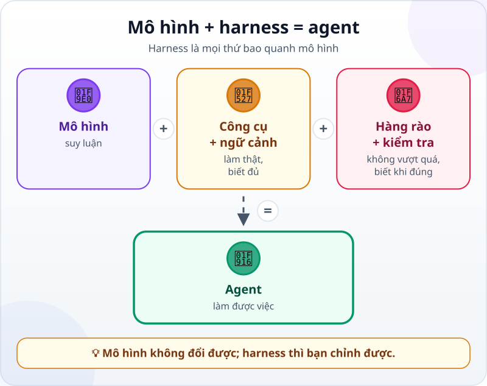
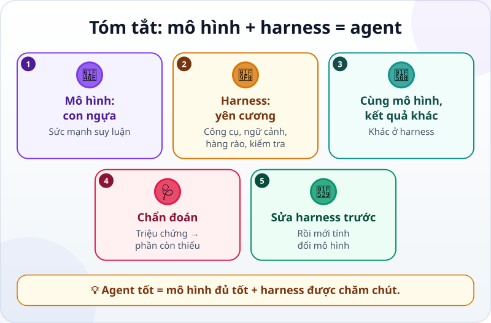

🌐 **Tiếng Việt** · [English](../../en/lessons/model-plus-harness.md) · [日本語](../../ja/lessons/model-plus-harness.md)

# Model + Harness = Agent: con ngựa và bộ yên cương

<!-- section: objective -->
## Mục tiêu bài học

Sau bài này, bạn sẽ:

- Giải thích được **agent = mô hình + harness**, và kể được bốn phần của harness: công cụ, ngữ cảnh, hàng rào, phép kiểm tra.
- Chẩn đoán được khi agent làm kém: thiếu phần nào của harness?
- Biết phần nào của harness bạn tự sửa được, và bài nào trong khóa dạy từng phần.

<!-- section: hook -->
## Mở đầu: vì sao nên quan tâm?

Tuấn và Mai dùng **cùng một mô hình AI**. Tuấn kể: *"Mình dán bảng số liệu vào, nhờ tính tổng, nó trả lời tự tin nhưng sai. Không dùng được."* Mai thì bảo: *"Agent của mình làm báo cáo tháng, tự kiểm tra, sai là tự sửa. Mình tin được."*

Cùng một "bộ não", sao lại khác nhau như vậy? Vì thứ họ dùng không chỉ có bộ não.

<!-- section: concept -->
## Nội dung chính

### Hai nửa của một agent

Bạn đã biết agent gồm [bộ não, đôi tay và vòng lặp](agent-parts-and-loop.md). Nhìn từ góc người dùng, có thể chia gọn hơn thành hai nửa:

- **Mô hình (model):** phần suy luận — hiểu yêu cầu, chọn bước tiếp theo, viết code. Bạn chọn mô hình, nhưng không sửa được bên trong nó.
- **Harness:** mọi thứ **bao quanh** mô hình để nó làm được việc thật. Tài liệu Claude Code (9/2026) gọi phần mềm bao quanh mô hình — cung cấp công cụ và quản lý những gì mô hình được thấy — là *agentic harness*.

### Bốn phần của harness

- **🔧 Công cụ:** agent được làm gì thật — đọc file, chạy lệnh, tìm kiếm. Thiếu công cụ, mô hình chỉ nói được, không làm được.
- **📋 Ngữ cảnh và chỉ dẫn:** agent biết gì — yêu cầu của bạn, file liên quan, quy ước của dự án được ghi sẵn trong một file chỉ dẫn. Thiếu ngữ cảnh, agent đoán.
- **🚧 Hàng rào:** agent **không** được làm gì, hay phải hỏi trước — quyền hạn, và các quy tắc tự động chặn việc nguy hiểm. Thiếu hàng rào, một bước sai có thể thành thiệt hại thật.
- **✅ Phép kiểm tra:** làm sao biết việc đã đúng — test, con số phải khớp. Thiếu kiểm tra, "trông như xong" là tín hiệu duy nhất.

### Cùng mô hình, harness khác — kết quả khác

Tuấn dùng mô hình qua một khung chat: không có công cụ chạy code, không có file, không có phép kiểm tra. Mô hình phải "tính nhẩm" một bảng dài, và dễ bị [ảo giác](hallucination.md): tự tin nói sai. Mai dùng cùng mô hình trong một agent có công cụ chạy Python, có thư mục dự án, có file chỉ dẫn, có phép kiểm tra. Mô hình không giỏi hơn — nó được **trang bị** tốt hơn.

### Khi agent làm kém, sửa harness trước

Đổi sang mô hình mạnh hơn là cách dễ nghĩ tới nhất, nhưng thường không phải cách đúng. Hãy chẩn đoán theo triệu chứng:

- **Chỉ nói, không làm được** → thiếu công cụ.
- **Không biết quy ước, mỗi phiên lại quên** → thiếu ngữ cảnh.
- **Làm việc bạn không cho phép** → thiếu hàng rào.
- **Báo xong mà sai** → thiếu phép kiểm tra.

Bốn thứ này bạn tự điều chỉnh được. Các bài sau trong phần *Harness tối thiểu* dạy từng thứ, bắt đầu với [Context engineering](context-engineering.md): ngữ cảnh, chỉ dẫn cho agent, hàng rào tự động, và test chạy tự động.

<!-- section: analogy -->
## Ví dụ đời thường

Một con ngựa khỏe và bộ yên cương. Con ngựa có sức mạnh — nhưng không có dây cương thì không đi đúng hướng, không có yên thì không chở được người, không có hàng rào thì chạy vào ruộng nhà hàng xóm. Người cưỡi giỏi không đổi ngựa mỗi khi ngựa đi sai; họ chỉnh dây cương, và dựng rào ở chỗ cần.

Mô hình là con ngựa; harness là yên, cương và hàng rào; bạn là người cưỡi.

Phép so sánh sai ở chỗ: con ngựa có ý muốn riêng và cảm nhận được người cưỡi. Mô hình không "hiểu" bạn theo cách đó — nó chỉ thấy những gì nằm trong ngữ cảnh. Cái gì bạn không đưa vào harness, với nó coi như không tồn tại.

<!-- section: example -->
## Ví dụ thực tế

Mai dùng agent làm báo cáo tháng từ [dự án tự động hóa](project-office-automation.md). Trong một tháng, cô gặp ba chuyện, và sửa từng chuyện bằng harness — không đổi mô hình lần nào.

**Chuyện 1 — mỗi phiên lại quên.** Tuần nào Mai cũng phải nhắc: *"Không sửa file dữ liệu. Tiền ghi theo kiểu Việt Nam, dấu chấm ngăn nghìn."* Phiên mới, agent lại quên. **Chẩn đoán: thiếu ngữ cảnh.** Mai ghi hai quy ước đó vào file chỉ dẫn của dự án (với Claude Code là `CLAUDE.md`, tính đến 9/2026) — file agent đọc ở đầu mỗi phiên. Từ đó cô không phải nhắc nữa.

**Chuyện 2 — suýt xóa nhầm.** Một lần, agent đề nghị xóa thư mục báo cáo cũ "cho gọn". May là Mai đang ở chế độ agent hỏi trước, nên cô từ chối. **Chẩn đoán: hàng rào đang làm đúng việc.** Mai giữ chế độ hỏi trước với mọi việc xóa, và không bao giờ bật chế độ cho phép tất cả trong thư mục có dữ liệu.

**Chuyện 3 — báo xong mà sai một con số.** Tháng 11, agent báo xong và `kiem_tra.py` vẫn ĐẠT, nhưng tổng chi nhánh Thu Duc lệch so với khi Mai tự cộng tay. Hóa ra `kiem_tra.py` chỉ so báo cáo với bảng kết quả đúng — mà bảng đó chỉ có cho tháng 9 và tháng 10. Với tháng mới, nó không kiểm tra được gì. **Chẩn đoán: phép kiểm tra chưa đủ.** Mai nhờ agent thêm một phép kiểm tra không cần biết trước đáp án: tính lại tổng từng chi nhánh thẳng từ các dòng dữ liệu bằng một cách đơn giản, riêng biệt, rồi so với báo cáo. Cô thử làm hỏng một con số trong bản sao báo cáo để thấy nó báo KHÔNG ĐẠT, rồi mới dùng.

Cuối tháng, báo cáo của Mai đáng tin hơn hẳn. Mô hình vẫn là mô hình cũ.

<!-- section: misconceptions -->
## Hiểu lầm thường gặp

- **"Agent làm kém thì phải đổi mô hình mạnh hơn."** — Thường thì thứ thiếu là công cụ, ngữ cảnh, hàng rào hay phép kiểm tra. Sửa harness rẻ hơn và bền hơn.
- **"Harness là việc của kỹ sư, người dùng không đụng tới."** — File chỉ dẫn, chế độ quyền hạn, phép kiểm tra — bạn đều tự đặt được, như Mai đã làm.
- **"Mô hình mạnh nhất thì không cần hàng rào."** — Mô hình mạnh làm sai thì cũng làm nhanh và tự tin. Hàng rào càng cần khi agent càng tự chủ.

<!-- section: recap -->
## Tóm tắt bằng hình

<!-- section: takeaways -->
## Ghi nhớ

- Agent = mô hình + harness; mô hình suy luận, harness trang bị cho nó.
- Harness có bốn phần: công cụ, ngữ cảnh và chỉ dẫn, hàng rào, phép kiểm tra.
- Cùng mô hình, harness khác nhau cho kết quả rất khác nhau.
- Agent làm kém? Chẩn đoán theo triệu chứng và sửa harness trước khi đổi mô hình.
- Bốn phần đó bạn tự điều chỉnh được.

<!-- section: quiz -->
## Tự kiểm tra

**Câu 1.** Tuấn và Mai dùng cùng một mô hình nhưng kết quả rất khác. Lý do hợp lý nhất?

- A) Mô hình của Mai được cập nhật riêng cho cô
- B) Mai dùng mô hình với harness đầy đủ hơn: công cụ, ngữ cảnh, hàng rào, phép kiểm tra
- C) Tuấn gõ yêu cầu bằng tiếng Nhật

**Câu 2.** Phiên nào agent cũng quên quy ước "không sửa file dữ liệu". Nên sửa phần nào của harness?

- A) Ngữ cảnh — ghi quy ước vào file chỉ dẫn mà agent đọc mỗi phiên
- B) Công cụ — cho agent thêm quyền xóa file
- C) Đổi sang mô hình khác

**Câu 3.** Agent báo xong, nhưng tổng một chi nhánh bị sai mà không ai biết. Triệu chứng này chỉ ra thiếu gì?

- A) Thiếu công cụ
- B) Thiếu hàng rào
- C) Phép kiểm tra chưa đủ

Xem đáp án

1. **B** — cùng một bộ não; khác nhau ở thứ bao quanh nó.
2. **A** — agent không nhớ giữa các phiên; thứ nó đọc ở đầu mỗi phiên thì luôn có mặt.
3. **C** — "báo xong mà sai" là dấu hiệu phép kiểm tra không bắt được lỗi đó.

<!-- section: sources -->
## Nguồn tham khảo

- Anthropic — [How Claude Code works](https://code.claude.com/docs/en/how-claude-code-works) (tiếng Anh, tính đến 9/2026): vòng lặp agent dựa trên hai thành phần, mô hình để suy luận và công cụ để hành động; Claude Code là lớp bao quanh mô hình, cung cấp công cụ và quản lý ngữ cảnh — lớp đó gọi là *agentic harness*; `CLAUDE.md` chứa chỉ dẫn được nạp mỗi phiên; các chế độ quyền hạn quyết định Claude được làm gì mà không hỏi.
- Google Cloud — [What is agentic coding?](https://cloud.google.com/discover/what-is-agentic-coding) (tiếng Anh, cập nhật 9/2026): phần mềm điều khiển vòng lặp suy luận của agent gọi là *agentic harness*; nên giới hạn những gì agent được truy cập và chặn các lệnh nguy hiểm.
