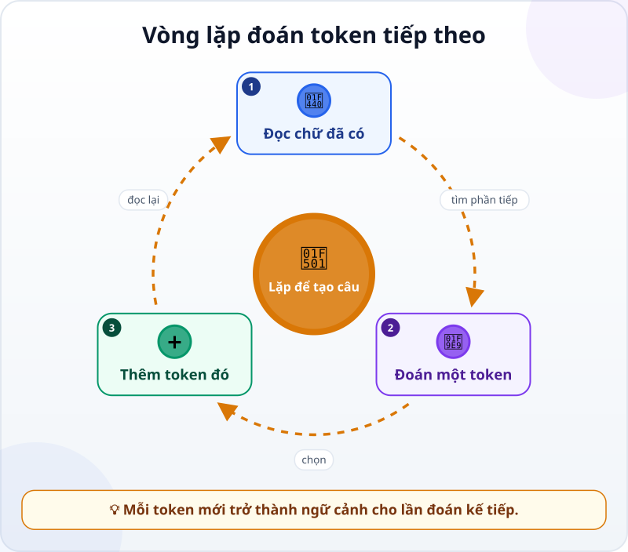
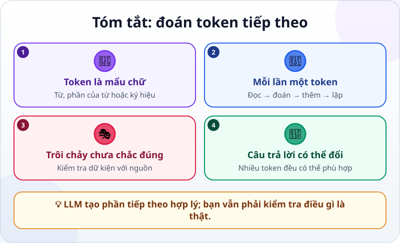

🌐 **Tiếng Việt** · [English](../../en/lessons/next-token-prediction.md) · [日本語](../../ja/lessons/next-token-prediction.md)

# Đoán chữ tiếp theo: bí mật đơn giản đằng sau LLM

<!-- section: objective -->
## Mục tiêu bài học

Sau bài này, bạn sẽ:

- Mô tả được cách LLM tạo câu trả lời, mỗi lần một token.
- Giải thích được vì sao văn trôi chảy không bảo đảm thông tin đúng.
- Biết vì sao cùng một câu hỏi có thể cho những câu trả lời khác nhau.

<!-- section: hook -->
## Mở đầu: vì sao nên quan tâm?

Mai gõ: *“Viết lời mở đầu thân thiện cho báo cáo bán hàng.”* Chỉ vài giây sau, AI trả về cả đoạn văn mạch lạc. Cảm giác như nó đã nghĩ sẵn toàn bộ đoạn rồi mới gửi ra.

Thực ra, một **mô hình ngôn ngữ lớn (LLM)** làm một việc đơn giản hơn: nhìn phần chữ đã có, chọn mẩu chữ có vẻ phù hợp để viết tiếp, rồi làm lại. Hiểu điều này giúp Mai không nhầm câu chữ tự tin với sự thật đã được kiểm tra.

<!-- section: concept -->
## Nội dung chính

### Token là mẩu chữ, không nhất thiết là một từ

LLM đọc và viết bằng **token**: những mẩu nhỏ có thể là một từ, một phần của từ, dấu câu hoặc ký hiệu. Người dùng thấy một câu; mô hình xử lý một chuỗi token.

### Một vòng rất nhỏ được lặp nhiều lần



Khi Mai bắt đầu bằng *“Báo cáo tháng này cho thấy…”*, mô hình:

1. Đọc tất cả token đang có trong [cửa sổ ngữ cảnh](context-window.md): yêu cầu, đoạn hội thoại và phần câu trả lời vừa viết.
2. Tính xem những token nào có vẻ hợp lý để đứng tiếp theo.
3. Chọn một token, chẳng hạn *“doanh”*, rồi thêm nó vào cuối.
4. Đọc lại chuỗi mới và lặp lại để có *“số”*, dấu phẩy, rồi những token sau đó.

Nó không lấy nguyên một câu hoàn chỉnh từ ngăn kéo. Mỗi token mới trở thành một phần đầu vào cho lần đoán kế tiếp. Những lựa chọn nhỏ nối nhau thành đoạn văn dài.

### “Có vẻ hợp lý” không có nghĩa là “đúng”

Mục tiêu gần nhất của vòng lặp là viết tiếp một cách phù hợp với phần chữ trước đó. Vì vậy, LLM rất giỏi tạo câu tự nhiên. Nhưng cơ chế đó không tự mở bảng tính của Mai, gọi điện cho khách hàng hay kiểm tra một ngày trên lịch.

Nếu thiếu dữ kiện, nó vẫn có thể tạo ra chuỗi chữ nghe hợp lý. Đây là một lý do dẫn tới [ảo giác AI](hallucination.md): câu trả lời có hình thức thuyết phục nhưng nội dung sai hoặc bịa. Với dữ kiện quan trọng, ta vẫn phải đưa nguồn vào và kiểm tra kết quả.

### Vì sao hỏi lại có thể được câu khác?

Ở một vị trí thường có nhiều token đều hợp lý: *“tăng”*, *“giảm”* hoặc *“ổn định”* đều có thể nối sau một câu chung chung về doanh số. Hệ thống có thể chọn giữa các khả năng phù hợp thay vì luôn lấy đúng một lựa chọn. Một lựa chọn khác ở đầu câu sẽ đổi phần chữ dùng cho các vòng sau, nên cả đoạn có thể rẽ sang hướng khác.

Điều đó hữu ích khi cần nhiều cách diễn đạt hoặc ý tưởng. Nhưng với dữ kiện, ta không nên hỏi đi hỏi lại rồi chọn câu mình thích nhất. Hãy đối chiếu với file, nguồn hoặc kết quả công cụ.

<!-- section: analogy -->
## Ví dụ đời thường

Hãy tưởng tượng trò nối câu. Một người nói *“Sáng nay tôi ra…”*; người tiếp theo đoán *“chợ”*; người khác nối *“mua”*. Mỗi người chỉ cần chọn một phần tiếp theo ăn khớp, nhưng cả nhóm dần tạo ra một câu chuyện.

LLM cũng nối tiếp từ phần đã có, nhưng bằng token và lặp rất nhanh. Điểm phép so sánh không đúng là người chơi có trải nghiệm, ý định và có thể dừng lại hỏi sự thật. Mô hình chỉ tạo đầu ra từ mẫu đã học và ngữ cảnh được đưa vào; đừng gán cho nó suy nghĩ hay trải nghiệm của con người.

<!-- section: example -->
## Ví dụ thực tế

Trong thư mục thực hành `ai-practice`, Mai có file giả lập `sales-note.txt`:

```text
Tháng: 6
Sản phẩm được hỏi nhiều: bình nước màu xanh
Việc cần làm: kiểm tra lại tồn kho
```

Cô yêu cầu: *“Dựa chỉ trên `sales-note.txt`, viết hai câu cập nhật cho nhóm. Nếu file không nói số lượng tồn kho, hãy nói chưa biết.”*

Mô hình bắt đầu từ yêu cầu và nội dung file, rồi tạo từng token. Cụm *“được hỏi nhiều”* giúp nó viết rằng khách quan tâm đến bình nước xanh. Ràng buộc *“nếu file không nói…”* giúp nó viết *“Chưa biết số lượng tồn kho”* thay vì điền một con số nghe hợp lý.

Mai kiểm tra từng ý với file. Câu văn có thể khác ở lần chạy khác, nhưng hai dữ kiện phải giữ nguyên. Nếu đầu ra nói *“còn nhiều hàng”*, cô loại bỏ: đó là câu nối có vẻ tự nhiên, không phải điều file chứng minh.

<!-- section: recap -->
## Tóm tắt bằng hình



<!-- section: takeaways -->
## Ghi nhớ

- LLM đọc và viết bằng token: từ, phần của từ hoặc ký hiệu.
- Nó đọc phần chữ đã có → chọn một token → thêm vào → lặp lại.
- Viết trôi chảy là kết quả của dự đoán phù hợp, không phải bằng chứng câu trả lời đúng.
- Nhiều token có thể phù hợp, nên cùng một câu hỏi có thể nhận câu trả lời khác.
- Với dữ kiện quan trọng, đưa nguồn vào và tự kiểm tra đầu ra.

<!-- section: quiz -->
## Tự kiểm tra

**Câu 1.** LLM tạo một đoạn trả lời theo cách nào?

- A) Viết toàn bộ đoạn trong một bước rồi mới đọc yêu cầu
- B) Đoán một token, thêm nó vào phần chữ đã có, rồi lặp lại
- C) Tìm một đoạn giống hệt trong một kho câu trả lời

**Câu 2.** Vì sao một câu trôi chảy vẫn có thể sai?

- A) Vì chọn phần chữ phù hợp không tự động kiểm tra sự thật ngoài đời
- B) Vì mọi token đều là một câu hoàn chỉnh
- C) Vì LLM không thể viết dấu câu

**Câu 3.** Cách nào phù hợp khi dùng AI tóm tắt `sales-note.txt`?

- A) Chạy nhiều lần rồi chọn con số lớn nhất
- B) Tin đầu ra nào có giọng tự tin nhất
- C) Yêu cầu chỉ dùng file và đối chiếu từng dữ kiện với file

<details>
<summary>Xem đáp án</summary>

1. **B** — mỗi token mới được thêm vào rồi trở thành ngữ cảnh cho lần đoán kế tiếp.
2. **A** — văn bản hợp lý và sự thật đã được kiểm chứng là hai việc khác nhau.
3. **C** — ràng buộc nguồn và kiểm tra lại giúp phát hiện thông tin được tự điền thêm.

</details>
