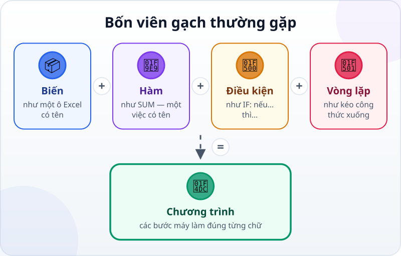
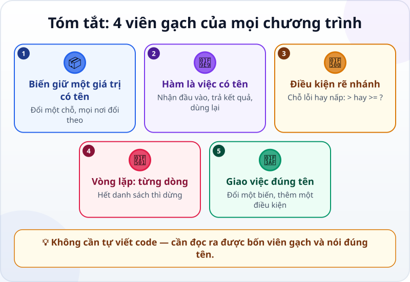

🌐 **Tiếng Việt** · [English](../../en/lessons/programming-building-blocks.md) · [日本語](../../ja/lessons/programming-building-blocks.md)

# Biến, hàm, điều kiện, vòng lặp: 4 viên gạch thường gặp

<!-- section: objective -->
## Mục tiêu bài học

Sau bài này, bạn sẽ:

- Gọi đúng tên bốn viên gạch mà phần lớn chương trình kết hợp: **biến, hàm, điều kiện, vòng lặp** — và thấy chúng đã có sẵn trong Excel.
- Đọc một đoạn code ngắn do agent viết và nói lại bằng lời thường nó làm gì.
- Dùng bốn từ này để giao việc và kiểm tra thay đổi chính xác hơn.

<!-- section: hook -->
## Mở đầu: vì sao nên quan tâm?

Mai nhờ agent viết một chương trình nhỏ: đọc file `chi_phi.csv` (dữ liệu giả, như trong bài [Viết yêu cầu tốt](writing-good-specs.md)), cộng tổng và liệt kê các khoản chi lớn. Agent chạy xong, kết quả đúng. Nhưng khi Mai mở file `tong_hop.py`, cô thấy mười mấy dòng chữ lạ: `def`, `for`, `if`…

*"Mình làm kế toán, đâu phải lập trình viên. Đọc sao nổi?"*

Tin tốt: Mai đọc được. Phần lớn chương trình kết hợp bốn viên gạch này; chương trình nhỏ có thể chỉ dùng một hoặc hai. Mai gặp cả bốn ý tưởng mỗi ngày — trong Excel.

<!-- section: concept -->
## Nội dung chính

### Bốn viên gạch



1. **Biến (variable)** — một cái hộp có tên, giữ một giá trị. Trong Excel: một ô bạn đặt tên, như ô `ty_gia` chứa 25.000. Trong code: `NGUONG = 500000`. Đổi giá trị ở một chỗ, mọi nơi dùng tên đó đổi theo.
2. **Hàm (function)** — một việc có tên: nhận đầu vào, trả kết quả, dùng lại được nhiều lần. Trong Excel: `SUM`, `VLOOKUP`. Trong code, agent tự đặt tên cho hàm, như `la_khoan_lon(so_tien)`: đưa vào một số tiền, nhận lại "có" hoặc "không".
3. **Điều kiện (condition)** — *nếu… thì…, không thì…*. Trong Excel: `IF`. Trong code: `if so_tien >= NGUONG:`. Đây là chỗ chương trình rẽ nhánh — và là chỗ lỗi hay nấp nhất: dùng `>` hay `>=`? Khoản đúng bằng ngưỡng có tính là lớn không?
4. **Vòng lặp (loop)** — làm lại cùng các bước cho từng phần tử: từng dòng, từng file, từng khách hàng. Trong Excel: kéo công thức xuống cho mọi dòng **hoạt động giống một vòng lặp**, dù thao tác điền công thức không tự nó là vòng lặp trong code. Trong code: `for dong in ...:`.

Các ngôn ngữ lập trình có thể diễn đạt những ý tưởng này khác nhau. Phần lớn chương trình kết hợp vài viên gạch; một chương trình nhỏ có thể chỉ dùng một hoặc hai.

### Vì sao người giao việc cần biết?

Bạn không cần tự viết code. Nhưng biết tên bốn viên gạch giúp bạn:

- **Đọc** code agent viết như đọc một công thức: tìm biến, hàm, điều kiện, vòng lặp, rồi nói lại bằng lời.
- **Giao việc chính xác:** "đổi ngưỡng từ 500.000 thành 1.000.000" là sửa một biến; "bỏ qua các dòng hạng mục Khac" là thêm một điều kiện.
- **Kiểm tra thay đổi:** bạn chỉ nhờ đổi một biến mà thay đổi (diff) sửa cả vòng lặp? Đó là lúc hỏi lại agent — như trong bài [Đọc và review thay đổi của agent](reviewing-agent-changes.md).

<!-- section: analogy -->
## Ví dụ đời thường

Đi chợ Tết với một tờ danh sách:

- **Biến:** ngân sách 2 triệu đồng — ghi một lần ở đầu tờ giấy, cần thì nhìn lại.
- **Hàm:** "mua một món" = hỏi giá, trả giá, trả tiền, bỏ vào giỏ. Một chuỗi bước có tên, món nào cũng dùng được.
- **Điều kiện:** món nào đắt hơn 200 nghìn thì cân nhắc; không thì mua luôn.
- **Vòng lặp:** với mỗi món trong danh sách, làm "mua một món" — hết danh sách thì về.

Chỗ chưa khớp: bạn tự linh động — hết hàng thì mua món khác, gặp người quen thì dừng lại hỏi thăm. Chương trình thì không: nó chỉ làm đúng những gì được viết. Tình huống nào chưa thành điều kiện trong code, chương trình không tự xử lý được — vì vậy spec của bạn cần nói trước những trường hợp đặc biệt.

<!-- section: example -->
## Ví dụ thực tế

Đây là `tong_hop.py` agent viết cho Mai. Phần sau dấu `#` là ghi chú cho người đọc; máy bỏ qua chúng.

```python
import csv

NGUONG = 500000                       # biến: từ mức này trở lên là "khoản lớn" (đồng)


def la_khoan_lon(so_tien):            # hàm: khoản này có lớn không?
    return so_tien >= NGUONG


tong = 0                              # biến: tổng, bắt đầu từ 0
with open("chi_phi.csv", encoding="utf-8") as f:
    for dong in csv.DictReader(f):    # vòng lặp: lần lượt từng dòng
        so_tien = int(dong["so_tien"])
        tong = tong + so_tien
        if la_khoan_lon(so_tien):     # điều kiện: chỉ in các khoản lớn
            print("Khoản lớn:", dong["ngay"], dong["hang_muc"], so_tien)

print("Tổng chi phí:", tong)
```

Mai đọc bằng lời thường, từ trên xuống:

1. Đặt biến `NGUONG` là 500.000 đồng: từ mức này trở lên là "khoản lớn".
2. Tạo hàm `la_khoan_lon`: đưa vào một số tiền, trả lời có lớn hay không.
3. Đặt `tong` bằng 0, mở `chi_phi.csv`, rồi **với từng dòng**: lấy số tiền, cộng vào tổng; **nếu** là khoản lớn thì in ra.
4. Hết file thì in tổng.

Từ đó, Mai giao việc chính xác hơn hẳn:

- *"Đổi NGUONG thành 1.000.000."* — sửa đúng một biến; thay đổi chỉ nên có một dòng.
- *"Bỏ qua các dòng có hang_muc là Khac."* — thêm một điều kiện bên trong vòng lặp.
- *"Khoản đúng bằng 500.000 có tính là lớn không?"* — một câu hỏi về điều kiện `>=`, và là một tiêu chí nghiệm thu đáng ghi vào spec.

Mẹo: gặp đoạn code khó, nhờ agent: *"Giải thích từng dòng bằng lời thường, chỉ rõ đâu là biến, hàm, điều kiện, vòng lặp."*

<!-- section: misconceptions -->
## Hiểu lầm thường gặp

- **"Phải thuộc cú pháp mới làm việc được với agent."** — Bạn cần nhận ra bốn viên gạch và nói được chúng làm gì. Viết đúng từng dấu hai chấm là việc của agent — và của các phép kiểm tra.
- **"Công thức Excel không phải lập trình."** — `=IF(C2>=500000;"Lớn";"")` cho thấy ba viên gạch trong công thức: ô (biến), hàm `IF` và điều kiện. Kéo công thức xuống **hoạt động giống** vòng lặp, chứ không phải bản thân công thức chứa một vòng lặp.
- **"Vòng lặp thì chạy mãi."** — Vòng lặp qua một danh sách sẽ dừng khi hết danh sách. Vòng lặp không bao giờ dừng là một lỗi: chương trình chạy mãi không xong thì đó là chỗ đầu tiên nên nghi.

<!-- section: recap -->
## Tóm tắt bằng hình



<!-- section: takeaways -->
## Ghi nhớ

- Phần lớn chương trình kết hợp biến, hàm, điều kiện và vòng lặp; chương trình nhỏ có thể chỉ dùng một hoặc hai.
- Biến giữ một giá trị có tên; hàm là một việc có tên, dùng lại được; điều kiện rẽ nhánh; vòng lặp làm lại cho từng phần tử.
- Bạn đã gặp cả bốn ý tưởng trong Excel: ô có tên, `SUM`, `IF`; kéo công thức xuống hoạt động giống vòng lặp.
- Đọc code agent viết bằng cách tìm bốn viên gạch rồi nói lại bằng lời thường.
- Giao việc bằng đúng tên — đổi một biến, thêm một điều kiện — rồi xem thay đổi có chỉ ở đúng chỗ đó không.

<!-- section: quiz -->
## Tự kiểm tra

**Câu 1.** Trong code của Mai, `NGUONG = 500000` là viên gạch nào?

- A) Vòng lặp
- B) Hàm
- C) Biến

**Câu 2.** Mai muốn chương trình bỏ qua các dòng hạng mục Khac. Cô nên nhờ agent thêm gì?

- A) Một điều kiện bên trong vòng lặp
- B) Một biến mới ở đầu file
- C) Một file dữ liệu mới

**Câu 3.** Mai chỉ nhờ đổi ngưỡng thành 1.000.000, nhưng thay đổi của agent sửa cả vòng lặp và hàm. Cô nên làm gì?

- A) Chấp nhận, vì agent biết rõ hơn
- B) Hỏi agent vì sao phải sửa những chỗ đó, trước khi chấp nhận
- C) Tự sửa lại code bằng tay

<details>
<summary>Xem đáp án</summary>

1. **C** — một cái tên giữ một giá trị là biến.
2. **A** — "bỏ qua khi…" là một điều kiện; đặt trong vòng lặp để áp dụng cho từng dòng.
3. **B** — yêu cầu chỉ đổi một biến; thay đổi rộng hơn cần được giải thích trước khi chấp nhận.

</details>
