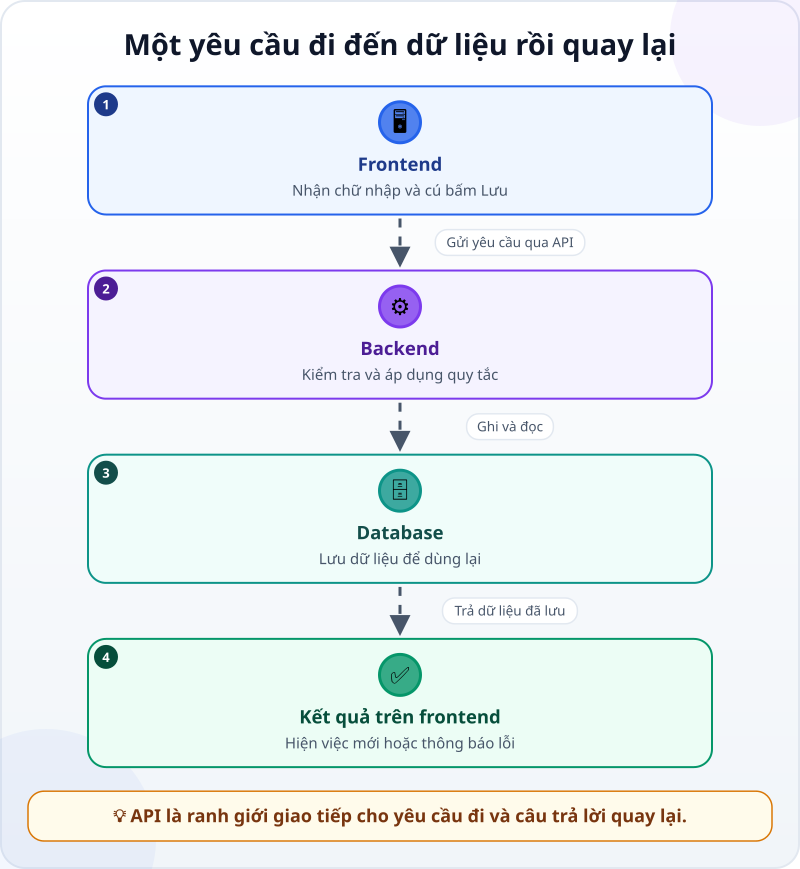
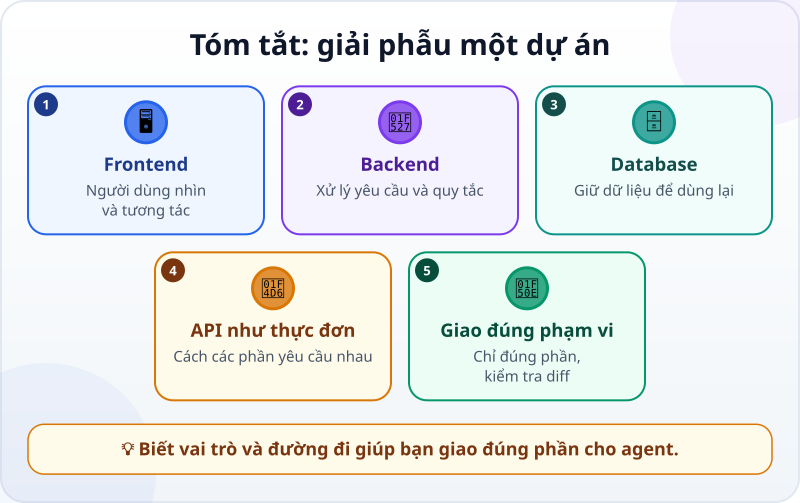

🌐 **Tiếng Việt** · [English](../../en/lessons/project-anatomy.md) · [日本語](../../ja/lessons/project-anatomy.md)

# Giải phẫu một dự án: frontend, backend, database, API

<!-- section: objective -->
## Mục tiêu bài học

Sau bài này, bạn sẽ:

- Nêu được vai trò cơ bản của frontend, backend, database và API trong một ứng dụng.
- Theo được một yêu cầu từ màn hình đến dữ liệu rồi quay lại.
- Chỉ đúng phần cho agent sửa và dùng tên thư mục trong diff để kiểm tra phạm vi.

<!-- section: hook -->
## Mở đầu: vì sao nên quan tâm?

Mai mở ứng dụng việc tuần và bấm **Lưu**. Một lát sau, việc mới hiện trên màn hình. Cô chỉ thấy một nút, nhưng phía sau nút ấy có thể là nhiều phần phối hợp: phần nhận cú bấm, phần kiểm tra quy tắc, nơi giữ dữ liệu và cách các phần nói chuyện với nhau.

Nếu Mai chỉ bảo agent “sửa ứng dụng”, phạm vi quá rộng. Agent có thể thay giao diện khi lỗi nằm ở xử lý, hoặc sửa nơi lưu dữ liệu dù yêu cầu chỉ là đổi màu nút. Người dẫn dắt không cần tự xây mọi phần, nhưng cần biết gọi đúng tên phần và kiểm tra agent có ở đúng ranh giới không.

<!-- section: concept -->
## Nội dung chính

### Bốn vai trò trong một ứng dụng

- **Frontend** là phần người dùng nhìn và tương tác: màn hình, ô nhập, nút và thông báo. Thư mục thường có tên như `frontend/`, `web/` hoặc `app/`.
- **Backend** nhận yêu cầu, áp dụng quy tắc và chuẩn bị câu trả lời. Ví dụ: từ chối tên việc trống hoặc quyết định thứ tự. Thư mục có thể là `backend/`, `server/` hoặc `api/`.
- **Database** là nơi dữ liệu được lưu để còn tồn tại sau khi đóng ứng dụng: việc, ngày và trạng thái. Dự án có thể để phần liên quan trong `database/`, `db/`, `migrations/` hoặc `models/`.
- **API** là cách đã được quy định để các chương trình yêu cầu dữ liệu hoặc hành động từ nhau. Nó nêu yêu cầu nào được phép gửi, cần thông tin gì và câu trả lời có hình dạng ra sao.

Tên thư mục chỉ là dấu hiệu, không phải luật chung. Một dự án nhỏ có thể để nhiều vai trò trong cùng thư mục; một dự án lớn có thể chia nhỏ hơn. Hãy đọc cấu trúc và quy ước của chính dự án trước khi kết luận.

### Một yêu cầu đi rồi quay lại



Khi Mai thêm một việc, đường đi có thể là:

1. **Frontend** nhận chữ Mai nhập và cú bấm Lưu.
2. Frontend gửi một yêu cầu qua **API**: “Tạo việc với tên này.”
3. **Backend** kiểm tra tên không trống và yêu cầu có hợp lệ không.
4. Backend ghi việc vào **database**, rồi đọc kết quả đã lưu.
5. Câu trả lời đi ngược qua API về frontend; frontend vẽ việc mới hoặc báo lỗi.

API không nhất thiết là một ứng dụng thứ năm. Nó là **ranh giới giao tiếp** giữa các phần. Trong dự án, code định nghĩa API thường nằm cùng backend, nhưng frontend cũng có code để gọi nó.

### Người dẫn dắt dùng bản đồ này thế nào?

Đừng chỉ giao “sửa nút Lưu”. Hãy nói hiện tượng, phần dự đoán cần đổi và ranh giới:

> Trong `ai-practice`, khi tên việc trống, hãy để backend từ chối và frontend hiện “Hãy nhập tên”. Không đổi cấu trúc database. Trước khi sửa, hãy chỉ ra các file dự định chạm tới.

Sau khi agent làm, đọc **diff** — danh sách thay đổi giữa trước và sau. Nếu yêu cầu chỉ đổi màu nút mà diff có file trong `database/`, hãy dừng và hỏi vì sao. Nếu thêm quy tắc kiểm tra nhưng chỉ có `frontend/` đổi, hãy hỏi liệu backend có còn nhận dữ liệu sai từ nơi khác không. Thư mục giúp bạn nhận ra phần; nội dung diff mới cho biết thay đổi thật sự.

<!-- section: analogy -->
## Ví dụ đời thường

Hãy hình dung một nhà hàng:

- Phòng ăn nơi khách nhìn và gọi món giống **frontend**.
- Bếp áp dụng công thức và chuẩn bị món giống **backend**.
- Kho giữ nguyên liệu giống **database**.
- **API giống thực đơn nhà hàng**: khách thấy những món có thể gọi và cách gọi, không cần biết bếp sắp xếp bên trong ra sao.

Khách chọn trên thực đơn; nhân viên chuyển yêu cầu đến bếp; bếp lấy nguyên liệu trong kho; món ăn quay lại bàn. Tương tự, màn hình gửi một yêu cầu theo API, backend xử lý với dữ liệu, rồi trả kết quả.

Chỗ chưa khớp: dữ liệu không bị “dùng hết” như nguyên liệu, và API còn quy định dạng câu trả lời chứ không chỉ liệt kê món. Một ứng dụng cũng có thể gộp nhiều vai trò trên cùng một máy.

<!-- section: example -->
## Ví dụ thực tế

Trong dự án giả định `ai-practice/task-app`, Mai thấy:

```text
task-app/
├── frontend/
│   └── TaskForm.js
├── backend/
│   └── tasks.js
├── database/
│   └── schema.sql
└── README.md
```

Ba yêu cầu nghe gần nhau nhưng thuộc các phần khác nhau:

- “Đổi chữ nút từ **Thêm** thành **Lưu việc**” — bắt đầu ở `frontend/`.
- “Không cho lưu tên chỉ có khoảng trắng” — quy tắc phải được bảo vệ ở `backend/`; frontend cũng có thể báo sớm để dễ dùng.
- “Mỗi việc cần thêm ngày đến hạn và phải lưu lại” — có thể chạm `database/`, backend/API và frontend. Đây là thay đổi xuyên nhiều phần, nên Mai yêu cầu agent lập kế hoạch trước.

Giả sử việc đầu tiên tạo diff chỉ có `frontend/TaskForm.js`: phạm vi hợp lý. Nếu agent còn sửa `database/schema.sql`, Mai không cần hiểu từng dòng để phát hiện điều bất thường. Cô hỏi: “Vì sao đổi nhãn nút cần đổi database?” Đó là cách dẫn dắt bằng ranh giới của dự án.

<!-- section: misconceptions -->
## Hiểu lầm thường gặp

- **“Frontend là đẹp, backend là mọi thứ quan trọng.”** — Frontend cũng có hành vi quan trọng; backend bảo vệ quy tắc và phối hợp dữ liệu. Hai phần phục vụ vai trò khác nhau.
- **“Database chỉ là một file bảng tính.”** — Nó là vai trò lưu và truy xuất dữ liệu bền vững; công nghệ cụ thể có nhiều dạng.
- **“API là database.”** — API là cách yêu cầu; database là nơi lưu. Backend có thể trả lời API mà không cần database, hoặc dùng nhiều nguồn dữ liệu.
- **“Thấy đúng tên thư mục là đủ.”** — Tên chỉ giúp định hướng. Luôn đọc diff và cách dự án thật tổ chức code.

<!-- section: recap -->
## Tóm tắt bằng hình



<!-- section: takeaways -->
## Ghi nhớ

- Frontend nhận tương tác; backend xử lý quy tắc; database giữ dữ liệu.
- API là cách giao tiếp đã quy định — giống thực đơn, không phải căn bếp hay kho.
- Một yêu cầu đi từ màn hình tới dữ liệu và kết quả quay lại màn hình.
- Hãy giao đúng phần và kiểm tra thư mục cùng nội dung trong diff.

<!-- section: quiz -->
## Tự kiểm tra

**Câu 1.** Phần nào chủ yếu giữ dữ liệu để dùng lại sau này?

- A) Frontend
- B) API
- C) Database

**Câu 2.** Trong phép so sánh nhà hàng, API giống gì nhất?

- A) Thực đơn quy định những gì có thể gọi
- B) Kho nguyên liệu
- C) Căn bếp nấu món

**Câu 3.** Agent đổi màu một nút nhưng diff có cả file database. Bạn nên làm gì?

- A) Chấp nhận vì agent biết nhiều hơn
- B) Dừng và hỏi vì sao thay đổi giao diện cần chạm database
- C) Xóa toàn bộ dự án ngay

<details>
<summary>Xem đáp án</summary>

1. **C** — database có vai trò lưu và truy xuất dữ liệu bền vững.
2. **A** — API quy định các yêu cầu có thể gửi, giống thực đơn cho biết món có thể gọi.
3. **B** — file ngoài phạm vi dự kiến là tín hiệu cần giải thích trước khi chấp nhận.

</details>
