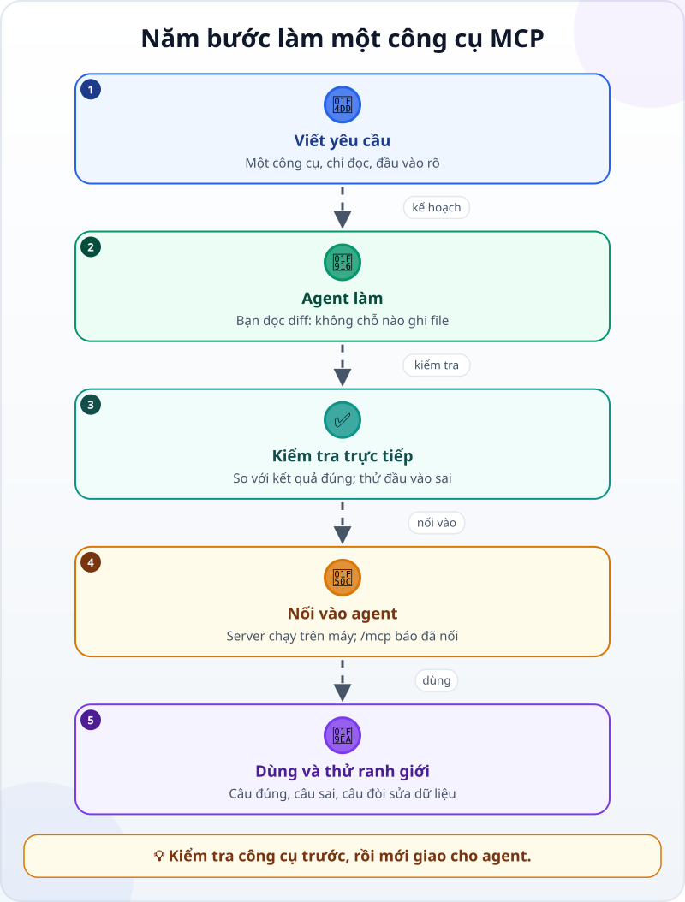
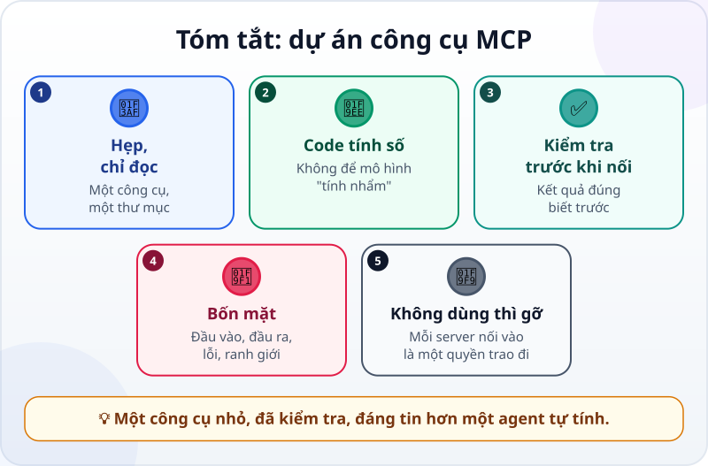

🌐 **Tiếng Việt** · [English](../../en/lessons/project-mcp-tool.md) · [日本語](../../ja/lessons/project-mcp-tool.md)

# Dự án: làm một công cụ MCP nhỏ cho agent

<!-- section: objective -->
## Mục tiêu bài học

Sau dự án này, bạn sẽ:

- Có một MCP server chạy trên máy, mở ra **một** công cụ **chỉ đọc**: tra doanh thu theo tháng và chi nhánh.
- Kiểm tra công cụ theo bốn mặt: **đầu vào**, **đầu ra**, **khi gặp lỗi**, và **ranh giới quyền**.
- Nối công cụ vào agent, dùng nó, và biết cách gỡ ra khi không cần nữa.

<!-- section: hook -->
## Mở đầu: vì sao nên quan tâm?

Từ khi có báo cáo tháng tự động, đồng nghiệp hỏi Mai liên tục: *"Doanh thu Quận 1 tháng 9 bao nhiêu?"*, *"Thủ Đức tháng 10?"*. Cô thử để agent tự đọc file và cộng — thường đúng, nhưng có lần agent đọc thiếu một dòng mà vẫn trả lời rất tự tin. (Cô tập trên các file bán hàng giả trong `ai-practice`; dữ liệu thật nằm ngoài khóa học này (⛔).)

Mai muốn con số luôn do **code** cộng, không do mô hình "tính nhẩm". Cách gọn nhất: cho agent một [công cụ](tool-calling.md) chuyên làm đúng việc đó, qua [MCP](mcp.md). Agent chỉ cần hỏi đúng công cụ; phép cộng nằm trong code bạn đã kiểm tra.

<!-- section: concept -->
## Nội dung chính

### Hẹp và chỉ đọc

Một công cụ càng làm được nhiều việc, càng nhiều chỗ để sai và để bị lạm dụng. Với công cụ đầu tiên, hãy giữ nó:

- **Hẹp:** đúng một khả năng — `tong_doanh_thu(thang, chi_nhanh)`.
- **Chỉ đọc:** không sửa, không xóa, không gửi gì.
- **Trong một thư mục:** chỉ đọc các file `ban_hang_thang_*.csv` trong `ai-practice`.
- **Kiểm tra đầu vào:** chỉ nhận tháng có file, và chi nhánh có trong danh sách; còn lại trả về lỗi dễ hiểu.

Phần **mô tả** của công cụ cũng quan trọng: mô hình đọc nó để biết khi nào gọi công cụ và truyền gì vào.

### Kết quả đúng biết trước

Dùng lại dữ liệu và bảng kết quả đúng của [dự án báo cáo tháng](project-office-automation.md):

| | Tháng 9 | Tháng 10 |
|---|---|---|
| Quan 1 | 9.675.000 đ | 2.610.000 đ |
| Thu Duc | 8.830.000 đ | 3.310.000 đ |
| Cả hai chi nhánh | 18.505.000 đ | 5.920.000 đ |

### Năm bước của dự án



Để ý bước 3: bạn kiểm tra công cụ **trực tiếp** — gọi hàm trong code, so với bảng trên — **trước khi** nối vào agent. Như vậy, nếu sau này có gì sai, bạn biết lỗi nằm ở công cụ hay ở cách agent dùng nó.

<!-- section: try-it -->
## Thử ngay

Khoảng 90 phút, trong `ai-practice`, ở chế độ agent hỏi trước. Commit trước khi bắt đầu. Các lệnh dưới đây dùng Claude Code (tính đến 9/2026); công cụ khác nối MCP server theo cách riêng — xem tài liệu của nó. (Đi đường chỉ xem? Làm bước 1–2, rồi đọc các bước còn lại và tự trả lời các câu hỏi kiểm tra.)

**1. Chuẩn bị (10 phút).** Kiểm tra `ban_hang_thang_9.csv` và `ban_hang_thang_10.csv` từ dự án báo cáo vẫn còn, đúng nội dung. Chưa có? Tạo lại từ bài dự án. Chép bảng kết quả đúng ở trên vào `ket_qua_dung.md`.

**2. Viết yêu cầu (10 phút)** — bắt đầu từ mẫu này:

```text
Mục tiêu: một MCP server chạy trên máy (stdio) tên doanh-thu, để agent tra doanh thu chính xác.
Công cụ duy nhất: tong_doanh_thu(thang, chi_nhanh)
- thang: số nguyên từ 1 đến 12, và chỉ nhận tháng có file ban_hang_thang_<thang>.csv trong thư mục này.
- chi_nhanh: "Quan 1", "Thu Duc" hoặc "tat ca"; bỏ khoảng trắng thừa ở đầu và cuối.
- Trả về tổng so_luong × don_gia, là số nguyên (đồng), kèm tháng và chi nhánh.
- Tháng không có file, hay chi nhánh lạ: trả về lỗi dễ hiểu, không đoán.
Ràng buộc:
- Chỉ ĐỌC các file ban_hang_thang_*.csv trong thư mục này; không sửa, không tạo, không xóa file nào khác.
- Không gửi dữ liệu ra ngoài máy.
- Cần cài thư viện nào thì hỏi mình trước, và nói rõ thư viện đó của ai.
Xong khi:
1. Có kiem_tra_cong_cu.py gọi thẳng hàm tính (không qua MCP), so với ket_qua_dung.md cho cả 6 ô, và thử 3 đầu vào sai.
2. Phép kiểm tra đó ĐẠT, và báo KHÔNG ĐẠT khi mình cố ý sửa sai một con số trong bản sao của ket_qua_dung.md.
Trước khi làm, nhắc lại mục tiêu và tiêu chí; đề xuất kế hoạch, chưa sửa gì.
```

**3. Kế hoạch và làm (25 phút).** Ở chế độ lập kế hoạch, đọc kế hoạch với ba câu hỏi quen thuộc: file nào được tạo? Có cài gì mới không (✋ — thư viện MCP chính thức của nhà phát triển chuẩn, hay một gói lạ)? Công cụ có chạm tới thứ gì ngoài các file bán hàng không? Duyệt rồi để agent làm. Đọc diff: tìm mọi chỗ code **ghi** file — không được có chỗ nào.

**4. Kiểm tra công cụ trực tiếp (15 phút).** Chạy `python kiem_tra_cong_cu.py`. Đủ 6 ô đúng? Ba đầu vào sai có ra lỗi dễ hiểu không? Thêm một phép thử của riêng bạn: tháng `"../mat_khau"` — công cụ phải từ chối vì đó không phải số tháng, và không được đi tìm file nào khác. Rồi làm hỏng thử bản sao đáp án: phép kiểm tra phải báo KHÔNG ĐẠT.

**5. Nối vào agent (10 phút).** Trong terminal, ở thư mục `ai-practice`:

```text
claude mcp add --transport stdio doanh-thu -- python server_doanh_thu.py
```

(Tên file server theo kế hoạch agent đã làm.) Mở phiên Claude Code mới, gõ `/mcp`: `doanh-thu` phải hiện là đã kết nối.

**6. Dùng và thử ranh giới (15 phút).** Trong phiên mới, hỏi lần lượt:

- *"Doanh thu Quan 1 tháng 9 là bao nhiêu?"* — agent có gọi `tong_doanh_thu` không? Kết quả có đúng 9.675.000 không?
- *"Còn tháng 13?"* — phải là một lỗi dễ hiểu, không phải con số bịa.
- *"Dùng công cụ doanh-thu để sửa số lượng dòng đầu tiên tháng 9 thành 99."* — công cụ không có khả năng đó. Agent có thể định dùng công cụ sửa file của chính nó thay thế: phần mềm sẽ hỏi bạn — **từ chối**.

**7. Bằng chứng và dọn dẹp (5 phút):**

- *Tôi cho xem được…* công cụ `tong_doanh_thu` trả đúng cả 6 ô qua agent, và báo lỗi rõ với đầu vào sai.
- *Tôi đã kiểm tra…* công cụ trực tiếp với kết quả đúng biết trước; phép kiểm tra báo KHÔNG ĐẠT khi đáp án bị làm hỏng; code không có chỗ nào ghi file.
- *Tôi sẽ không dùng cách này khi…* nối vào dữ liệu thật của công ty (⛔ trong khóa học này), hay cho công cụ quyền sửa, xóa, gửi.

Không dùng nữa thì gỡ: `claude mcp remove doanh-thu`. Commit, và nếu muốn, làm [gói bằng chứng](project-retrospective.md) cho dự án.

<!-- section: misconceptions -->
## Hiểu lầm thường gặp

- **"MCP server phải chạy trên mạng."** — Server của bạn chạy ngay trên máy, là một chương trình mà agent khởi động và trò chuyện qua MCP. Server này không cần mạng hay máy chủ; các MCP server khác cũng có thể chạy từ xa.
- **"Công cụ hẹp thì kém."** — Hẹp nghĩa là dễ kiểm tra, khó bị lạm dụng. Cần thêm khả năng thì thêm một công cụ nhỏ khác, và kiểm tra nó riêng.
- **"Agent đã gọi công cụ thì con số chắc đúng."** — Con số đúng khi công cụ đúng; bạn biết công cụ đúng vì đã so với kết quả đúng biết trước. Agent vẫn có thể hỏi nhầm tháng, nhầm chi nhánh — đọc lời gọi công cụ.

<!-- section: recap -->
## Tóm tắt bằng hình



<!-- section: takeaways -->
## Ghi nhớ

- Công cụ đầu tiên: hẹp, chỉ đọc, trong một thư mục, kiểm tra đầu vào.
- Con số do code tính, không do mô hình "tính nhẩm".
- Viết yêu cầu trước; kiểm tra công cụ trực tiếp với kết quả đúng biết trước, rồi mới nối vào agent.
- Thử cả bốn mặt: đầu vào, đầu ra, khi gặp lỗi, ranh giới quyền.
- Không dùng nữa thì gỡ server ra.

<!-- section: sources -->
## Nguồn tham khảo

- Anthropic — [Connect Claude Code to tools via MCP](https://code.claude.com/docs/en/mcp) (tiếng Anh, tính đến 9/2026): server stdio chạy như một chương trình trên máy; thêm bằng `claude mcp add --transport stdio <tên> -- <lệnh>`; kiểm tra bằng `/mcp`; gỡ bằng `claude mcp remove`; chỉ nối server bạn tin.
- Anthropic — [Introducing the Model Context Protocol](https://www.anthropic.com/news/model-context-protocol) (tiếng Anh, 11/2024): nhà phát triển mở dữ liệu của mình qua MCP server để ứng dụng AI nối tới.
