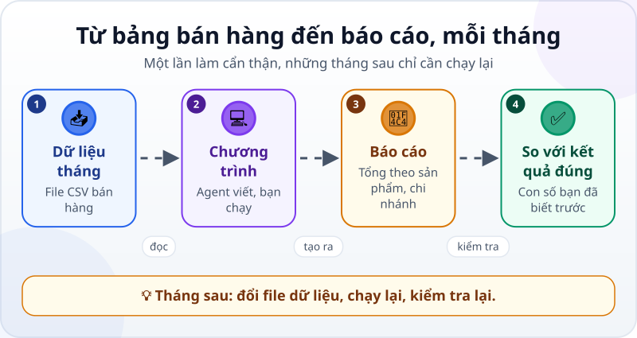
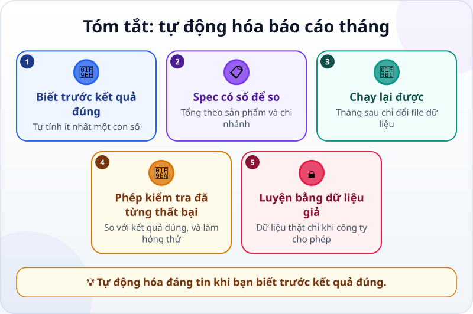

🌐 **Tiếng Việt** · [English](../../en/lessons/project-office-automation.md) · [日本語](../../ja/lessons/project-office-automation.md)

# Dự án: tự động hóa việc văn phòng (bảng tính → báo cáo)

<!-- section: objective -->
## Mục tiêu bài học

Sau dự án này, bạn sẽ:

- Có một chương trình tạo báo cáo doanh thu tháng từ file bán hàng, **chạy lại được** cho tháng sau.
- Kiểm chứng báo cáo bằng **kết quả đúng biết trước** và một phép kiểm tra đã từng thất bại.
- Biết khi nào nên — và chưa nên — dùng cách này với dữ liệu thật ở chỗ làm.

<!-- section: hook -->
## Mở đầu: vì sao nên quan tâm?

Mai làm kế toán. Cuối mỗi tháng, cô mất nửa ngày cộng doanh thu theo sản phẩm và chi nhánh từ file bán hàng. Việc lặp lại, dễ nhầm, và nhàm chán — đúng loại việc nên tự động hóa.

Nhưng một báo cáo sai được gửi cho quản lý còn tệ hơn làm tay. Dự án này dạy điều quan trọng nhất của tự động hóa: **chỉ tin chương trình khi bạn đã có cách biết nó đúng.**

<!-- section: concept -->
## Nội dung chính

### Từ bảng bán hàng đến báo cáo



Agent viết một chương trình nhỏ bằng Python: đọc file CSV bán hàng, tính doanh thu (số lượng × đơn giá), cộng theo sản phẩm và chi nhánh, rồi ghi ra một báo cáo. Bạn chạy chương trình và kiểm tra. Tháng sau, chỉ cần đổi file dữ liệu.

**Chưa cài được Python?** Có đường chỉ dùng bảng tính: mở file CSV bằng Excel hoặc Google Sheets, thêm cột doanh thu, rồi dùng bảng tổng hợp (pivot table) hoặc hàm `SUMIF` — nhờ agent hay chatbot hướng dẫn từng bước. Bước kiểm tra với kết quả đúng thì giữ nguyên.

### Kết quả đúng biết trước

Trước khi giao việc, hãy biết ít nhất một con số đúng. Với dữ liệu mẫu bên dưới, kết quả đúng là:

| | Tháng 9 | Tháng 10 |
|---|---|---|
| **Tổng doanh thu** | 18.505.000 đ | 5.920.000 đ |
| Ca phe hat | 6.480.000 đ | 3.600.000 đ |
| Tra xanh | 6.175.000 đ | 1.330.000 đ |
| Banh quy | 5.850.000 đ | 990.000 đ |
| Quan 1 | 9.675.000 đ | 2.610.000 đ |
| Thu Duc | 8.830.000 đ | 3.310.000 đ |

Ở chỗ làm, bạn sẽ không có sẵn bảng này — nhưng bạn luôn có thể tự tính một hai con số (một sản phẩm, một chi nhánh) để so.

### Còn dữ liệu thật ở công ty?

Luyện bằng dữ liệu giả. Dùng dữ liệu thật **chỉ khi công ty cho phép**, bằng công cụ được duyệt, đúng quy định — và vẫn so báo cáo với một con số bạn tự tính.

<!-- section: try-it -->
## Thử ngay

Khoảng 90 phút, trong `ai-practice`, ở chế độ agent hỏi trước. Commit trước khi bắt đầu.

**1. Tạo dữ liệu (10 phút).** Nhờ agent tạo hai file với **đúng** nội dung sau.

`ban_hang_thang_9.csv`:

```text
ngay,chi_nhanh,san_pham,so_luong,don_gia
2026-09-02,Quan 1,Ca phe hat,12,180000
2026-09-03,Thu Duc,Tra xanh,20,95000
2026-09-05,Quan 1,Banh quy,30,45000
2026-09-08,Thu Duc,Ca phe hat,8,180000
2026-09-10,Quan 1,Tra xanh,15,95000
2026-09-12,Thu Duc,Banh quy,25,45000
2026-09-15,Quan 1,Ca phe hat,10,180000
2026-09-18,Thu Duc,Tra xanh,18,95000
2026-09-20,Quan 1,Banh quy,40,45000
2026-09-23,Thu Duc,Ca phe hat,6,180000
2026-09-26,Quan 1,Tra xanh,12,95000
2026-09-29,Thu Duc,Banh quy,35,45000
```

`ban_hang_thang_10.csv`:

```text
ngay,chi_nhanh,san_pham,so_luong,don_gia
2026-10-03,Quan 1,Ca phe hat,9,180000
2026-10-09,Thu Duc,Tra xanh,14,95000
2026-10-16,Quan 1,Banh quy,22,45000
2026-10-24,Thu Duc,Ca phe hat,11,180000
```

**2. Tự tính một con số (10 phút).** Bằng máy tính cầm tay: doanh thu Ca phe hat tháng 9 = (12 + 8 + 10 + 6) × 180.000 = ? So với bảng kết quả đúng.

**3. Viết spec (10 phút)** — bắt đầu từ mẫu này:

```text
Mục tiêu: mỗi tháng tạo báo cáo doanh thu từ file bán hàng, để gửi quản lý.
Bối cảnh: dữ liệu tháng 9 ở ban_hang_thang_9.csv (cột ngay, chi_nhanh, san_pham,
so_luong, don_gia; doanh thu = so_luong × don_gia). Dữ liệu là giả.
Ràng buộc:
- Viết chương trình Python lam_bao_cao.py, chỉ dùng thư viện có sẵn của Python;
  cần cài gì thì hỏi mình trước.
- Không sửa file dữ liệu; báo cáo ghi ra file mới bao_cao_thang_9.html.
- Chạy lại được cho tháng khác bằng cách đổi tên file đầu vào.
Xong khi:
1. Báo cáo có tổng doanh thu, doanh thu theo sản phẩm và theo chi nhánh.
2. Các con số khớp với bảng kết quả đúng mình dán kèm.
3. Chạy với ban_hang_thang_10.csv ra báo cáo tháng 10 khớp kết quả đúng tháng 10.
4. Có phép kiểm tra tự động so với kết quả đúng, và nó báo KHÔNG ĐẠT khi một con số bị sửa sai.
Trước khi làm, nhắc lại mục tiêu và tiêu chí. Có gì chưa rõ thì hỏi mình trước.
```

Dán kèm bảng kết quả đúng ở trên.

**4. Tìm hiểu và lập kế hoạch (10 phút).** Ở chế độ lập kế hoạch, đọc kế hoạch với ba câu hỏi. Chưa có Python? Quyết định: cài (✋ hỏi trước, làm theo hướng dẫn chính thức) hay đi đường bảng tính.

**5. Làm và đọc diff (20 phút).** Đọc từng thay đổi. File nào được tạo? Chương trình có đụng vào file dữ liệu không?

**6. Kiểm tra (20 phút):**

- Chạy chương trình, mở `bao_cao_thang_9.html`, so với bảng kết quả đúng — từng con số.
- Nhờ agent chạy phép kiểm tra; rồi làm hỏng thử trên một bản sao báo cáo: nó phải báo KHÔNG ĐẠT.
- Chạy cho tháng 10 và so tiếp. Có lỗi? Gỡ lỗi như một thám tử.

**7. Bằng chứng và cho người khác xem (10 phút):**

- *Tôi cho xem được…* báo cáo tháng 9 và tháng 10, tạo từ cùng một chương trình.
- *Tôi đã kiểm tra…* mọi con số với bảng kết quả đúng; phép kiểm tra báo KHÔNG ĐẠT với bản sao bị làm hỏng.
- *Tôi sẽ không dùng cách này khi…* ví dụ: dữ liệu thật của công ty khi chưa được phép, hoặc file có cột khác với lúc viết chương trình.

Commit kết quả với một lời nhắn rõ ràng.

<!-- section: misconceptions -->
## Hiểu lầm thường gặp

- **"Chương trình chạy không báo lỗi là báo cáo đúng."** — Một chương trình có thể chạy êm và vẫn cộng sai. Chỉ so với kết quả đúng mới biết.
- **"Tự động hóa rồi thì khỏi kiểm tra nữa."** — Mỗi tháng dữ liệu có thể khác: thêm cột, thêm sản phẩm, ô trống. Giữ phép kiểm tra và tự tính một con số mỗi lần.
- **"Dữ liệu thật mới học được thật."** — Kỹ năng giống hệt với dữ liệu giả. Dữ liệu thật chỉ khi công ty cho phép.

<!-- section: recap -->
## Tóm tắt bằng hình



<!-- section: takeaways -->
## Ghi nhớ

- Biết trước kết quả đúng — ít nhất một con số tự tính — trước khi tin một báo cáo tự động.
- Spec có số để so; chương trình chạy lại được cho tháng sau.
- Phép kiểm tra so với kết quả đúng, và bạn đã thấy nó thất bại.
- Luyện bằng dữ liệu giả; dữ liệu thật chỉ khi công ty cho phép.
- Bạn đã đi hết lộ trình tối thiểu: giao việc, kiểm tra và chịu trách nhiệm về kết quả của một AI agent.

<!-- section: sources -->
## Nguồn tham khảo

- Anthropic — [Best practices for Claude Code](https://code.claude.com/docs/en/best-practices) (tiếng Anh): một kết quả trông có vẻ đúng vẫn có thể bỏ sót trường hợp biên; luôn kèm cách kiểm chứng — không kiểm chứng được thì đừng đưa ra dùng.
