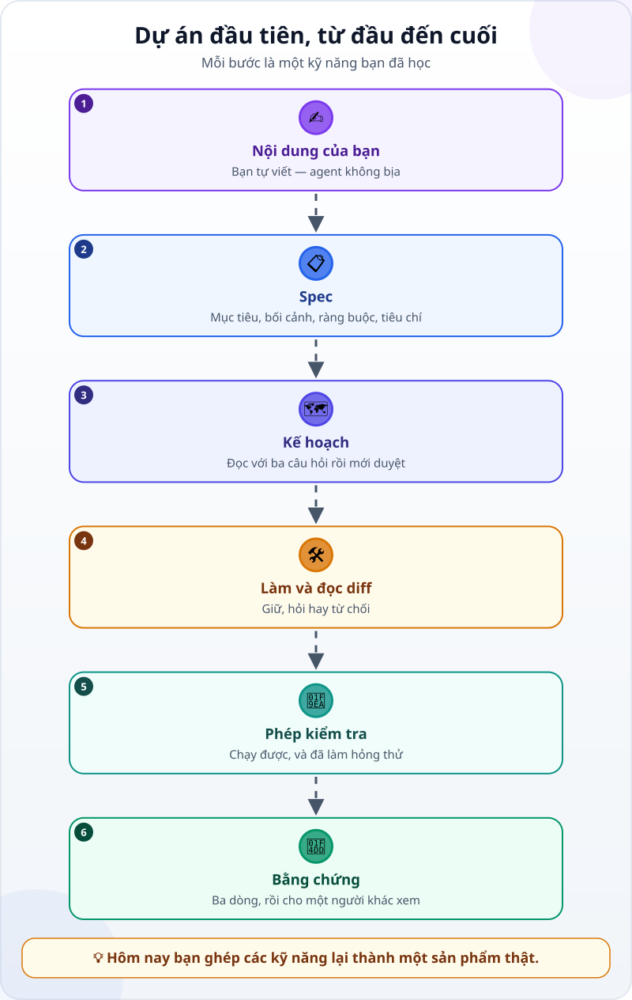
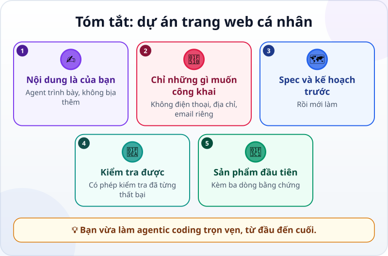

🌐 **Tiếng Việt** · [English](../../en/lessons/project-personal-page.md) · [日本語](../../ja/lessons/project-personal-page.md)

# Dự án: trang web cá nhân của bạn

<!-- section: objective -->
## Mục tiêu bài học

Sau dự án này, bạn sẽ:

- Có một trang web giới thiệu bản thân chạy được, nằm trong `ai-practice/personal-page/`.
- Tự đi hết một vòng làm việc với agent: nội dung → spec → kế hoạch → làm và đọc diff → phép kiểm tra → bằng chứng.
- Cho người khác xem sản phẩm, kèm ba dòng bằng chứng.

<!-- section: hook -->
## Mở đầu: vì sao nên quan tâm?

Đến giờ, mỗi bài dạy một kỹ năng. Dự án này ghép chúng lại. Sản phẩm vẫn nhỏ — một trang web giới thiệu bạn là ai, bạn quan tâm gì, bạn đã làm được gì — nhưng lần này **bạn là trưởng nhóm từ đầu đến cuối**.

Và vì đây là trang về chính bạn, bạn sẽ thấy ngay một điều quan trọng: agent trình bày rất giỏi, nhưng **nội dung phải là của bạn**.

<!-- section: concept -->
## Nội dung chính

### Dự án từ đầu đến cuối



Mỗi bước là một kỹ năng bạn đã học:

- **Spec:** [viết yêu cầu tốt](writing-good-specs.md).
- **Kế hoạch:** [tìm hiểu → lập kế hoạch → thực hiện → kiểm chứng](explore-plan-build-verify.md).
- **Đọc diff:** [review thay đổi của agent](reviewing-agent-changes.md).
- **Phép kiểm tra:** [từ "trông có vẻ đúng" đến phép kiểm tra](testing-basics.md).
- **Khi có lỗi:** [gỡ lỗi như một thám tử](errors-and-debugging.md).

### Hai luật riêng của dự án này

- **Nội dung là của bạn.** Bạn tự viết phần giới thiệu. Agent chỉ trình bày, không thêm thông tin về bạn — nó có thể bịa rất tự tin những điều nghe hợp lý.
- **Chỉ những gì bạn muốn công khai.** Không số điện thoại, địa chỉ nhà, email cá nhân. Viết như thể trang này sẽ được cả công ty đọc.

<!-- section: try-it -->
## Thử ngay

Khoảng 60 phút, trong `ai-practice`, ở chế độ agent hỏi trước mỗi thay đổi.

**1. Viết nội dung (10 phút).** Tạo file `noi-dung.txt` và **tự viết**:

- Tên hoặc biệt danh bạn muốn dùng.
- Hai, ba câu giới thiệu: bạn làm gì, vì sao học agentic coding.
- Ba sở thích hoặc kỹ năng.
- Một dự án: thẻ "Việc của tôi trong tuần" — một câu tả nó làm gì.

**2. Viết spec (10 phút)** — bắt đầu từ mẫu này, sửa cho hợp với bạn:

```text
Mục tiêu: một trang web giới thiệu bản thân, để gửi cho bạn bè và đồng nghiệp xem.
Bối cảnh: nội dung nằm trong noi-dung.txt (mình tự viết). Thẻ my-week.html có sẵn trong thư mục này.
Ràng buộc:
- Mọi file mới nằm trong thư mục personal-page/.
- Chỉ dùng chữ trong noi-dung.txt; không tự thêm thông tin nào về mình.
- Không số điện thoại, địa chỉ nhà, email cá nhân.
- Mở được khi không có Internet; không dùng thư viện hay phông chữ tải từ bên ngoài.
Xong khi:
1. Mở personal-page/index.html thấy đủ các phần: tên, giới thiệu, 3 sở thích/kỹ năng, dự án.
2. Mọi câu trong noi-dung.txt đều có trên trang; không có câu nào agent tự thêm.
3. Liên kết đến thẻ my-week.html mở được.
4. Thu hẹp cửa sổ cỡ điện thoại vẫn đọc được, không phải kéo ngang.
Trước khi làm, nhắc lại mục tiêu và tiêu chí. Có gì chưa rõ thì hỏi mình trước.
```

**3. Tìm hiểu và lập kế hoạch (10 phút).** Ở chế độ lập kế hoạch, gửi spec và nhờ agent đề xuất kế hoạch. Đọc với ba câu hỏi: file nào sẽ đổi hoặc được tạo? Có gì mới được thêm vào? Quyết định nào là của bạn (màu sắc, bố cục)? Rồi mới duyệt.

**4. Làm và đọc diff (15 phút).** Đọc từng thay đổi trước khi chấp nhận. Để ý: có file nào nằm ngoài `personal-page/` không? Có câu nào không đến từ `noi-dung.txt` không? Liên kết đến thẻ có dạng `../my-week.html` — một đường dẫn tương đối lên một cấp.

**5. Phép kiểm tra (10 phút):**

```text
Viết một phép kiểm tra tự động: mọi câu trong noi-dung.txt đều có trong personal-page/index.html,
và liên kết đến my-week.html trỏ tới một file có thật. Chạy và cho mình xem kết quả.
Sau đó chạy nó trên một bản sao index.html đã bị xóa bớt một câu: nó phải báo KHÔNG ĐẠT.
```

Tự kiểm tra thêm tiêu chí 4: thu hẹp cửa sổ và đọc thử.

**6. Bằng chứng và cho người khác xem (5 phút):**

- *Tôi cho xem được…* `personal-page/index.html` mở trong trình duyệt, cả khi cửa sổ hẹp.
- *Tôi đã kiểm tra…* bốn tiêu chí; phép kiểm tra báo ĐẠT với trang thật và KHÔNG ĐẠT với bản sao bị làm hỏng.
- *Tôi sẽ không dùng cách này khi…* ví dụ: trang cần thông tin riêng tư, hoặc cần cập nhật mỗi ngày.

Rồi nhờ một người bạn mở trang và nói lại bạn là ai. Họ hiểu đúng chưa?

**Thử thách thêm (tùy chọn):** đưa trang lên mạng để ai cũng mở được — hãy để việc này đến khi bạn đã học Git.

<!-- section: misconceptions -->
## Hiểu lầm thường gặp

- **"Để agent viết luôn phần giới thiệu cho nhanh."** — Agent không biết bạn; nó sẽ viết những câu nghe hay nhưng có thể sai. Nội dung về bạn thì bạn viết.
- **"Trang cá nhân thì không cần phép kiểm tra."** — Chính phép kiểm tra "mọi câu đều từ `noi-dung.txt`" bắt được những câu agent tự thêm vào.
- **"Dự án phải hoàn hảo mới được cho người khác xem."** — Cho xem sớm, kèm ba dòng bằng chứng, là cách tốt nhất để biết cần sửa gì tiếp.

<!-- section: recap -->
## Tóm tắt bằng hình



<!-- section: takeaways -->
## Ghi nhớ

- Nội dung về bạn thì bạn viết; agent trình bày, không bịa thêm.
- Chỉ đưa lên trang những gì bạn muốn công khai.
- Spec → kế hoạch → làm và đọc diff → phép kiểm tra → bằng chứng: đó là một vòng làm việc trọn vẹn với agent.
- Có người gọi cách làm có kỷ luật này — giao việc có tiêu chí, duyệt kế hoạch và thay đổi, kiểm chứng bằng phép kiểm tra — là *agentic engineering*. Trong khóa học, ta vẫn gọi là agentic coding.

<!-- section: sources -->
## Nguồn tham khảo

- Anthropic — [Best practices for Claude Code](https://code.claude.com/docs/en/best-practices) (tiếng Anh): nếu không kiểm chứng được thì đừng đưa ra dùng; luôn kèm cách kiểm chứng (phép kiểm tra, chương trình nhỏ, ảnh chụp màn hình).
