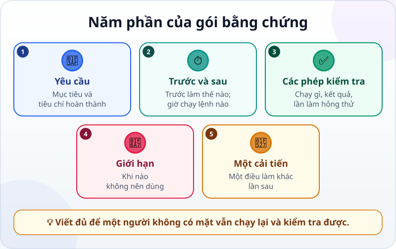
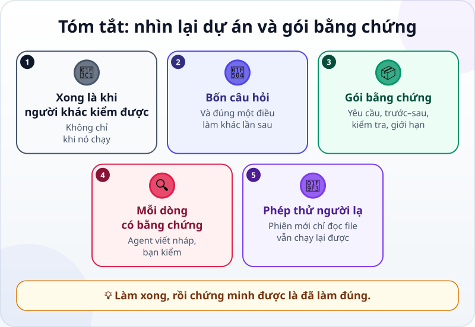

🌐 **Tiếng Việt** · [English](../../en/lessons/project-retrospective.md) · [日本語](../../ja/lessons/project-retrospective.md)

# Nhìn lại dự án và gói bằng chứng

<!-- section: objective -->
## Mục tiêu bài học

Sau bài này, bạn sẽ:

- Nhìn lại một dự án bằng bốn câu hỏi, không đổ lỗi cho ai.
- Gói bằng chứng của dự án vào một file ngắn: yêu cầu, trước và sau, các phép kiểm tra, giới hạn, một cải tiến.
- Kiểm tra gói bằng chứng bằng một "người lạ": một phiên agent mới chỉ được đọc file đó.

<!-- section: hook -->
## Mở đầu: vì sao nên quan tâm?

Mai đã làm xong [dự án báo cáo tháng](project-office-automation.md): chương trình đọc file bán hàng giả, làm báo cáo, và một phép kiểm tra so với kết quả đúng. Cô kể với quản lý. Quản lý hỏi ba câu:

*"Nó có đúng không? Nếu em nghỉ phép, ai chạy được? Có chỗ nào nó sẽ sai không?"*

Mai biết câu trả lời — nằm rải rác trong đầu cô, trong vài phiên trò chuyện đã đóng, trong mấy file ở `ai-practice`. Cô không đưa ra được thứ gì trong năm phút.

Một dự án chỉ thật sự xong khi **người khác** kiểm tra được nó.

<!-- section: concept -->
## Nội dung chính

### Nhìn lại: bốn câu hỏi

Ngay sau khi xong — lúc còn nhớ rõ — trả lời ngắn bốn câu:

1. **Mục tiêu ban đầu là gì, và đạt tới đâu?** So với tiêu chí bạn đã viết trong yêu cầu.
2. **Điều gì chạy tốt?** Bước nào, cách viết yêu cầu nào, phép kiểm tra nào đã giúp.
3. **Điều gì trục trặc, và đã sửa thế nào?** Lỗi, lần agent đi lạc, lần bạn phải ngắt.
4. **Lần sau làm khác điều gì?** Chỉ **một** điều cụ thể — một điều làm được hơn năm điều nói suông.

Nhìn lại không phải để tìm người có lỗi, kể cả không phải để trách agent. Mục đích là để lần sau tốt hơn.

### Gói bằng chứng: năm phần



Gói bằng chứng là **một file ngắn** (ví dụ `BANG_CHUNG.md`) đặt cạnh dự án, cho người chưa từng thấy dự án:

- **Yêu cầu:** mục tiêu và tiêu chí hoàn thành, như trong [Viết yêu cầu tốt](writing-good-specs.md).
- **Trước và sau:** trước thì làm thế nào, mất bao lâu; giờ chạy bằng một lệnh nào. Con số ước lượng thì ghi rõ là ước lượng.
- **Các phép kiểm tra:** chạy gì, kết quả ra sao, và bằng chứng phép kiểm tra thật sự bắt được lỗi (lần làm hỏng thử).
- **Giới hạn:** khi nào **không** nên dùng — dữ liệu khác mẫu, dữ liệu thật chưa được phép, trường hợp chưa thử.
- **Một cải tiến:** câu trả lời cho câu hỏi thứ tư ở trên.

Đây là ba dòng bằng chứng quen thuộc (*Tôi cho xem được… / Tôi đã kiểm tra… / Tôi sẽ không dùng cách này khi…*), viết đủ để người khác tự làm lại.

### Agent viết nháp, bạn kiểm từng dòng

Agent có thể đọc lịch sử [Git](git-version-control.md), các file và kết quả kiểm tra để viết nháp gói bằng chứng rất nhanh. Nhưng một bản tổng kết cũng là chỗ [ảo giác](hallucination.md) dễ chen vào: một con số không ai đo, một phép kiểm tra chưa từng chạy. Với mỗi dòng, hỏi: *"Mình chỉ ra được nó ở đâu?"* Không chỉ ra được thì sửa hay xóa.

### Phép thử người lạ

Gói bằng chứng tốt khi một người **không có mặt** lúc làm vẫn chạy lại và kiểm tra được. Cách thử rẻ nhất: mở **một phiên agent mới**, chỉ cho nó đọc file bằng chứng, và nhờ nó làm theo. Chỗ nào nó phải đoán, chỗ đó file còn thiếu. Lưu ý: nhiều công cụ tự nạp một file chỉ dẫn (như `CLAUDE.md`) vào mọi phiên mới. Hãy hỏi phiên đó đã dùng gì từ file như vậy; dự án cần gì từ đó thì cũng phải ghi vào file bằng chứng.

<!-- section: try-it -->
## Thử ngay

Khoảng 11 phút, với dự án báo cáo tháng (hoặc [trang web cá nhân](project-personal-page.md)) trong `ai-practice`. (Đi đường chỉ xem? Làm bước 1 và viết bước 2 trên giấy cho một việc bạn đã làm xong gần đây.)

**1. Nhìn lại (3 phút).** Viết câu trả lời ngắn cho bốn câu hỏi vào `NHIN_LAI.md`.

**2. Nháp gói bằng chứng (3 phút).** Giao cho agent:

```text
Viết nháp BANG_CHUNG.md cho dự án này, gồm năm phần: Yêu cầu, Trước và sau,
Các phép kiểm tra, Giới hạn, Một cải tiến (lấy từ NHIN_LAI.md).
Chỉ ghi điều có trong file, lịch sử Git hay kết quả chạy thật; chỗ nào không chắc thì ghi "CẦN KIỂM TRA".
Ghi rõ lệnh để chạy lại chương trình và phép kiểm tra.
```

**3. Kiểm từng dòng (3 phút).** Với mỗi dòng: chỉ ra được bằng chứng ở đâu? Chạy lại đúng các lệnh trong file. Xử lý mọi chỗ "CẦN KIỂM TRA". Xóa con số không ai đo.

**4. Phép thử người lạ (2 phút).** Mở **phiên mới** và giao:

```text
Chỉ đọc BANG_CHUNG.md. Làm theo nó để chạy lại chương trình và phép kiểm tra.
Liệt kê mọi chỗ bạn phải đoán vì file không nói rõ.
```

Hỏi thêm: *"Bạn có dùng gì từ file được nạp tự động lúc đầu, như file chỉ dẫn, không?"* Sửa file bằng chứng ở những chỗ nó phải đoán hay phải dựa vào file như vậy. Commit.

**Bằng chứng:**

- *Tôi cho xem được…* `NHIN_LAI.md` và `BANG_CHUNG.md`, và một phiên mới chạy lại được dự án chỉ từ file đó.
- *Tôi đã kiểm tra…* từng dòng trong file với file thật, lịch sử Git và kết quả chạy lại.
- *Tôi sẽ không dùng cách này khi…* gói bằng chứng cần chứa dữ liệu thật hay thông tin nội bộ — những thứ đó là ⛔ trong khóa học này; gói bằng chứng chỉ dùng dữ liệu giả.

<!-- section: misconceptions -->
## Hiểu lầm thường gặp

- **"Nhìn lại là để tìm ai có lỗi."** — Mục đích là để lần sau tốt hơn. Câu hỏi đúng là *"điều gì đã xảy ra"*, không phải *"ai làm sai"*.
- **"Gói bằng chứng là để khoe."** — Nó ghi cả giới hạn và chỗ đã sai. Một bản chỉ toàn điều tốt khó được tin hơn.
- **"Agent viết bản tổng kết rồi, gửi luôn."** — Bản tổng kết cũng có thể có con số bịa. Mỗi dòng phải chỉ ra được bằng chứng.

<!-- section: recap -->
## Tóm tắt bằng hình



<!-- section: takeaways -->
## Ghi nhớ

- Dự án chỉ xong khi người khác kiểm tra được nó.
- Nhìn lại bằng bốn câu hỏi, và chọn đúng một điều làm khác lần sau.
- Gói bằng chứng: yêu cầu, trước và sau, các phép kiểm tra, giới hạn, một cải tiến.
- Agent viết nháp; bạn chỉ ra được bằng chứng cho từng dòng.
- Phép thử người lạ: một phiên mới bắt đầu từ file vẫn chạy lại được — và bạn kiểm tra nó còn đọc thêm gì.

<!-- section: quiz -->
## Tự kiểm tra

**Câu 1.** Phần nào **không thể thiếu** trong gói bằng chứng?

- A) Toàn bộ nội dung mọi cuộc trò chuyện với agent
- B) Giới hạn: khi nào không nên dùng
- C) Đúng từng chữ các câu lệnh bạn đã dùng

**Câu 2.** Bản nháp của agent ghi "tiết kiệm 5 giờ mỗi tháng", nhưng bạn chưa từng đo. Nên làm gì?

- A) Xóa, hoặc ghi rõ đó là ước lượng của bạn và vì sao
- B) Giữ nguyên vì nghe thuyết phục
- C) Giữ nguyên, chắc agent đã đo rồi

**Câu 3.** Cách rẻ nhất để biết gói bằng chứng có đủ không?

- A) Tự đọc lại một lần
- B) Cho một phiên agent mới chỉ đọc file đó và thử chạy lại dự án
- C) Hỏi chính agent đã viết nó xem còn thiếu gì không

<details>
<summary>Xem đáp án</summary>

1. **B** — người khác cần biết khi nào không nên dùng; thiếu nó là thiếu phần quan trọng nhất.
2. **A** — chỉ ghi điều bạn chỉ ra được bằng chứng; con số chưa đo không phải bằng chứng.
3. **B** — phiên mới không nhớ các cuộc trò chuyện lúc bạn làm dự án; nó bắt đầu từ file (cùng file chỉ dẫn mà công cụ tự nạp — nên kiểm tra cả những gì nó lấy từ đó). Chỗ nó phải đoán là chỗ file còn thiếu.

</details>
