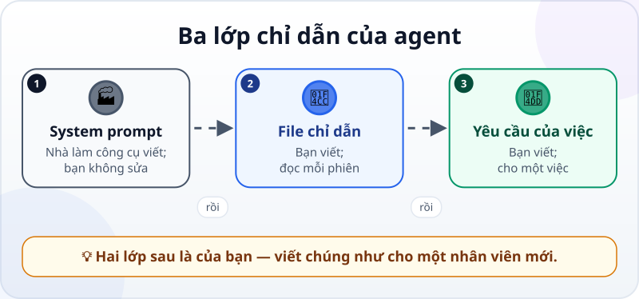
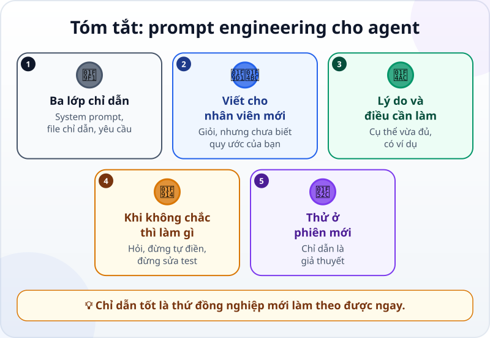

🌐 **Tiếng Việt** · [English](../../en/lessons/prompt-engineering-for-agents.md) · [日本語](../../ja/lessons/prompt-engineering-for-agents.md)

# Prompt engineering cho agent: system prompt và chỉ dẫn

<!-- section: objective -->
## Mục tiêu bài học

Sau bài này, bạn sẽ:

- Phân biệt được ba lớp chỉ dẫn: **system prompt**, **file chỉ dẫn của dự án**, **yêu cầu của từng việc** — và lớp nào là của bạn.
- Viết lại một chỉ dẫn yếu thành chỉ dẫn agent làm theo được, bằng năm cách.
- Thử một chỉ dẫn ở phiên mới và biết nó có tác dụng hay không.

<!-- section: hook -->
## Mở đầu: vì sao nên quan tâm?

Trong file chỉ dẫn của dự án báo cáo, Mai viết: *"Báo cáo phải chuyên nghiệp."* Tuần đầu, agent thêm một trang bìa. Tuần sau, nó đổi tiêu đề sang tiếng Anh. Tuần thứ ba, nó thêm biểu tượng cảm xúc vào đầu mỗi mục "cho sinh động".

Nếu Mai nói câu đó với một nhân viên mới, người ấy sẽ hỏi lại: *"Chị muốn chuyên nghiệp kiểu gì?"* Agent thì không hỏi — nó đoán, và mỗi lần đoán một kiểu.

Câu chỉ dẫn của Mai không sai. Nó chỉ chưa nói điều cô thật sự muốn.

<!-- section: concept -->
## Nội dung chính

### Ba lớp chỉ dẫn

Khi agent làm một việc, nó đọc chỉ dẫn từ ba lớp:



1. **System prompt** — do nhà làm công cụ viết, nằm dưới mọi cuộc trò chuyện: agent là ai, được dùng công cụ nào, làm việc theo cách nào. Bạn thường không thấy hết, và thường không sửa trực tiếp được.
2. **File chỉ dẫn của dự án** — do **bạn** viết, được đọc ở đầu mỗi phiên (bạn đã tập viết trong [Context engineering](context-engineering.md)).
3. **Yêu cầu của từng việc** — do **bạn** viết, cho một việc cụ thể (như trong [Viết yêu cầu tốt](writing-good-specs.md)).

[Prompt căn bản](prompting-basics.md) dạy bạn hỏi một chatbot cho rõ. Với agent, chỉ dẫn còn phải **bền**: nó được đọc lại ở nhiều phiên, cho nhiều việc, và agent hành động theo nó — không chỉ trả lời.

### Năm cách viết chỉ dẫn agent làm theo được

Tài liệu của Anthropic (9/2026) gợi ý một cách nghĩ: coi mô hình như **một nhân viên mới rất giỏi nhưng chưa biết gì về quy ước của bạn**. Thử đưa chỉ dẫn cho một đồng nghiệp không biết gì về việc này — họ bối rối chỗ nào, agent cũng bối rối chỗ đó.

**1. Nói lý do.** *"Không ghi tên khách hàng"* chỉ chặn đúng một thứ. *"Không ghi tên khách hàng hay tên người liên hệ, vì báo cáo này gửi ra ngoài công ty"* giúp agent tự suy ra cả những trường hợp bạn chưa nghĩ tới.

**2. Nói điều cần làm, không chỉ điều cấm.** *"Đừng viết số kiểu Mỹ"* để agent đoán. *"Viết tiền như 1.250.000 đ"* cho nó đích đến.

**3. Cụ thể vừa đủ.** Anthropic gọi đây là viết ở *đúng độ cao*: không mơ hồ như *"cho chuyên nghiệp"*, cũng không thành một danh sách dài *"nếu… thì…"* cứng nhắc cho mọi tình huống. Nói điều bạn muốn thấy: *"Báo cáo ngắn, dưới 150 chữ: tiêu đề, ba ý chính, một bảng số liệu có đơn vị. Tiếng Việt, không biểu tượng cảm xúc."*

**4. Cho một ví dụ ngắn** khi định dạng khó tả. Ví dụ là một trong những cách đáng tin nhất để chỉnh định dạng và giọng văn.

**5. Nói rõ làm gì khi không chắc.** *"Nếu thiếu số liệu, ghi 'chưa có số liệu' và báo mình; đừng tự điền."* *"Nếu một test có vẻ sai, dừng lại và nói với mình; đừng sửa code chỉ để khớp với test."*

### Đừng hét

VIẾT HOA, ba dấu chấm than, *"TUYỆT ĐỐI"* ở mọi dòng — không làm chỉ dẫn mạnh hơn. Hướng dẫn của Claude Code (9/2026) nói: nếu nhấn mạnh nhiều dòng, sẽ không dòng nào nổi bật. Chỉ nhấn mạnh một dòng thật sự bị bỏ qua, sau khi đã thử viết nó rõ hơn.

### Chỉ dẫn là thứ cần thử

Một câu chỉ dẫn là một giả thuyết: *"viết thế này thì agent sẽ làm thế kia"*. Cách duy nhất để biết là thử — ở một **phiên mới**, để agent không mang theo gì từ cuộc trò chuyện cũ — rồi nhìn xem hành vi có đổi không.

<!-- section: try-it -->
## Thử ngay

Khoảng 8 phút, trong `ai-practice`, dữ liệu giả. (Đi đường chỉ xem? Làm bước 1 trên giấy, rồi so với gợi ý.)

**1. Viết lại ba chỉ dẫn yếu (4 phút).** Viết lại từng câu bằng ít nhất hai trong năm cách:

```text
a) KHÔNG BAO GIỜ DÙNG CHỮ VIẾT TẮT!!!
b) Làm cho báo cáo chuyên nghiệp.
c) Đừng làm hỏng test.
```

<details>
<summary>Gợi ý</summary>

- **a)** *"Viết đầy đủ, không viết tắt (ví dụ 'đơn vị tính', không phải 'ĐVT'), vì báo cáo được gửi cho đối tác đọc qua công cụ dịch, và chữ viết tắt thường bị dịch sai."* — có lý do, có ví dụ, không cần viết hoa.
- **b)** *"Báo cáo ngắn, dưới 150 chữ: tiêu đề, ba ý chính, một bảng số liệu có đơn vị. Tiếng Việt, không biểu tượng cảm xúc, không trang bìa."* — cụ thể vừa đủ, nói điều cần làm.
- **c)** *"Chạy kiem_tra.py trước khi báo xong. Nếu một test có vẻ sai, dừng lại và nói với mình; không sửa test, không viết code chỉ để khớp với test."* — nói làm gì khi không chắc.

</details>

**2. Thử một câu (3 phút).** Chọn câu **b**. Nó chỉ dành cho việc báo cáo này, nên đừng thêm vào file chỉ dẫn dùng cho mọi phiên. Mở **phiên mới**, dán câu **b** bạn đã viết lại vào đầu yêu cầu, rồi giao tiếp:

```text
Tạo bao_cao_tuan.md từ dữ liệu giả sau: tuần 39, 12 đơn hàng, doanh thu 18.600.000 đ, 2 đơn bị trả lại.
```

So kết quả với từng ý trong câu chỉ dẫn: dưới 150 chữ? tiêu đề? ba ý chính? bảng có đơn vị? không biểu tượng cảm xúc?

**3. Sửa một lần (1 phút).** Nếu có ý không đạt, đừng thêm chữ in hoa. Tự hỏi: *câu này có chỗ nào một đồng nghiệp mới sẽ hiểu khác?* Sửa chỗ đó, thử lại ở phiên mới.

**Bằng chứng:**

- *Tôi cho xem được…* ba câu chỉ dẫn trước và sau khi viết lại, và báo cáo từ một phiên mới.
- *Tôi đã kiểm tra…* từng ý của câu chỉ dẫn với báo cáo thật.
- *Tôi sẽ không dùng cách này khi…* điều cần chặn là việc nguy hiểm thật (xóa, gửi, chạm dữ liệu thật) — lúc đó cần hàng rào trong công cụ, không chỉ một câu chỉ dẫn.

<!-- section: misconceptions -->
## Hiểu lầm thường gặp

- **"Viết hoa và nhiều dấu chấm than thì agent sẽ nghe lời hơn."** — Nhấn mạnh mọi thứ thì không gì nổi bật. Câu rõ ràng và có lý do có tác dụng hơn.
- **"Chỉ dẫn càng dài, càng nhiều trường hợp càng tốt."** — Một danh sách *nếu… thì…* dài vừa cứng nhắc vừa dễ bị bỏ sót. Nói điều bạn muốn và lý do; agent tự xử lý phần còn lại tốt hơn.
- **"Đã ghi 'không được xóa' thì agent không thể xóa."** — Chỉ dẫn là lời dặn, không phải khóa. Việc nguy hiểm cần quyền hạn và hàng rào của công cụ chặn lại.

<!-- section: recap -->
## Tóm tắt bằng hình



<!-- section: takeaways -->
## Ghi nhớ

- Ba lớp chỉ dẫn: system prompt (của nhà làm công cụ), file chỉ dẫn và yêu cầu từng việc (của bạn).
- Viết cho một nhân viên mới rất giỏi nhưng chưa biết quy ước của bạn.
- Nói lý do, nói điều cần làm, cụ thể vừa đủ, có ví dụ, nói rõ làm gì khi không chắc.
- Đừng hét: nhấn mạnh mọi thứ thì không gì nổi bật.
- Chỉ dẫn là giả thuyết: thử ở phiên mới và nhìn hành vi.

<!-- section: quiz -->
## Tự kiểm tra

**Câu 1.** Lớp chỉ dẫn nào bạn thường **không** sửa được?

- A) File chỉ dẫn của dự án
- B) System prompt của công cụ
- C) Yêu cầu của từng việc

**Câu 2.** Câu chỉ dẫn nào agent dễ làm đúng nhất?

- A) "Viết tiền như 1.250.000 đ, vì báo cáo gửi cho kế toán Việt Nam"
- B) "ĐỪNG VIẾT SỐ SAI!!!"
- C) "Làm cho đẹp"

**Câu 3.** Bạn thêm một chỉ dẫn mới vào file chỉ dẫn. Làm sao biết nó có tác dụng?

- A) Đọc lại câu thấy hợp lý là đủ
- B) Viết hoa để chắc chắn
- C) Giao một việc ở phiên mới và xem hành vi của agent có đổi không

<details>
<summary>Xem đáp án</summary>

1. **B** — system prompt do nhà làm công cụ viết; file chỉ dẫn và yêu cầu là phần của bạn.
2. **A** — có điều cần làm, có ví dụ, có lý do; B chỉ hét, C mơ hồ.
3. **C** — chỉ dẫn là giả thuyết; hành vi ở phiên mới mới là bằng chứng.

</details>

<!-- section: sources -->
## Nguồn tham khảo

- Anthropic — [Prompting best practices](https://platform.claude.com/docs/en/build-with-claude/prompt-engineering/claude-prompting-best-practices) (tiếng Anh, tính đến 9/2026): coi Claude như một nhân viên mới rất giỏi nhưng thiếu bối cảnh; đưa chỉ dẫn cho một đồng nghiệp ít bối cảnh đọc thử; nói lý do đằng sau chỉ dẫn; nói điều cần làm thay vì điều không được làm; ví dụ là cách đáng tin để chỉnh định dạng; system prompt đặt vai trò cho Claude; đừng viết code chỉ để khớp với test.
- Anthropic — [Effective context engineering for AI agents](https://www.anthropic.com/engineering/effective-context-engineering-for-ai-agents) (tiếng Anh, 9/2025): viết system prompt ở "đúng độ cao" — giữa logic *nếu… thì…* cứng nhắc và chỉ dẫn chung chung mơ hồ.
- Anthropic — [Best practices for Claude Code](https://code.claude.com/docs/en/best-practices) (tiếng Anh, tính đến 9/2026): chỉ nhấn mạnh một dòng thật sự bị bỏ qua; nhấn mạnh nhiều dòng thì không dòng nào nổi bật; thử thay đổi bằng cách xem hành vi của Claude có đổi không.
