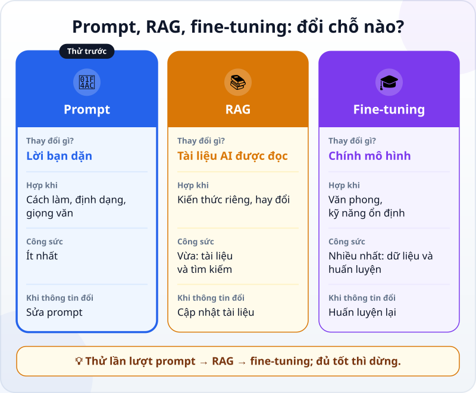
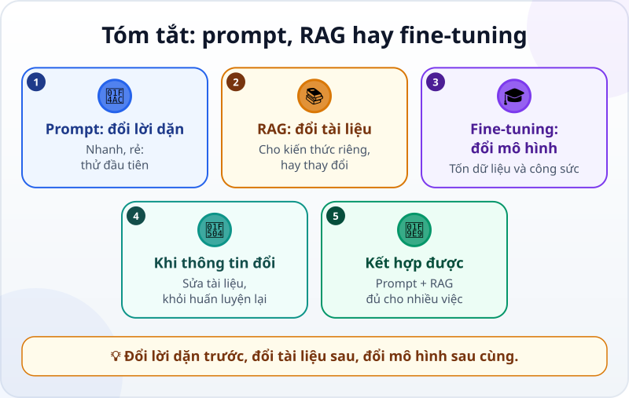

🌐 **Tiếng Việt** · [English](../../en/lessons/prompt-rag-finetune-compare.md) · [日本語](../../ja/lessons/prompt-rag-finetune-compare.md)

# Prompt, RAG hay fine-tuning: chọn cách nào?

<!-- section: objective -->
## Mục tiêu bài học

Sau bài này, bạn sẽ:

- Nói được mỗi cách thay đổi điều gì: lời bạn dặn (prompt), tài liệu AI được đọc (RAG), hay chính mô hình (fine-tuning).
- Chọn cách hợp với một nhu cầu cụ thể, theo thứ tự nên thử.
- Giải thích vì sao thông tin hay thay đổi thì hợp với RAG hơn là fine-tuning.

<!-- section: hook -->
## Mở đầu: vì sao nên quan tâm?

Nhóm của Mai muốn có một trợ lý AI trả lời đồng nghiệp về quy định thanh toán công tác phí. Trong buổi họp có ba ý kiến. Một người nói: *"Viết prompt tốt hơn là được."* Người khác: *"Cho AI đọc bộ quy định."* Người thứ ba: *"Phải fine-tune một mô hình riêng cho công ty."*

Ý nào nghe cũng có lý. Nhưng ba cách này thay đổi ba thứ khác nhau, tốn công sức rất khác nhau, và hỏng theo những kiểu khác nhau. Chọn sai, nhóm có thể mất nhiều tuần cho một việc mà một buổi chiều là xong.

<!-- section: concept -->
## Nội dung chính

### Ba chỗ có thể thay đổi

Câu trả lời của AI đến từ ba thứ: chính mô hình, những gì nó được đọc, và lời bạn dặn. Mỗi cách đổi một thứ:

- **Prompt — đổi lời bạn dặn.** Chỉ dẫn, ví dụ mẫu, định dạng mong muốn ([Prompt căn bản](prompting-basics.md)). Có tác dụng ngay, chỉ trong cuộc trò chuyện hay lần gọi đó, và sửa lúc nào cũng được.
- **RAG — đổi tài liệu AI được đọc.** Mỗi lần có câu hỏi, hệ thống tìm những đoạn tài liệu liên quan và đưa vào ngữ cảnh ([RAG: cho AI mở tài liệu ra tra cứu](rag-intro.md)). Hợp với kiến thức riêng của bạn, thông tin hay thay đổi, và khi cần trích nguồn. Muốn cập nhật thì sửa tài liệu.
- **Fine-tuning (tinh chỉnh) — đổi chính mô hình.** Huấn luyện thêm một mô hình có sẵn bằng dữ liệu mới, nên các con số bên trong thay đổi ([Máy "học" như thế nào?](how-machines-learn.md)). Mô hình bắt đầu bắt chước khuôn mẫu của dữ liệu đó, nên cách này hợp để nó quen một lĩnh vực, một loại việc hay một văn phong. Chính các trợ lý AI bạn đang dùng cũng đã được fine-tune để trò chuyện như một trợ lý.

### Cái giá của fine-tuning

Fine-tuning cần nhiều ví dụ tốt và công sức huấn luyện. Nó có những rủi ro riêng: mô hình có thể "học vẹt" các ví dụ, hoặc quên bớt một phần khả năng đã có. Và nó học cả những chỗ sai trong dữ liệu. Khi thông tin đổi, điều mô hình đã học không tự đổi theo: phải huấn luyện lại. Việc này thường do đội kỹ thuật làm, và không phải dịch vụ nào cũng cho tự fine-tune — tính đến tháng 9/2026, bảng thuật ngữ của Anthropic ghi rằng Claude API hiện không cung cấp fine-tuning.

### Nên thử theo thứ tự nào?

1. **Prompt trước.** Nhanh nhất, rẻ nhất, sửa được ngay. Rất nhiều việc chỉ cần một prompt rõ ràng hơn, kèm một ví dụ mẫu.
2. **Thêm RAG** khi AI thiếu thông tin riêng của bạn, hoặc thông tin hay thay đổi. Nếu tài liệu chỉ vài trang, đôi khi dán thẳng vào prompt là đủ.
3. **Cân nhắc fine-tuning** khi đã thử hai cách trên mà vẫn cần một văn phong hay kỹ năng ổn định, dùng lặp lại rất nhiều lần, và bạn có nhiều ví dụ tốt.

Dừng ở bước nào đã đủ tốt. Và ba cách không loại trừ nhau: một hệ thống có thể dùng prompt để dặn cách trả lời, RAG để đưa tài liệu, trên một mô hình đã được fine-tune sẵn.

### Còn với agent lập trình?

Trong khóa học này, bạn gần như chỉ dùng hai cách đầu: viết chỉ dẫn (prompt, và file hướng dẫn của dự án), và để agent tự tìm đọc những file cần thiết bằng [gọi công cụ](tool-calling.md) — cùng ý tưởng với RAG. Fine-tuning hiếm khi là việc của người học.

<!-- section: analogy -->
## Ví dụ đời thường

Hãy nghĩ về một nhân viên mới:

- **Prompt** giống dặn việc thật rõ cho một nhiệm vụ: *"Viết email trả lời, giọng lịch sự, tối đa năm câu."*
- **RAG** giống đưa cho họ cuốn sổ tay quy định để tra mỗi khi cần.
- **Fine-tuning** giống cử họ đi một khóa đào tạo dài: thói quen làm việc thay đổi lâu dài, nhưng tốn thời gian, và điều đã học có thể lỗi thời khi quy định đổi.

Phép so sánh sai ở chỗ: người đi học về vẫn hiểu vì sao, và tự cập nhật khi đọc quy định mới. Mô hình đã fine-tune thì chỉ có các con số đã được chỉnh; muốn nó theo quy định mới, bạn phải huấn luyện lại — hoặc đưa quy định mới cho nó đọc.

<!-- section: example -->
## Ví dụ thực tế

Nhóm của Mai thử lần lượt, với một bộ quy định giả để thực hành:

1. **Chỉ prompt:** *"Bạn là trợ lý hành chính. Trả lời ngắn gọn, lịch sự, bằng tiếng Việt."* Câu trả lời trình bày đẹp nhưng nói sai mức phụ cấp: AI không biết quy định của công ty Mai, nên nó viết theo điều nghe có vẻ phổ biến.
2. **Prompt + RAG:** hệ thống tìm đúng mục trong bộ quy định và đưa vào prompt. Câu trả lời đúng mức phụ cấp và ghi số mục. Tháng sau quy định đổi: nhóm chỉ việc thay file quy định.
3. **Đề xuất fine-tuning:** một đồng nghiệp muốn huấn luyện mô hình trên toàn bộ câu hỏi và câu trả lời của năm ngoái. Mai hỏi hai câu: *"Quy định đổi thì sao?"* — phải huấn luyện lại. *"Câu trả lời năm ngoái có chỗ nào sai không?"* — mô hình sẽ học cả chỗ sai.

Nhóm chọn prompt + RAG. Fine-tuning để dành cho khi nào cần một kiểu việc lặp lại rất nhiều, với văn phong cố định mà prompt không đạt được.

<!-- section: misconceptions -->
## Hiểu lầm thường gặp

- **"Muốn AI biết tài liệu công ty thì phải fine-tune."** — Với thông tin hay đổi và cần trích nguồn, RAG thường hợp hơn: cập nhật tài liệu là xong. Fine-tuning đổi mô hình, và có thông tin mới thì phải huấn luyện lại.
- **"Prompt chỉ là mẹo cho người mới; làm thật thì phải fine-tune."** — Prompt là bước đầu tiên, rẻ và nhanh, và nhiều việc chỉ cần prompt tốt. Một mô hình đã fine-tune vẫn cần prompt.
- **"Phải chọn một trong ba."** — Có thể kết hợp: prompt dặn cách trả lời, RAG đưa tài liệu, trên một mô hình đã được fine-tune sẵn để làm trợ lý.

<!-- section: recap -->
## Tóm tắt bằng hình

<!-- section: takeaways -->
## Ghi nhớ

- Prompt đổi lời bạn dặn; RAG đổi tài liệu AI được đọc; fine-tuning đổi chính mô hình.
- Thử theo thứ tự prompt → RAG → fine-tuning, và dừng khi đã đủ tốt.
- Thông tin riêng, hay đổi, cần trích nguồn → RAG: cập nhật tài liệu thay vì huấn luyện lại.
- Fine-tuning hợp với văn phong hay kỹ năng ổn định, và cần nhiều ví dụ tốt cùng công sức.
- Với agent lập trình, bạn dùng chủ yếu prompt và việc để agent tự tìm đọc file.

<!-- section: quiz -->
## Tự kiểm tra

**Câu 1.** Nhóm muốn AI trả lời theo quy định công tác phí, mà quy định thay đổi vài tháng một lần. Nên chọn cách nào?

- A) Fine-tune lại mô hình mỗi lần quy định đổi
- B) Chỉ viết prompt hay hơn
- C) RAG với bộ quy định mới nhất

**Câu 2.** Cách nào thay đổi chính các con số bên trong mô hình?

- A) Fine-tuning
- B) RAG
- C) Prompt

**Câu 3.** Bạn muốn AI viết email theo một định dạng cố định. Nên thử gì trước tiên?

- A) Fine-tune một mô hình riêng
- B) Viết prompt rõ ràng, kèm một email mẫu
- C) Xây một hệ thống RAG

Xem đáp án

1. **C** — thông tin hay đổi thì để trong tài liệu và cập nhật tài liệu; prompt một mình không biết quy định, còn fine-tune lại mỗi lần thì tốn kém.
2. **A** — fine-tuning huấn luyện thêm nên đổi mô hình; RAG và prompt chỉ đổi những gì mô hình đọc trong một lần trả lời.
3. **B** — định dạng là việc của lời dặn; một prompt rõ kèm ví dụ mẫu thường là đủ.

<!-- section: sources -->
## Nguồn tham khảo

- Anthropic — [Glossary](https://platform.claude.com/docs/en/about-claude/glossary) (tiếng Anh), mục *Fine-tuning* và *RAG*: fine-tuning là huấn luyện thêm một mô hình đã huấn luyện trước bằng dữ liệu bổ sung, khiến nó bắt chước khuôn mẫu của dữ liệu đó, hợp để điều chỉnh theo một lĩnh vực, một loại việc hay văn phong; Claude đã được fine-tune để làm trợ lý; Claude API hiện không cung cấp fine-tuning (tính đến 9/2026). RAG đưa tài liệu tìm được vào ngữ cảnh lúc hỏi, hợp với thông tin cập nhật, kiến thức chuyên ngành và việc cần trích nguồn.
- Google Cloud — [Fine-tuning LLMs: overview and guide](https://cloud.google.com/use-cases/fine-tuning-ai-models) (tiếng Anh): fine-tuning thay đổi tham số của mô hình, còn RAG bổ sung kiến thức bên ngoài vào prompt; fine-tuning tốn tài nguyên hơn, cần nhiều dữ liệu hơn, có nguy cơ học vẹt (overfitting) và quên kiến thức cũ; RAG chỉ dùng được dữ liệu nó truy cập được.
- Anthropic — [Introducing Contextual Retrieval](https://www.anthropic.com/news/contextual-retrieval) (tiếng Anh, 9/2024): kho tài liệu đủ nhỏ thì có thể đưa cả vào prompt, không cần RAG; kho lớn hơn thì dùng RAG.
- Google Cloud — [Prompt engineering: overview and guide](https://cloud.google.com/discover/what-is-prompt-engineering) (tiếng Anh): prompt đưa cho mô hình ngữ cảnh, chỉ dẫn và ví dụ để nó hiểu ý bạn.
