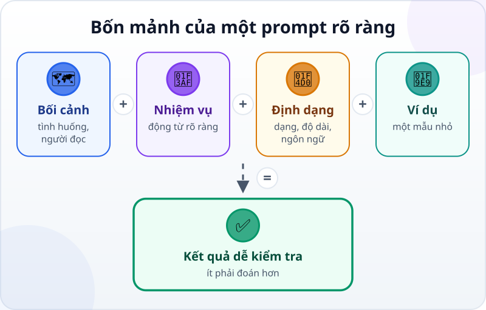
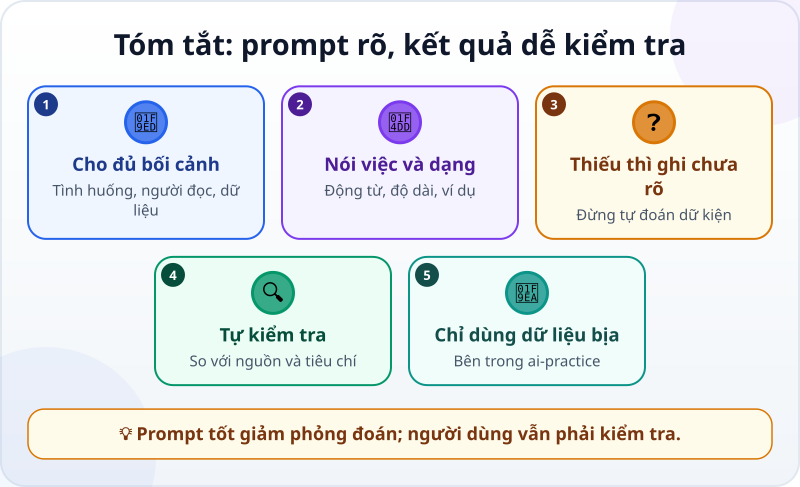

🌐 **Tiếng Việt** · [English](../../en/lessons/prompting-basics.md) · [日本語](../../ja/lessons/prompting-basics.md)

# Prompt căn bản: nói sao cho AI hiểu

<!-- section: objective -->
## Mục tiêu bài học

Sau bài này, bạn sẽ:

- Viết prompt có bối cảnh, nhiệm vụ, định dạng kết quả và ví dụ.
- Yêu cầu AI nêu điều chưa biết thay vì tự đoán.
- So sánh hai câu trả lời bằng tiêu chí bạn kiểm tra được.

<!-- section: hook -->
## Mở đầu: "Viết giúp tôi cho hay"

Mai dán ba dòng ghi chú về một cuộc họp vào chatbot và gõ: *"Viết giúp tôi cho hay."* AI trả lại một email dài, trang trọng, tự thêm ngày họp và gọi người nhận là "quý khách". Không cái nào đúng ý Mai.

AI không đọc được suy nghĩ. Khi lời yêu cầu để trống nhiều chỗ, nó phải đoán. Một câu trả lời trôi chảy vẫn có thể là câu trả lời cho một việc khác.

<!-- section: concept -->
## Nội dung chính

**Prompt** là nội dung bạn đưa cho AI để yêu cầu nó trả lời hoặc làm một việc. Prompt tốt không cần dài hay có câu thần chú. Nó cần đưa đủ thông tin để AI ít phải đoán, và đủ rõ để bạn kiểm tra kết quả.



Bốn mảnh hữu ích là:

1. **Bối cảnh:** tình huống, người đọc, dữ liệu được phép dùng.
2. **Nhiệm vụ:** một động từ rõ — tóm tắt, phân loại, viết lại, so sánh.
3. **Định dạng:** số gạch đầu dòng, bảng hay email; độ dài; ngôn ngữ.
4. **Ví dụ:** một mẫu nhỏ cho thấy bạn muốn gì, nhất là khi định dạng khó tả.

Thêm một hàng rào quan trọng: *"Chỉ dùng thông tin bên dưới. Nếu thiếu, hãy ghi `chưa rõ`; đừng tự đoán."* Câu này không bảo đảm AI luôn đúng, nhưng biến phần thiếu thành thứ bạn có thể thấy và kiểm tra.

Đừng đưa dữ liệu thật chỉ để prompt "đủ bối cảnh". Trong bài này, mọi tên, ngày và nội dung đều bịa. Quy tắc bốn phần dành cho việc giao một dự án cho agent nằm trong [Viết spec tốt: việc cần làm và thế nào là xong](writing-good-specs.md); ở đây ta chỉ luyện một lượt hỏi–đáp với chatbot.

<!-- section: try-it -->
## Thử ngay

Khoảng 12 phút. Tạo file `ai-practice/ghi-chu-hop.txt` với dữ liệu bịa sau:

```text
Dự án: Góc đọc sách giả lập
Có mặt: Mai, An
Đã thống nhất: thử mở cửa sáng thứ Bảy
Chưa rõ: ai chuẩn bị bảng hướng dẫn
```

Không dùng biên bản công ty thật, tên người thật, mật khẩu hay API key.

**1. Hỏi mơ hồ (2 phút)**

Mở chatbot bạn được phép dùng, dán nội dung file và hỏi:

```text
Viết thông báo về cuộc họp này cho hay.
```

Lưu câu trả lời vào `ai-practice/tra-loi-mo-ho.txt`. Đánh dấu chi tiết nào AI tự thêm, định dạng nào không tiện dùng, và điều gì đáng lẽ phải hỏi lại.

**2. Hỏi rõ (5 phút)**

Bắt đầu cuộc trò chuyện mới để câu đầu không ảnh hưởng câu sau. Dán cùng ghi chú và prompt này:

```text
Bối cảnh: Đây là ghi chú bịa cho nhóm tình nguyện. Người đọc là thành viên vắng mặt.
Nhiệm vụ: Tóm tắt quyết định và việc còn bỏ ngỏ.
Định dạng: Tiếng Việt, đúng 3 gạch đầu dòng, mỗi dòng dưới 20 từ.
Ví dụ một dòng: - Quyết định: [điều đã thống nhất]
Chỉ dùng ghi chú được cung cấp. Nếu thiếu người phụ trách, ghi "chưa rõ"; đừng tự đoán.
```

Lưu kết quả vào `ai-practice/tra-loi-ro-rang.txt`.

**3. So sánh và sửa một lần (5 phút)**

Kiểm tra: có đúng ba gạch đầu dòng không? Có giữ đúng quyết định không? Có ghi người phụ trách là "chưa rõ" không? Nếu một tiêu chí chưa đạt, đừng viết lại mọi thứ. Gửi một yêu cầu sửa cụ thể, chẳng hạn: *"Giữ nguyên nội dung, rút mỗi dòng xuống dưới 20 từ."*

Kết thúc bằng ba dòng bằng chứng:

- *Tôi cho xem được…* hai file câu trả lời trong `ai-practice` và prompt rõ có đủ bốn phần.
- *Tôi đã kiểm tra…* số dòng, độ dài, quyết định và chỗ "chưa rõ" so với ghi chú gốc.
- *Tôi sẽ không dùng cách này khi…* dữ liệu là bí mật công ty, dữ liệu cá nhân thật, mật khẩu hoặc API key.

<!-- section: recap -->
## Tóm tắt bằng hình



<!-- section: takeaways -->
## Ghi nhớ

- Prompt là nội dung bạn đưa cho AI; rõ ràng quan trọng hơn dài dòng.
- Cho biết bối cảnh, nhiệm vụ, định dạng và một ví dụ khi cần.
- Yêu cầu AI ghi "chưa rõ" khi thiếu thông tin thay vì tự đoán.
- So câu trả lời với dữ liệu gốc và tiêu chí; không tin chỉ vì câu chữ trôi chảy.
- Chỉ thực hành với dữ liệu bịa trong `ai-practice`.

<!-- section: quiz -->
## Tự kiểm tra

**Câu 1.** Prompt nào cho kết quả dễ kiểm tra nhất?

- A) "Viết hay hơn"
- B) "Bạn là chuyên gia giỏi nhất, hãy làm thật hoàn hảo"
- C) "Tóm tắt thành 3 gạch đầu dòng; chỉ dùng ghi chú này; thiếu thì ghi chưa rõ"

**Câu 2.** Ghi chú không nói ai chuẩn bị bảng. Bạn nên yêu cầu AI làm gì?

- A) Chọn người có vẻ phù hợp nhất
- B) Ghi "chưa rõ" và không tự đoán
- C) Bỏ luôn việc đó khỏi kết quả

**Câu 3.** Sau khi nhận câu trả lời trôi chảy, bước nào quan trọng nhất?

- A) Đối chiếu với ghi chú gốc và tiêu chí định dạng
- B) Tin ngay vì câu văn tự nhiên
- C) Gửi dữ liệu thật để AI kiểm tra lại

<details>
<summary>Xem đáp án</summary>

1. **C** — nhiệm vụ, định dạng, nguồn được dùng và cách xử lý phần thiếu đều kiểm tra được.
2. **B** — ghi phần thiếu giúp bạn nhìn thấy vấn đề mà không biến phỏng đoán thành sự thật.
3. **A** — độ trôi chảy không chứng minh nội dung đúng hay đúng định dạng.

</details>
