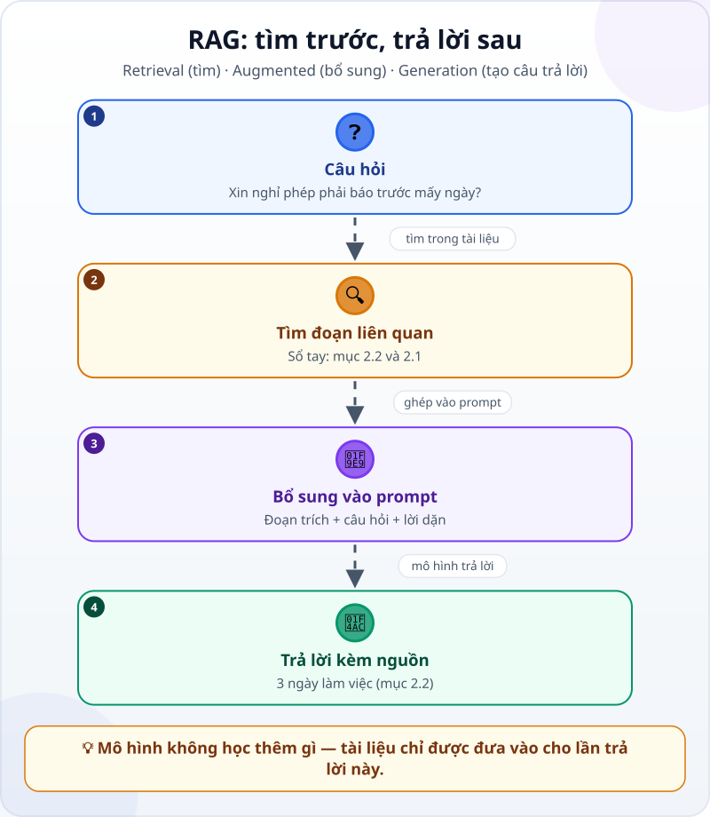
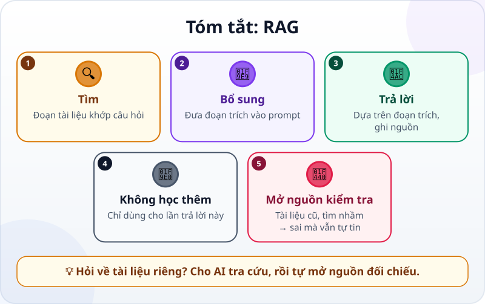

🌐 **Tiếng Việt** · [English](../../en/lessons/rag-intro.md) · [日本語](../../ja/lessons/rag-intro.md)

# RAG: cho AI mở tài liệu ra tra cứu

<!-- section: objective -->
## Mục tiêu bài học

Sau bài này, bạn sẽ:

- Giải thích RAG bằng ba bước: tìm đoạn liên quan, đưa vào prompt, trả lời dựa trên các đoạn đó.
- Theo dõi được một lượt hỏi đáp có RAG và chỉ ra câu trả lời lấy từ đoạn tài liệu nào.
- Nhận ra hai chỗ RAG vẫn sai — tài liệu cũ và tìm nhầm đoạn — và biết mở nguồn ra đối chiếu.

<!-- section: hook -->
## Mở đầu: vì sao nên quan tâm?

Tuấn hỏi một chatbot: *"Ở công ty tôi, xin nghỉ phép phải báo trước mấy ngày?"* Câu trả lời đến ngay, rất tự tin: *"Thông thường, bạn nên báo trước một đến hai tuần…"*

Nghe hợp lý, nhưng chatbot chưa từng đọc sổ tay nhân viên của công ty Tuấn. Nó chỉ viết ra điều *thường gặp* ở đâu đó. Muốn có câu trả lời đúng cho chính công ty mình, AI cần được đưa đúng trang tài liệu — giống như bạn mở sổ tay ra tra, thay vì đoán.

<!-- section: concept -->
## Nội dung chính

### Mô hình không biết tài liệu của bạn

Một mô hình chỉ mang theo những gì nó học được khi huấn luyện ([Máy "học" như thế nào?](how-machines-learn.md)). Sổ tay nội bộ, quy định vừa sửa tháng trước, biên bản họp hôm qua — nó chưa từng thấy. Khi thiếu thông tin, mô hình vẫn viết ra một câu trả lời nghe hợp lý, vì nó được làm ra để [đoán chữ tiếp theo](next-token-prediction.md). Đó chính là mảnh đất của [ảo giác AI](hallucination.md).

### RAG: tìm trước, trả lời sau

**RAG** (Retrieval-Augmented Generation — tạo câu trả lời có bổ sung thông tin tìm được) gồm đúng ba bước, theo ba chữ trong tên:



1. **Tìm (Retrieval):** hệ thống tìm trong kho tài liệu những đoạn gần với câu hỏi nhất.
2. **Bổ sung (Augmented):** các đoạn tìm được được ghép vào prompt, cùng câu hỏi và lời dặn cách trả lời.
3. **Tạo câu trả lời (Generation):** mô hình viết câu trả lời dựa trên các đoạn đó. Nếu hệ thống gửi kèm nguồn của từng đoạn và dặn ghi nguồn, mô hình có thể chỉ ra ý nào lấy từ đoạn nào; không được dặn thì chưa chắc nó sẽ làm.

Những đoạn tài liệu này nằm trong [cửa sổ ngữ cảnh](context-window.md): mô hình dùng được chúng chừng nào chúng còn trong cuộc trò chuyện. Nhưng các con số bên trong mô hình không thay đổi: mô hình không "học thuộc" tài liệu của bạn, và một cuộc trò chuyện mới sẽ không có chúng.

### Vì sao phải tìm, sao không đưa hết?

Nếu tài liệu chỉ vài trang, đôi khi cách đơn giản nhất là đưa cả tài liệu vào prompt. Nhưng một kho tài liệu lớn thì không vừa cửa sổ ngữ cảnh. Vì vậy, hệ thống RAG chia tài liệu thành những đoạn nhỏ từ trước; mỗi lần có câu hỏi, nó chỉ lấy vài đoạn liên quan nhất. Nhiều hệ thống tìm theo **nghĩa**, không chỉ theo chữ giống nhau: câu hỏi nói "báo trước", đoạn tài liệu viết "chậm nhất 3 ngày làm việc trước ngày nghỉ" vẫn được tìm ra.

### Bạn gặp RAG ở đâu?

- Chatbot hỏi đáp về tài liệu nội bộ, trả lời kèm tên tài liệu và số mục.
- Công cụ tìm kiếm có AI, hiện nguồn bên dưới câu trả lời.
- Agent tự tìm và đọc file trong dự án trước khi trả lời hay sửa code. Ở đây, việc tìm được làm bằng [gọi công cụ](tool-calling.md) — cùng một ý tưởng: đọc đúng tài liệu trước, rồi mới trả lời.

<!-- section: analogy -->
## Ví dụ đời thường

RAG giống một bài **thi được mở sách**. Học sinh không cần thuộc lòng cả cuốn sách. Gặp câu hỏi, em lật đến đúng trang, đọc đoạn liên quan, rồi viết câu trả lời và ghi *"theo trang 42"*. Người chấm có thể mở trang 42 ra kiểm tra.

Phép so sánh sai ở chỗ: học sinh hiểu nội dung và có thể nhận ra sách in sai. AI chỉ dùng những đoạn được đưa cho nó. Nếu lật nhầm trang, hoặc cuốn sách là bản cũ, câu trả lời vẫn tự tin và vẫn "có nguồn" — chỉ là sai. Và ở đây, người lật sách thường là phần tìm kiếm của hệ thống, không phải chính mô hình.

<!-- section: example -->
## Ví dụ thực tế

Hãy xem một lượt hỏi đáp có RAG, với dữ liệu hoàn toàn giả. Kho tài liệu chỉ có file `ai-practice/handbook.md`:

```text
# Sổ tay nhân viên (dữ liệu giả để thực hành)

## 1. Giờ làm việc
1.1. Giờ làm việc từ 8:30 đến 17:30, nghỉ trưa 60 phút.

## 2. Nghỉ phép
2.1. Nhân viên chính thức có 12 ngày phép năm.
2.2. Xin nghỉ phép qua hệ thống chấm công, chậm nhất 3 ngày làm việc trước ngày nghỉ.

## 3. Công tác
3.1. Vé tàu xe đi công tác do bộ phận hành chính đặt.
```

**Bước 1 — Tuấn hỏi:** *"Xin nghỉ phép phải báo trước mấy ngày?"*

**Bước 2 — hệ thống tìm.** Nó trả về hai đoạn gần với câu hỏi nhất: **2.2** và **2.1**. Mục 1 và mục 3 không được lấy, vì không nói gì về nghỉ phép.

**Bước 3 — hệ thống ghép prompt.** Mô hình nhận được:

```text
Chỉ trả lời dựa trên các đoạn trích dưới đây và ghi số mục đã dùng.
Nếu các đoạn không có câu trả lời, hãy nói: "Sổ tay không ghi."

[2.2] Xin nghỉ phép qua hệ thống chấm công, chậm nhất 3 ngày làm việc trước ngày nghỉ.
[2.1] Nhân viên chính thức có 12 ngày phép năm.

Câu hỏi: Xin nghỉ phép phải báo trước mấy ngày?
```

**Bước 4 — mô hình trả lời:** *"Chậm nhất 3 ngày làm việc trước ngày nghỉ, gửi qua hệ thống chấm công (mục 2.2)."*

**Bước 5 — Tuấn kiểm tra.** Anh mở mục 2.2 trong sổ tay: khớp. Câu trả lời có nguồn thì kiểm tra được trong chốc lát; câu trả lời không nguồn thì chỉ có thể tin, hoặc không.

Giờ thử hai tình huống khó hơn:

- **Câu hỏi không có trong tài liệu.** Tuấn hỏi: *"Công ty có cho làm việc từ xa không?"* Không đoạn nào nói về việc này. Câu trả lời đúng là *"Sổ tay không ghi."* Nếu AI vẫn đưa ra một "quy định", đó là dấu hiệu nó đang bịa — lời dặn ở Bước 3 là để ngăn chuyện này.
- **Tài liệu cũ.** Giả sử kho còn sót bản sổ tay năm ngoái, ghi *"báo trước 5 ngày làm việc"*. Nếu hệ thống lấy nhầm đoạn cũ, câu trả lời vẫn ghi nguồn đàng hoàng — và vẫn sai. RAG chỉ tốt bằng tài liệu trong kho và phần tìm kiếm của nó.

<!-- section: try-it -->
## Thử ngay

Khoảng 10 phút, với một chatbot bạn đang dùng. Chỉ dùng dữ liệu giả: ⛔ không đưa tài liệu thật của công ty vào công cụ AI chưa được công ty cho phép.

1. Trong thư mục `ai-practice`, tạo file `handbook.md` và chép sổ tay giả ở trên vào.
2. Mở một cuộc trò chuyện mới và hỏi: *"Xin nghỉ phép phải báo trước mấy ngày?"* — không đưa file. Ghi lại câu trả lời.
3. Mở một cuộc trò chuyện mới khác. Dán nội dung file, kèm lời dặn ở Bước 3, rồi hỏi lại cùng câu hỏi.
4. Trong cuộc trò chuyện thứ hai, hỏi thêm: *"Công ty có cho làm việc từ xa không?"*

Tự kiểm tra: ở lần hỏi thứ hai, câu trả lời phải là 3 ngày làm việc và ghi mục 2.2; với câu hỏi cuối, AI phải nói sổ tay không ghi. Ở đây, chính bạn làm bước "tìm" — bạn chọn file để đưa. Một hệ thống RAG tự động hóa bước đó cho một kho tài liệu lớn.

<!-- section: misconceptions -->
## Hiểu lầm thường gặp

- **"RAG giúp AI học thuộc tài liệu của mình."** — Không. Các đoạn tài liệu chỉ nằm trong ngữ cảnh của cuộc trò chuyện, chừng nào còn vừa cửa sổ ngữ cảnh; mô hình không thay đổi gì.
- **"Có ghi nguồn là chắc chắn đúng."** — Nguồn giúp bạn kiểm tra được, chứ không tự làm câu trả lời đúng. Hệ thống có thể lấy nhầm đoạn, lấy bản cũ, hoặc mô hình đọc sai. Việc quan trọng thì mở nguồn ra đối chiếu.
- **"Có RAG thì không cần viết prompt cẩn thận."** — Vẫn cần: dặn AI chỉ dựa vào đoạn trích, ghi số mục, và nói "không có" khi tài liệu không ghi.

<!-- section: recap -->
## Tóm tắt bằng hình



<!-- section: takeaways -->
## Ghi nhớ

- RAG = tìm đoạn tài liệu liên quan → đưa vào prompt → trả lời dựa trên các đoạn đó.
- Mô hình không học thêm: tài liệu nằm trong ngữ cảnh, không vào mô hình.
- Câu trả lời tốt ghi nguồn, và dám nói "tài liệu không ghi".
- Tài liệu cũ hay tìm nhầm đoạn thì câu trả lời vẫn tự tin — mà sai.
- Việc quan trọng: mở đúng mục được trích ra đối chiếu.

<!-- section: quiz -->
## Tự kiểm tra

**Câu 1.** RAG giúp mô hình trả lời về tài liệu nội bộ bằng cách nào?

- A) Huấn luyện lại mô hình bằng tài liệu mỗi đêm
- B) Tìm đoạn liên quan và đưa vào prompt cùng câu hỏi
- C) Cho mô hình nhớ vĩnh viễn mọi file đã từng đọc

**Câu 2.** Câu trả lời ghi rõ "theo mục 2.2", nhưng hệ thống đã lấy nhầm bản sổ tay năm ngoái. Điều gì có thể xảy ra?

- A) Câu trả lời vẫn đúng, vì đã có nguồn
- B) Mô hình sẽ tự nhận ra đó là bản cũ
- C) Câu trả lời nghe có căn cứ nhưng sai

**Câu 3.** Người dùng hỏi điều mà tài liệu không hề nhắc tới. Một hệ thống RAG tốt nên làm gì?

- A) Nói rằng tài liệu không ghi thông tin đó
- B) Đoán một câu trả lời nghe hợp lý
- C) Lấy đại một đoạn gần giống để trả lời

<details>
<summary>Xem đáp án</summary>

1. **B** — RAG không đổi mô hình; nó tìm đúng đoạn và đưa vào ngữ cảnh.
2. **C** — nguồn chỉ tốt bằng tài liệu được lấy; tài liệu cũ cho ra câu trả lời "có nguồn" mà vẫn sai.
3. **A** — nói "không có" tốt hơn một câu trả lời bịa nghe hợp lý.

</details>

<!-- section: sources -->
## Nguồn tham khảo

- Anthropic — [Glossary](https://platform.claude.com/docs/en/about-claude/glossary) (tiếng Anh), mục *RAG*: tài liệu được tìm lúc có câu hỏi và đưa vào cửa sổ ngữ cảnh cùng câu hỏi; mô hình có thể tự tìm nếu có công cụ; hiệu quả của RAG phụ thuộc vào chất lượng và độ liên quan của tài liệu tìm được.
- Anthropic — [Introducing Contextual Retrieval](https://www.anthropic.com/news/contextual-retrieval) (tiếng Anh, 9/2024): RAG tìm thông tin liên quan trong kho tài liệu rồi thêm vào prompt; kho lớn được chia thành đoạn nhỏ và mỗi lần hỏi chỉ lấy những đoạn gần nghĩa nhất; kho đủ nhỏ thì có thể đưa cả vào prompt.
- Google Cloud — [What is Retrieval-Augmented Generation (RAG)?](https://cloud.google.com/use-cases/retrieval-augmented-generation) (tiếng Anh): RAG kết hợp tìm kiếm với mô hình ngôn ngữ lớn để câu trả lời mới hơn và có căn cứ hơn; nếu thông tin tìm được không liên quan, câu trả lời có thể "có căn cứ" mà vẫn lạc đề hoặc sai.
