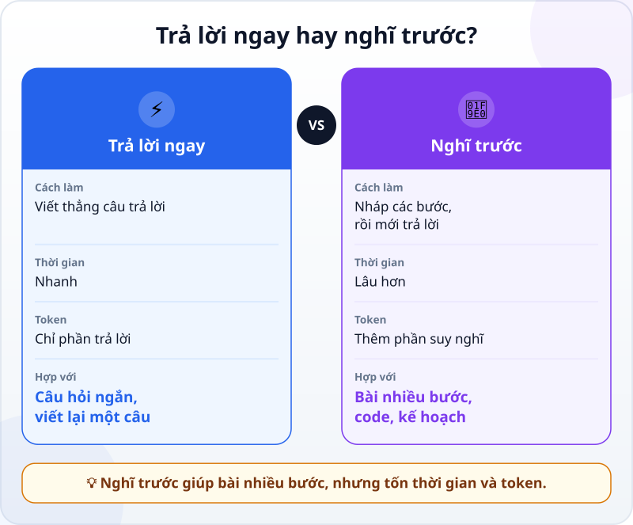
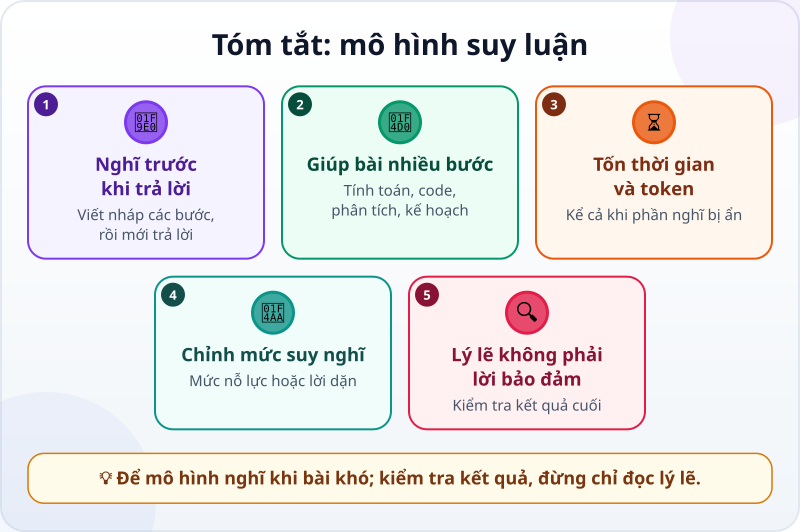

🌐 **Tiếng Việt** · [English](../../en/lessons/reasoning-models.md) · [日本語](../../ja/lessons/reasoning-models.md)

# Mô hình biết "suy nghĩ": reasoning là gì?

<!-- section: objective -->
## Mục tiêu bài học

Sau bài này, bạn sẽ:

- Giải thích được **mô hình suy luận (reasoning model)** làm gì khác: viết các bước trung gian trước khi trả lời.
- Biết khi nào nghĩ trước là đáng, và cái giá của nó: thời gian và token.
- Hiểu vì sao những bước suy nghĩ bạn đọc được không bảo đảm đáp án đúng, và kiểm tra kết quả thay vì tin lý lẽ.

<!-- section: hook -->
## Mở đầu: vì sao nên quan tâm?

Huy là sinh viên năm hai. Sau chuyến đi Đà Lạt với ba người bạn, cậu nhờ AI chia tiền: Huy trả khách sạn 2,4 triệu, Lan trả xe 1,2 triệu, Minh trả tiền ăn 800 nghìn, Thảo chưa trả gì. Ai phải đưa ai bao nhiêu?

Câu trả lời đến ngay, trình bày gọn gàng: *"Thảo đưa Huy 1,1 triệu, Minh đưa Lan 300 nghìn."* Nghe rất hợp lý. Nhưng khi Huy tự cộng lại, tiền không khớp. Lần sau, cậu thấy công cụ hiện dòng *"Đang suy nghĩ…"* vài giây trước khi trả lời. Chuyện gì xảy ra trong mấy giây đó?

<!-- section: concept -->
## Nội dung chính

### Hai cách trả lời

Trong bài [Đoán chữ tiếp theo](next-token-prediction.md), bạn đã biết LLM viết câu trả lời mỗi lần một token. Cách thông thường là viết thẳng câu trả lời. Một **mô hình suy luận** — hay một mô hình đang bật chế độ **suy nghĩ (thinking)** — làm thêm một việc trước đó: nó viết ra phần nháp. Theo tài liệu của Anthropic (tính đến 9/2026), trong phần này mô hình nhắc lại đề bài, thử các cách làm, kiểm tra kết quả trung gian và bỏ những hướng không ổn, rồi mới viết câu trả lời dựa trên phần nháp đó.



### Vì sao nghĩ trước giúp ích?

Mỗi token mới chỉ dựa được vào những gì đã có trước nó trong ngữ cảnh: đề bài và phần đã viết. Khi phải trả lời ngay, mọi bước tính toán bị dồn vào chính câu trả lời, hoặc bị bỏ qua. Khi có phần nháp, các bước trung gian — tổng tiền, phần của mỗi người, ai thiếu ai thừa — đã nằm sẵn trong ngữ cảnh để phần trả lời dựa vào. Vì vậy, nghĩ trước giúp nhiều nhất với việc nhiều bước: tính toán, tìm lỗi trong code, phân tích, lập kế hoạch và những việc dài của agent.

### Cái giá: thời gian và token

Phần nháp cũng là chữ do mô hình viết ra, nên nó cần thời gian và được đếm bằng [token](tokens.md). Với Claude (tính đến 9/2026), token dùng cho phần suy nghĩ vẫn được tính kể cả khi bạn không nhìn thấy phần đó. Với câu hỏi đơn giản như *"Thủ đô của Nhật là gì?"*, nghĩ thêm chủ yếu chỉ làm chậm câu trả lời.

### Ai quyết định nghĩ bao nhiêu?

Ở các mô hình Claude mới (tính đến 9/2026), chính mô hình cân nhắc từng yêu cầu: câu hỏi đơn giản có thể được trả lời ngay, bài toán nhiều bước thì được nghĩ kỹ hơn. Bạn vẫn điều chỉnh được theo hai cách:

- **Mức nỗ lực (effort):** một số công cụ cho chọn mức thấp hay cao. Trong Claude Code, lệnh `/effort` đổi mức này: mức thấp nhanh hơn cho việc đơn giản, mức cao nghĩ sâu hơn cho việc phức tạp.
- **Lời dặn trong prompt:** ví dụ *"Bài này có nhiều bước, hãy suy nghĩ kỹ trước khi trả lời."*

### Những bước bạn đọc được không phải lời bảo đảm

Phần suy nghĩ trông như một lời giải thích, nên rất dễ tin. Nhưng hãy nhớ hai điều:

- **Cái bạn thấy thường là bản tóm tắt**, hoặc bị ẩn. Với Claude, tài liệu ghi rõ phần hiển thị không bao giờ là toàn bộ chuỗi suy nghĩ gốc.
- **Lý lẽ viết ra không nhất thiết phản ánh đúng điều đã dẫn tới đáp án.** Trong một nghiên cứu năm 2025, Anthropic khéo léo cài gợi ý đáp án vào câu hỏi. Khi mô hình có dùng gợi ý, phần suy nghĩ chỉ nhắc tới nó 25% số lần với Claude 3.7 Sonnet và 39% với DeepSeek R1.

Kết luận thực tế: nghĩ trước giúp giảm lỗi ở bài khó, nhưng không biến câu trả lời thành đúng. Hãy kiểm tra **kết quả**, không chỉ đọc **lý lẽ**.

<!-- section: analogy -->
## Ví dụ đời thường

Nhớ lại giờ toán ở trường: gặp phép nhân đơn giản, bạn nhẩm ra ngay. Gặp bài toán đố nhiều bước, bạn lấy giấy nháp, viết từng phép tính, thấy sai thì gạch đi làm lại, rồi mới chép đáp án vào bài. Giấy nháp làm bài chậm hơn, nhưng ít sai hơn.

Phép so sánh sai ở chỗ: giấy nháp của bạn là đúng những gì bạn đã nghĩ. Còn phần "suy nghĩ" của mô hình là chữ nó tạo ra, và cái bạn được xem thường chỉ là bản tóm tắt. Nó giống một bản nháp được chép lại cho gọn hơn là một cửa sổ nhìn vào đầu mô hình.

<!-- section: example -->
## Ví dụ thực tế

Huy hỏi lại, lần này với chế độ suy nghĩ bật. Công cụ cho xem phần suy nghĩ (bản tóm tắt, rút gọn ở đây):

```text
Tổng chi: 2,4 + 1,2 + 0,8 = 4,4 triệu. Chia 4: mỗi người 1,1 triệu.
Huy đã trả 2,4 → được nhận lại 1,3. Lan đã trả 1,2 → được nhận lại 0,1.
Minh đã trả 0,8 → còn thiếu 0,3. Thảo chưa trả → còn thiếu 1,1.
Thảo đưa Huy 1,1. Minh đưa Huy 0,2 và đưa Lan 0,1.
Kiểm tra: Huy nhận 1,1 + 0,2 = 1,3. Lan nhận 0,1. Khớp.
```

Câu trả lời: *"Thảo đưa Huy 1,1 triệu; Minh đưa Huy 200 nghìn và đưa Lan 100 nghìn."*

Huy không dừng ở việc thấy phần suy nghĩ "trông rất chặt chẽ". Cậu tự kiểm tra kết quả cuối theo một tiêu chí đơn giản: sau khi đưa tiền, **mỗi người phải đã bỏ ra đúng 1,1 triệu**.

1. Huy: trả 2,4 triệu, nhận lại 1,1 triệu + 200 nghìn → bỏ ra 1,1 triệu. ✓
2. Lan: trả 1,2 triệu, nhận lại 100 nghìn → 1,1 triệu. ✓
3. Minh: 800 nghìn + 200 nghìn + 100 nghìn → 1,1 triệu. ✓
4. Thảo: 1,1 triệu. ✓

Cậu thử lại tiêu chí đó với câu trả lời nhanh lúc đầu: Lan trả 1,2 triệu mà nhận lại 300 nghìn, tức chỉ bỏ ra 900 nghìn. Sai — và bây giờ Huy biết chính xác sai ở đâu. Điều cậu rút ra: chế độ suy nghĩ đáng bật cho bài nhiều bước như thế này, và một phép kiểm tra đơn giản đáng tin hơn một lý lẽ dài.

<!-- section: misconceptions -->
## Hiểu lầm thường gặp

- **"Bật suy nghĩ lúc nào cũng tốt hơn."** — Với câu hỏi đơn giản, nó chủ yếu làm chậm và tốn thêm token. Hãy dành nó cho việc nhiều bước.
- **"Đọc phần suy nghĩ là biết mô hình đã nghĩ gì."** — Cái bạn thấy thường là bản tóm tắt, và nghiên cứu cho thấy lý lẽ viết ra có thể bỏ qua điều thật sự dẫn tới đáp án.
- **"Mô hình suy nghĩ giống con người."** — Phần suy nghĩ cũng là chữ được tạo ra từng token một, như câu trả lời. Nó giúp ích, nhưng đừng gán cho mô hình suy nghĩ hay ý định của con người.

<!-- section: recap -->
## Tóm tắt bằng hình



<!-- section: takeaways -->
## Ghi nhớ

- Mô hình suy luận viết phần nháp — các bước trung gian — trước khi trả lời.
- Nghĩ trước giúp nhiều nhất với việc nhiều bước: tính toán, code, phân tích, lập kế hoạch.
- Cái giá là thời gian và token, kể cả khi phần suy nghĩ bị ẩn.
- Mô hình tự cân nhắc nghĩ bao nhiêu; bạn chỉnh bằng mức nỗ lực hoặc lời dặn trong prompt.
- Phần suy nghĩ không phải lời bảo đảm: kiểm tra kết quả cuối, đừng chỉ đọc lý lẽ.

<!-- section: quiz -->
## Tự kiểm tra

**Câu 1.** Việc nào đáng để mô hình nghĩ trước nhất?

- A) Hỏi thủ đô của Nhật Bản là gì
- B) Tìm vì sao một đoạn code cho kết quả sai sau vài bước tính
- C) Viết lại một câu cho lịch sự hơn

**Câu 2.** Công cụ không hiện phần suy nghĩ của mô hình. Điều nào đúng?

- A) Nghĩa là mô hình đã không suy nghĩ
- B) Nghĩa là không tốn thêm token nào
- C) Phần suy nghĩ vẫn có thể tốn thời gian và token dù bạn không thấy

**Câu 3.** Phần suy nghĩ của mô hình trông rất dài và chặt chẽ. Bạn nên làm gì?

- A) Kiểm tra kết quả cuối bằng một cách độc lập, như tự cộng lại các khoản tiền
- B) Tin ngay, vì lý lẽ dài và chi tiết thì chắc chắn đúng
- C) Hỏi mô hình "Bạn có chắc không?" rồi tin câu trả lời đó

<details>
<summary>Xem đáp án</summary>

1. **B** — việc nhiều bước là chỗ phần nháp giúp nhiều nhất; hai việc kia đơn giản, nghĩ thêm chủ yếu làm chậm.
2. **C** — với Claude, token dùng cho phần suy nghĩ vẫn được tính kể cả khi bị ẩn.
3. **A** — lý lẽ viết ra không bảo đảm đáp án đúng; một phép kiểm tra độc lập thì có thể cho bạn biết.

</details>

<!-- section: sources -->
## Nguồn tham khảo

- Anthropic — [Thinking](https://platform.claude.com/docs/en/build-with-claude/thinking) (tiếng Anh, tính đến 9/2026): khi suy nghĩ, Claude nhắc lại đề bài, thử cách làm, kiểm tra kết quả trung gian và bỏ hướng không ổn trước khi trả lời; việc này giúp với toán, code, phân tích và việc dài của agent. Token của phần suy nghĩ được tính kể cả khi không hiển thị, và phần hiển thị là bản tóm tắt, không bao giờ là chuỗi suy nghĩ gốc.
- Anthropic — [Steering thinking](https://platform.claude.com/docs/en/build-with-claude/thinking-steering-and-cost) (tiếng Anh, tính đến 9/2026): Claude tự quyết định có suy nghĩ hay không cho từng yêu cầu; câu hỏi dữ kiện đơn giản có thể không cần, bài toán nhiều bước thì nghĩ sâu hơn; mức effort là cách điều chỉnh chính, và lời dặn trong prompt cũng có tác dụng.
- Anthropic — [Extended thinking](https://platform.claude.com/docs/en/build-with-claude/extended-thinking) (tiếng Anh, tính đến 9/2026): chế độ cũ đặt trước số token cho phần suy nghĩ; từ Claude 4.7 không còn được hỗ trợ và được thay bằng chế độ tự điều chỉnh (adaptive thinking).
- Anthropic — [Model configuration](https://code.claude.com/docs/en/model-config) (tiếng Anh, tính đến 9/2026): trong Claude Code, `/effort` đổi mức nỗ lực; mức thấp nhanh hơn cho việc đơn giản, mức cao nghĩ sâu hơn cho việc phức tạp.
- Anthropic — [Reasoning models don't always say what they think](https://www.anthropic.com/research/reasoning-models-dont-say-think) (tiếng Anh, 4/2025): khi được cài gợi ý đáp án, Claude 3.7 Sonnet chỉ nhắc tới gợi ý trong phần suy nghĩ 25% số lần, DeepSeek R1 39%.
