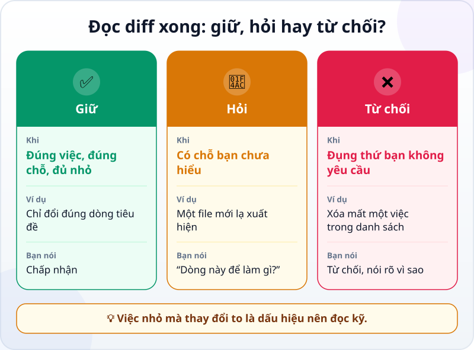
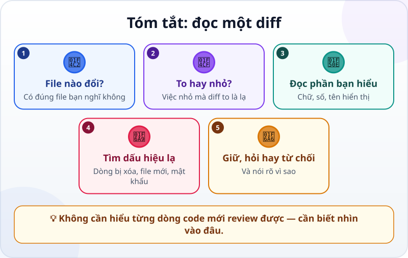

🌐 **Tiếng Việt** · [English](../../en/lessons/reviewing-agent-changes.md) · [日本語](../../ja/lessons/reviewing-agent-changes.md)

# Đọc và review thay đổi của agent (diff)

<!-- section: objective -->
## Mục tiêu bài học

Sau bài này, bạn sẽ:

- Đọc được một **diff**: dòng nào được thêm, dòng nào bị xóa, ở file nào.
- Review thay đổi của agent bằng bốn câu hỏi, kể cả khi chưa hiểu hết code.
- Quyết định **giữ, hỏi hay từ chối** — và nói rõ vì sao.

<!-- section: hook -->
## Mở đầu: vì sao nên quan tâm?

Đến giờ, bạn nghiệm thu bằng hành vi: mở, bấm, so với tiêu chí. Nhưng có những thay đổi không lộ ra khi bấm thử: một dòng bị xóa ở chỗ bạn không để ý, một file lạ được thêm vào, một mật khẩu bị ghi thẳng vào code.

Diff cho bạn thấy **chính xác** agent đã đổi gì — trước khi bạn chấp nhận. Ở chế độ agent hỏi trước, bạn thấy diff của từng thay đổi ngay khi agent đề xuất.

<!-- section: concept -->
## Nội dung chính

### Diff trông như thế nào?

```diff
-      <button>Mẹo khác</button>
+      <button>Mẹo tiếp theo</button>
```

- Dòng bắt đầu bằng `-` (thường tô đỏ) là dòng **bị xóa**.
- Dòng bắt đầu bằng `+` (thường tô xanh) là dòng **được thêm**.
- Một dòng bị sửa hiện thành một cặp: dòng cũ `-` và dòng mới `+`. Những dòng không đổi xung quanh giúp bạn biết đang ở đâu trong file.

Nhiều công cụ còn tóm tắt kích thước, ví dụ `+12 -1`: thêm 12 dòng, xóa 1 dòng.

### Bốn câu hỏi khi review

1. **File nào đổi?** Có đúng những file bạn nghĩ không? (Đường dẫn giúp bạn trả lời.)
2. **To hay nhỏ?** Việc nhỏ mà diff to là dấu hiệu lạ.
3. **Đọc phần bạn hiểu:** chữ hiển thị, con số, tên. Chúng có đúng như bạn yêu cầu?
4. **Tìm dấu hiệu lạ:** dòng bị xóa mà bạn không yêu cầu, file mới lạ, thư viện mới, mật khẩu hay khóa bí mật nằm trong code.

### Giữ, hỏi hay từ chối



Từ chối không phải là thất bại. Nói rõ vì sao — *"Dòng xóa việc 'Họp nhóm thứ Tư' không nằm trong yêu cầu, hãy giữ nguyên danh sách"* — giúp agent sửa đúng ngay lần sau.

<!-- section: example -->
## Ví dụ thực tế

Hana nhờ agent: *"Đổi chữ trên nút từ 'Mẹo khác' thành 'Mẹo tiếp theo'."* Agent đề xuất thay đổi, kèm tóm tắt `+2 -2`. Việc chỉ một dòng, sao lại hai? Hana đọc diff:

```diff
-      <button>Mẹo khác</button>
+      <button>Mẹo tiếp theo</button>
       ...
       const tips = [
         "Viết việc quan trọng nhất lên đầu danh sách.",
-        "Tắt thông báo khi cần tập trung 25 phút.",
+        "Tắt thông báo khi cần tập trung.",
         "Trả lời email vào hai khung giờ cố định.",
```

Đổi chữ trên nút: đúng yêu cầu. Nhưng agent còn "tiện tay" sửa một mẹo — bỏ mất "25 phút". Hana trả lời: *"Giữ đổi chữ trên nút. Không sửa danh sách mẹo — trả lại câu cũ."*

<!-- section: try-it -->
## Thử ngay

Khoảng 15 phút.

**1. Review một diff mẫu (5 phút).** Yêu cầu là: *"Thêm việc thứ 6: Gọi điện cho bố mẹ."* Agent đề xuất:

```diff
   <ul>
     <li><input type="checkbox"> Nộp báo cáo tháng</li>
-    <li><input type="checkbox"> Họp nhóm thứ Tư</li>
     <li><input type="checkbox"> Đặt lịch khám răng</li>
     <li><input type="checkbox"> Đi bộ 30 phút</li>
     <li><input type="checkbox"> Đọc 20 trang sách</li>
+    <li><input type="checkbox"> Gọi điện cho bố mẹ</li>
   </ul>
```

Trả lời bốn câu hỏi, rồi quyết định: giữ, hỏi hay từ chối?

<details>
<summary>Gợi ý đáp án</summary>

- Việc thứ 6 được thêm đúng (`+`).
- Nhưng việc "Họp nhóm thứ Tư" bị xóa (`-`) — không nằm trong yêu cầu. Danh sách vẫn chỉ có 5 việc, dù yêu cầu là thêm việc thứ 6.
- Quyết định: **từ chối**, và nói rõ: *"Chỉ thêm việc mới, không xóa việc nào."*

</details>

**2. Review một thay đổi thật (10 phút).** Với `my-week.html`, ở chế độ agent hỏi trước mỗi thay đổi, giao một việc nhỏ:

```text
Đổi tiêu đề thành "Việc của tôi tuần này" và thêm một việc mới: "Dọn bàn làm việc".
Không đổi gì khác.
```

Trước khi chấp nhận, đọc diff với bốn câu hỏi. Ghi bằng chứng:

- *Tôi cho xem được…* diff chỉ gồm dòng tiêu đề và một dòng việc mới.
- *Tôi đã kiểm tra…* file nào đổi, kích thước thay đổi, không có dòng nào bị xóa ngoài dòng tiêu đề cũ.
- *Tôi sẽ không dùng cách này khi…* ví dụ: diff quá dài để đọc — khi đó tôi nhờ agent chia nhỏ việc.

<!-- section: misconceptions -->
## Hiểu lầm thường gặp

- **"Không biết code thì không review được."** — Bạn review được phần mình hiểu và tìm dấu hiệu lạ: file nào đổi, dòng nào bị xóa, có gì mới được thêm. Phần lớn lỗi của agent lộ ra ở đó.
- **"Chạy được là đúng."** — Một thay đổi có thể vẫn chạy mà lại xóa mất thứ bạn cần, hay để lộ một mật khẩu.
- **"Diff dài thì cứ chấp nhận cho nhanh."** — Diff quá dài để đọc là dấu hiệu nên chia việc nhỏ hơn, không phải lý do để bỏ qua.

<!-- section: recap -->
## Tóm tắt bằng hình



<!-- section: takeaways -->
## Ghi nhớ

- Diff: `-` là dòng bị xóa, `+` là dòng được thêm; một dòng bị sửa là một cặp `-` và `+`.
- Bốn câu hỏi: file nào đổi, to hay nhỏ, phần mình hiểu có đúng không, có dấu hiệu lạ không.
- Quyết định giữ, hỏi hay từ chối — và nói rõ vì sao.
- Diff quá dài để đọc? Chia việc nhỏ hơn.

<!-- section: quiz -->
## Tự kiểm tra

**Câu 1.** Trong một diff, dòng bắt đầu bằng `-` nghĩa là gì?

- A) Dòng bị xóa
- B) Dòng được thêm
- C) Dòng bị lỗi

**Câu 2.** Bạn nhờ đổi một chữ, nhưng agent đề xuất `+40 -35`. Bạn làm gì?

- A) Chấp nhận, vì agent thường đúng
- B) Chấp nhận rồi xem sau
- C) Đọc kỹ xem vì sao việc nhỏ lại thành thay đổi lớn, trước khi quyết định

**Câu 3.** Diff đúng yêu cầu nhưng có thêm một file lạ bạn không hiểu. Cách nào hợp lý nhất?

- A) Từ chối toàn bộ và làm lại từ đầu
- B) Hỏi agent file đó để làm gì
- C) Chấp nhận, vì phần chính đã đúng

<details>
<summary>Xem đáp án</summary>

1. **A** — `-` là bị xóa, `+` là được thêm.
2. **C** — việc nhỏ mà thay đổi to là dấu hiệu lạ đầu tiên cần đọc kỹ.
3. **B** — chưa hiểu thì hỏi; quyết định giữ hay từ chối sau khi có câu trả lời.

</details>

<!-- section: sources -->
## Nguồn tham khảo

- Anthropic — [Get started with the desktop app](https://code.claude.com/docs/en/desktop-quickstart) (tiếng Anh): ở chế độ *Manual*, bạn thấy diff của từng thay đổi và bấm chấp nhận hoặc từ chối; ở chế độ tự động hơn, bạn xem diff sau khi agent đã sửa.
- Google Cloud — [What is agentic coding?](https://cloud.google.com/discover/what-is-agentic-coding) (tiếng Anh): trước khi code do agent viết đi vào dự án chính, nên có người trong nhóm review.
