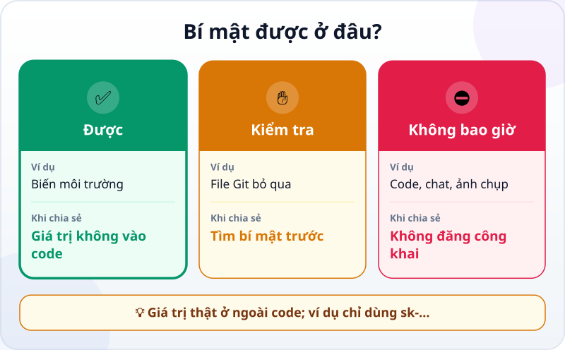
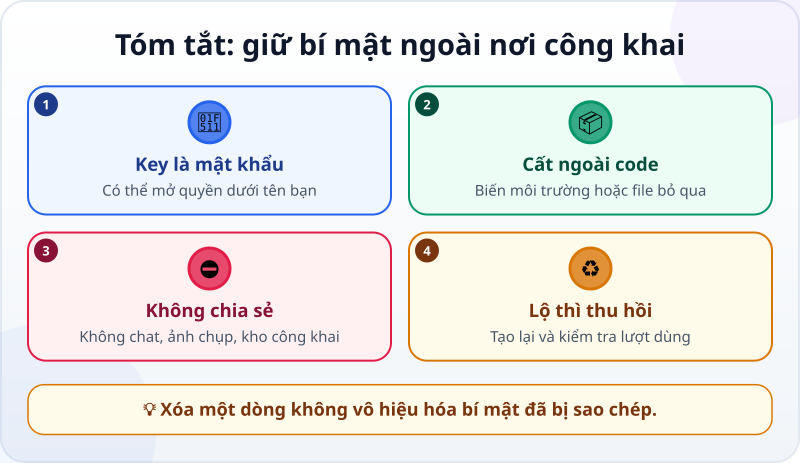

🌐 **Tiếng Việt** · [English](../../en/lessons/security-basics.md) · [日本語](../../ja/lessons/security-basics.md)

# An toàn cơ bản: API key, mật khẩu và dữ liệu cá nhân

<!-- section: objective -->
## Mục tiêu bài học

Sau bài này, bạn sẽ:

- Giải thích vì sao API key phải được bảo vệ như mật khẩu.
- Phân biệt nơi bí mật có thể nằm và nơi bí mật tuyệt đối không được xuất hiện.
- Biết cách xử lý ngay nếu một bí mật đã bị lộ.

<!-- section: hook -->
## Mở đầu: một dòng suýt thành công khai

Huy viết một chương trình nhỏ trong thư mục `ai-practice`. Dịch vụ yêu cầu một **API key**, nên cậu dán thẳng vào file Python:

```python
API_KEY = "sk-..."  # chỉ là ký hiệu giữ chỗ, không phải key thật
```

Chương trình chạy. Huy chuẩn bị đưa dự án lên một kho Git công khai để khoe với bạn. Ngay trước khi bấm, cậu nhận ra: ai tải code xuống cũng sẽ thấy dòng đó.

Một bí mật không trở nên an toàn chỉ vì nó nằm giữa nhiều dòng code. Nếu file được chia sẻ, bí mật cũng được chia sẻ.

<!-- section: concept -->
## Nội dung chính

### API key là mật khẩu của chương trình

**API key** là một chuỗi bí mật dùng để nhận diện chương trình của bạn với một dịch vụ. Nó có thể mở quyền sử dụng và gắn lượt dùng với tài khoản của bạn. Người khác lấy được key có thể dùng quyền đó dưới tên bạn. Vì vậy, hãy đối xử với API key như mật khẩu: không đăng, không gửi, không dán vào cuộc trò chuyện với AI.

Quy tắc này cũng áp dụng cho mật khẩu và dữ liệu cá nhân của người khác. Tên giả như "Nguyễn Văn A" trong bài tập thì được; danh sách khách hàng thật, số điện thoại thật hay bảng lương thật thì không.

### Bí mật được ở đâu?



- ✅ **Được:** biến môi trường do hệ điều hành giữ; hoặc file bí mật cục bộ đã được Git bỏ qua. Chỉ dùng cách thứ hai khi bạn hiểu file bỏ qua của dự án.
- ✋ **Kiểm tra trước:** trước khi chia sẻ thư mục hay chụp màn hình, tìm lại xem bí mật có xuất hiện trong file, terminal hoặc ảnh không.
- ⛔ **Không bao giờ:** code, cuộc trò chuyện với AI, ảnh chụp màn hình, kho công khai. Viết `sk-...` khi cần minh họa.

Biến môi trường cho chương trình đọc giá trị mà không viết giá trị đó vào code. Nhưng nó không phải phép thuật: nếu bạn in key ra terminal rồi chụp màn hình, key vẫn lộ.

### Nếu bí mật đã lộ

Đừng chỉ xóa dòng code. Lịch sử Git hoặc bản sao của người khác có thể vẫn giữ nó. Làm theo thứ tự:

1. **Thu hồi** key hoặc đổi mật khẩu tại dịch vụ đã cấp nó.
2. **Tạo key mới** nếu vẫn cần dùng, rồi cất đúng chỗ.
3. **Gỡ bí mật khỏi file và lịch sử chia sẻ**, kiểm tra lượt dùng bất thường, và báo người phụ trách nếu đó là tài khoản trường học hay công ty.

Bài [An toàn dữ liệu và quyền hạn](data-safety-and-permissions.md) dùng ba loại ✅ / ✋ / ⛔ cho mọi hành động. Bài [Git: nút hoàn tác kỳ diệu cho cả dự án](git-version-control.md) giải thích vì sao xóa ở phiên bản hiện tại chưa chắc xóa khỏi lịch sử.

<!-- section: analogy -->
## Ví dụ đời thường

API key giống thẻ ra vào có ghi tên bạn. Người cầm thẻ có thể mở những cửa thẻ được phép mở, và hệ thống ghi nhận dưới tên bạn. Bạn không dán ảnh rõ mã thẻ lên bảng tin; bạn cất nó và hủy thẻ ngay khi thất lạc.

Chỗ so sánh chưa khớp: bạn có thể thấy một chiếc thẻ vật lý đã mất. Một bí mật số có thể bị sao chép mà bạn không hề biết, và cả bản gốc lẫn bản sao đều dùng được. Vì thế, khi nghi ngờ bị lộ, phải thu hồi chứ không chỉ chuyển file sang chỗ khác.

<!-- section: example -->
## Ví dụ thực tế

Huy sửa dự án trước khi chia sẻ:

1. Cậu thay dòng trong code bằng cách đọc biến môi trường: `API_KEY = os.environ["API_KEY"]`.
2. Cậu đặt giá trị thật ở biến môi trường trên máy mình, không ghi vào bài hướng dẫn hay file code.
3. Cậu tìm toàn bộ thư mục `ai-practice` với phần đầu của key để chắc rằng không còn bản sao.
4. Cậu xem phần thay đổi bằng Git trước khi commit. Ảnh chụp chỉ hiện `sk-...`.

Nếu key thật đã từng được commit, Huy sẽ thu hồi nó trước. Một commit mới xóa dòng cũ không làm key cũ an toàn trở lại.

<!-- section: recap -->
## Tóm tắt bằng hình



<!-- section: takeaways -->
## Ghi nhớ

- API key là mật khẩu của chương trình; người có nó có thể dùng quyền dưới tên bạn.
- Cất bí mật trong biến môi trường hoặc file cục bộ được Git bỏ qua, không cất trong code.
- Không đưa mật khẩu, API key hay dữ liệu cá nhân thật vào AI, ảnh chụp hoặc kho công khai.
- Bí mật đã lộ thì thu hồi, tạo lại và kiểm tra — xóa dòng code là chưa đủ.

<!-- section: quiz -->
## Tự kiểm tra

**Câu 1.** Nơi nào phù hợp nhất cho một API key dùng trên máy của bạn?

- A) Viết thẳng trong file Python
- B) Một biến môi trường
- C) Tin nhắn riêng gửi cho AI

**Câu 2.** Bạn vừa nhận ra key thật đã nằm trong một kho công khai. Việc đầu tiên là gì?

- A) Thu hồi key ở dịch vụ đã cấp nó
- B) Chỉ đổi tên file chứa key
- C) Thêm chú thích "đừng dùng"

**Câu 3.** Dữ liệu nào phù hợp cho ví dụ trong `ai-practice`?

- A) Danh sách số điện thoại khách hàng thật
- B) Bảng lương thật đã bỏ tên nhưng còn mã nhân viên
- C) Danh sách người và số điện thoại hoàn toàn bịa

<details>
<summary>Xem đáp án</summary>

1. **B** — chương trình đọc biến môi trường mà không cần ghi giá trị bí mật vào code.
2. **A** — phải vô hiệu hóa quyền của bản sao đã lộ; chỉ sửa file không làm bản sao biến mất.
3. **C** — dữ liệu bịa không tiết lộ thông tin của người thật.

</details>
