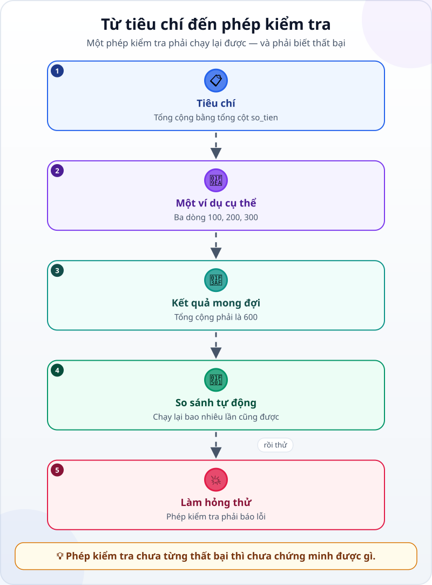
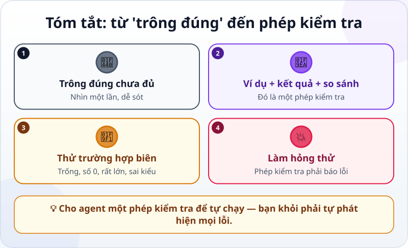

🌐 **Tiếng Việt** · [English](../../en/lessons/testing-basics.md) · [日本語](../../ja/lessons/testing-basics.md)

# Từ "trông có vẻ đúng" đến phép kiểm tra

<!-- section: objective -->
## Mục tiêu bài học

Sau bài này, bạn sẽ:

- Biến một tiêu chí thành **phép kiểm tra** (test): ví dụ cụ thể, kết quả mong đợi, so sánh tự động.
- Nhờ agent viết và chạy phép kiểm tra, rồi đọc được kết quả.
- Kiểm tra chính phép kiểm tra: **làm hỏng thử** và thử **trường hợp biên**.

<!-- section: hook -->
## Mở đầu: vì sao nên quan tâm?

Đến giờ, bạn nghiệm thu bằng mắt: mở ra, bấm, cộng thử vài số. Cách đó tốt, nhưng mỗi lần sửa bạn lại phải làm lại từ đầu — và mắt người dễ bỏ sót.

Hướng dẫn của Claude Code nói thẳng: hãy cho agent một phép kiểm tra nó tự chạy được. Không có nó, "trông có vẻ xong" là tín hiệu duy nhất — và bạn thành người phải tự phát hiện mọi lỗi.

<!-- section: concept -->
## Nội dung chính

### Một phép kiểm tra gồm gì?



1. **Một ví dụ cụ thể:** dữ liệu vào mà bạn biết rõ, ví dụ ba dòng chi phí 100, 200, 300.
2. **Kết quả mong đợi:** tổng cộng phải là 600.
3. **So sánh tự động:** một chương trình nhỏ chạy, so kết quả với mong đợi và báo **ĐẠT** hoặc **KHÔNG ĐẠT**.

Vì là chương trình, phép kiểm tra chạy lại được bao nhiêu lần cũng được — sau mỗi lần sửa, agent tự chạy trước khi báo xong.

### Thử cả trường hợp biên

Lỗi hay nấp ở chỗ không bình thường. Ngoài ví dụ bình thường, hãy thử:

- **Trống:** file không có dòng nào.
- **Số 0 hoặc rất lớn:** một chi phí 0 đồng, một chi phí 1 tỷ đồng.
- **Sai kiểu:** ô số tiền để trống, hay ghi chữ thay vì số.

Bạn không cần tự viết những phép thử này — chỉ cần yêu cầu agent thêm chúng.

### Làm hỏng thử

Một phép kiểm tra lúc nào cũng báo ĐẠT thì vô dụng: có thể nó chẳng kiểm tra gì cả. Cách chắc chắn nhất: **cố tình làm sai một chỗ**, chạy phép kiểm tra, và thấy nó báo KHÔNG ĐẠT. Rồi trả lại như cũ. Một phép kiểm tra chưa từng thất bại thì chưa chứng minh được gì.

<!-- section: example -->
## Ví dụ thực tế

Mai đã có `tong_hop.csv` — bảng tổng hợp chi phí theo hạng mục. Cô nhờ agent viết phép kiểm tra cho tiêu chí *"Tong cong bằng tổng cột so_tien trong chi_phi.csv"*.

1. Agent viết một chương trình nhỏ, `kiem_tra.py`, rồi chạy: **ĐẠT**.
2. Mai chưa tin ngay. Cô nhờ agent tạo bản sao `tong_hop_sai.csv` với một con số bị sửa sai, rồi chạy phép kiểm tra trên bản sao: **KHÔNG ĐẠT — Tong cong lệch 50.000 đồng.** Giờ cô biết phép kiểm tra thật sự bắt được lỗi.
3. Mai thêm một trường hợp biên: một dòng có ô `so_tien` để trống. Chương trình tổng hợp của agent báo lỗi rồi dừng. Mai quyết định: dòng trống được tính là 0 và phải được liệt kê trong báo cáo — rồi giao agent sửa và thêm phép kiểm tra cho trường hợp này.

<!-- section: try-it -->
## Thử ngay

Khoảng 12 phút, với `chi_phi.csv` và `tong_hop.csv` từ bài [viết yêu cầu tốt](writing-good-specs.md) (chưa có? nhờ agent tạo lại bằng dữ liệu giả).

**1. Nhờ agent viết phép kiểm tra (4 phút):**

```text
Viết một phép kiểm tra tự động (một chương trình nhỏ) cho tiêu chí:
"Tong cong trong tong_hop.csv bằng tổng cột so_tien trong chi_phi.csv".
Chạy nó và cho mình xem kết quả: ĐẠT hoặc KHÔNG ĐẠT kèm lý do.
Không sửa chi_phi.csv hay tong_hop.csv. Cần cài gì thì hỏi mình trước.
```

**2. Làm hỏng thử (4 phút):**

```text
Tạo bản sao tong_hop_sai.csv, sửa sai một con số trong đó,
rồi chạy phép kiểm tra trên bản sao. Nó phải báo KHÔNG ĐẠT.
```

Nếu nó vẫn báo ĐẠT, phép kiểm tra chưa kiểm tra đúng thứ cần kiểm tra — nói lại với agent.

**3. Thêm một trường hợp biên (4 phút):** nhờ agent thêm phép thử cho một file chi phí không có dòng nào, và cho một dòng có ô `so_tien` để trống. Bạn quyết định kết quả mong đợi là gì.

Ghi bằng chứng:

- *Tôi cho xem được…* phép kiểm tra báo ĐẠT với file thật và KHÔNG ĐẠT với bản sao bị sửa sai.
- *Tôi đã kiểm tra…* một ví dụ bình thường và hai trường hợp biên.
- *Tôi sẽ không dùng cách này khi…* ví dụ: tiêu chí là cảm nhận ("trông chuyên nghiệp") — khi đó tôi vẫn cần tự xem.

<!-- section: misconceptions -->
## Hiểu lầm thường gặp

- **"Test là việc của lập trình viên."** — Bạn không cần viết test, nhưng bạn quyết định cần kiểm tra gì, mong đợi gì, và đọc kết quả.
- **"Test báo ĐẠT là code đúng."** — Test chỉ kiểm tra điều nó được viết ra để kiểm tra. Test chưa từng thất bại thì có thể chẳng kiểm tra gì.
- **"Thử một ví dụ bình thường là đủ."** — Lỗi hay nấp ở trường hợp biên: ô trống, số 0, dữ liệu rất lớn.

<!-- section: recap -->
## Tóm tắt bằng hình



<!-- section: takeaways -->
## Ghi nhớ

- Phép kiểm tra = ví dụ cụ thể + kết quả mong đợi + so sánh tự động.
- Agent chạy được phép kiểm tra sau mỗi lần sửa — bạn khỏi phải tự phát hiện mọi lỗi.
- Thử cả trường hợp biên: trống, số 0, rất lớn, sai kiểu.
- Làm hỏng thử: phép kiểm tra phải báo KHÔNG ĐẠT, nếu không nó chưa chứng minh được gì.

<!-- section: quiz -->
## Tự kiểm tra

**Câu 1.** Cách nào là một phép kiểm tra thật sự cho tiêu chí "tổng đúng"?

- A) Với ba dòng 100, 200, 300, tổng phải là 600 — một chương trình tự so
- B) Nhìn qua thấy con số hợp lý
- C) Hỏi agent "đúng chưa?"

**Câu 2.** Vì sao nên cố tình làm hỏng thử?

- A) Để agent luyện sửa lỗi
- B) Để chắc phép kiểm tra thật sự bắt được lỗi
- C) Để kéo dài dự án

**Câu 3.** Trường hợp nào là trường hợp biên?

- A) 20 dòng chi phí bình thường
- B) Một chi phí 50.000 đồng
- C) Một file chi phí không có dòng nào

<details>
<summary>Xem đáp án</summary>

1. **A** — có ví dụ cụ thể, kết quả mong đợi và so sánh tự động.
2. **B** — phép kiểm tra chưa từng thất bại thì chưa chứng minh được gì.
3. **C** — file trống nằm ở "biên" của dữ liệu; A và B là trường hợp bình thường.

</details>

<!-- section: sources -->
## Nguồn tham khảo

- Anthropic — [Best practices for Claude Code](https://code.claude.com/docs/en/best-practices) (tiếng Anh), mục *Give Claude a way to verify its work*: hãy cho agent một phép kiểm tra nó tự chạy được — test, bản build, ảnh chụp màn hình để so; không có nó, "trông có vẻ xong" là tín hiệu duy nhất, và bạn thành người phải phát hiện mọi lỗi.
